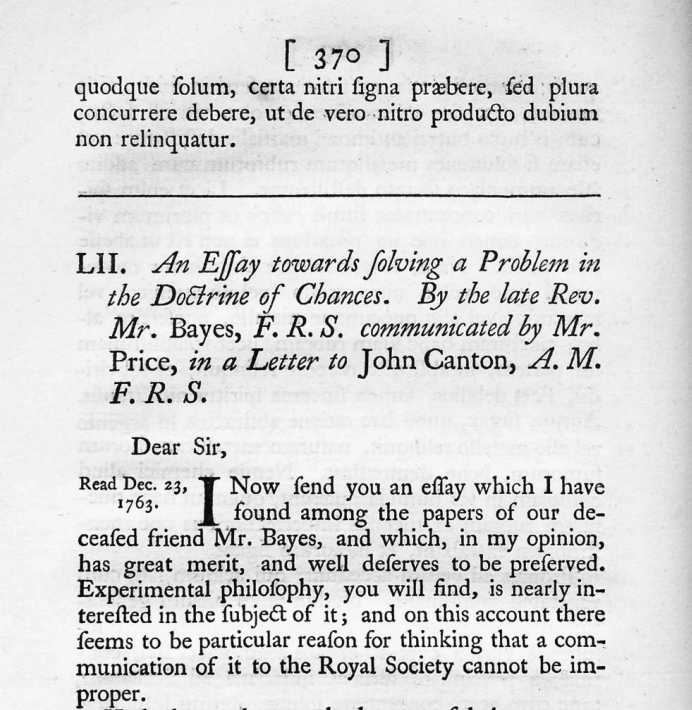
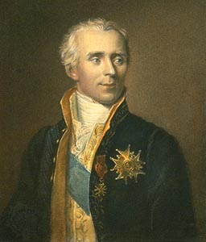
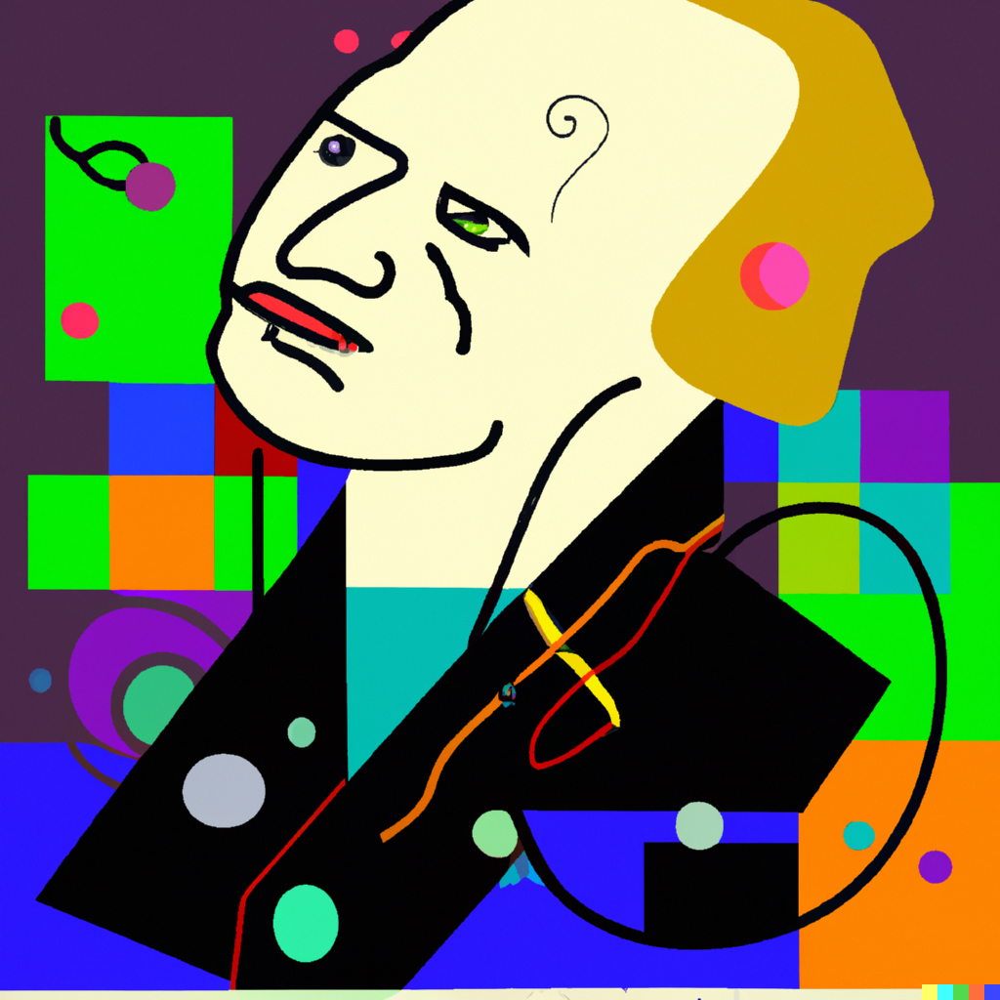
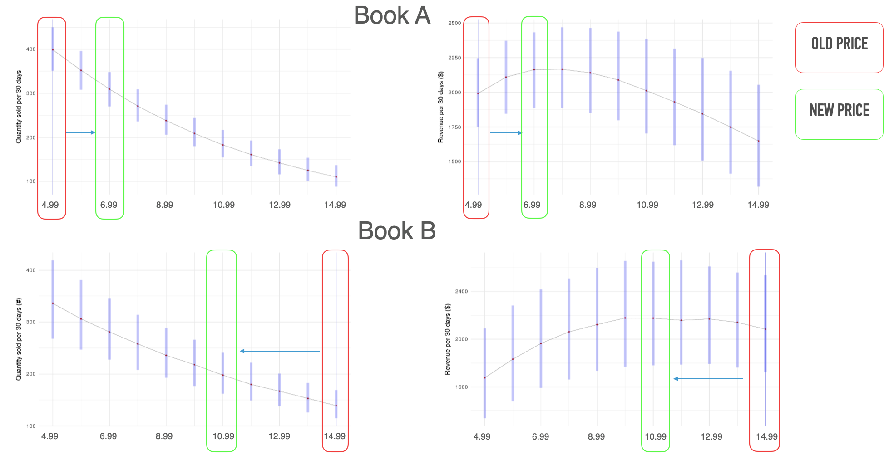
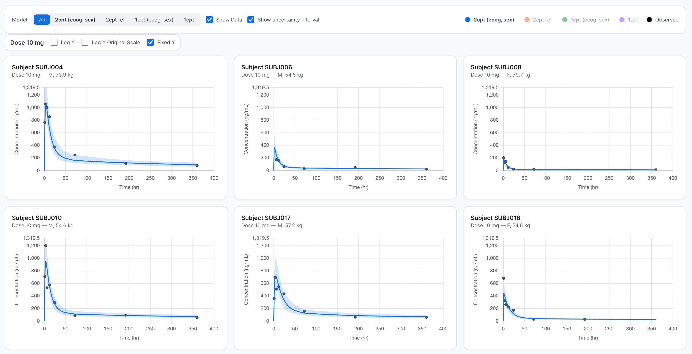
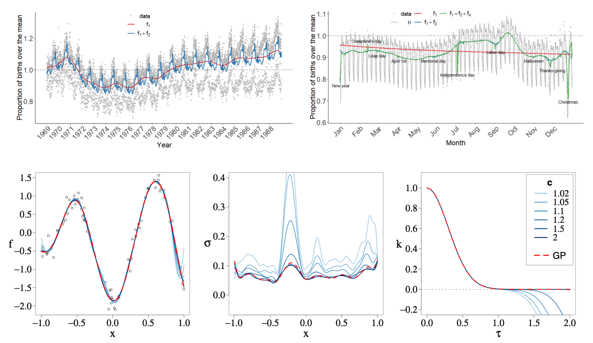
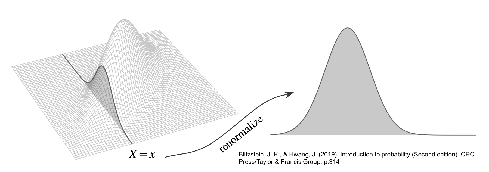
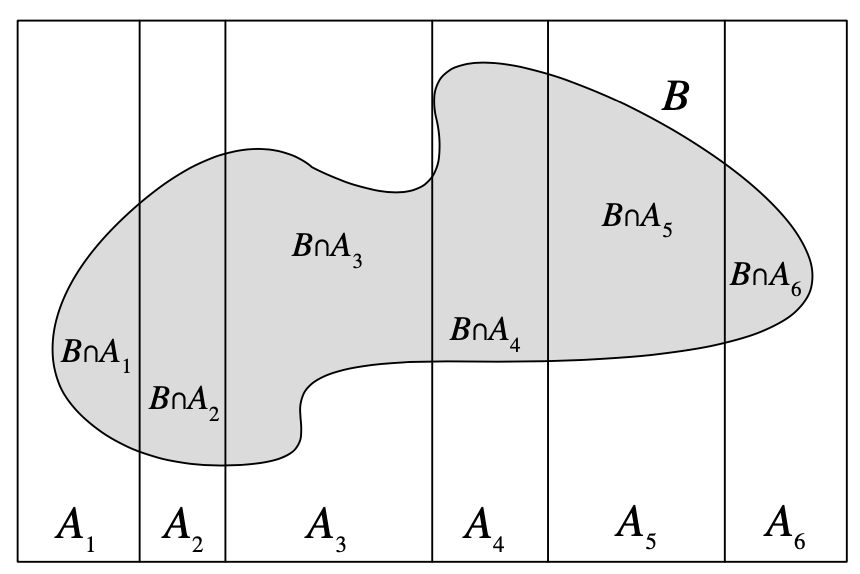
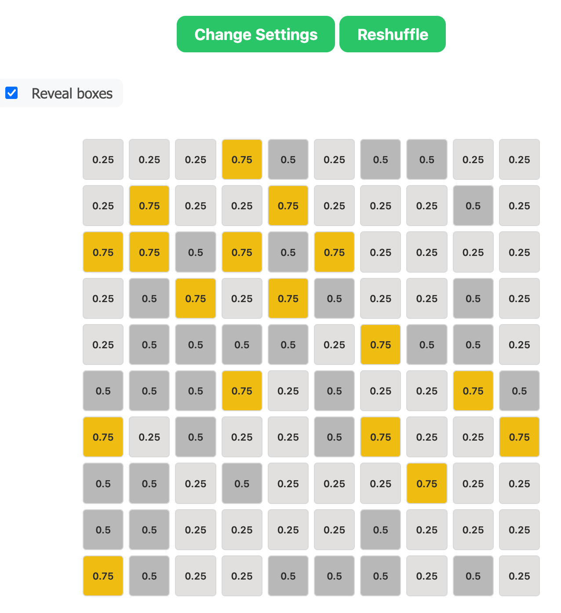

```{r, include=FALSE, cache=FALSE}
library(ggplot2)
library(dplyr)
library(janitor)
library(MASS)
library(gridExtra)
library(purrr)

thm <-
  theme_minimal() + theme(
    panel.background = element_rect(fill = "#f0f1eb", color = "#f0f1eb"),
    plot.background = element_rect(fill = "#f0f1eb", color = "#f0f1eb"),
    panel.grid.major = element_blank()
  )
theme_set(thm)

dbinom_theta <- function(theta, N, y) {
  choose(N, y) * theta^y * (1 - theta)^(N - y) 
}

dot_plot <- function(x, y) {
  p <- ggplot(data.frame(x, y), aes(x, y))
  p + geom_point(aes(x = x, y = y), size = 0.5) +
    geom_segment(aes(x = x, y = 0, xend = x, yend = y), linewidth = 0.2) +
    xlab(expression(theta)) + ylab(expression(f(theta)))
}
```

## Introductions

::: columns
::: {.column width="50%"}

- State your name and where you are from
- What is your field of study/work, and what are you hoping to learn in this class

:::

::: {.column width="50%"}

{fig-align="center" width="500"}

:::
:::
$$
\DeclareMathOperator{\E}{\mathbb{E}}
\DeclareMathOperator{\P}{\mathbb{P}}
\DeclareMathOperator{\V}{\mathbb{V}}
\DeclareMathOperator{\L}{\mathscr{L}}
\DeclareMathOperator{\I}{\text{I}}
\DeclareMathOperator{\d}{\mathrm{d}}
$$

## Lecture 1: Bayesian Workflow {.smaller}

::: columns
::: {.column width="50%"}

::: incremental
-   Overview of the course
-   Subjective vs Objective
-   Statistics vs AI/ML
-   Brief history of Bayesian inference
-   Stories: pricing books and developing drugs
-   Review of probability and simulations
-   Bayes's rule
-   Introduction to Bayesian workflow
-   Wanna bet? Mystery box game
:::

:::

::: {.column width="50%"}

{fig-align="center" width="500"}

:::
:::


<!-- ## Two Truths and a Lie[^1] {.smaller} -->

<!-- ::: columns -->
<!-- ::: {.column width="50%"} -->
<!-- 1. One person tells three personal statements, one of which is a lie.  -->
<!-- 1. Others discuss and guess which statement is the lie, and they jointly construct a numerical statement of their certainty in the guess (on a 0–10 scale).  -->
<!-- 1. The storyteller reveals which was the lie.  -->
<!-- 1. Enter the certainty number and the outcome (success or failure) and submit in the Google form. Rotate through everyone in your group so that each person plays the storyteller role once. -->
<!-- ::: -->

<!-- ::: {.column width="50%"} -->
<!-- {fig-align="center" width="500"} -->
<!-- ::: -->
<!-- ::: -->

<!-- [^1]: Gelman, A. (2023). “Two Truths and a Lie” as a Class-Participation Activity. The American Statistician, 77(1), 97–101. -->

<!-- ## Two Truths and a Lie -->

<!-- https://tinyurl.com/two-truths-and -->

<!-- {fig-align="center" width="500"} -->

<!-- ::: {.notes} -->
<!-- What do you think the range of certainty scores will look like: will there be any 0’s or 10’s? Will there be a positive relation between x and y: are guesses with higher certainty be more accurate, on average? How strong will the relation be between x and y: what will the curve look like? Give approximate numerical values for the intercept and slope coefficients corresponding to their sketched curves. -->
<!-- ::: -->

## 

{fig-align="center"}

## Subjective vs Objective {.smaller}

::: columns
::: {.column width="50%"}

::: incremental
- An experienced sommelier is able to correctly identify 8 types of wine from 8 samples
- An astrologer was able to correctly predict if the stock marker is up or down 8 times in a row
- Is your inference about their predictive ability different? The data are the same!
- Should we let data speak?
:::

:::

::: {.column width="50%"}
{fig-align="center" height="600"}
:::
:::


## IPEPSI: Checklist for how to use AI as a tutor {.smaller}
::: {.fragment}
Supposed you forgot the law of iterated expectations (Adam's Law) which states
$$
\E(Y) = E_X(E_{Y|X}(Y \mid X))
$$
:::

::: {.fragment}
Use the following AI prompts
:::

::: incremental
- I am a Masters student in Statistics. I want to go over the law of iterated expectations. First, give me an intuitive explanation. I will ask a follow-up question after.
- Please, provide a step-by-step proof of the discrete case, explaining every move. 
- Please provide a numerical example.
- Now, please give me a practice problem.
- Write a simulation and ask AI to check it OR say: write a simulation in R
- How is this for an explanation? [Enter an explanation in your words and have it check you]
:::

## Adam's Law Simulation {.smaller}

```{r}
#| cache: true
#| echo: true
#| eval: false

library(purrr)
n <- 20
class_sizes <- sample(n)
mean_gpa_vec <- runif(n = n, 2.8, 3.2)
N <- sum(class_sizes)
W <- class_sizes / N
G <- class_sizes |>
  map(\(x) rnorm(n = x, mean = mean_gpa_vec, sd = 1))

# E(Y)
EY <- unlist(G) |> mean()
print(EY)

# E(E(Y | X))
class_means <- map_dbl(G, mean) # can't just average those
gpaXprob <- class_means * W
EEYX <- sum(gpaXprob)
print(EEYX)
```


## Statistics vs. AI/ML (Simplification!) {.smaller}

::: incremental
::: columns
::: {.column width="50%"}

-   AI is about **automating tasks** that humans are able to to
    -   Recognizing faces, cats, and other objects
    -   Identifying tumors on a radiology scan
    -   Playing Chess and Go
    -   Driving a car
    -   Post ChatGPT 4: Generating coherent text/images/video, signs of reasoning
:::

::: {.column width="50%"}
-   Statistics is useful for **answering questions** that humans are not able to do
    -   How fast does a drug clear from the body? 
    -   What is the expected tumor size two months after treatment? 
    -   How would patients respond under a different treatment?
    -   Should I take this drug?
    -   Should we (FDA/EMA/...) approve this drug? 

:::
:::

::: {.fragment}
::: callout-note
"Machine learning excels when you have lots of training data that can be reasonably modeled as exchangeable with your test data; Bayesian inference excels when your data are sparse and your model is dense." — Andrew Gelman
:::
::: 


:::

## Turn to your neighbor and discuss {.small}

Classify each of the following: {_decision_, _parameter inference_, _prediction_, _causal inference_}

::: columns
::: {.column width="60%"}
::: incremental
1.  How fast does a drug clear from the body? 
1.  What is the expected tumor size two months after treatment? 
1.  How would patients respond under a different treatment?
1.  Should I take this drug?
1.  Should we (FDA/EMA/...) approve this drug? 
:::

:::

::: {.column width="40%"}
{fig-align="center" width="500"} 
:::
:::

::: {.fragment style="font-size: 18px;"}
::: callout-tip
## Question
Which category is missing data imputation?
:::
:::
  
## Brief History {.smaller}

[Summary](https://www.lesswrong.com/posts/RTt59BtFLqQbsSiqd/a-history-of-bayes-theorem) of the book [The Theory That Would Not Die](https://www.amazon.com/Theory-That-Would-Not-Die/dp/0300169698/)

::: columns
::: {.column width="50%"}
::: incremental
-   Thomas Bayes (1702(?) --- 1761) is [credited](https://en.wikipedia.org/wiki/Nicholas_Saunderson) with the discovery of the "Bayes's Rule"
-   His paper was published posthumously by Richard Price in 1763
-   Laplace (1749 --- 1827) independently discovered the rule and published it in 1774
-   Scientific context: Newton's Principia was published in 1687
-   Bayesian wins: German Enigma cipher, search for a missing H-bomb, Federalist papers, Moneyball, FiveThirtyEight
:::
:::

::: {.column width="50%"}

{fig-align="center" width="672"}

:::
:::

::: notes
Stephen Stigler gives 3:1 in favor of Nicholas Saunderson for the discovery of Bayes's \[sic\] rule.
:::

## Laplace's Demon {.smaller}

::: columns
::: {.column width="50%"}
> We may regard the present state of the universe as the effect of its past and the cause of its future. An intellect which at any given moment knew all of the forces that animate nature and the mutual positions of the beings that compose it, if this intellect were vast enough to submit the data to analysis, could condense into a single formula the movement of the greatest bodies of the universe and that of the lightest atom; for such an intellect **nothing could be uncertain**, and the future just like the past would be present before its eyes.
:::

::: {.column width="50%"}
{fig-align="center"}

Marquis Pierre Simon de Laplace (1729 --- 1827)

"Uncertainty is a function of our ignorance, not a property of the world."
:::
:::

## Modern Examples of Bayesian Analyses

::: columns
::: {.column width="50%"}
{fig-align="center" width="500px"}
:::

::: {.column width="50%"}
{fig-align="center" width="500px"}
:::
:::


::: footer
Left: Pierre Simon Laplace in the style of Wassily Kandinsky, by OpenAI DALL·E
:::


## Elasticity of Demand 
#### Stan with Hierarchical Models

{fig-align="center" width="100px"}

## Pharmacokinetics of Drugs 
####  Stan with Ordinary Differential Equations

{fig-align="left"}

## Nonparametric Bayes
#### Stan with Gaussian Processes 
{fig-align="center" width="100px"}

::: footer
Practical Hilbert space approximate Bayesian Gaussian processes for probabilistic programming, Riutort-Mayol et al. (2022)
:::


## Example Simulation {.tiny}

::: incremental
- We will use R's `sample()` function to simulate rolls of a die and `replicate()` function to repeat the rolling process many times
:::

::: columns
::: {.column width="50%"}

::: {.fragment}
```{r}
#| echo: true
#| cache: true

die <- 1:6; N <- 1e4
roll <- function(x, n) {
  sample(x, size = n, replace = TRUE)
}
roll(die, 2) # roll the die twice
rolls <- replicate(N, roll(die, 2))
rownames(rolls) <- c("X1", "X2")
rolls[, 1:10] # print first 10 outcomes
Y <- colSums(rolls) # Y = X1 + X2
head(Y)
mean(Y < 11) # == 1/N * sum(Y < 11)
```
:::

:::

::: {.column width="50%"}

::: incremental
- Given a Random Variable $Y$, $y^{(1)}, y^{(2)}, y^{(3)}, \ldots, y^N$ are simulations or draws from $Y$
- Fundamental bridge (Blitzstein & Hwang p. 164): $\P(A) = \E(\I_A)$
- For $Y = X_1 + X_2$: $\P(Y < 11) \approx \frac{1}{N} \sum^{N}_{n=1} \I(y^n < 11)$
- In R, $Y < 11$ creates an indicator variable
- And `mean()` does the average
:::

:::
:::

::: {.fragment}
::: callout-warning
There is something sublte going on: a difference between generating 100 draws from one random variable $Y$ vs getting one draw from 100 $Y$s
:::
::: 

## Example Simulation {.small}

This is a more direct demonstration of random draws from a distribution of $Y = X_1 + X_2$

::: columns
::: {.column width="50%"}

::: {.fragment}
```{r}
#| echo: true
#| cache: true

# Define the possible values of 
# Y = X1 + X2 and their probabilities

Omega <- 2:12
Y_probs <- 
  c(1, 2, 3, 4, 5, 6, 5, 4, 3, 2, 1) / 36

# Simulate 10,000 realizations of Y
Y_samples <- sample(Omega,
                    size = 1e4, 
                    replace = TRUE, 
                    prob = Y_probs)

# Compute Pr(A)
mean(Y_samples < 11)
```
:::

:::

::: {.column width="50%"}

::: {.fragment}
```{r}
#| echo: true
#| cache: true
#| fig-width: 5
#| fig-height: 4
#| fig-align: center

# Plot a histogram of the realizations of Y
par(bg = "#f0f1eb")
hist(Y_samples, 
     breaks = seq(1.5, 12.5, by = 1), 
     main = "Realizations of Y",
     xlab = "Y", ylab = "P",
     col = "lightblue",
     prob = TRUE)
```
:::

:::
:::

                         
## Bivariate Case {.tinier}

::: {.fragment}
- A bivariate CDF $F_{X,Y}(x, y) = \P(X \leq x, Y \leq y)$

$$
F_{X,Y}(x, y) \geq 0 \quad \text{for all } x, y
$$
:::

::: {.fragment}
- If the PDF exists

$$
F_{X,Y}(x, y) = \int_{-\infty}^x \int_{-\infty}^y f_{X,Y}(u, v) \, \mathrm{d}v \, \mathrm{d}u
$$
:::

::: {.fragment}
- Normalization

$$
\int_{-\infty}^\infty \int_{-\infty}^\infty f_{X,Y}(x, y) \, \mathrm{d}x \, \mathrm{d}y = 1
$$
:::

::: {.fragment}
- From CDF to PDF

$$
f_{X,Y}(x, y) = \frac{\partial^2}{\partial x \partial y} F_{X,Y}(x, y)
$$
:::

## Bivariate Case {.smaller}

::: {.fragment}
- Marginalization

$$
f_Y(y) = \int_{-\infty}^\infty f_{X,Y}(x, y) \, \mathrm{d}x.
$$
:::

::: {.fragment}
- Conditional CDF

$$
F_{Y \mid X}(y \mid x) = \P(Y \leq y \mid X = x)
$$
:::

::: columns
::: {.column width="40%"}

::: {.fragment}
- Conditional PDF: a function of $y$ for fixed $x$
$$
f_{Y|X}(y \mid x) = \frac{f_{X,Y}(x, y)}{f_X(x)}
$$
:::

:::

::: {.column width="60%"}

::: {.fragment}
{fig-align="right" height="200"}
:::

:::
:::


## Bivariate Normal {.smaller}

$$
f_{X,Y}(x, y) = \frac{1}{2 \pi \sqrt{\det(\Sigma)}} 
\exp\left( -\frac{1}{2} 
\begin{bmatrix} 
x - \mu_X \\ 
y - \mu_Y 
\end{bmatrix}^\top 
\Sigma^{-1} 
\begin{bmatrix} 
x - \mu_X \\ 
y - \mu_Y 
\end{bmatrix} 
\right)
$$

::: columns
::: {.column width="50%"}
```{r}
#| fig-width: 8
#| fig-height: 4.5
#| fig-align: left

library(mvtnorm)  # For bivariate normal distribution
library(plotly)   # For interactive 3D plots

# Define parameters for the bivariate normal distribution
sigma_X <- 1
sigma_Y <- 2
rho <- 0.3  # Correlation coefficient
rho_sigmaXY <- rho * sigma_X * sigma_Y
cov_matrix <- matrix(c(sigma_X^2,   rho_sigmaXY,
                       rho_sigmaXY, sigma_Y^2), 2, 2)

# Create a grid of x and y values
x <- seq(-4, 4, length.out = 50)
y <- seq(-6, 6, length.out = 50)
grid <- expand.grid(x = x, y = y)

# Compute the bivariate PDF
pdf_values <- dmvnorm(grid, mean = c(0, 0), sigma = cov_matrix)
pdf_matrix <- matrix(pdf_values, nrow = length(x), ncol = length(y))

# Create PDF plot
plot_ly(
  x = x,
  y = y,
  z = pdf_matrix,
) |>
  add_surface() |>
  layout(title = NULL,
         paper_bgcolor = "f0f1eb", # Background color of the entire figure
         plot_bgcolor  = "f0f1eb", # Background color of the plot area
         scene = list(
           xaxis = list(title = "X"),
           yaxis = list(title = "Y"),
           zaxis = list(title = "PDF")
         )) |>
  hide_colorbar()
```
:::

::: {.column width="50%"}
```{r}
#| fig-width: 8
#| fig-height: 4.5
#| fig-align: right

# Create a data frame of the grid
grid <- grid |>
  mutate(
    # Calculate the CDF for each (x, y) point
    cdf = mapply(function(x, y) {
      pmvnorm(lower = c(-Inf, -Inf), upper = c(x, y), mean = c(0, 0), 
              sigma = cov_matrix)
    }, x, y)
  )

# Convert grid to matrix for 3D plotting
cdf_matrix <- matrix(grid$cdf, nrow = length(x), ncol = length(y))

# Create a 3D surface plot
plot_ly(
  x = x, 
  y = y, 
  z = cdf_matrix,
  type = "surface"
) |>
  layout(
    title = NULL,
    paper_bgcolor = "f0f1eb", # Background color of the entire figure
    plot_bgcolor  = "f0f1eb", # Background color of the plot area
    scene = list(
      xaxis = list(title = "X"),
      yaxis = list(title = "Y"),
      zaxis = list(title = "CDF")
    )
  ) |> hide_colorbar()
```
:::
:::

## Bivariate Normal Demo {.small}
```{r}
#| echo: true

library(distributional)

sigma_X <- 1
sigma_Y <- 2
rho <- 0.3  # Correlation coefficient

rho_sigmaXY <- rho * sigma_X * sigma_Y # why?

cov_matrix <- matrix(c(sigma_X^2,   rho_sigmaXY,
                       rho_sigmaXY, sigma_Y^2), 2, 2)

dmv_norm <- dist_multivariate_normal(mu    = list(c(0, 0)), 
                                     sigma = list(cov_matrix))
dimnames(dmv_norm) <- c("x", "y")
variance(dmv_norm)
covariance(dmv_norm)
density(dmv_norm, cbind(-3, -3)) |> round(2) # should be low
cdf(dmv_norm, cbind(3, 3)) |> round(2)       # should be high
draws <- generate(dmv_norm, 1e4)             # draws from the bivariate normal
str(draws)
draws <- as_tibble(draws[[1]])
head(draws)
# estimated means
colMeans(draws) |> round(2)
# estimated covariance matrix
cov(draws) |> round(2)
# estimated corelations matrix
cor(draws) |> round(2)

# should be close to cdf(dist, cbind(3, 3)); why?
# both evaluate to P(X and Y < 3); & is an _and_ operator
mean(draws$x < 3 & draws$y < 3) |> round(2)

# P(X < 0 or Y < 1); | is an _or_, not conditioning operator
mean(draws$x < 0 | draws$y < 1) |> round(2)
```


How would we do the above analytically?
$$
\P(X < 0 \cup Y < 1) = \P(X < 0) + \P(Y < 1) - \P(X < 0 \cap Y < 1)
$$

```{r}
#| echo: true

# Compute P(X < 0)
p_X_less_0 <- cdf(dist_normal(mu = 0, sigma = sigma_X), 0) # pnorm(0, mean = 0, sd = sigma_X)

# Compute P(Y < 1)
p_Y_less_1 <- cdf(dist_normal(mu = 0, sigma = sigma_Y), 1) # pnorm(1, mean = 0, sd = sigma_Y)

# Compute P(X < 0, Y < 1)
p_X_less_0_and_Y_less_1 <- cdf(dmv_norm, cbind(0, 1))

# P(X < 0 or Y < 1)
(p_X_less_0 + p_Y_less_1 - p_X_less_0_and_Y_less_1) |> round(2)
```

- Whould you rather do `mean(draws$x < 0 | draws$y < 1)` or the analytical solution?
- How would you evaluate $\P(X < 0 \mid Y < 1)$

```{r}
#| echo: true
draws |> filter(y < 1) |>
  summarise(pr = mean(x < 0)) |>
  as.numeric() |> round(2)
```


## Law of Total Probability (LOTP)
Let $A$ be a partition of $\Omega$, so that each $A_i$ is disjoint, $\P(A_i >0)$, and $\cup A_i = \Omega$.
$$
\P(B) = \sum_{i=1}^{n} \P(B \cap A_i) = \sum_{i=1}^{n} \P(B \mid A_i) \P(A_i)
$$ 

{fig-align="center" width="500"}

::: footer
Image from Blitzstein and Hwang (2019), Page 55
:::

## Bayes's Rule {.smaller}

::: {.fragment}
- Bayes's rule for events

$$
\P(A \mid B) = \frac{\P(A \cap B)}{\P(B)} = 
               \frac{\P(B \mid A) \P(A)}{\sum_{i=1}^{n} \P(B \mid A_i) \P(A_i)}
$$
:::

::: {.fragment}
- Bayes's rule for continuous RVs

$$
\underbrace{\color{blue}{f_{\Theta|Y}(\theta \mid y)}}_{\text{Posterior}} =
\frac{
    \overbrace{ \color{red}{f_{Y|\Theta}(y \mid \theta)} }^{\text{Likelihood}} 
    \cdot 
     \overbrace{\color{green}{f_\Theta(\theta)}}^{ \text{Prior} }
}{
    \underbrace{\int_{-\infty}^{\infty} f_{Y|\Theta}(y \mid \theta) f_\Theta(\theta) \, \text{d}\theta}_{\text{Prior Predictive } f(y)}
} \propto 
\color{red}{f_{Y|\Theta}(y \mid \theta)} \cdot 
\color{green}{f_\Theta(\theta)}
$$
:::


## Notation {.smaller}

::: incremental
-   $\theta$: unknowns or parameters to be estimated; could be multivariate, discrete, and continuous; in your book $\pi$
-   $y$: observations or measurements to be modelled ($y_1, y_2, ...$)
-   $\widetilde{y}$ : unobserved but observable quantities; in your book $y'$
-   $x$: covariates
-   $f( \theta )$: a prior model, P[DM]F of $\theta$
-   $f(y \mid \theta, x)$: an observational model, P[DM]F when it is a function of $y$; in your book: $f(y \mid \pi)$
-   $f(y \mid \theta)$: is a likelihood function when it is a function of $\theta$; in your book: $\L(\pi \mid y)$
-   Some people write $\L(\theta; y)$ or simply $\L(\theta)$
-   $U(z)$: utility function where $z$ can be $\theta$, $\tilde{y}$ 
-   $\E(U(z) \mid d)$: expected utility for decision $d$
:::

## Bayesian Workflow in a Nutshell {.small}
::: incremental
- Specify a prior model $f(\theta)$ 
- Pick a data model $f(y \mid \theta, x)$, including conditional mean: $\E(y \mid x)$
- Set up a prior predictive distribution $f(y)$
- After observing data $y$, we treat $f(y \mid \theta, x)$ as the likelihood of observing $y$ under all plausible values of $\theta$, conditioning on $x$ if necessary
- Derive a posterior distribution for $\theta$, $\, f(\theta \mid y, x)$
- Evaluate model quality: 1) quality of the inferences; 2) quality of predictions; go back to the beginning
- Compute derived quantities, such as $\P(\theta > \alpha)$, $f(\widetilde{y} \mid y)$, and $d^* = \textrm{arg max}_d \ \E(U(z) \mid d)$ 
:::

::: footer
For a more complete workflow, see [Bayesian Workflow](https://arxiv.org/abs/2011.01808) by Gelman et al. (2020)
:::


## Mystery Box Game Analysis {.tiny}

::: columns
::: {.column width="60%"}

::: incremental
  - You are invited to bet on the proportion of red balls
  - True proportions: $\theta \in \{0.25,\, 0.50,\, 0.75\}$
  - You are allowed to draw 5 balls from the box with replacement and wager \$5
  - Net payoffs (Gross payoffs - your wager) if your chosen $\theta$ is correct:
    - For $\theta=0.25$: \$5
    - For $\theta=0.50$: \$10
    - For $\theta=0.75$: \$25
  - Does it makes sense to assume that each box type is equality likely?
  - Work out the implied probabilities based on the payoffs, assuming fair game
  - Go to [https://ericnovik.github.io/apps/](https://ericnovik.github.io/apps/), click on Mystery Box and play 20 rounds

:::

:::

::: {.column width="40%"}


{fig-align="center"}


:::
:::


## Game and Prior {.smaller}

::: columns
::: {.column width="60%"}

::: incremental
- You can draw 5 balls from the box 
- You can pay \$5 and play (make a guess), or pay \$0.50 for extra ball
- After paying for extra ball, you pay $5 and play
- For warm-ups: we take one ball from a box -- what is $\P(\text{red})$?
- Law of Total Probability (LOTP):
:::

:::

::: {.column width="40%"}

::: {.fragment}
```{r}
#| fig-width: 3
#| fig-height: 3
#| fig-align: center
#| echo: false
dot_plot <- function(x, y) {
  p <- ggplot(data.frame(x, y), aes(x, y))
  p + geom_point(aes(x = x, y = y), size = 0.5) +
    geom_segment(aes(x = x, y = 0, xend = x,
                     yend = y), linewidth = 0.2) +
      scale_x_continuous(breaks = x) +
    xlab(expression(theta)) +
    ylab(expression(f(theta)))
}
theta <- c(0.25, 0.50, 0.75); prior <- c(1/2, 1/3, 1/6)
dot_plot(theta, prior) + ggtitle("Prior PMF")
```
:::
:::
:::


::: {.fragment}
$$
\begin{eqnarray*}
\P(\text{red}) &=& \sum_{i=1}^{3} f(\text{red},\ \theta_i) = \sum_{i=1}^{3} f(\text{red} \mid \theta_i) \cdot f(\theta_i) \\
 &=& 0.25 \cdot \left(\frac{1}{2}\right) + 0.50 \cdot \left(\frac{1}{3}\right) + 0.75 \cdot \left(\frac{1}{6}\right) \approx 0.42
\end{eqnarray*}
$$
:::


## Data Model: Before Drawing 5 Balls {.smaller}

::: incremental
- Take red ball as success, so $y$ successes out of $N = 5$ trials
$$
y | \theta \sim \text{Bin}(N,\theta) = \text{Bin}(5,\theta)
$$

- $f(y \mid \theta) = \text{Bin} (y \mid 5,\theta) = \binom{5}{y} \theta^y (1 - \theta)^{5 - y}$ for $y \in \{0,1,\ldots,5\}$
- Is this a valid probability distribution as a function of $y$?

::: {.fragment}
```{r}
#| echo: true
N = 5; y <- 0:N
f_y <- dbinom(x = y, size = N, prob = theta[1])
sum(f_y)
```
:::

::: {.fragment}
```{r}
#| fig-width: 16
#| fig-height: 3
#| fig-align: center
#| echo: false

f_y <- map(theta, ~ dbinom(x = y, size = N, prob = .))
yl <- expression(paste("f(y | ", theta, ")"))
p <- list()
for (i in 1:length(theta)) {
  p[[i]] <- dot_plot(y, f_y[[i]]) + xlab(expression(y)) + ylab(yl) +
    ggtitle(bquote(theta == .(theta[i])))
}
grid.arrange(p[[1]], p[[2]], p[[3]], nrow = 1)
```
:::
:::

## Likelihood Function: After Drawing 5 Balls {.smaller}
::: incremental
- We observe that 2 out of 5 balls are red
- We can construct a likelihood function for $y = 2$ as a function of $\theta$
- Let's check if this function is a probability distribution:
$$
f (y) = \int_{0}^{1} \binom{N}{y} \theta^y (1 - \theta)^{N - y}\, d\theta = \frac{1}{N + 1}
$$
:::

::: {.fragment}
```{r}
#| echo: true
dbinom_theta <- function(theta, N, y) {
  choose(N, y) * theta^y * (1 - theta)^(N - y)
}
integrate(dbinom_theta, lower = 0, upper = 1,
          N = 5, y = 2)[[1]] |> fractions()
```
:::

::: incremental
- Recall, $f(y)$ is called marginal distribution or prior predictive distribution
- It tells us that prior to observing $y$, all values of $y$ are equally likely
:::

## Visualizing the Likelihood Function {.smaller}

```{r}
#| fig-width: 8
#| fig-height: 3
#| fig-align: center
#| echo: false
p1 <- list()
lik <- map(y, ~ dbinom(x = ., size = N, prob = theta))
for (i in 1:(N + 1)) {
  p1[[i]] <- dot_plot(theta, lik[[i]]) +
    xlab(expression(theta)) + ylab("Lik") +
    ggtitle(bquote(y == .(y[i])))
}
grid.arrange(p1[[1]], p1[[2]], p1[[3]], p1[[4]], p1[[5]], p1[[6]], nrow = 2)
```

::: {.fragment}
Compare with the data model:
:::

::: {.fragment}
```{r}
#| fig-width: 8
#| fig-height: 1.5
#| fig-align: center
#| echo: false
grid.arrange(p[[1]], p[[2]], p[[3]], nrow = 1)
```
:::

## Putting It All Together {.small}

::: incremental
- We observe 2 red balls, so we can condition on $y = 2$
- Let's turn the Bayesian crank
:::

::: {.fragment}
$$
\begin{eqnarray*}
f(\theta \mid y) &=& \frac{f(y \mid \theta) f(\theta)}{f(y)} =
\frac{f(y \mid \theta) f(\theta)}{\sum_{i=1}^{3} f(y, \, \theta_i)} =
\frac{f(y \mid \theta) f(\theta)}{\sum_{i=1}^{3} f(y \mid \theta_i) f(\theta_i)} \\ &\propto&
f(y \mid \theta) f(\theta) \propto
\theta^2 (1 - \theta)^{3} \cdot f(\theta)
\end{eqnarray*}
$$
:::

::: incremental
- How many elements in $f(\theta)$?
- How many elements in $f(\theta \mid y)$?
:::

## Compute the Posterior {.smaller}

- We observed $y = 2$, so $f(y \mid \theta) \propto \theta^2 (1 - \theta)^{3}$

::: columns
::: {.column width="60%"}

::: incremental
  - For $\theta = 0.25$: (we can drop $\binom{5}{2}$ term)
    $$
    f(y | 0.25) = \binom{5}{2} (0.25)^2 (0.75)^3 \approx 0.26
    $$
  - For $\theta = 0.50$:
    $$
    f(y | 0.50) = \binom{5}{2} (0.50)^5 \approx 0.31
    $$
  - For $\theta = 0.75$:
    $$
    f(y| 0.75 ) = \binom{5}{2} (0.75)^2 (0.25)^3 \approx 0.09
    $$
:::

:::

::: {.column width="40%"}

::: {.fragment}
```{r}
#| echo: true
N <- 5; y <- 2
theta <- c(0.25, 0.50, 0.75)
prior <- c(1/2, 1/3, 1/6)
lik <- dbinom(y, N, theta)
lik_x_prior <-  lik * prior
norm_const <- sum(lik_x_prior)
post <- lik_x_prior / norm_const
```
:::

<br />

::: {.fragment}
```{r}
#| echo: false

library(kableExtra)
d <- data.frame(theta, prior, lik, lxp = lik_x_prior, post)
nr <- nrow(d)

# Format and display the table
d |>
  adorn_totals("row") |>
  kbl(booktabs = T,
      linesep = "",
      digits = 2) |>
  kable_paper(full_width = F) |>
  column_spec(5,
              color = "white",
              background = spec_color(d$post[1:nr], end = 0.5,
                                      direction = -1)) |>
  column_spec(2,
              color = "white",
              background = spec_color(d$prior[1:nr], end = 0.5,
                                      direction = -1)) |>
  column_spec(3,
              color = "white",
              background = spec_color(d$lik[1:nr], end = 0.5,
                                      direction = -1)) |>
  column_spec(4,
              color = "white",
              background = spec_color(d$lxp[1:nr], end = 0.5,
                                      direction = -1)
  ) |>
  row_spec(4, color = "black", background = "#f0f1eb")
```
:::

:::
:::

## Option 1: Play Immediately {.smaller}

::: incremental
- Let $x_i$ represent the gross payoffs for each option $i$ ($10, 15, 30$)
- We maximize Expected Utility: 
:::

::: {.fragment}
$$
\theta^* = \textrm{arg max}_{\theta} \left\{ x_i \times f(\theta_i \mid y) - \text{Cost} \right\}
$$
:::

::: incremental
- Bet on $\theta=0.25$: $10 \times 0.526 - 5 \approx \$0.26$
- Bet on $\theta=0.50$: $15 \times 0.416 - 5 \approx \$1.24$
- Bet on $\theta=0.75$: $30 \times 0.058 - 5 \approx -\$3.26$
- We bet on $\theta^*=0.50$ with expected payoff of \$1.24.
:::


::: {.fragment}
::: callout-important
### The Conflict
The bet on the **most probable outcome** (MAP estimate of $\theta=0.25$ at 53%) is suboptimal! 

Because of the asymmetric payoffs, we bet on $\theta=0.50$ despite it having a lower posterior probability (42%).
:::
:::

## Option 2: Should You Buy an Extra Ball? {.smaller}

::: incremental
- We need to average over uncertainty of the red vs green ball
- We use the current posterior weights $f(\theta \mid y)$, where y is 2 reds out of 5
- Compute the probability of red on the next draw (Posterior Predictive Distribution):
:::

::: {.fragment}
$$
\begin{eqnarray*}
\P(\tilde{y} = \text{red} \mid y) &=& \sum_{i=1}^{3} f(\tilde{y} = \text{red}, \ \theta_i \mid y) = \sum_{i=1}^{3} f(\tilde{y} = \text{red} \mid \theta_i, \ y) f(\theta_i \mid y) \\
&=& \sum_{i=1}^{3} f(\tilde{y} = \text{red} \mid \theta_i) f(\theta_i \mid y) \\
 \P(\tilde{y} = \text{red} \mid y) &=& 0.25 \times 0.526  + 0.50 \times 0.416  + 0.75 \times 0.058  \\
  &\approx& 0.383
\end{eqnarray*}
$$
:::


::: {.fragment}
- Posterior predictive probability of green: $\P(\text{green}) = 1 - 0.383  \approx 0.617$
:::

## Updating Beliefs With the Extra Ball {.tiny}

### Case 1: Extra Ball is Red

- **Update:** Multiply the original posterior for each $\theta$ by $\theta$:
  - For $\theta=0.25$: $0.044 \times 0.25 = 0.011$
  - For $\theta=0.50$: $0.559 \times 0.5 = 0.280$
  - For $\theta=0.75$: $0.397 \times 0.75 = 0.298$

- **Normalized probabilities:**
  - $\P(0.25|\text{red}) \approx \frac{0.011}{0.589} \approx 0.019$
  - $\P(0.50|\text{red}) \approx \frac{0.280}{0.589} \approx 0.475$
  - $\P(0.75|\text{red}) \approx \frac{0.298}{0.589} \approx 0.506$

- **Expected prizes:**
  - Bet on $\theta=0.25$: $0.019 \times 3 \approx 0.057$
  - Bet on $\theta=0.50$: $0.475 \times 5 \approx 2.375$
  - Bet on $\theta=0.75$: $0.506 \times 15 \approx 7.593$

## Case 2: Extra Ball is Green {.tiny}

- **Update:** Multiply the original posterior by $(1-\theta)$:
  - For $\theta=0.25$: $0.044 \times 0.75 = 0.033$
  - For $\theta=0.50$: $0.559 \times 0.5 = 0.280$
  - For $\theta=0.75$: $0.397 \times 0.25 = 0.099$

- **Normalized probabilities:**
  - $\P(0.25|\text{green}) \approx \frac{0.033}{0.412} \approx 0.080$
  - $\P(0.50|\text{green}) \approx \frac{0.280}{0.412} \approx 0.680$
  - $\P(0.75|\text{green}) \approx \frac{0.099}{0.412} \approx 0.240$

- **Expected prizes:**
  - Bet on $\theta=0.25$: $0.080 \times 3 \approx 0.240$
  - Bet on $\theta=0.50$: $0.680 \times 5 \approx 3.400$
  - Bet on $\theta=0.75$: $0.240 \times 15 \approx 3.600$


## Overall Expected Prize With the Extra Ball {.smaller}

- **Combine the two cases:**

  $$
  \begin{align*}
  \E_\text{extra_ball}({\text{payoff}}) =& \P(\text{red})\times7.593 + \P(\text{green})\times3.600 \\
  =& 0.589 \times 7.593 + 0.411 \times 3.600 \approx 5.95
  \end{align*}
  $$

- **Net Expected Payoff (including costs):**

  - Extra ball cost: \$1
  - Play cost: \$2

  $$
  \E_\text{extra_ball}({\text{payoff}}) = 5.95 - 3 = \$2.95.
  $$

- **Without the extra ball:** Net EV $\approx \$3.96$.
- **With the extra ball:** Net EV $\approx \$2.95$.

**Decision:** It is better to pay \$2 and play immediately rather than buying an extra ball.

## What About For All Possible Outcomes? {.small}

::: columns
::: {.column width="50%"}

```{r}
#| fig-width: 5
#| fig-height: 5
#| fig-align: center
#| echo: false
source("mystery_box.R")
p1
```

:::

::: {.column width="50%"}

```{r}
#| fig-width: 5
#| fig-height: 5
#| fig-align: center
#| echo: false
source("mystery_box.R")
p2
```

:::
:::

## Net Payoffs With and Without Extra Ball? {.small}

```{r}
#| fig-width: 8
#| fig-height: 8
#| fig-align: center
#| echo: false
p3
```
