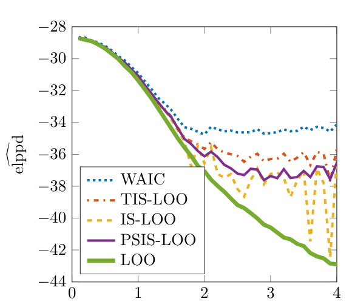

## Bayesian linear regression and model evaluation {.small}

::: columns
::: {.column width="60%"}
::: incremental
- Introducing linear regression
- Prior predictive simulations
- Sampling from the posterior
- Example of linear regression in Stan
- Evaluating the quality of the draws
- Posterior predictions
- Cross-validation, ELPD, and LOO
:::
:::

::: {.column width="40%"}
{fig-align="center" height="500"}
:::
:::

```{r}
library(ggplot2)
library(dplyr)
library(janitor)
library(gridExtra)
library(purrr)

thm <-
  theme_minimal() + theme(
    panel.background = element_rect(fill = "#f0f1eb", color = "#f0f1eb"),
    plot.background = element_rect(fill = "#f0f1eb", color = "#f0f1eb"),
    panel.grid.major = element_blank()
  )
theme_set(thm)

dbinom_theta <- function(theta, N, y) {
  choose(N, y) * theta^y * (1 - theta)^(N - y) 
}

dot_plot <- function(x, y, yc = NULL, dodge = 0.2) {
  x <- as.factor(x)
  p <- ggplot(data.frame(x, y), aes(x, y))
  p <- p + geom_point(aes(x = x, y = y), size = 0.5) +
    geom_segment(aes(
      x = x,
      y = 0,
      xend = x,
      yend = y
    ), linewidth = 0.2) +
    xlab(expression(theta)) + ylab(expression(f(theta)))
  
  if (!is.null(yc)) {
    xc <- as.numeric(x) + dodge
    p1 <- p + geom_point(aes(x = xc, y = yc), color = 'red', size = 0.5) +
      geom_segment(aes(
        x = xc,
        y = 0,
        xend = xc,
        yend = yc
      ), color = 'red', linewidth = 0.2)
    return(p1)
  }
  return(p)
}

```

$$
\DeclareMathOperator{\E}{\mathbb{E}}
\DeclareMathOperator{\P}{\mathbb{P}}
\DeclareMathOperator{\V}{\mathbb{V}}
\DeclareMathOperator{\L}{\mathcal{L}}
\DeclareMathOperator{\I}{\text{I}}
\DeclareMathOperator*{\argmax}{arg\,max}
\DeclareMathOperator*{\argmin}{arg\,min}
$$

## Motivating Example {.smaller}
::: columns
::: {.column width="50%"}
::: incremental
- We borrow this example from Richard McElreath's Statistical Rethinking
- The data sets provided have been produced between 1969 to 2008, based on Nancy Howell's observations of the !Kung San
- From Wikipedia: "The ǃKung are one of the San peoples who live mostly on the western edge of the Kalahari desert, Ovamboland (northern Namibia and southern Angola), and Botswana."
:::

:::

::: {.column width="50%"}
{fig-align="right"}
:::
:::


::: footer
[University of Toronto Data Sets](https://tspace.library.utoronto.ca/handle/1807/10395)
:::

## Howell Dataset {.smaller}

::: columns
::: {.column width="50%"}
::: {.fragment}
- Data sample and summary:
```{r}
#| echo: false
library(dplyr)
d <- readr::read_csv("data/howell.csv")
knitr::kable(d[1:6, ])
summary(d[, 1:3])
```
:::
:::

::: {.column width="50%"}
::: {.fragment}
```{r}
#| fig-width: 4.5
#| fig-height: 3.4
#| fig-align: center
#| echo: false
library(ggplot2)
w <- 199.8 / 2.2; h <- 69 * 2.54
p <- ggplot(aes(height, weight), data = d)
p + geom_point(aes(color = as.factor(male)), size = 0.2) + 
  geom_point(aes(x = h, y = w), color = '#00bfc4') + 
  ylab("Weight (kg)") + xlab("Height (cm)") +
  annotate("text", y = w - 5, x = h, label = "US male",
            color = '#00bfc4', size = 3) +
  annotate("text", y = 42, x = 131, label = "females",
            color = '#f8766d', size = 3) +
  annotate("text", y = 42, x = 173, label = "males",
            color = '#00bfc4', size = 3) +
  ggtitle("Kalahari !Kung San people") +
  theme(legend.position = "none")
```
:::

::: incremental
-   Notice a non-linearity
-   Thinking about why this should be, can give you an insight into how to model these data
:::

:::

:::

## Howell Dataset {.smaller}
::: incremental
- For now, we will focus on the linear subset of the data
- We will demonstrate the non-linear model at the end
- We will restrict our attention to adults (age > 18)
:::

::: {.fragment}
```{r}
#| fig-width: 5
#| fig-height: 4.5
#| fig-align: center
#| echo: false
d <- d |> filter(age >= 18)
p <- ggplot(aes(height, weight), data = d)
p + geom_point(size = 0.2) +
  ylab("Weight (kg)") + xlab("Height (cm)") +
  ggtitle("Kalahari !Kung San people")

```
:::

## General Approach {.smaller}
::: incremental
1. Assess the scope of the inferences
1. Set up reasonable priors and likelihood
1. Perform a forward simulation with fixed parameter values and try to recover them by running an inference algorithm. See [this](https://www.generable.com/post/fitting-a-basic-sir-model-in-stan) example for a standard epidemiological model.
1. Perform a prior predictive simulation
1. Possibly adjust your priors
1. Fit the model to data
1. Assess the **quality of the inferences** and the **quality of the model**
1. Improve or fix your model and go back to #3
1. Unless you are doing causal inference, you should interpret your coefficients as comparisons (RAOS, Page 84)
:::

## Howell Regression {.smaller}
::: incremental
- We will build a predictive model for adult Weight $y$ given Height $x$ using the Howell dataset
- Initial stab at the model:
$$
\begin{eqnarray}
y_i & \sim & \text{Normal}(\mu_i, \, \sigma)\\
\mu_i & = & \alpha + \beta x_i \\
\alpha & \sim & \text{Normal}(\alpha_{l}, \, \alpha_s) \\
\beta & \sim & \text{Normal}(\beta_{l}, \, \beta_s) \\
\sigma & \sim & \text{Exp}(r) \\
\end{eqnarray}
$$
- We have to specify $\alpha_{l}$ and $\alpha_s$, where l and s signify location and scale, and r, the rate of the exponential
- If we work on the original scale for $x$, it is awkward to choose a prior for the intercept \alpha. Why? Discuss...
- This can be fixed by subtracting the average height from $x$
:::

## Howell Regression {.smaller}
::: incremental
- We define a new variable, the centered version of $x$: $x^c_i = x_i - \bar{x}$
- Now $\alpha$ corresponds to the weight of an average person
- Checking [Wikipedia](https://en.wikipedia.org/wiki/Human_body_weight) reveals that the average weight of a person in Africa is about 60 kg
- They don't state the standard deviation, but it is unlikely that an African adult would weigh less than 30 kg and more than 120 kg so we will set the prior sd = 10
$$
\begin{eqnarray}
y_i & \sim & \text{Normal}(\mu_i, \, \sigma)\\
\mu_i & = & \alpha + \beta x^c_i \\
\alpha & \sim & \text{Normal}(60, \, 10) \\
\beta & \sim & \text{Normal}(\beta_{l}, \, \beta_s) \\
\sigma & \sim & \text{Exp}(r) \\
\end{eqnarray}
$$
- What about the slope $\beta$?

:::

## Howell Regression {.smaller}
::: incremental
- In this dataset, the units of $\beta$ are $\frac{kg}{cm}$, since the units of height are $cm$
- Should $\beta$ be positive? Why?
- Do you think $\beta$ is likely to be less than 1. Why?
- We can consult [height-weight tables](http://socr.ucla.edu/docs/resources/SOCR_Data/SOCR_Data_Dinov_020108_HeightsWeights.html) for the expected value and variance
- In the dataset, $\E(\beta) = 0.55$ with a standard error of 0.006, but since we are uncertain how applicable that is to !Kung, we will allow the prior to vary more
$$
\begin{eqnarray}
y_i & \sim & \text{Normal}(\mu_i, \, \sigma)\\
\mu_i & = & \alpha + \beta x^c_i \\
\alpha & \sim & \text{Normal}(60, \, 10) \\
\beta & \sim & \text{Normal}(0.55, \, 0.1) \\
\sigma & \sim & \text{Exp}(r) \\
\end{eqnarray}
$$
- What about the error term $\sigma$?
:::

## Howell Regression {.smaller}
::: incremental
- We know that $\sigma$ must be positive, so a possible choice for the prior is $\text{Normal}^+$, Exponential, etc.
- At this stage, the key is to rule out implausible values, not to get something precise, particularly since we have enough data (> 340 observations)
- From the background data, the residual standard error was 4.6. What's a reasonable value for $\lambda$, in $\text{Exp}(\lambda)$?
:::

::: {.fragment}
$$
\begin{eqnarray}
y_i & \sim & \text{Normal}(\mu_i, \, \sigma)\\
\mu_i & = & \alpha + \beta x^c_i \\
\alpha & \sim & \text{Normal}(60, \, 10) \\
\beta & \sim & \text{Normal}(0.55, \, 0.1) \\
\sigma & \sim & \text{Exp}(0.2) \\
\end{eqnarray}
$$
:::

## Prior Predictive Simulation {.smaller}

::: columns
::: {.column width="50%"}

::: {.fragment}
```{r}
#| echo: true

d <- d |>
  mutate(height_c = height - mean(height))
round(mean(d$height_c), 2)
head(d)

prior_pred <- function(data) {
  alpha <- rnorm(1, 60, 10)
  beta <- rnorm(1, 0.55, 0.1)
  sigma <- rexp(1, 0.2)
  l <- nrow(data); y <- numeric(l)
  for (i in 1:l) {
    mu <- alpha + beta * data$height_c[i]
    y[i] <- rnorm(1, mu, sigma)
  }
  return(y)
}
```
:::

:::

::: {.column width="50%"}

::: {.fragment}
```{r}
#| cache: true
#| echo: true
n <- 1000
pr_p <- replicate(n = n, prior_pred(d))
# using library(purrr) functional primitives:
# pr_p <- map(1:n, \(i) prior_pred(d))
dim(pr_p)
round(pr_p[1:12, 1:8], 2)
```
:::

:::
:::

## Prior Predictive Simulation {.smaller}

```{r}
#| fig-width: 4
#| fig-height: 3
#| fig-align: center
#| output-location: default
#| echo: true
data_mean <- mean(d$weight)
mean_dist <- colMeans(pr_p)
ggplot(data.frame(data_mean, mean_dist), aes(mean_dist)) +
  geom_histogram() +
  geom_vline(xintercept = data_mean, color = 'red') +
  xlab("Distribution of Weight means (kg) under the prior") + ylab("") +
  theme(axis.title.y=element_blank(), axis.text.y=element_blank(), axis.ticks.y=element_blank())
```


## Prior Predictive Simulation {.smaller}

::: incremental
- To get a sense for the possible regression lines implied by the prior, we can fit a linear model to each simulation draw, and plot the lines over observations
:::

::: {.fragment}
```{r}
#| fig-width: 4
#| fig-height: 3
#| fig-align: center
#| output-location: column
#| echo: true

N <- 100
s100 <- pr_p[, sample(ncol(pr_p), N)]
intercepts <- numeric(N)
slopes <- numeric(N)
for (i in 1:N) {
  coefs <- coef(lm(s100[, i] ~ d$height_c))
  intercepts[i] <- coefs[1]
  slopes[i] <- coefs[2]
}

# using library(purrr) functional primitives:
# df <- pr_p |> map_dfr(\(y) coef(lm(y ~ d$height_c)))

p <- ggplot(aes(height_c, weight), data = d)
p + geom_point(size = 0.5) + ylim(20, 90) + 
  geom_abline(slope = slopes, 
              intercept = intercepts, 
              alpha = 1/6) +
  ylab("Weight (kg)") + 
  xlab("Centered Height (cm)") +
  ggtitle("Kalahari !Kung San people", 
          subtitle = "Prior predictive simulation")
```
:::

## Deriving a Posterior Distribution {.smaller}

::: incremental
- We have seen how to derive the posterior and posterior predictive distribution
- Three dimensional posterior: $f(\alpha, \beta, \sigma)$. Where is $\mu$?
- We construct the posterior from the prior and data likelihood (for each $y_i$):
$$
\begin{eqnarray}
&\text{Prior: }f(\alpha, \beta, \sigma) = f_1(\alpha) f_2(\beta) f_3(\sigma) \\
&\text{Likelihood: }f(y \mid \alpha, \beta, \sigma) = \prod_{i=1}^{n}f_4(y_i \mid \alpha, \beta, \sigma) \\
&\text{Posterior: }f(\alpha,\beta,\sigma \mid y) = \frac{f_1(\alpha) f_2(\beta) f_3(\sigma) \cdot \left[\prod_{i=1}^{n}f_4(y_i \mid \alpha, \beta, \sigma) \right]}
 {\int\int\int f_1(\alpha) f_2(\beta) f_3(\sigma) \cdot \left[\prod_{i=1}^{n}f_4(y_i \mid \alpha, \beta, \sigma) \right] d\alpha \, d\beta \, d\sigma}
\end{eqnarray}
$$
- To be more precise, we would indicate that $f_1, f_2$ and $f_4$ are Normal with different parameters, and $f_3$ is $\text{Exp}(0.2)$
:::

## Deriving a Posterior Distribution {.smaller}

::: incremental
- Substituting the actual densities from our model (with $\mu_i = \alpha + \beta x^c_i$):
$$
\begin{aligned}
f_1(\alpha) &= \tfrac{1}{10\sqrt{2\pi}} \exp\!\left(-\tfrac{(\alpha - 60)^2}{200}\right) \\
f_2(\beta) &= \tfrac{1}{0.1\sqrt{2\pi}} \exp\!\left(-\tfrac{(\beta - 0.55)^2}{0.02}\right) \\
f_3(\sigma) &= 0.2 \, e^{-0.2\, \sigma}, \quad \sigma \geq 0 \\
f_4(y_i \mid \alpha, \beta, \sigma) &= \tfrac{1}{\sigma\sqrt{2\pi}} \exp\!\left(-\tfrac{(y_i - \alpha - \beta x^c_i)^2}{2 \sigma^2}\right)
\end{aligned}
$$
- The (unnormalized) posterior is the product of these densities:
$$
f(\alpha,\beta,\sigma \mid y) \propto f_1(\alpha)\, f_2(\beta)\, f_3(\sigma) \prod_{i=1}^{n} f_4(y_i \mid \alpha, \beta, \sigma)
$$
:::

## Coding the Model in Stan {.smaller}

::: {.fragment}
```{stan, output.var = 'stan1', eval = FALSE, echo = TRUE}
data {
  int<lower=0> N;
  vector[N] x;
  vector[N] y;
  int<lower=0, upper=1> prior_PD;
}
parameters {
  real alpha;
  real beta;
  real<lower=0> sigma;
}
transformed parameters {
  vector[N] mu = alpha + beta * x;
}
model {
  alpha ~ normal(60, 10);
  beta ~ normal(0.55, 0.1);
  sigma ~ exponential(0.2);
  if (prior_PD == 0) {
    y ~ normal(mu, sigma);
  }
}
generated quantities {
  array[N] real yrep = normal_rng(mu, sigma);
}
```
:::

::: incremental
- You can pass `prior_PD` as a flag to enable drawing from the prior predictive distribution
:::

## {.smaller}

```{=html}
<div style="display:flex;justify-content:center;">
<video src="stan/sampler-exploration.mp4" autoplay loop muted playsinline
       style="height:680px;max-width:100%;"></video>
</div>
```

## {.smaller}

```{=html}
<iframe src="stan/posterior-3d.html" width="100%" height="690" style="border:none;"></iframe>
```

## {#nuts-demo background-iframe="https://chi-feng.github.io/mcmc-demo/app.html?algorithm=RandomWalkMH&target=banana" background-interactive="true"}

```{=html}
<style>
.reveal:has(section#nuts-demo.present) .footer,
.reveal:has(section#nuts-demo.present) .slide-number { display: none !important; }
</style>
```

::: {.attribution style="position: absolute; bottom: 0.4em; left: 50%; transform: translateX(-50%); font-size: 0.3em; background: transparent; color: #666; padding: 0; white-space: nowrap;"}
Interactive NUTS demo by Chi Feng — [github.com/chi-feng/mcmc-demo](https://github.com/chi-feng/mcmc-demo) (MIT License)
:::

## Fitting the Model in RStanArm {.smaller}

::: incremental
- Even though our prior is slightly off, 300+ observations is a lot in this case (big data!), and so we proceed to model fitting
- We will use `stan_glm()` function in `rstanarm`
- `rstanarm` has default priors, but you should specify your own:

```{r}
#| echo: false
library(rstanarm)
library(bayesplot)
color_scheme_set("viridis")
m1 <- readr::read_rds("models/m1.rds")
```
::: {.fragment}
```{r}
#| echo: true
#| cache: true
#| eval: false
library(rstanarm)
library(bayesplot)
options(mc.cores = parallel::detectCores())

m1 <- stan_glm(
  weight ~ height_c,
  data = d,
  family = gaussian,
  prior_intercept = normal(60, 10),
  prior = normal(0.55, 0.1),
  prior_aux = exponential(0.2),
  chains = 4,
  iter = 500,
  seed = 1234
)
```
::: 

- By default, `rstanarm` samples from the posterior. To get back the prior predictive distribution (instead of doing it in R) use `prior_PD = TRUE`
:::


## Looking at the Model Summary {.smaller}

::: {.fragment}
```{r}
#| fig-width: 4.5
#| fig-height: 4.5
#| fig-align: center
#| echo: true
summary(m1)
```
::: 

::: incremental
- You can examine the priors by running `prior_summary(m1)`
:::


## Evaluating Quality of the Inferences {.smaller}

::: {.fragment}
```{r}
#| echo: true
neff_ratio(m1) |> round(2)
```
:::


::: {.fragment}
```{r}
#| echo: true
rhat(m1) |> round(2)
```
:::


::: {.fragment}
```{r}
#| fig-width: 12
#| fig-height: 4
#| fig-align: center
#| echo: true
mcmc_trace(m1, size = 0.3)
```
:::


## Prior vs Posterior {.smaller}
::: incremental   
- Comparing the prior to the posterior tells us how much the model learned from data
- It also helps us to validate if our priors were reasonable
- In `rstanarm`, you can use the `posterior_vs_prior` function
:::

::: {.fragment}
```{r} 
#| fig-width: 12
#| fig-height: 3
#| fig-align: center
#| echo: false

p1 <- posterior_vs_prior(m1, pars = "(Intercept)", color_by = "vs") + xlab("") + thm + theme(legend.position = "none")
p2 <- posterior_vs_prior(m1, pars = "height_c", color_by = "vs") + xlab("") + thm + theme(legend.position = "none")
p3 <- posterior_vs_prior(m1, pars = "sigma", color_by = "vs") + xlab("") + thm + theme(legend.position = "none")
grid.arrange(p1, p2, p3, ncol = 3) 
```
:::

::: incremental
- Your prior should cover the plausible range of parameter values
- When we don't have a lot of data and parameters are complex, setting good priors takes work, but there are [guidelines](https://github.com/stan-dev/stan/wiki/Prior-Choice-Recommendations)
:::

## Examining the Posterior {.smaller}

::: {.fragment}
```{r}
#| echo: true
library(tidybayes)

draws <- spread_draws(m1, `(Intercept)`, height_c, sigma)
knitr::kable(head(round(draws, 2)))

```
:::

::: incremental
-   `spread_draws` will arrange the inferences in columns (wide format)
-   `gather_draws` will arrange the inferences in rows (long format), which is usually more convenient for plotting and computation
:::

## Examining the Posterior {.smaller}

::: {.fragment}
```{r}
#| echo: true
options(digits = 3)
draws <- gather_draws(m1, `(Intercept)`, height_c, sigma)
knitr::kable(tail(draws, 4))
```
:::

::: {.fragment}
```{r}
#| echo: true
draws |> mean_qi(.width = 0.90) |> knitr::kable() # also see ?median_qi(), etc
```
:::

::: incremental
- From the above table: $\E(y \mid x^c) (\text{kg}) = 45 (\text{kg}) + 0.62 (\text{kg/cm}) \cdot x^c (\text{cm})$
:::

## Variability in Parameter Inferences {.smaller}

::: incremental
- The code in section 9.4 in the book doesn't work as the function and variable names have changed
:::

::: {.fragment}
```{r}
#| echo: true
dpred <- d |> 
  # same as add_epred_draws for lin reg not for other GLMs
  add_linpred_draws(m1, ndraws = 50)
head(dpred, 3)
```
:::

::: {.fragment}
```{r}
#| fig-width: 4
#| fig-height: 3
#| fig-align: center
#| output-location: column-fragment
#| echo: true
p <- dpred |> ggplot(aes(x = height_c, y = weight)) +
  geom_line(aes(y = .linpred, group = .draw), 
            alpha = 0.1) + 
  geom_point(data = d, size = 0.05) +
  ylab("Weight (kg)") + 
  xlab("Centered Height (cm)") +
  ggtitle("100 draws from the slope/intercept posterior")
print(p)
```
:::


## Posterior Predictions {.smaller}

::: incremental
- Suppose we are interested in predicting the weight of a person with a height of 160 cm
- This corresponds to the centered height of 5.4: ($160 - \bar{x}$)
- We can now compute the distribution of the mean weight of a 160 cm person (reflecting variability in the slope and intercept only):
  - $\mu = \alpha + \beta \cdot 5.4$, for each posterior draw
- And a predictive distribution:
  -  $y_{\text{pred}}  \sim \text{Normal}(\mu, \sigma)$
:::

::: {.fragment}
```{r}
#| cache: true
#| echo: true
draws <- spread_draws(m1, `(Intercept)`, height_c, sigma)
draws <- draws |>
  mutate(mu = `(Intercept)` + height_c * 5.4,
         y_pred = rnorm(nrow(draws), mu, sigma))
draws[1:3, 4:8]
```
:::

## Posterior Predictions {.smaller}

::: incremental
-   We can compare predictive and average densities
-   Left panel showing the densities on their own
-   Right panel showing the same densities in the context of raw observations
:::

::: {.fragment}
```{r}
#| echo: true
mqi <- draws |> median_qi(.width = 0.90)
select(mqi, contains(c('mu', 'y_pred'))) |> round(2)
```
:::

::: columns
::: {.column width="50%"}

::: {.fragment}
```{r}
#| cache: true
#| fig-width: 5
#| fig-height: 3
#| echo: false
p1 <- ggplot(aes(mu), data = draws)
p1 + geom_density(color = 'red') + geom_density(aes(y_pred), color = 'blue') +
  ylab("") + annotate("text", 51, 0.15, label = expression(y_pred), color = 'blue') +
  annotate("text", 49.3, 0.5, label = expression(mu), color = 'red') +
  xlab("Weight (kg)")
```
:::

:::

::: {.column width="50%"}

::: {.fragment}
```{r}
#| cache: true
#| fig-width: 5
#| fig-height: 3
#| echo: false
p + 
  geom_segment(aes(x = 5.4, y = mu.lower, xend = 5.4, yend = mu.upper), 
               linewidth = 1.5, color = 'red', data = mqi) +
  geom_segment(aes(x = 5.4, y = y_pred.lower, xend = 5.4, yend = y_pred.upper), 
               linewidth = 2, color = 'blue', alpha = 1/5, data = mqi) + 
  ggtitle("Predicting the weight of a 160 cm person")
  
```
:::

:::
:::

## RStanArm Prediction Functions 

::: incremental
- `posterior_linpred` returns $D \times N$ matrix with D draws and N data points
   - $\eta_n = \alpha + \sum_{p=1}^P \beta_p x_{np}$, where $P$ is the total number of regression inputs

- `posterior_epred` returns an $D \times N$ matrix that applies the inverse link (in GLMs) to the linear predictor $\eta$
   - $\mu_n = \E(y \mid x_n)$; this is the same as $\eta$ in Lin Regression
   
- `posterior_predict` returns an $D \times N$ matrix of predictions: $y \mid \mu_n$
:::

## Stan View: `linpred` vs `epred` {#stan-view-linpred-vs-epred .smaller}


::: incremental
- In Stan terms, `posterior_linpred` returns draws of the linear predictor $\eta$
- `posterior_epred` returns draws of $\mu = g^{-1}(\eta)$, where $g^{-1}$ is the inverse link
- `posterior_predict` (`y_rep`) adds outcome noise on top of $\mu$
:::

::: columns
::: {.column width="50%"}

::: {.fragment}
::: {style="font-size: 0.8em; line-height: 1.06;"}
```{stan, output.var = 'stan_identity_link', eval = FALSE, echo = TRUE}
// Identity link (Gaussian)
data {
  int<lower=1> N;
  int<lower=1> K;
  matrix[N, K] X;
  vector[N] y;
}
parameters {
  real alpha;
  vector[K] beta;
  real<lower=0> sigma;
}
transformed parameters {
  vector[N] eta = alpha + X * beta;
  vector[N] mu = eta; // g^{-1}(eta) = eta
}
model {
  y ~ normal(mu, sigma);
}
generated quantities {
  array[N] real y_rep;
  for (n in 1:N) {
    y_rep[n] = normal_rng(mu[n], sigma);
  }
}
```
:::

:::
:::

::: {.column width="50%"}
::: {.fragment}
::: {style="font-size: 0.8em; line-height: 1.06;"}
```{stan, output.var = 'stan_logit_link', eval = FALSE, echo = TRUE}
// Logit link (Bernoulli)
data {
  int<lower=1> N;
  int<lower=1> K;
  matrix[N, K] X;
  array[N] int<lower=0, upper=1> y;
}
parameters {
  real alpha;
  vector[K] beta;
}
transformed parameters {
  vector[N] eta = alpha + X * beta;
  vector[N] mu = inv_logit(eta); // g^{-1}(eta)
}
model {
  y ~ bernoulli_logit(eta);
}
generated quantities {
  array[N] int y_rep;
  for (n in 1:N) {
    y_rep[n] = bernoulli_rng(mu[n]);
  }

}
```
:::

:::
:::

:::

## Predictions in RStanArm {.smaller}

::: incremental

- Posterior linear predictor

::: {.fragment}
::: {style="font-size: 0.8em; line-height: 1.06;"}
```{r}
#| cache: true
#| echo: true
eta <- posterior_linpred(m1, newdata = data.frame(height_c = 5.4))
quantile(eta, probs = c(0.05, 0.50, 0.95)) |> round(2)
glue::glue('From the R simulation, 90% interval for eta = [{mqi$mu.lower |> round(2)}, {mqi$mu.upper |> round(2)}]')
```
:::
:::

- Posterior conditional mean

::: {.fragment}
::: {style="font-size: 0.8em; line-height: 1.06;"}
```{r}
#| cache: true
#| echo: true
mu <- posterior_epred(m1, newdata = data.frame(height_c = 5.4))
quantile(mu, probs = c(0.05, 0.50, 0.95)) |> round(2)
```
:::
:::

- Posterior prediction

::: {.fragment}
::: {style="font-size: 0.8em; line-height: 1.06;"}
```{r}
#| cache: true
#| echo: true
y_pred <- posterior_predict(m1, newdata = data.frame(height_c = 5.4))
quantile(y_pred, probs = c(0.05, 0.50, 0.95)) |> round(2)
glue::glue('From the R simulation, 90% interval for y_pred = [{mqi$y_pred.lower |> round(2)}, {mqi$y_pred.upper |> round(2)}]')
```
:::
:::
:::

## Evaluating Model Quality {.smaller}

</br>
</br>

{fig-align="center"}

## Evaluating Quality of the Model {.smaller}

::: incremental
- There are at least two stages of model evaluation: 1) the quality of the draws and 2) the quality of predictions
- There is also a question of model appropriateness -> fairness
   - How were the data collected? Who ended up in your sample?
   - People will likely interpret the results causally, even if not appropriate
   - How will the model be used?
   - Example: Correctional Offender Management Profiling for Alternative Sanctions ([COMPAS](https://en.wikipedia.org/wiki/COMPAS_(software)))
- Just because the draws have good statistical properties (e.g., good mixing, low auto-correlation, etc.), it does not mean the model will predict well
- Model performance is assessed on how well it can make predictions, minimize costs and/or maximize benefits. Predictive accuracy is a common way of evaluating model performance.
:::


## Evaluating Quality of the Model {.smaller}

::: incremental
- Once we are satisfied that the draws are statistically well-behaved, we can focus on evaluating predictive performance
- We typically care about predictive performance out-of-sample
- In general, a good model is well-calibrated and makes sharp predictions (Gneiting et al. 2007)[^1]
- For in-sample assessment, we perform Posterior Predictive Checks or PPCs
- To assess out-of-sample performance, we rely on cross-validation or its approximations
- If you are making causal (counterfactual) predictions, naive cross-validation will not work. Why?
:::

::: {.fragment}
[^1]: Gneiting, T., Balabdaoui, F., and Raftery, A. E. (2007) Probabilistic forecasts, calibration and sharpness. Journal of the Royal Statistical Society: Series B (Statistical Methodology), 69(2), 243–268.
:::


## Model Evaluation {.smaller}

Here is the high-level plan of attack:

::: incremental
- Fit a linear model to the full !Kung dataset (not just adults) and let `rstanarm` pick the priors (don't do this at home)
- We know that this model is not quite right
- Evaluate the model fit 
- Fix the model by thinking about the relationship between height and weight
- Evaluate the improved model
- Compare the linear model to the improved model
:::

## Model Evaluation {.smaller}

::: incremental
- The following fits a linear model to the full dataset (not just adults)
:::

```{r}
#| cache: true
#| echo: false
d <- readr::read_csv("data/howell.csv")
m2 <- readr::read_rds("models/m2.rds")
```

::: {.fragment}
```{r}
#| cache: true
#| echo: true
#| eval: false
m2 <- stan_glm(
  weight ~ height,
  data = d,
  family = gaussian,
  chains = 4,
  iter = 600,
  seed = 1234
)
summary(m2)
```
:::

::: incremental
-   There were no sampling problems
-   And posterior draws look well-behaved
-   But how good is this model?
:::

::: {.fragment}
```{r}
#| cache: true
#| echo: false
summary(m2)
```
:::

## Visual Posterior Predictive Checks {.smaller}

::: incremental
- The idea behind PPCs is to compare the distribution of the observation to posterior predictions
- We already saw an example of how to do it by hand
- Here, we will do this using functions in `rstanarm`
:::

::: {.fragment}
```{r}
#| cache: true
#| echo: true
#| fig-width: 4.5
#| fig-height: 3.5
#| fig-align: center
#| output-location: column
library(bayesplot)
# bayesplot::pp_check(m2) <-- shortcut

# predict for every observed point
yrep <- posterior_predict(m2) 

# select 50 draws at random
s <- sample(nrow(yrep), 50)

# plot data against predictive densities
ppc_dens_overlay(d$weight, yrep[s, ]) 
```
:::

## Visual Posterior Predictive Checks {.smaller}

::: incremental
- We can also compute the distributions of test statistics:    
:::

::: {.fragment}
```{r}
#| cache: true
#| echo: true
#| fig-width: 11
#| fig-height: 2
#| fig-align: center
library(gridExtra)
p1 <- ppc_stat(d$weight, yrep, stat = "mean"); p2 <- ppc_stat(d$weight, yrep, stat = "sd")
q25 <- function(y) quantile(y, 0.25); q75 <- function(y) quantile(y, 0.75)
p3 <- ppc_stat(d$weight, yrep, stat = "q25"); p4 <- ppc_stat(d$weight, yrep, stat = "q75"); 
grid.arrange(p1, p2, p3, p4, ncol = 4)
```
:::

::: incremental
- `Mean` and `sd` are not good test statistics in this case!
- `ppc_stat` is a shorthand for computation on each posterior (predictive) draw
- For example, `ppc_stat(d$weight, yrep, stat = "mean")` is equivalent to:
   - Setting $T(y) = \text{mean(d\$weight)}$ and $T_{\text{yrep}} = \text{rowMeans(yrep)}$ 
:::

## Visual Posterior Predictive Checks {.smaller}

::: incremental
- Since we have a distribution at each observation point, we can plot the predictive distribution at each observation
- We will first randomly select a subset of 50 people
- Each column of `yrep` is a prediction for each observation point
:::

::: {.fragment}
```{r}
#| cache: true
#| fig-width: 6
#| fig-height: 4
#| fig-align: center
#| echo: true
#| output-location: column

s <- sample(ncol(yrep), 50)

bayesplot::ppc_intervals(
  d$weight[s],
  yrep = yrep[, s],
  x = d$height[s],
  prob = 0.5,
  prob_outer = 0.90
) + xlab("Height (cm)")  + 
  ylab("Weight (kg)") +
  ggtitle("Predicted vs observed weight")

```
:::


## Quantifying Model Accuracy {.smaller}

::: columns
::: {.column width="60%"}

::: incremental
- We looked at some visual evidence for in-sample model accuracy
- The model is clearly doing a poor job of capturing observed data, particularly in the lower quantiles of the predictive distribution
- In a situation like this, we would typically proceed to model improvements
- Often, the model is not as bad as this one, and we would like to get some quantitative measures of model fit
- We do this so we can assess the relative performance of the next set of models
:::


:::

::: {.column width="40%"}

::: {.fragment}
{fig-align="center"}
:::
:::
:::


## Quantifying Model Accuracy {.smaller}

::: incremental
- One way to assess model accuracy is to compute an average square deviation from point prediction: mean square error
   - $\text{RMSE} = \sqrt{\frac{1}{N} \sum_{n=1}^{N} (y_n - \E(y_n|\theta))^2}$
   - Or its scaled version, which divides the summand by $\V(y_n | \theta)$
- These measures do not work well for non-normal models 
- On the plus side, it is intuitive (why?) and computation is easy
- Note that if we just average the errors, we will get zero by definition
:::

::: {.fragment}
```{r}
#| echo: true

# average error
mean(d$weight - colMeans(yrep)) |> round(2)

# root mean square error
mean((d$weight - colMeans(yrep))^2) |> sqrt() |> round(2)

# your book reports median absolute error
median(abs(d$weight - colMeans(yrep)))
```
:::

## Quantifying Model Accuracy {.smaller}

::: incremental
- In a probabilistic prediction, we can assess model calibration
- Calibration says that, for example, 50% intervals contain approximately 50% of the observations, and so on
- A well-calibrated model may still be a bad model (see below) as the uncertainty may be too wide; for two models with the same calibration, we prefer the one with lower uncertainty
:::

::: {.fragment}
```{r}
#| echo: true
inside <- function(y, obs) return(obs >= y[1] & obs <= y[2])
calib  <- function(y, data, interval) {
  mid <- interval / 2
  l <- 0.5 - mid; u <- 0.5 + mid
  intervals <- apply(y, 2, quantile, probs = c(l, u))
  is_inside <- numeric(ncol(intervals))
  for (i in 1:ncol(intervals)) {
    is_inside[i] <- inside(intervals[, i], data[i])
  }
 return(mean(is_inside))
}
calib(yrep, d$weight, 0.50)
calib(yrep, d$weight, 0.90)
```
:::


## Bayesian Model Evaluation {.smaller}

::: incremental
::: {style="font-size: 0.6em; line-height: 1.06;"}
- For the full treatment, see Vehtari, et al. (2017): [Practical Bayesian model evaluation using leave-one-out cross-validation and WAIC](https://sites.stat.columbia.edu/gelman/research/published/loo_stan.pdf).

- Data $y_1, \ldots, y_N$, $f(y \mid \theta) = \prod_{n=1}^{N} f(y_n \mid \theta)$, and the PPD for a new point $\tilde{y}_n$ is $f(\tilde{y}_n \mid y) = \int f(\tilde{y}_n \mid \theta) \, f(\theta \mid y) \, d\theta$
- Out-of-sample predictive accuracy over all $N$ points is summarized by the **expected log pointwise predictive density**
$$
\text{elpd} = \sum_{n=1}^{N} \mathbb{E}_{\tilde{y}_n \sim f_t}\!\big[\log f(\tilde{y}_n \mid y)\big]
            = \sum_{n=1}^{N} \int f_t(\tilde{y}_n) \log f(\tilde{y}_n \mid y) \, d\tilde{y}_n
$$
where $f_t(\tilde{y}_n)$ is the (unknown) true data-generating density for $\tilde{y}_n$
- We don't know $f_t$, so we approximate elpd from the data we have. The naive in-sample plug-in is the **log pointwise predictive density**
$$
\text{lpd} = \sum_{n=1}^{N} \log f(y_n \mid y) = \sum_{n=1}^{N} \log \int f(y_n \mid \theta) \, f(\theta \mid y) \, d\theta
$$
- With $S$ posterior draws $\theta^{s} \sim f(\theta \mid y)$, define $\ell_{s,n} = \log f(y_n \mid \theta^{s})$; then the Monte-Carlo estimate of lpd is
$$
\widehat{\text{lpd}} = \sum_{n=1}^{N} \log \!\left( \frac{1}{S} \sum_{s=1}^{S} f(y_n \mid \theta^{s})\right) =
\sum_{n=1}^{N} \log \!\left( \frac{1}{S} \sum_{s=1}^{S} \exp(\ell_{s,n}) \right)
$$
- $\widehat{\text{lpd}}$ uses each $y_n$ to both fit *and* evaluate the model, so it overestimates elpd. Leave-one-out cross-validation gives an honest estimate
$$
\text{elpd}_{\text{loo}} = \sum_{n=1}^{N} \log f(y_n \mid y_{-n}), \qquad f(y_n \mid y_{-n}) = \int f(y_n \mid \theta) \, f(\theta \mid y_{-n}) \, d\theta
$$
- Naively this requires re-fitting the model $N$ times; the `loo` package avoids this with Pareto-smoothed importance sampling (PSIS-LOO)
:::
:::

## Two models, one dataset {.smaller}

Simulate $N = 100$ points from an exponential growth process with normal noise.

::: {.fragment}
```{r}
#| label: sim-exp
#| echo: true
set.seed(123)
N <- 100
x <- seq(0, 5, length.out = N)
a_true <- 1; b_true <- 0.7; sigma_true <- 1.5
y <- a_true * exp(b_true * x) + rnorm(N, 0, sigma_true)
df <- data.frame(x = x, y = y)
```
:::

::: {.fragment}
```{r}
#| echo: false
#| fig-width: 9
#| fig-height: 3.2
#| fig-align: center

ggplot(df, aes(x, y)) +
  geom_point(alpha = 0.7, color = "#1f77b4") +
  geom_smooth(method = "lm", formula = y ~ x, se = FALSE,
              color = "#d62728", linetype = 2, linewidth = 0.5) +
  labs(title = expression(y == exp(0.7 * x) + N(0, 1.5^2)),
       subtitle = "dashed red: best linear fit; clearly misses the curvature") +
  thm
```
:::

## Two Stan programs {#two-stan-programs .smaller}

```{=html}
<style>
#two-stan-programs pre { font-size: 0.55em !important; line-height: 1.05 !important; }
#two-stan-programs pre code { font-size: 1em !important; line-height: 1.05 !important; }
</style>
```

::: columns
::: {.column width="50%"}

::: {.fragment}
```{stan, output.var = 'lin_reg_compare', eval = FALSE, echo = TRUE}
// linear: mu = a + b * x
data {
  int<lower=0> N;
  vector[N] x;
  vector[N] y;
}
parameters {
  real a;
  real b;
  real<lower=0> sigma;
}
transformed parameters {
  vector[N] mu = a + b * x;
}
model {
  a     ~ normal(0, 1);
  b     ~ normal(0, 5);
  sigma ~ exponential(0.2);
  y ~ normal(mu, sigma);
}
generated quantities {
  vector[N] log_lik;
  for (n in 1:N)
    log_lik[n] = normal_lpdf(y[n] | mu[n], sigma);
}
```

:::
:::

::: {.column width="50%"}

::: {.fragment}
```{stan, output.var = 'exp_growth', eval = FALSE, echo = TRUE}
// exponential: mu = a * exp(b * x)
data {
  int<lower=0> N;
  vector[N] x;
  vector[N] y;
}
parameters {
  real<lower=0> a;
  real b;
  real<lower=0> sigma;
}
transformed parameters {
  vector[N] mu = a * exp(b * x);
}
model {
  a     ~ normal(0, 1);
  b     ~ normal(0, 5);
  sigma ~ exponential(0.2);
  y ~ normal(mu, sigma);
}
generated quantities {
  vector[N] log_lik;
  for (n in 1:N)
    log_lik[n] = normal_lpdf(y[n] | mu[n], sigma);
}
```


:::
:::
:::

## From `log_lik` to lpd {.smaller}

::: incremental
::: {style="font-size: 0.9em; line-height: 1.06;"}
- Let $\ell_{s,n} = \log f(y_n \mid \theta^{s})$ be the pointwise log-likelihood under posterior draw $\theta^{s}$; the Stan output `log_lik` is the $S \times N$ matrix $[\ell_{s,n}]$
- Summing one **row** gives the log joint likelihood at a single draw, not the lpd
$$
\sum_{n=1}^{N} \ell_{s,n} \;=\; \log f(y \mid \theta^{s})
$$
- The (in-sample) **lpd** averages densities over draws *inside* the log, then sums over data (column-wise log-mean-exp, then sum)
$$
\widehat{\text{lpd}} \;=\; \sum_{n=1}^{N} \log\!\left(\frac{1}{S}\sum_{s=1}^{S} \exp(\ell_{s,n})\right)
\;=\; \sum_{n=1}^{N} \!\Big[\operatorname{log\_sum\_exp}\bigl(\{\ell_{s,n}\}_{s=1}^{S}\bigr) - \log S\Big]
$$
- Stan provides `log_sum_exp(...)`; in R it's a one-liner: `log_sum_exp <- function(z) { m <- max(z); m + log(sum(exp(z - m))) }`. See [this](https://ericnovik.github.io/stats-math/02-lecture/02-Lecture.html#/logarithmic-functions) for more details.
- Order matters: lpd is the log of an average density, not an average of log densities
:::
:::

## Fitting both models {.smaller}

::: {.fragment}
```{r}
#| label: fit-both
#| echo: true
#| message: false
#| warning: false
#| results: hide
#| cache: true
#| cache.extra: !expr c(tools::md5sum("stan/lin_reg_compare.stan"), tools::md5sum("stan/exp_growth.stan"))
library(cmdstanr)

stan_data <- list(N = N, x = x, y = y)

mod_lin <- cmdstan_model("stan/lin_reg_compare.stan")
mod_exp <- cmdstan_model("stan/exp_growth.stan")

fit_lin <- mod_lin$sample(
  data = stan_data, chains = 4, parallel_chains = 4,
  iter_sampling = 1000, refresh = 0, show_messages = FALSE)
fit_exp <- mod_exp$sample(
  data = stan_data, chains = 4, parallel_chains = 4,
  iter_sampling = 1000, refresh = 0, show_messages = FALSE)

ll_lin <- fit_lin$draws("log_lik", format = "matrix")  # S x N
ll_exp <- fit_exp$draws("log_lik", format = "matrix")
```
:::

::: {.fragment}
```{r}
#| echo: true
dim(ll_lin)
```
:::

## lpd: exponential wins {.smaller}

::: {.fragment}
```{r}
#| echo: true
log_sum_exp <- function(z) { m <- max(z); m + log(sum(exp(z - m))) }

S <- nrow(ll_lin)
lpd_pt_lin <- apply(ll_lin, 2, log_sum_exp) - log(S)
lpd_pt_exp <- apply(ll_exp, 2, log_sum_exp) - log(S)

c(lpd_linear = sum(lpd_pt_lin),
  lpd_exp    = sum(lpd_pt_exp),
  diff       = sum(lpd_pt_exp) - sum(lpd_pt_lin))
```
:::

::: {.fragment}
```{r}
#| echo: false
#| fig-width: 9
#| fig-height: 3.4
#| fig-align: center

pt <- data.frame(
  x = rep(x, 2),
  lpd = c(lpd_pt_lin, lpd_pt_exp),
  model = rep(c("linear", "exponential"), each = N)
)
ggplot(pt, aes(x, lpd, color = model)) +
  geom_line(linewidth = 0.3, alpha = 0.8) +
  geom_point(alpha = 0.7, size = 1) +
  scale_color_manual(values = c(linear = "#d62728", exponential = "#1f77b4")) +
  labs(y = expression(pointwise~widehat(lpd)[n]),
       title = "Pointwise lpd across the dataset (higher is better)") +
  thm
```
:::

## elpd via the `loo` package {.smaller}

::: incremental
- $\widehat{\text{lpd}}$ is in-sample and overestimates predictive accuracy; the `loo` package gives PSIS-LOO estimates of $\text{elpd}_{\text{loo}}$ from the same $S \times N$ `log_lik` matrix
- `loo_compare()` ranks models by $\widehat{\text{elpd}}_{\text{loo}}$ and reports the standard error of the difference
:::

::: {.fragment}
```{r}
#| echo: true
#| message: false
#| warning: false
library(loo)
loo_lin <- loo(ll_lin)
loo_exp <- loo(ll_exp)
lpd_vals <- c(linear = sum(lpd_pt_lin), exponential = sum(lpd_pt_exp))
cbind(rbind(linear      = loo_lin$estimates["elpd_loo", ],
            exponential = loo_exp$estimates["elpd_loo", ]),
      lpd = lpd_vals)
cmp <- loo_compare(list(linear = loo_lin, exponential = loo_exp))
cbind(cmp[, c("elpd_diff", "se_diff")],
      lpd_diff = lpd_vals[rownames(cmp)] - max(lpd_vals))
```
:::
