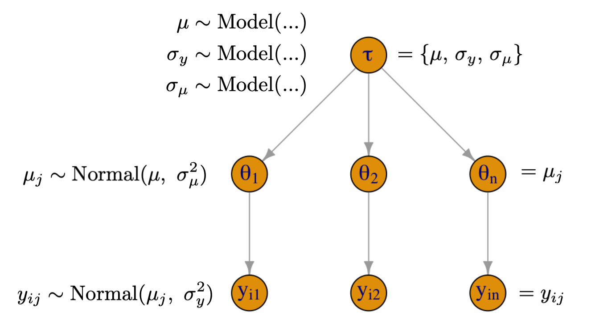

##  Logistic Regression and Introduction to Hierarchical Models {.smaller}

::: incremental
- GLMs and logistic regression
- Understanding logistic regression
- Simulating data
- Prior predictive simulations
- Example: Diabetes in Pima Native Americans
- Introducing hierarchical/multi-level models
- Pooling: none, complete, and partial
- Example hierarchical model
:::

```{r}
library(ggplot2)
library(dplyr)
library(tibble)
library(janitor)
library(gridExtra)
library(purrr)
library(rstanarm)
library(tidybayes)
library(latex2exp)
library(tidyr)

thm <- theme_minimal() + theme(
    panel.background = element_rect(fill = "#f0f1eb", color = "#f0f1eb"),
    plot.background = element_rect(fill = "#f0f1eb", color = "#f0f1eb"),
    panel.grid.major = element_blank()
  )
theme_set(thm)
```

$$
\DeclareMathOperator{\E}{\mathbb{E}}
\DeclareMathOperator{\P}{\mathbb{P}}
\DeclareMathOperator{\V}{\mathbb{V}}
\DeclareMathOperator{\L}{\mathcal{L}}
\DeclareMathOperator{\I}{\text{I}}
\DeclareMathOperator*{\argmax}{arg\,max}
\DeclareMathOperator*{\argmin}{arg\,min}
$$

## Logit and Inverse Logit {.smaller}

::: incremental
- In logistic regression, we have to map from probability space to the real line and from the real line back to probability
- Logistic function (log odds) achieves the former:
$$
\text{logit}(p) = \log\left(\frac{p}{1-p}\right)
$$
- Inverse logit achieves the latter:
$$
\text{logit}^{-1}(x) = \frac{e^x}{1 + e^x}
$$
- Notice that $\text{logit}^{-1}(5)$ is very close to 1 and $\text{logit}^{-1}(-5)$ is very close to 0
- In R, you can set `logit <- qlogis` and `invlogit <- plogis`
:::

## GLMs and Models For 0/1 Outcomes {.smaller}

::: incremental
-   Modeling a probability of an event can be framed in the GLM context (just like with counts)
-   The general setup is that we have:
    - Response vector $y$ consisting of zeros and ones
    - The data model is $y_i \sim \text{Bernoulli}(p_i)$
    - Linear predictor: $\eta_i = \alpha + X_i\beta$, where $X$ is a matrix
    - In general: $\E(y \mid X) = g^{-1}(\eta)$, where $g^{-1}$ is the inverse link function that maps the linear predictor onto the observational scale
    - In particular: $\E(y_i \mid X_i) = \text{logit}^{-1}(\alpha + X_i\beta) = p_i = \P(y_i = 1)$
       - $\text{logit}(p_i) = \eta_i$ and $p_i = \text{logit}^{-1}(\eta_i)$
:::

## Logistic Posterior {.smaller}

::: incremental
- We consider K regression inputs and independent priors on all $K + 1$ unknowns: $\alpha$ and $\beta_1, \beta_2, ..., \beta_K$
- Bernoulli likelihood is: $f(y \mid p) = p^y (1 - p)^{1-y}$ with $y \in \{0, 1\}$
- And each $p_i = \text{logit}^{-1}(\alpha + X_i\beta)$
$$
f\left(\alpha,\beta \mid y,X\right) \propto
f_{\alpha}\left(\alpha\right) \cdot \prod_{k=1}^K f_{\beta}\left(\beta_k\right) \cdot \\
\prod_{i=1}^N \left(\text{logit}^{-1}(\alpha + X_i\beta) \right)^{y_i} \left(1 - \text{logit}^{-1}(\alpha + X_i\beta)\right)^{1-y_i}
$$

- [In Stan](https://mc-stan.org/docs/functions-reference/binary_distributions.html#bernoulli-logit-glm), the likelihood term can be written on a log scale as `y ~ bernoulli_logit_glm(x, alpha, beta)` or `bernoulli_logit_glm_lupmf(y | x, alpha, beta)`
:::

## Logistic Simulation {.smaller}

::: incremental
- As before, we can forward simulate data for logistic regression
- We will fit the data and try to recover the parameters
:::

::: {.fragment}
```{r}
#| fig-width: 5
#| fig-height: 5
#| fig-align: center
#| echo: true
#| output-location: column
set.seed(123)
logit <- qlogis; invlogit <- plogis
n <- 100
a <- 1.2
b <- 0.4
x <- runif(n, -15, 10)
eta <- a + x * b
Pr <- invlogit(eta)
y <- rbinom(n, 1, Pr)
sim <- tibble(y, x, Pr)

p <- ggplot(aes(x, y), data = sim)
p <- p + geom_point(size = 0.5) +
  geom_line(aes(x, Pr), linewidth = 0.2) +
  geom_vline(xintercept = 0, color = "red", linewidth = 0.2,
             linetype = "dashed", alpha = 1/3) +
  geom_hline(yintercept = invlogit(a), color = "red", linewidth = 0.2,
             linetype = "dashed", alpha = 1/3) +
  geom_hline(yintercept = 0.50, linewidth = 0.2, linetype = "dashed", alpha = 1/3) +
  ggtitle(TeX("$y_i \\sim Bernoulli(logit^{-1}(1.2 + 0.4x_i))$")) +
  annotate("text", x = -5.5, y = invlogit(a) - 0.02,
           label = TeX("Intercept = $logit^{-1}(1.2)$ \\approx 0.77")) +
  annotate("text", x = -8, y = 0.53,
           label = TeX("$slope_{.5} = \\frac{0.4}{4} = 0.10$")) +
  ylab(TeX("$logit^{-1}(1.2 + 0.4x)$")); print(p)
```
:::

## Interpreting Logistic Coefficients {.smaller}

::: columns
::: {.column width="50%"}

::: incremental
- The intercept is the log odds of an event when $x = 0$, $\text{logit}^{-1}(1.2) = 0.77$
- The slope changes depending on where you are on the curve
- When you are near 0.50, the slope of the inverse logit function (logistic curve) is 1/4 and so you can divide your coefficient by 4 to get a rough estimate
- This implies that if we go from $x = -3$ to $x = -2$, the probability will increase by about 0.10
:::
::: {.fragment}
```{r}
#| cache: true
#| echo: true
(invlogit(1.2 + 0.4 * -2) -
   invlogit(1.2 + 0.4 * -3)) |>
  round(2)
```
:::


:::

::: {.column width="50%"}

```{r}
#| fig-width: 5
#| fig-height: 5
#| fig-align: center
#| echo: false
print(p)
```


:::
:::

## Fitting Simulated Data {.smaller}
::: incremental
- Complex and non-linear models may have a hard time recovering parameters from forward simulations
- The process for fitting simulated data may give some insight into the data-generating process and priors
:::

::: {.fragment}
```{r}
#| echo: true
#| cache: true
#| output-location: column

# fitting from eta = 1.2 +  0.4 * x
m1 <- stan_glm(y ~ x,
               prior_intercept = normal(0, 1),
               prior = normal(0, 1),
               family = binomial(link = "logit"),
               data = sim,
               chains = 4,
               refresh = 0,
               iter = 1000)
summary(m1)
```
:::

## Generating Probability Data {.smaller}
::: incremental
-   To get a sense of the variability in probability we can simulate from the prior distribution on the probability scale
:::

::: {.fragment}
```{r}
#| cache: true
#| fig-width: 5
#| fig-height: 4
#| fig-align: center
#| echo: true
#| output-location: column

prior_pred_logit <- function(x) {
  a <- rnorm(1, mean = 1.2, sd = 0.5)
  b <- rnorm(1, mean = 0.4, sd = 0.1)
  Pr <- invlogit(a + b * x)
  return(Pr)
}
prior_pred <- replicate(50, prior_pred_logit(x)) |>
  as.data.frame()

df_long <- prior_pred |>
  mutate(x = x) |>
  pivot_longer(cols = -x, names_to = "line", values_to = "y")

p <- ggplot(aes(x, y), data = df_long)
p + geom_line(aes(group = line), linewidth = 0.2, alpha = 1/5) +
  geom_line(aes(y = Pr), data = sim, linewidth = 0.5, color = 'red') +
  ylab(TeX("$logit^{-1}(\\alpha + \\beta x)$")) +
  ggtitle(TeX("Simulating from prior $logit^{-1}(\\alpha + \\beta x_i))$"),
  subtitle = TeX("$\\alpha \\sim Normal(1.2, 0.5)$ and $\\beta \\sim Normal(0.4, 0.1)$"))

```
:::

## Two Truths and a Lie[^1] {.smaller}

::: columns
::: {.column width="50%"}
1. One person tells three personal statements, one of which is a lie.
1. Others discuss and guess which statement is the lie, and they jointly construct a numerical statement of their certainty in the guess (on a 0–10 scale).
1. The storyteller reveals which was the lie.
1. Enter the certainty number and the outcome (success or failure) and submit in the Google form. Rotate through everyone in your group so that each person plays the storyteller role once.
:::

::: {.column width="50%"}
{fig-align="center" width="500"}
:::
:::

[^1]: Gelman, A. (2023). “Two Truths and a Lie” as a Class-Participation Activity. The American Statistician, 77(1), 97–101.

## Two Truths and a Lie

https://tinyurl.com/two-truths-and

{fig-align="center" width="500"}

::: {.notes}
What do you think the range of certainty scores will look like: will there be any 0’s or 10’s? Will there be a positive relation between x and y: are guesses with higher certainty be more accurate, on average? How strong will the relation be between x and y: what will the curve look like? Give approximate numerical values for the intercept and slope coefficients corresponding to their sketched curves.
:::

## Example: Diabetes {.smaller}

::: incremental
- This example comes from US National Institute of Diabetes and Digestive and Kidney Diseases from a population of women who were at least 21 years old, of Pima Indian heritage, and living near Phoenix, Arizona
- It is available as part of the R package `pdp`
- The outcome $diabetes$, is an indicator of the disease
- Some other variables are:
:::

::: {.fragment}
```{r}
#| echo: false
library(pdp)
knitr::kable(head(pima))
```
:::

## Missing Value Imputation {.smaller}

::: columns
::: {.column width="50%"}

::: incremental
- This dataset contains missing values
- People typically either delete them or replace them with average values, or something like that
- None of these are good approaches
- In R, we recommend a combination of the `mice` package and `brms`, [which works nicely](https://cran.r-project.org/web/packages/brms/vignettes/brms_missings.html) with `mice`
- From a Bayesian perspective, a missing value is just another unknown parameter in the model, which can be modeled
:::

:::


::: {.column width="50%"}
::: incremental
-  Following is an example of a simple missing value estimation from the [Stan manual](https://mc-stan.org/docs/stan-users-guide/missing-data.html)
:::

::: {.fragment}
```{stan, output.var = 'stan3', eval = FALSE, echo = TRUE}
#| code-line-numbers: "|2|3|4|7|8|9|12|13|"
data {
  int<lower=0> N_obs;
  int<lower=0> N_mis;
  array[N_obs] real y_obs;
}
parameters {
  real mu;
  real<lower=0> sigma;
  array[N_mis] real y_mis;
}
model {
  y_obs ~ normal(mu, sigma);
  y_mis ~ normal(mu, sigma);
}
```
:::

::: incremental
-  Notice, that you need to make an assumption about the model for missing values
:::


:::
:::

## Example: Diabetes {.smaller}

::: panel-tabset
## Code

::: incremental
- It is well-known that people with high BMI are at risk for Type 2 diabetes
- We can do some exploratory analysis to check this
:::

::: {.fragment}
```{r}
#| echo: true

p1 <- ggplot(pima, aes(x = mass)) +
  geom_density(aes(group = diabetes, fill = diabetes, color = diabetes), alpha = 1/5) +
  xlab("BMI")
p2 <- pima |>
  drop_na() |>
  mutate(bmi_cut = cut(mass, breaks = seq(15, 70, by = 5))) |>
  group_by(bmi_cut) |>
  summarize(p = mean(diabetes == "pos"),
            n = n(),
            se = sqrt(p * (1 - p) / n),
            lower = p - se,
            upper = p + se) |>
  ggplot(aes(x = bmi_cut, y = p)) +
  geom_point() + geom_linerange(aes(ymin = lower, ymax = upper), linewidth = 0.2) +
  xlab("BMI range") + ylab("Proportion") +
  ggtitle("Proportion of diabetics by BMI +/- 1 SE")
```
:::


## Plot

::: {.fragment}
```{r}
#| fig-width: 10
#| fig-height: 4
#| fig-align: center
#| echo: false
grid.arrange(p1, p2, ncol = 2)
```
:::

:::

## Example: Diabetes {.smaller}

::: incremental
- Before building a model, we should scale the variables
:::

::: {.fragment}
```{r}
#| cache: true
#| echo: true

library(pdp)
d <- pima |>
  as_tibble() |>
  select(diabetes, age, pedigree, mass, glucose) |>
  drop_na() |> # in an important analysis, you should not do this; instead, impute
  mutate(diab = if_else(diabetes == "pos", 1, 0),
         age = (age - mean(age)) / 10,
         pedigree = (pedigree - mean(pedigree)),
         bmi = ((mass - mean(mass)) / 10),
         glucose = ((glucose - mean(glucose)) / sd(glucose)))
head(d)
```
:::

## Example: Diabetes {.smaller}

::: incremental
- We will be fitting the following statistical model, where $x$ is the BMI and $\bar x$ is the average BMI in the sample
- We divide by ten so that a unit increase in BMI is a meaningful change
- We need to pick priors on $\alpha$, and $\beta$
:::

::: {.fragment}
$$
\begin{eqnarray}
y_i &\sim& \text{Bernoulli}(p_i) \\
\eta_i &=& \alpha + \beta \left( \frac{x_{i} - \bar x}{10} \right) \\
p_i &=& \frac{e^{\eta_i}}{1 + e^{\eta_i}} \\
\alpha &\sim& \text{Normal}(\mu_\alpha ,\ \sigma_\alpha) \\
\beta &\sim& \text{Normal}(\mu_\beta , \ \sigma_\beta)
\end{eqnarray}
$$
:::


## Example: Diabetes {.smaller}

::: incremental
- The prior on the intercept corresponds to the log odds of developing diabetes when a person has an average BMI, which is about 29 in the US (which is considered high-risk)
- It is likely that the probability is between 20% and 80%, and so a weakly informative prior can be expressed as $\text{Normal}(0, 0.5)$, since `invlogit(c(-1.5, 1.5)) = [0.18, 0.82]`
- Suppose, we also put a weakly informative $\text{Normal}(0, 1)$ prior on $\beta$
:::

::: {.fragment}
$$
\begin{eqnarray}
y_i &\sim& \text{Bernoulli}(p_i) \\
\eta_i &=& \alpha + \beta \left( \frac{x_{i} - \bar x}{10} \right) \\
p_i &=& \frac{e^{\eta_i}}{1 + e^{\eta_i}} \\
\alpha &\sim& \text{Normal}(0 ,\ 0.5) \\
\beta &\sim& \text{Normal}(0 , \ 1)
\end{eqnarray}
$$
:::


## Example: Diabetes {.smaller}

::: incremental
- Let's perform prior predictive simulation
:::

::: {.fragment}
```{r}
#| cache: true
#| echo: true
#| output-location: column

m_prior <- stan_glm(diab ~ bmi,
               prior_intercept = normal(0, 0.5),
               prior = normal(0, 1),
               family = binomial(link = "logit"),
               prior_PD = TRUE,
               data = d,
               refresh = 0,
               seed = 123,
               iter = 1000)

summary(m_prior)
```
:::

## Example: Diabetes {.smaller}

::: {.fragment}
```{r}
#| cache: true
#| fig-width: 6
#| fig-height: 4
#| fig-align: center
#| echo: true

d |>
  add_epred_draws(m_prior, ndraws = 100) |>
  ggplot(aes(x = mass, y = diab)) +
  geom_line(aes(y = .epred, group = .draw), size = 0.1) +
  geom_point(aes(mass, diab), alpha = 1/20, size = 0.5) +
  xlab("BMI") + ylab("Probability") +
  ggtitle("Possible Logit Curves Implied by the Prior")
```
:::

## Example: Diabetes {.smaller}

::: incremental
- The negative associations are implausible given everything we know about diabetes
- Suppose the risk of diabetes doubles for every 10 $kg/m^2$ (unverified)
- That would imply average $\beta \approx 0.7$, since the multiplicative change in odds is $e^{0.7} \approx 2$
- We will set the standard deviation to 0.2 to avoid negative effects and allow the odds to be as high as 3.5
:::

::: {.fragment}
$$
\begin{eqnarray}
y_i &\sim& \text{Bernoulli}(p_i) \\
\eta_i &=& \alpha + \beta \left( \frac{x_{i} - \bar x}{10} \right) \\
p_i &=& \frac{e^{\eta_i}}{1 + e^{\eta_i}} \\
\alpha &\sim& \text{Normal}(0 ,\ 0.5) \\
\beta &\sim& \text{Normal}(0.7 , \ 0.2)
\end{eqnarray}
$$
:::

## Example: Diabetes {.smaller}

::: incremental
- With new priors, let's repeat the prior predictive simulation
:::

::: {.fragment}
```{r}
#| cache: true
#| echo: true
#| output-location: column

m_prior <- stan_glm(diab ~ bmi,
               prior_intercept = normal(0, 0.5),
               prior = normal(0.7, 0.2),
               family = binomial(link = "logit"),
               prior_PD = TRUE,
               data = d,
               refresh = 0,
               seed = 123,
               iter = 1000)
summary(m_prior)
```
:::

## Example: Diabetes {.smaller}

::: {.fragment}
```{r}
#| fig-width: 6
#| fig-height: 4
#| fig-align: center
#| echo: true

d |>
  add_epred_draws(m_prior, ndraws = 100) |>
  ggplot(aes(x = mass, y = diab)) +
  geom_line(aes(y = .epred, group = .draw), size = 0.1) +
  geom_point(aes(mass, diab), alpha = 1/20, size = 0.5) +
  xlab("BMI") + ylab("Probability") +
  ggtitle("Possible Logit Curves Implied by the Prior")
```
:::

## Example: Diabetes {.smaller}

::: incremental
- With this new prior we are ready to fit the model
:::

::: {.fragment}
```{r}
#| cache: true
#| echo: true
#| output-location: column

m2 <- stan_glm(diab ~ bmi,
               prior_intercept = normal(0, 0.5),
               prior = normal(0.7, 0.2),
               family = binomial(link = "logit"),
               prior_PD = FALSE,
               data = d,
               refresh = 0,
               seed = 123,
               iter = 1000)
summary(m2)
```
:::

## Example: Diabetes {.smaller}

::: incremental
- There are no sampling problems, but we should still check the diagnostics
:::

::: {.fragment}
```{r}
#| fig-width: 10
#| fig-height: 4
#| fig-align: center
#| echo: true

library(bayesplot)
p1 <- mcmc_trace(m2)
p2 <- mcmc_acf(m2)
grid.arrange(p1, p2, ncol = 2)

```
:::

## Example: Diabetes {.smaller}

::: incremental
- We can examine the posterior probability of diabetes among this population (women who were at least 21 years old, and of Pima Indian heritage)
:::

::: {.fragment}
```{r}
#| fig-width: 5
#| fig-height: 4
#| fig-align: center
#| echo: true
d |>
  add_epred_draws(m2, ndraws = 100) |>
  ggplot(aes(x = mass, y = diab)) +
  geom_line(aes(y = .epred, group = .draw), size = 0.1) +
  geom_point(aes(mass, diab), alpha = 1/20, size = 0.5) +
  xlab("BMI") + ylab("Probability")
```
:::

## Example: Diabetes {.smaller}

::: incremental
- We can also see the posterior predictive distribution of the probability of diabetes
:::

::: {.fragment}
```{r}
#| fig-width: 5
#| fig-height: 4
#| fig-align: center
#| echo: true
prop_diab <- function(x) {
  mean(x == 1)
}
pp_check(m2, nreps = 100,
         plotfun = "stat", stat = "prop_diab") + xlab("Probability of Diabetes")
```
:::

## Example: Diabetes {.smaller}

::: incremental
- As before, we can compute predictions for new data using `posterior_predict` or by constructing the posterior distribution directly
- Let's say we want to predict the probability of diabetes for a person with BMI = 40
:::

::: {.fragment}
```{r}
#| cache: true
#| echo: true

bmi_scaled <- (40 - mean(d$mass)) / 10
yepred_m2 <- posterior_epred(m2, newdata = data.frame(bmi = bmi_scaled))
quantile(yepred_m2, probs = c(0.05, 0.50, 0.95)) |> round(2)

d_m2 <- as_tibble(m2) |>
  mutate(log_odds = `(Intercept)` + bmi * bmi_scaled,
         prob = invlogit(log_odds),
         ypred = rbinom(2e3, size = 1, prob = prob))
d_m2[1:3, ]
quantile(d_m2$prob, probs = c(0.05, 0.50, 0.95)) |> round(2)
```
:::

## Example: Diabetes {.smaller}

::: incremental
- We will extend this model and evaluate the model performance
- Here we set weakly informative priors on the other three coefficients
:::

::: {.fragment}
```{r}
#| cache: true
#| echo: true
#| output-location: column
priors <- normal(location = c(0.7, 0, 0, 0),
                 scale = c(0.2, 1, 1, 1))
m3 <- stan_glm(diab ~ bmi + pedigree +
                 age + glucose,
               prior_intercept = normal(0, 0.5),
               prior = priors,
               family = binomial(link = "logit"),
               data = d,
               refresh = 0,
               seed = 123,
               iter = 1000)
summary(m3)
```
:::

## ShinyStan Demo {.smaller}

- To install, run `install.packages("shinystan")`, then launch with `launch_shinystan(m3)`

{fig-align="center" width="672"}

## Making Additional Improvements {.smaller}

::: incremental
- There is a good reason to believe that glucose and heredity interact so we will include an interaction term
- Age effects are rarely linear and so we include a B-Spline for non-linear age effects
:::

::: {.fragment}
```{r}
#| cache: true
#| echo: true
#| output-location: column
library(splines)
priors <- normal(location = c(0.7, rep(0, 7)),
                 scale = c(0.2, rep(1, 7)))
m4 <- stan_glm(diab ~ bmi + pedigree +
                 bs(age, df = 4) +
                 glucose + glucose:pedigree,
               prior_intercept = normal(0, 0.5),
               prior = priors,
               family = binomial(link = "logit"),
               data = d,
               refresh = 0,
               seed = 123,
               iter = 1000)
summary(m4)
```
:::

## Example: Diabetes {.smaller}

::: incremental
- We can perform model comparison using several methods
- One way is to assess classification accuracy under different probability cut points, which is often done in Machine Learning (ROC/AUC)
- A better way is to use LOO (`loo` and `loo_compare` in R)
:::

::: {.fragment}
```{r}
#| cache: true
#| echo: true
#| output-location: column
par(mar = c(3,3,2,1),
    mgp = c(2,.7,0),
    tck = -.01,
    bg  = "#f0f1eb")
m2_loo <- loo(m2)
m3_loo <- loo(m3)
m4_loo <- loo(m4)
loo_compare(m2_loo, m3_loo, m4_loo)
plot(m4_loo)
```
:::

## Introduction to Hierarchical Models {.smaller}

{fig-align="center"}

## Introduction to Hierarchical Models {.small}

::: incremental
- Hierarchical: modeling dependence of lower parameter on a higher parameter, which we sometimes call hyperparameter
- Call the lower level parameter $\theta$, and hyperparameter $\tau$
- We can express the joint prior as: $f(\theta, \tau) = f(\theta \mid \tau) f(\tau)$
- The joint posterior is:
:::

::: {.fragment}
$$
\begin{split}
f(\theta, \tau \mid y) & \propto \underbrace{f(y \mid \theta, \tau)}_\text{Likelihood} \; \underbrace{ f(\theta, \tau)}_\text{Joint Prior} \\
& = f(y \mid \theta, \tau) \; f(\theta \mid \tau) \; f(\tau) \\
& = f(y \mid \theta) \; f(\theta \mid \tau) \; f(\tau)
\end{split}
$$
:::


## Sleep Data {.smaller}

::: incremental
-   Let's look at a classic dataset called `sleepstudy` from `lme4` package
-   These data are from the study described in Belenky et al. (2003), for the most sleep-deprived group (3 hours time-in-bed) and for the first 10 days of the study, up to the recovery period
:::

::: {.fragment}
```{r}
#| fig-width: 8
#| fig-height: 3.8
#| fig-align: center
#| echo: true
p <- ggplot(aes(Days, Reaction), data = lme4::sleepstudy)
p + geom_point(size = 0.3) + geom_line(linewidth = 0.1) + facet_wrap(vars(Subject)) + ylab("Reaction time (ms)")
```
:::

## Sleep Data {.smaller}

::: incremental
-   To get a better sense of the differences in per-Subject reaction time distributions, we can plot them side by side
:::

::: {.fragment}
```{r}
#| fig-width: 11
#| fig-height: 4.5
#| fig-align: center
#| echo: false
p <- ggplot(aes(Subject, Reaction), data = lme4::sleepstudy)
p + geom_boxplot() + facet_wrap(vars(Subject), ncol = 18) + ylab("Reaction time (ms)") +
   theme(axis.title.x = element_blank(),axis.text.x = element_blank(), axis.ticks.x = element_blank())
```
:::


## Pooling {.smaller}

::: incremental
- Pooling has to do with how much regularization we induce on parameter estimates in each cluster; sometimes this is called shrinkage
- Complete pooling ignores the clusters and estimates a global parameter
- Even though reaction time $y_i$, belongs to subject $j$, we ignore the groups and index all the $y$s together

:::

::: {.fragment}
```{r}
#| fig-align: center
#| fig-width: 5
#| fig-height: 4
#| echo: false
library(igraph)
par(mar = c(3,3,2,1), mgp = c(2,.7,0), tck = -.01, bg  = "#f0f1eb")
edge_list <- data.frame(from = c("theta"),
                        to   = c("y1", "y2", "yn"))
latex_node_labels <- c("$\\theta$", "$y_{1}$", "$y_{2}$", "$y_{n}$")

names <- sapply(latex_node_labels, function(x) as.expression(TeX(x)))
graph <- graph_from_data_frame(edge_list, directed = TRUE)
layout <- layout_as_tree(graph)
plot(graph, layout = layout, vertex.size = 30, vertex.label = names,
     vertex.label.cex = 1.2, edge.arrow.size = 0.6)
```
:::

## Pooling {.smaller}

::: incremental
- Complete pooling is the opposite of no pooling, where we estimate a separate model for each group
- Here, we have $n$ subjects, and $y_{ij}$ refers to the $i$th reaction time in subject $j$
:::

::: {.fragment}
```{r}
#| fig-align: center
#| fig-width: 5
#| fig-height: 4
#| echo: false
par(mar = c(3,3,2,1), mgp = c(2,.7,0), tck = -.01, bg  = "#f0f1eb")
edge_list <- data.frame(from = c("theta1", "theta2", "thetan"),
                        to   = c("y1", "y2", "yn"))
latex_node_labels <- c("$\\theta_1$", "$\\theta_2$", "$\\theta_n$",
                       "$y_{i1}$", "$y_{i2}$", "$y_{\\i\\n}$")
names <- sapply(latex_node_labels, function(x) as.expression(TeX(x)))
graph <- graph_from_data_frame(edge_list, directed = TRUE)
layout <- layout_as_tree(graph)
plot(graph, layout = layout, vertex.size = 30, vertex.label = names,
     vertex.label.cex = 1.2, edge.arrow.size = 0.6)
```
:::

## Partial Pooling {.smaller}

::: incremental
- Partial pooling is the compromise between the two extremes
- Like any other parameter in a Bayesian model, the global hyperparameter $\tau$ is given a prior and is learned from the data
- There could be multiple levels of nesting, say students within schools, within states, etc.
:::

::: {.fragment}
```{r}
#| fig-align: center
#| fig-width: 5
#| fig-height: 4
#| echo: false
par(mar = c(3,3,2,1), mgp = c(2,.7,0), tck = -.01, bg  = "#f0f1eb")
edge_list <- data.frame(from = c("tau", "tau", "tau", "theta1", "theta2", "thetan"),
                        to   = c("theta1", "theta2", "thetan", "y1", "y2", "yn"))
latex_node_labels <- c("$\\tau$", "$\\theta_1$", "$\\theta_2$", "$\\theta_n$",
                       "$y_{i1}$", "$y_{i2}$", "$y_{\\i\\n}$")
names <- sapply(latex_node_labels, function(x) as.expression(TeX(x)))
graph <- graph_from_data_frame(edge_list, directed = TRUE)
layout <- layout_as_tree(graph)
plot(graph, layout = layout, vertex.size = 30, vertex.label = names,
     vertex.label.cex = 1.2, edge.arrow.size = 0.6)
```
:::

## Partial Pooling Compromise {.smaller}

::: incremental
- Posterior $f(\theta \mid y)$ is a compromise between prior $f(\theta)$ and likelihood $f(y \mid \theta)$
- In the same spirit, the pooled parameter $\theta_j$ (say reaction time for subject $j$) is a compromise between within-subject parameters, and among-subject parameters
:::

::: {.fragment}
$$
\theta_j^{\text{pooled}} \approx \frac{\frac{n_j}{\sigma_{y}^2} \overline y_j + \frac{1}{\sigma_{\tau}^2} \overline y_{\tau}} {\frac{n_j}{\sigma_{y}^2} + \frac{1}{\sigma_{\tau}^2}}
$$
:::

::: incremental
- $\overline y_j$ is no-pool estimate of average reaction time for subject $j$, and $\overline y_{\tau}$ is complete-pool estimate
- $n_j$ is the number of observations for subject $j$, $\sigma_{y}^2$ is within subject variance of reaction times, and $\sigma_{\tau}^2$ is the between-subject variance
:::

## Sleep Data {.smaller}

::: incremental
- Let's build three models for the sleep data, starting with complete pooling, which is what we have been doing all along
- We will start with the intercept-only model
- These data contain the same number of observations per Subject, which is unusual, so we will make it more realistic by removing 30% of the measurements
:::

::: {.fragment}
```{r}
#| fig-width: 4
#| fig-height: 3
#| fig-align: center
#| echo: true
#| output-location: column
set.seed(123)
n <- nrow(lme4::sleepstudy)
s <- sample(1:n, n * 0.7)
d <- lme4::sleepstudy[s, ]
p1 <- ggplot(aes(Days, Reaction),
            data = d)
p1 <- p1 + geom_jitter(size = 0.3, width = 0.2)
p2 <- ggplot(aes(Reaction),
            data = d)
p2 <- p2 + geom_histogram(binwidth = 20)
grid.arrange(p1, p2, nrow = 2)
```
:::

## Sleep Data {.smaller}

::: incremental
- This is a simple model of the mean reaction time $\mu$
:::

::: {.fragment}
$$
\begin{eqnarray}
y_{ij} & \sim & \text{Normal}(\mu, \ \sigma^2) \\
\mu    & \sim & \text{Normal}(300, 10^2) \\
\sigma & \sim & \text{Exponential}(0.02)
\end{eqnarray}
$$
:::

::: {.fragment}
```{r}
#| echo: true
#| cache: true
#| output-location: column

m1 <- stan_glm(Reaction ~ 1,
               prior_intercept = normal(300, 10),
               prior_aux = exponential(0.02),
               family = gaussian,
               data = d,
               iter = 5000,
               refresh = 0,
               seed = 123)
summary(m1)
```
:::

## Sleep Data {.smaller}

::: incremental
- We can compare the predictions from the complete-pooling model to the reaction times of each subject
:::

::: {.fragment}
```{r}
#| echo: true
#| cache: true
#| fig-width: 10
#| fig-height: 3
#| fig-align: center

new <- d |> group_by(Subject) |> summarise(Reaction = mean(Reaction)) |>
  arrange(Reaction)
new_pred <- posterior_predict(m1, newdata = new)
ppc_intervals(new$Reaction, yrep = new_pred) +
  scale_x_continuous(labels = new$Subject,  breaks = 1:nrow(new)) +
  xlab("Subject") + ylab("Reaction")
```
:::

## Sleep Data {.smaller}

::: incremental
- Next, we will fit a no-pool model, which means we are fitting 18 separate models, one for each subject
- You can fit them separately, by making 18 calls to `stan_glm`, or you can do in all at once
- Since we will not run 18 separate regressions, it will be simpler to estimate one global variance parameter $\sigma$, which means there is some variance pooling
- This will not affect the inferences for $\mu_j$ which is our main focus here
:::

::: {.fragment}
$$
\begin{eqnarray}
y_{ij} & \sim & \text{Normal}(\mu_j, \ \sigma^2) \\
\mu_j    & \sim & \text{Normal}(300, s^2) \\
\sigma & \sim & \text{Exponential}(0.02)
\end{eqnarray}
$$
:::


## Sleep Data {.smaller}

::: {.fragment}
```{r}
#| echo: true
#| cache: true

m2 <- stan_glm(Reaction ~ Subject - 1,
               prior = normal(300, 10),
               prior_aux = exponential(0.02),
               family = gaussian,
               data = d,
               iter = 1000,
               refresh = 0,
               seed = 123)
summary(m2)
```
:::

## Sleep Data {.smaller}

::: incremental
- We can compare the predictions from the no-pooling model to the reaction times of each subject
:::

::: {.fragment}
```{r}
#| echo: true
#| cache: true
#| fig-width: 10
#| fig-height: 3
#| fig-align: center

new_pred <- posterior_predict(m2, newdata = new)
ppc_intervals(new$Reaction, yrep = new_pred) +
  scale_x_continuous(labels = new$Subject,  breaks = 1:nrow(new)) +
  xlab("Subject") + ylab("Reaction")
```
:::

::: incremental
- What are some of the limitations of this approach?
:::

## Building a Hierarchical Model {.smaller}

{fig-align="center" height="300"}

::: incremental
- $\mu_j$ is an average reaction time for subject $j$
- $\sigma_y$ is the within-subject variability of reaction times
- $\mu$ is the global average of reaction times across all subject
- $\sigma_{\mu}$ is subject to subject variability of reaction times
- Top-level parameters get fixed priors and induce the degree of pooling
:::


## Sleep Data {.smaller}

::: columns
::: {.column width="50%"}

::: incremental
- We can now write out the full model giving priors to all global parameters
- Notice, how the model could be extended if instead of $\mu_j$ we had our typical linear predictor
:::

::: {.fragment}
$$
\begin{eqnarray}
y_{ij} &\sim& \text{Normal}(\mu_j, \ \sigma_y^2) \\
\mu_{j} &\sim& \text{Normal}(\mu, \ \sigma_{\mu}^2) \\
\mu &\sim& \text{Normal}(300, 50^2) \\
\sigma_y &\sim& \text{Exponential}(0.02) \\
\sigma_{\mu} &\sim& \text{Exponential}(0.02)
\end{eqnarray}
$$
:::

:::

::: {.column width="50%"}

::: incremental
- This model can also be written such that $\mu_j = \mu + b_j$, where each $b_j \sim \text{Normal}(0, \sigma_{\mu}^2)$
:::

::: {.fragment}
$$
\begin{eqnarray}
y_{ij} &\sim& \text{Normal}(\mu_j, \ \sigma_y^2) \\
\mu_j &=& \mu + b_j \\
b_j &\sim& \text{Normal}(0, \ \sigma_{\mu}^2) \\
\ldots
\end{eqnarray}
$$
:::

:::
:::

## Non-Centering {.smaller}

::: columns
::: {.column width="50%"}

Centered:

$$
\begin{eqnarray}
b_j &\sim& \text{Normal}(0, \sigma_\mu^2) \\
\mu_j &=& \mu + b_j
\end{eqnarray}
$$

:::

::: {.column width="50%"}

Non-centered:

$$
\begin{eqnarray}
z_j &\sim& \text{Normal}(0, 1) \\
b_j &=& \sigma_\mu z_j \\
\mu_j &=& \mu + b_j
\end{eqnarray}
$$

:::
:::

::: incremental
- Both parameterizations imply the same model: $b_j \sim \text{Normal}(0, \sigma_\mu^2)$
- Non-centering samples a standardized effect $z_j$ first, then scales it by $\sigma_\mu$
- This often improves Stan sampling when group-level variation is weakly identified
:::

## Stan Model (not what stan_glmer() does) {.smaller}

::: columns
::: {.column width="50%"}
::: {style="font-size: 0.8em; line-height: 1.06;"}
```stan
data {
  int<lower=1> N;                 // observations
  int<lower=1> J;                 // subjects
  vector[N] y;                    // reaction times
  array[N] int<lower=1, upper=J> subject;
}

parameters {
  real mu;                        // population mean
  real<lower=0> sigma_y;          // within-subject sd
  real<lower=0> sigma_mu;         // between-subject sd
  vector[J] z_subject;            // standardized subject effects
}

transformed parameters {
  vector[J] b_subject = sigma_mu * z_subject;
  vector[J] mu_subject = mu + b_subject;
}

model {
  mu ~ normal(300, 50);
  sigma_y ~ exponential(0.02);
  sigma_mu ~ exponential(0.02);
  z_subject ~ normal(0, 1);

  for (i in 1:N) {
    y[i] ~ normal(mu_subject[subject[i]], sigma_y);
  }
}
```
:::
:::

::: {.column width="50%"}

::: {style="font-size: 0.65em;"}
Hypothetical data:

| $i$ | $y_i$ | `subject[i]` | mean used |
|---:|---:|---:|:---|
| 1 | 250 | 1 | `mu_subject[1]` |
| 2 | 310 | 1 | `mu_subject[1]` |
| 3 | 370 | 2 | `mu_subject[2]` |
| 4 | 340 | 2 | `mu_subject[2]` |
| 5 | 290 | 3 | `mu_subject[3]` |

Key parameters:

| parameter | meaning |
|:---|:---|
| `mu` | population mean |
| `b_subject[j]` | subject $j$ deviation |
| `mu_subject[j]` | $\mu + b_j$ |
| `sigma_y` | within-subject SD |

So for row $i = 3$:

$$
\texttt{subject[3]} = 2
$$

and

$$
y_3 \sim \text{Normal}(\texttt{mu_subject[2]}, \sigma_y).
$$
:::

:::
:::

## Stan Model Direct Non-centered  {.smaller}

```stan
data {
  int<lower=1> N;
  int<lower=1> J;
  vector[N] y;
  array[N] int<lower=1, upper=J> subject;
}
parameters {
  real mu;                                          // population mean
  real<lower=0> sigma_y;                            // within-subject sd
  real<lower=0> sigma_mu;                           // between-subject sd
  vector<offset=mu, multiplier=sigma_mu>[J] mu_subject;  // subject means
}
model {
  mu ~ normal(300, 50);
  sigma_y ~ exponential(0.02);
  sigma_mu ~ exponential(0.02);
  mu_subject ~ normal(mu, sigma_mu);
  y ~ normal(mu_subject[subject], sigma_y);
}
```

## Sleep Data {.smaller}

::: columns
::: {.column width="50%"}

::: {.fragment}
```{r}
#| echo: true
#| cache: true

m3 <- stan_glmer(Reaction ~ (1 | Subject),
                 prior_intercept = normal(300, 50),
                 prior_aux = exponential(0.02),
                 prior_covariance = decov(shape = 1, scale = 50),
                 family = gaussian, data = d, iter = 1500,
                 refresh = 0,
                 seed = 123)
```
:::


:::

::: {.column width="50%"}

::: incremental
- (Intercept) = $\mu$
- sigma = $\sigma_y$
- Sigma[Subject:(Intercept),(Intercept)] = $\sigma^2_{\mu}$
- b[(Intercept) Subject:XYZ] = $b_j$, and so $\mu_j = \mu + b_j$
:::


:::
:::

::: {.fragment}
```{r}
#| echo: true
#| cache: true
summary(m3)
```
:::


## Computing $\mu_j$ {.smaller}

::: {.fragment}
```{r}
#| cache: true
#| echo: true

muj <- m3 |>
  spread_draws(`(Intercept)`, b[ ,Subject]) |>
  mutate(mu_j = `(Intercept)` + b) |>
  select(Subject, mu_j) |>
  mean_qi(.width = 0.90)

head(muj)
```
:::

::: {.fragment}
```{r}
#| fig-width: 10
#| fig-height: 3
#| fig-align: center
muj |> arrange(mu_j) |> mutate(order = row_number()) |>
  ggplot(aes(x = order, y = mu_j, ymin = .lower, ymax = .upper)) +
  geom_pointrange(size = 0.3, linewidth = 0.2) +
  scale_x_continuous(labels = "Subjects", breaks = 18) + xlab("") +
  ylab(expression(mu[j]))
```
:::

## Sleep Data {.smaller}

::: incremental
- We can see the effects of hierarchical pooling below
- Subjects that are farther away from $\E(\mu) = 294$(ms) and the ones that have fewer observations are pooled more towards the global mean
:::

::: {.fragment}
```{r}
#| cache: true
#| fig-width: 10
#| fig-height: 4
#| fig-align: center

mu <- m3 |>
  spread_draws(`(Intercept)`) |>
  median_qi(.width = 0.50)


new_pred <- posterior_predict(m3, newdata = new)
ppc_intervals(new$Reaction, yrep = new_pred) +
  scale_x_continuous(labels = new$Subject,  breaks = 1:nrow(new)) +
  xlab("Subject") + ylab("Reaction") +
  geom_hline(yintercept = mu$`(Intercept)`, linewidth = 0.2, color = "grey")
```
:::

## Varying Intercepts and Slopes {.smaller}

::: {style="font-size: 0.72em; line-height: 1.10;"}

**The data.** We have $N$ observations of reaction time $y_i$ measured on day $\text{days}_i$ for subject
$s[i] \in \{1, \ldots, J\}$, with $J = 18$ subjects and roughly 10 observations per subject.

**The generative model.** At the observation level:

$$
y_i \mid \alpha, \beta, \mathbf{b}_{s[i]}, \sigma_y
\sim
\mathcal{N}\!\left(
\alpha + b_{s[i],1} + (\beta + b_{s[i],2})\,\text{days}_i,\;
\sigma_y
\right)
$$

Each subject has a pair of deviations from the population intercept and slope:

$$
\mathbf{b}_j =
\begin{pmatrix}
b_{j,1} \\
b_{j,2}
\end{pmatrix}
\sim
\mathcal{N}_2(\mathbf{0}, \Sigma),
\qquad j = 1, \ldots, J
$$

where $\Sigma$ is a $2 \times 2$ covariance matrix that captures both the spread of subject-level intercepts and slopes *and* their correlation. The decomposition that matters for the parameterization is:

$$
\Sigma = \text{diag}(\boldsymbol\tau)\,\Omega\,\text{diag}(\boldsymbol\tau)
$$

with $\boldsymbol\tau = (\tau_1, \tau_2)^\top$ the marginal SDs and $\Omega$ the $2 \times 2$ correlation matrix.
This separates scale from correlation, letting priors act separately on $\boldsymbol\tau$ and $\Omega$.
:::

## Stan Model: Centered {.smaller}

::: columns
::: {.column width="52%"}
::: {style="font-size: 0.75em; line-height: 1.10;"}
```stan
data {
  int<lower=1> N;
  int<lower=1> J;
  vector[N] y;
  vector[N] days;
  array[N] int<lower=1, upper=J> subject;
}
parameters {
  real alpha;                     // population intercept
  real beta;                      // population slope
  real<lower=0> sigma_y;          // residual sd
  vector<lower=0>[2] tau;         // intercept/slope subject SDs
  corr_matrix[2] Omega;           // correlation matrix
  array[J] vector[2] b_subject;   // subject deviations (centered)
}
transformed parameters {
  cov_matrix[2] Sigma = quad_form_diag(Omega, tau);
}
model {
  alpha ~ normal(300, 50);
  beta ~ normal(0, 2);
  sigma_y ~ exponential(0.02);
  tau[1] ~ exponential(0.02);
  tau[2] ~ exponential(0.2);

  Omega ~ lkj_corr(1);
  b_subject ~ multi_normal(rep_vector(0, 2), Sigma);

  for (i in 1:N) {
    y[i] ~ normal(
      alpha + b_subject[subject[i], 1] +
        (beta + b_subject[subject[i], 2]) * days[i],
      sigma_y
    );
  }
}
...
```
:::
:::

::: {.column width="48%"}
::: {style="font-size: 0.8em; line-height: 1.10;"}
```stan
...
generated quantities {
  real rho = Omega[1, 2];
  vector[N] log_lik;
  for (i in 1:N)
    log_lik[i] = normal_lpdf(y[i] |
      alpha + b_subject[subject[i], 1] +
        (beta + b_subject[subject[i], 2]) * days[i],
      sigma_y);
}
```
:::
:::
:::


## Stan Model: Non-centered {.smaller}

::: columns
::: {.column width="52%"}

::: {style="font-size: 0.50em; line-height: 1.00;"}
```stan
data {
  int<lower=1> N;
  int<lower=1> J;
  vector[N] y;
  vector[N] days;
  array[N] int<lower=1, upper=J> subject;
}

parameters {
  real alpha;                     // population intercept
  real beta;                      // population slope
  real<lower=0> sigma_y;          // residual sd
  vector<lower=0>[2] tau;         // intercept/slope subject SDs
  cholesky_factor_corr[2] L_Omega;
  matrix[2, J] z_subject;         // standardized subject effects
}

transformed parameters {
  matrix[J, 2] b_subject =
    (diag_pre_multiply(tau, L_Omega) * z_subject)';
}

model {
  alpha ~ normal(300, 50);
  beta ~ normal(0, 2);
  sigma_y ~ exponential(0.02);
  tau[1] ~ exponential(0.02);
  tau[2] ~ exponential(0.2);
  L_Omega ~ lkj_corr_cholesky(1);
  to_vector(z_subject) ~ normal(0, 1);

  for (i in 1:N) {
    y[i] ~ normal(
      alpha + b_subject[subject[i], 1] +
        (beta + b_subject[subject[i], 2]) * days[i],
      sigma_y
    );
  }
}

generated quantities {
  corr_matrix[2] Omega = multiply_lower_tri_self_transpose(L_Omega);
  real rho = Omega[1, 2];
  vector[N] log_lik;
  for (i in 1:N)
    log_lik[i] = normal_lpdf(y[i] |
      alpha + b_subject[subject[i], 1] +
        (beta + b_subject[subject[i], 2]) * days[i],
      sigma_y);
}
```
:::

:::

::: {.column width="48%"}

::: {style="font-size: 0.48em; line-height: 1.06;"}
The non-centered trick rewrites the prior on $\mathbf{b}_j$ using a deterministic transformation of standard normals.
Cholesky-decompose $\Omega = L_\Omega L_\Omega^\top$, so:

$$
\Sigma =
\text{diag}(\boldsymbol\tau)L_\Omega L_\Omega^\top\text{diag}(\boldsymbol\tau)
=
\left(\text{diag}(\boldsymbol\tau)L_\Omega\right)
\left(\text{diag}(\boldsymbol\tau)L_\Omega\right)^\top
$$

Let $L = \text{diag}(\boldsymbol\tau)L_\Omega$. Then if
$\mathbf{z}_j \sim \mathcal{N}_2(\mathbf{0}, I)$,

$$
\mathbf{b}_j = L\mathbf{z}_j
\sim \mathcal{N}_2(\mathbf{0}, \Sigma)
$$

by construction. Crucially, in the parameterization $(\mathbf{z}_j, \boldsymbol\tau, L_\Omega)$, the prior is independent across components:
$\mathbf{z}_j \sim \mathcal{N}(\mathbf{0}, I)$ regardless of what $\boldsymbol\tau$ does.
The funnel is gone; the dependency between $\mathbf{b}_j$ and $\boldsymbol\tau$ is moved out of the prior geometry and into the data-informed likelihood.

In the Stan code this is exactly the line:

```stan
matrix[J, 2] b_subject =
  (diag_pre_multiply(tau, L_Omega) * z_subject)';
```

Reading it:

- `diag_pre_multiply(tau, L_Omega)` builds $L = \text{diag}(\boldsymbol\tau)L_\Omega$, a $2 \times 2$ matrix.
- `z_subject` is $2 \times J$, with each column a standard-normal draw $\mathbf{z}_j$.
- Multiplication gives a $2 \times J$ matrix whose columns are $L\mathbf{z}_j = \mathbf{b}_j$.
- The transpose makes it $J \times 2$, so `b_subject[j, 1]` is subject $j$'s intercept deviation and `b_subject[j, 2]` is its slope deviation.

`z_subject` is declared $2 \times J$ rather than $J \times 2$ so the multiplication $LZ$ lines up without an extra transpose inside the hot path.
:::

:::
:::

## Similar Model in RStanArm {.smaller}

::: {.fragment}
```{r}
#| echo: true
#| cache: true
m4 <- stan_glmer(Reaction ~ Days + (Days | Subject),
                 prior_intercept = normal(300, 50),
                 prior = normal(0, 2),
                 prior_aux = exponential(0.02),
                 prior_covariance = decov(reg = 1,   # This is not what is done
                   conc = 1, shape = 1, scale = 1),  # in Stan on the previous slide
                 family = gaussian, data = d, iter = 1500,
                 cores = 4, seed = 123, refresh = 0)
summary(m4)
```
:::


##

```{r}
#| echo: false
#| fig-width: 12
#| fig-height: 8
#| fig-align: center

new_data <- lme4::sleepstudy |> select(Days, Subject)
ypred <- posterior_predict(m4, newdata = new_data)
aug_data <- mutate(lme4::sleepstudy, InSample = 1:nrow(lme4::sleepstudy) %in% s)
aug_data |>
  add_predicted_draws(m4) |>
  ggplot(aes(x = Days, y = Reaction)) +
  facet_wrap(vars(Subject)) +
  stat_lineribbon(aes(y = .prediction), .width = c(0.5, 0.90), alpha = 0.07) +
  geom_point(size = 0.3, aes(color = InSample)) +
  geom_smooth(method = lm, se = FALSE, linewidth = 0.3, data = d) +
  ggtitle("No-pooling (blue) vs partial pooling (grey)",
         subtitle = "Models were fit to green points only")

```

## Predicting for a New Subject {.smaller}

::: incremental
- We saw that we can make predictions for reaction times of subjects that were part of the model
- But we can also make predictions for unobserved subjects by drawing from the "population" distribution, as opposed to subject-specific parameters
:::

::: {.fragment}
```{r}
#| cache: true
#| echo: true
#| fig-width: 5
#| fig-height: 3
#| fig-align: center
#| output-location: column
new_subj <- data.frame(Days = 0:9,
              Subject = as.factor(rep(400, 10)))
ypred_subj <- posterior_predict(m4,
                        newdata = new_subj)
new_subj |>
  add_predicted_draws(m4) |>
  ggplot(aes(x = Days)) +
  stat_lineribbon(aes(y = .prediction),
                  .width = c(.9, .8, .5),
                  alpha = 0.25) +
  ylab("Reaction time") +
  ggtitle("Prediction for an unobserved subject") +
  scale_fill_brewer(palette = "Greys")

```
:::
