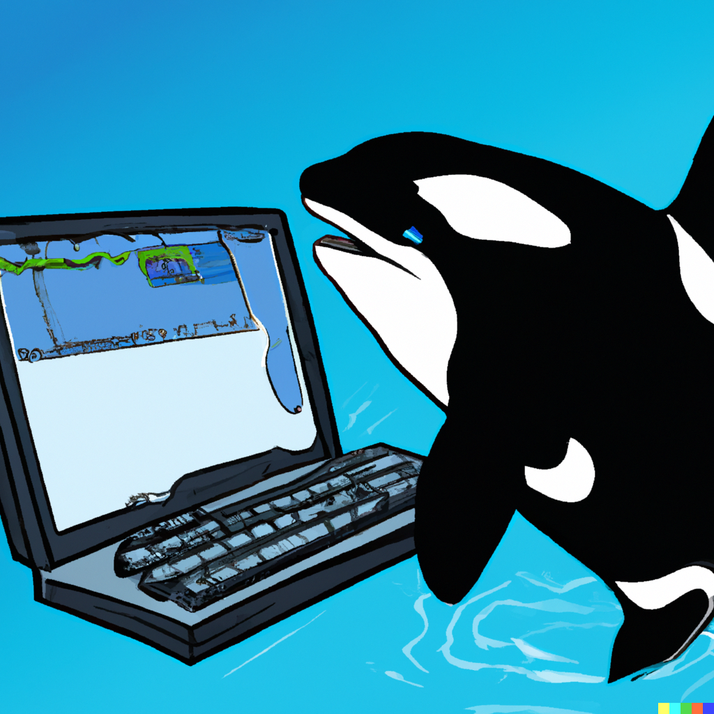

{fig-align="center" width="300"}

This is the home of the math, statistics, and R programming bootcamp offered by NYU PRIISM, the Center for Practice and Research at the Intersection of Information, Society, and Methodology. Registered students will be given access to [Brightspace](https://brightspace.nyu.edu/d2l/home/296393), where we will host an online forum.

The bootcamp aims to prepare students for the [Applied Statistics for Social Science Research](https://steinhardt.nyu.edu/degree/ms-applied-statistics-social-science-research) program at NYU. We will cover basic programming using the R language, including data manipulation and graphical displays; some key ideas from calculus, including differentiation and integration; basic matrix algebra, including vector and matrix arithmetic; some core concepts in probability, including random variables, discrete and continuous distributions, and expectations; and a few simple regression examples.

[This](stats-math/syllabus.pdf) is the current version of the syllabus, which is subject to change, so please check the date to make sure you have the most recent version.

- Topic 01: The Big Picture and Introduction to R
- Topic 02: Plotting, Exponentials, Logs, and Derivatives
- Topic 03: Reshaping Data, Loops, and Maps; Introduction to Integration
- Topic 04: Sample Spaces, Conditional Probability, Independence, Bayes' Rule
- Topic 05: Random Variables and Expectations
- Topic 06: Introduction to Linear Algebra
- Topic 07: Statistical Inference
- Topic 08: Analysis Workflow and Regression

## Course materials and references

### Programming and Data Visualization

- [Hands-On Programming with R](https://rstudio-education.github.io/hopr/), Grolemund, 2014

- [R for Data Science](https://r4ds.hadley.nz/), Wickham et al., 2023

- [Data Visualization: A Practical Introduction](https://socviz.co/), Healy, 2018

### Calculus

- [YouTube: Essence of Calculus](https://bit.ly/calc-3blue1brown), Sanderson, 2018

- [Calculus Made Easy](http://calculusmadeeasy.org/), Thompson, 1980

- [Calculus](https://openstax.org/details/books/calculus-volume-1), Herman et al., 2016

### Probability

- [YouTube: Probability Animations](https://www.youtube.com/playlist?list=PLltdM60MtzxNwhL4sg7swFFlUlH7EEy7H), Blitzstein

- [YouTube: Statistics 110 \@ Harvard](https://www.youtube.com/playlist?list=PL2SOU6wwxB0uwwH80KTQ6ht66KWxbzTIo), Blitzstein

- [Introduction to Probability](https://projects.iq.harvard.edu/stat110/home), Blitzstein et al., 2019

- [Introduction to Probability Cheat Sheet v2](https://static1.squarespace.com/static/54bf3241e4b0f0d81bf7ff36/t/55e9494fe4b011aed10e48e5/1441352015658/probability_cheatsheet.pdf), Chen, 2015

### Statistics

- [Regression and Other Stories](https://avehtari.github.io/ROS-Examples/), Gelman et al., 2020

### Linear Algebra

- [YouTube: Essence of Linear Algebra](https://bit.ly/lin-algebra-3blue1brown), Sanderson, 2018

- [Introduction to Linear Algebra](https://web.stanford.edu/~boyd/vmls/), Boyd, 2018

- [Matrix Cookbook](https://www.math.uwaterloo.ca/~hwolkowi/matrixcookbook.pdf), Petersen, 2012
