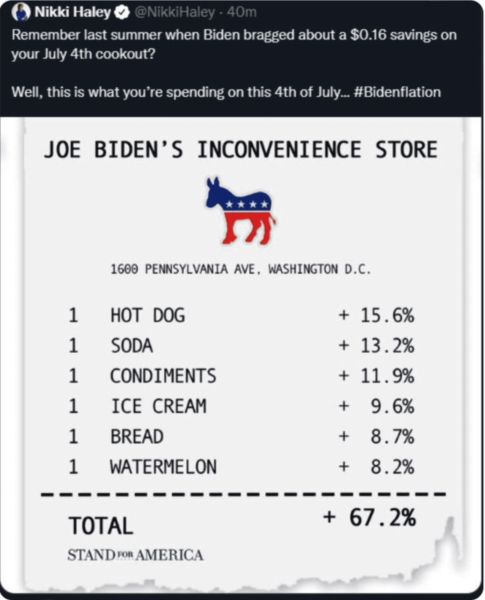
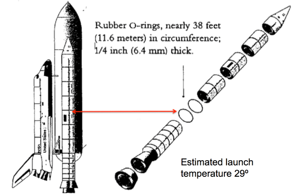
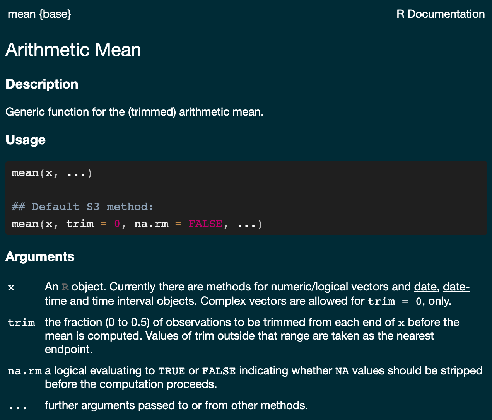
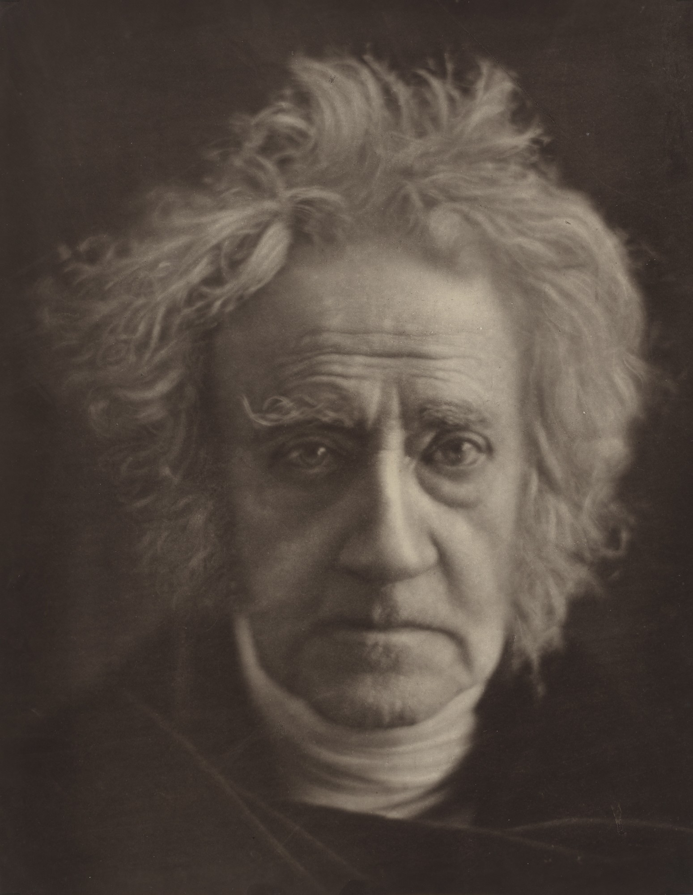
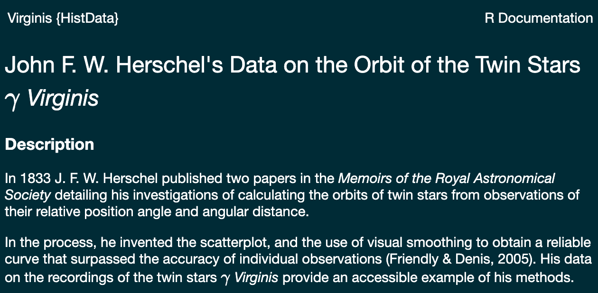
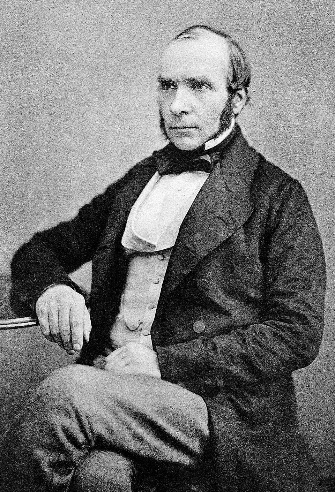
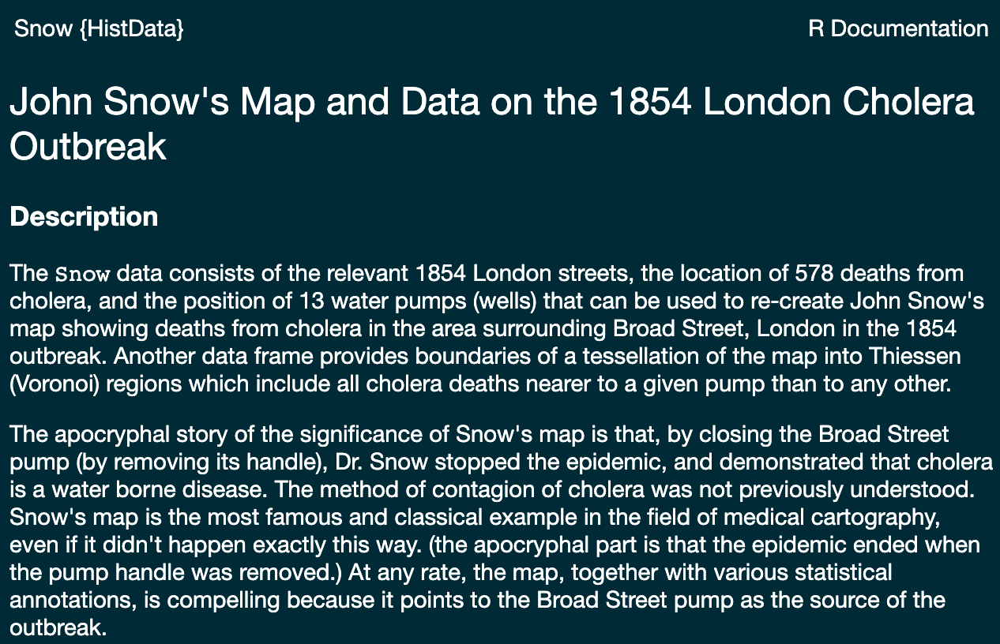

##

::: columns
::: {.column width="60%"}
> “If you want to be a writer, you must do two things above all others: read a lot and write a lot. There's no way around these two things that I'm aware of, no shortcut.”
>
> — Stephen King, *On Writing: A Memoir of the Craft*

[Course syllabus (PDF)](../syllabus.pdf)
:::

::: {.column width="40%"}
{fig-align="center" height="430"}

::: {style="font-size: 52%; text-align: center;"}
Photo: [Kevin Payravi / WikiPortraits](https://commons.wikimedia.org/wiki/File:Stephen_King_at_the_2024_Toronto_International_Film_Festival_2_(cropped).jpg), [CC BY-SA 4.0](https://creativecommons.org/licenses/by-sa/4.0/).
:::
:::
:::

```{r}
#| include: false
library(ggplot2)
library(dplyr)
library(janitor)
#library(MASS)
library(gridExtra)
library(purrr)

thm <-
  theme_minimal() + theme(
    panel.background = element_rect(fill = "#f0f1eb", color = "#f0f1eb"),
    plot.background = element_rect(fill = "#f0f1eb", color = "#f0f1eb"),
    panel.grid.major = element_blank()
  )
theme_set(thm)

dbinom_theta <- function(theta, N, y) {
  choose(N, y) * theta^y * (1 - theta)^(N - y)
}

dot_plot <- function(x, y) {
  p <- ggplot(data.frame(x, y), aes(x, y))
  p + geom_point(aes(x = x, y = y), size = 0.5) +
    geom_segment(aes(x = x, y = 0, xend = x, yend = y), linewidth = 0.2) +
    xlab(expression(theta)) + ylab(expression(f(theta)))
}

```

$$
\DeclareMathOperator{\E}{\mathbb{E}}
\DeclareMathOperator{\P}{\mathbb{P}}
\DeclareMathOperator{\V}{\mathbb{V}}
\DeclareMathOperator{\L}{\mathscr{L}}
\DeclareMathOperator{\I}{\text{I}}
$$

## Course Format

::: incremental
-   The course will run for two weeks, five days per week, 3 hours per day

-   Each day will consist of:

    -   \~30-minute going over questions

    -   \~1.5-hour lecture

    -   \~1-hour hands of exercises

-   The course will be computationally intensive -- we will write many small programs.
:::


## Course Outline {.smaller}

::: columns
::: {.column width="50%"}
::: incremental
-   Introduction to the **R language**, RStudio, and R Markdown.

-   Basic **differentiation**. Meaning of the derivative. Numeric and symbolic differentiation and optimization.

-   Basic **integration**. Riemann integral and basic rules of integration.

-   Review of **one-dimensional** **probability**. Conditional probability, random variables, and expectations. Solving probability problems by simulation.
:::
:::

::: {.column width="50%"}
::: incremental
-   **Discrete distributions** like Bernoulli and Binomial and **continuous distributions** like Normal and Exponential

-   Introduction to **Linear Algebra**. Vectors and vector arithmetic. Matrixes and matrix operations.

-   Manipulating and graphing data and **Exploratory Data Analysis**


-   Programming basics: **variables, flow control, loops, functions**, and writing **simulations**

-   Introduction to basic **statistical inference and linear regression**.
:::
:::
:::

## Session 1 Outline

::: incremental
-   The big picture -- costs and benefits

-   Setting up an analysis environment

-   RStudio projects

-   Working with interpreted languages like R

-   Some basic R syntax and elements of R style

-   Generating data with R

-   Some basic R and ggplot graphics

-   Writing your first Monte Carlo simulation
:::

## Some Mistakes Are Silly

::: {.columns style="align-items: center;"}
::: {.column width="33%"}
::: fragment
{width="386"}
:::
:::

::: {.column width="33%"}
::: fragment
{width="557"}
:::
:::

::: {.column width="34%"}
::: fragment
::: {style="margin-top: 1.6rem;"}

:::
:::
:::
:::

## Some Mistakes Are Deadly

On January 28, 1986, shortly after launch, Shuttle Challenger exploded, killing all seven crew members.

::: panel-tabset
### O-Ring Data

::: columns
::: {.column width="50%"}
```{r}
#| fig-width: 5
#| fig-height: 3.5

library(ggplot2)
library(scales)

# Challenger O-Ring data
file <- "https://archive.ics.uci.edu/ml/machine-learning-databases/space-shuttle/o-ring-erosion-only.data"

d <- readr::read_table(file, col_names = FALSE)
colnames(d) <- c("n_rings", "n_distress", "temp", "psi", "flight_order")

p <- ggplot(d, aes(temp, n_distress))
p + geom_point() + xlab("Temperature at launch (F)") + ylab("") +
  ggtitle("Challenger Space Shuttle O-Ring Data",
          subtitle = "Number of O-rings experiencing thermal distress") +
  scale_y_continuous(breaks = c(0, 1, 2))
```
:::

::: {.column width="50%"}

:::
:::

### Binomial Model

::: columns
::: {.column width="50%"}
```{r}
#| fig-width: 5
#| fig-height: 3.5

library(dplyr)
library(readr)

library(rstanarm)
d <- d %>%
  mutate(not_in_distress = n_rings - n_distress)

# $$
# \begin{eqnarray*}
# \text{BinomialLogit}(n~|~N,\alpha) & = &
# \text{Binomial}(n~|~N,\text{logit}^{-1}(\alpha)) \\[6pt] & = &
# \binom{N}{n} \left( \text{logit}^{-1}(\alpha) \right)^{n}  \left( 1 -
# \text{logit}^{-1}(\alpha) \right)^{N - n}
# \end{eqnarray*}
# $$

# or_model <- stan_glm(
#   cbind(n_distress, not_in_distress) ~ temp,
#   data = d,
#   family = binomial(link = "logit"),
#   cores = 4
# )
# temps <- seq(30, 81, len = 100)
# newdata <-
#   tibble(
#     temp = temps,
#     n_distress = rep(0, 100),
#     not_in_distress = rep(6, 100)
# )
# y_epred <- posterior_epred(or_model, newdata)
# write_rds(y_epred, file = "data/oring_epred.rds")

y_pred <- read_rds("data/oring_pred.rds")
y_epred <- read_rds("data/oring_epred.rds")

temps <- seq(30, 81, len = 100)
y_expected <- y_epred * 6 # expectation of the binomial Np, N=6
mean_failures <- colMeans(y_expected)
pred <- tibble(mean_failures, temp = temps)
temp_at_launch <- 36
idx <- which.min(abs(pred$temp - 36))
expected_fails_at_launch <- pred$mean_failures[idx]

p <- ggplot(pred, aes(temp, n_distress))
p + xlab("Temperature at launch (F)") + ylab("") +
  geom_line(
    aes(x = temp, y = mean_failures),
    linewidth = 0.2,
    color = 'red'
  ) +
  geom_point(
    x = temp_at_launch,
    y = expected_fails_at_launch,
    color = 'blue',
    size = 2
  ) +
  geom_point(
    data = d,
    aes(x = temp, y = n_distress)
  ) +
  annotate("segment", x = temp_at_launch + 10, xend = temp_at_launch + 1,
             y = expected_fails_at_launch, yend = expected_fails_at_launch,
           colour = "blue", size = 0.2, arrow = arrow(type = "closed",
                                                      length = unit(0.1, "inches"))) +
  annotate("text", x = temp_at_launch + 24,
           y = expected_fails_at_launch,
           label = paste("Expected number of failures at launch = ",
                         round(expected_fails_at_launch)),
           size = 3, color = 'blue') +
  ggtitle("Challenger Space Shuttle O-Ring Data",
          subtitle = "Number of O-rings experiencing thermal distress")

```
:::

::: column
-   Probability of *1 or more* rings being damaged at launch is about **`r round(mean(y_pred[, 7] > 0), 2)`**

-   Probability of *all 6 rings* being damaged at launch is about **`r round(mean(y_pred[, 7] == 6), 2)`**
:::
:::

### References

-   @fowlkes1989: Analysis of the Space Shuttle: Pre-Challenger Prediction of Failure.

-   @martz1992: The Risk of Catastrophic Failure of the Solid Rocket Boosters on the Space Shuttle.
:::

::: footer
Data source: [UCI Machine Learning Repository](https://archive.ics.uci.edu/ml/datasets/Challenger+USA+Space+Shuttle+O-Ring)
:::

## Allan McDonald Dies at 83

::: columns
::: {.column width="50%"}
::: fragment
{fig-align="left"}
:::
:::

::: {.column width="50%"}
::: fragment
{fig-align="right" width="1300"}
:::
:::
:::

::: fragment
Communication is part of the job --- it's worth learning how to do it well.
:::

::: footer
Source: [The New York Times, March 9, 2021](https://www.nytimes.com/2021/03/09/us/allan-mcdonald-dead.html)
:::

## SMaC: Why Bother?

::: columns
::: {.column width="60%"}
::: {.incremental style="font-size: 80%;"}
-   Programming: a cheap way to do experiments and a lazy way to do math
-   Differential calculus: optimize functions, Frequentist statistics
-   Integral calculus: compute probabilities, expectations, Bayesian statistics
-   Linear algebra: the language for solving many equations at once
-   Probability: given a (known) population, how likely is this sample
-   Statistics: given a sample, what are the attributes of a population
:::
:::

::: {.column width="40%"}
{height="520"}
:::
:::

## Programming and Statistics in the Age of AI {.smaller}

A frontier LLM generated 20 independent solutions to the same statistical programming task. Three did not run, and several that ran produced catastrophic errors.

{fig-align="center" width="92%"}

::: {.fragment style="font-size: 78%;"}
Each red point is a different ChatGPT Codex 5.2 submission. The worst RMSE exceeded **100 billion outcome standard deviations**.

Source: [Perrett, Elliott, Hill, and Scott (2026), *Flaws in the LLM Automation Narrative*](https://arxiv.org/abs/2606.11166).
:::

## A Plausible Answer Can Be Catastrophically Wrong {.smaller}

The same prompt produced estimates ranging from competitive to billions of standard deviations from the truth.

{fig-align="center" width="92%"}

::: {.fragment style="font-size: 78%;"}
The danger is not that every LLM answer is wrong; it is that a plausible-looking answer may be catastrophically wrong. Statistical and programming knowledge lets you verify the output instead of merely trusting it.

Source: [Perrett, Elliott, Hill, and Scott (2026), *Flaws in the LLM Automation Narrative*](https://arxiv.org/abs/2606.11166).
:::

## Example: Differential Calculus {.smaller}

::: panel-tabset
### Regression Line View

::: columns
::: {.column width="50%"}
::: incremental
-   Differentiation comes up when you want to find the most likely values of parameters (unknowns) in optimization-based (sometimes called frequentist) inference
-   Imagine that we need to find the values of the slope and intercept such that the yellow line fits "nicely" through the cloud of points
:::
:::

::: {.column width="50%"}
```{r}
#| fig-height: 5
#| fig-width: 5

set.seed(123)
mu <- c(1, 0.5)
x <- seq(0, 10, len = 50)
y <- mu[1] + mu[2] * x + rnorm(50)
p <- ggplot(data.frame(x, y), aes(x, y))
p + geom_point() + geom_smooth(method = "lm", size = 0.3,
                               color = "yellow", fill = "blue") +
# p + geom_point() + geom_abline(slope = mu[2], intercept = mu[1],
#                                size = 0.2, color = 'red') +
  xlim(0, 10) + ylim(0, 10) +
  ggtitle("Regression line with slope = 0.5 and intercept = 1")
```
:::
:::

### Likelihood View

::: columns
::: {.column width="50%"}
::: incremental
-   Suppose you have linear regression model of the form $y_n \sim \operatorname{normal}(\alpha + \beta x_n, \, \sigma)$ and you want to learn the most likely values of $\alpha$ and $\beta$

-   The most likely values for slope (beta) and intercept (alpha) are at the peak of this function, which can be found by using (partial) derivatives
:::
:::

::: {.column width="50%"}
```{r}
#| fig-width: 5
#| fig-height: 5
#| fig-align: center


alpha <- seq(-2, 4, 0.1)
beta <- seq(-2.5, 3.5, 0.1)
sigma <- matrix(c(2,-1,-1, 2), nrow = 2)
f <- function(x, y) mvtnorm::dmvnorm(cbind(x, y), mu, sigma)
lik <- outer(alpha, beta, f)

library(plotly)
p <- plot_ly(x = ~alpha, y = ~beta, z = ~lik)
p %>% add_surface() %>% layout(title = 'Normal Likelihood',
                                        plot_bgcolor = "#f0f1eb",
                                       paper_bgcolor = "#f0f1eb")
# library(plot3D)
#
# # Generate grid data
# grid_data <- expand.grid(alpha = alpha, beta = beta)
#
# # Apply function to each row of the grid data
# grid_data$lik <- apply(grid_data, 1, function(row) f(row['alpha'], row['beta']))
#
# par(mar = c(3,3,2,1), mgp = c(2,.7,0), tck = -.01, bg = "#f0f1eb")
# scatter3D(x = grid_data$alpha, y = grid_data$beta, z = grid_data$lik,
#           phi = 10, theta = 30,
#           xlab = "Alpha", ylab = "Beta", zlab = "Likelihood",
#           col = "blue", ticktype = "detailed", pch = ".")

```
:::
:::
:::

## Example: Integral Calculus {style="font-size: 75%;"}

::: columns
::: {.column width="47.5%"}
::: incremental
-   Suppose we have a probability distribution of some parameter $\theta$, which represents the differences between the treated and control units

-   Further, suppose that $\theta > 0$ favors the treatment group

-   We want to know the probability that treatment is better than control

-   This probability can be written as:
:::

::: fragment
$$
    \P(\theta > 0) = \int_{0}^{\infty} p_{\theta}\, \text{d}\theta
$$
:::
:::

::: {.column width="5%"}
:::

::: {.column width="47.5%"}
::: incremental
-   Assuming $\theta$ is normally distributed with $\mu = 1$ and $\sigma = 1$ we can evaluate the integral as an area under the normal curve from $0$ to $\infty$.
:::

::: fragment
```{r}
#| fig-width: 5
#| fig-height: 3.5

library(ggdist)
nd <- tibble::tribble(
  ~ dist,      ~ args,
  "norm",      list(1, 1),
)

nd %>%
  ggplot(aes(xdist = dist, args = args)) +
  stat_slab(aes(fill = stat(x > 0))) +
  scale_fill_manual(values = c("gray85", "skyblue")) +
  theme(legend.position = "none") +
  xlab(expression(theta)) + ylab("") +
  annotate("text", x = 1.2, y = 0.3, label = "P(theta > 0) == 0.84", parse = TRUE) +
  ggtitle("Normal distribution with mean 1 and standard deviation 1")

```
:::
:::
:::

## Probabilistic Programming {.smaller}

::: columns
::: {.column width="44%"}
::: {style="display: grid; grid-template-columns: repeat(2, 1fr); gap: 1.1rem; align-items: center;"}
::: {style="text-align: center;"}
{fig-align="center" height="125"}
:::

::: {style="text-align: center;"}
{fig-align="center" width="180"}
:::

::: {style="text-align: center;"}
{fig-align="center" width="150"}
:::

::: {style="text-align: center;"}
{fig-align="center" height="105"}

**NumPyro**
:::
:::
:::

::: {.column width="56%"}
::: incremental
-   A probabilistic program specifies a forward generative process using random variables and data.

-   Unknown parameters $\theta$ (RVs) are represented explicitly; observed data $x$ and measurements $y$ condition the model.

-   An inference engine uses the model to solve the inverse problem (perform inference) without requiring a separate hand-derived solution for every model.

-   Model specification is separated from algorithms such as numerical optimization (MLE), Hamiltonian Monte Carlo, and variational inference.

-   R, Python, Julia are not probabilistic programming languages.
:::
:::
:::

::: footer
Logo assets: [Stan](https://github.com/stan-dev/logos), [PyMC](https://github.com/pymc-devs/pymc/tree/main/docs/logos), [JAX](https://github.com/jax-ml/jax/tree/main/docs/_static), and [NumPyro](https://github.com/pyro-ppl/numpyro/tree/master/docs/source/_static/img).
:::

## Example: Linear Regression {.smaller}

Notice a Linear Algebra notation $X \beta$, which is matrix-vector multiplication. <br>

::: {.columns style="align-items: flex-start; gap: 1.2rem; font-size: 80%;"}
::: {.column width="49%"}
### Stan

```{stan output.var="model0"}
#| echo: true
#| eval: false
data {
  int<lower=0> N;   // number of data items
  int<lower=0> K;   // number of predictors
  matrix[N, K] X;   // predictor matrix
  vector[N] y;      // outcome vector
}
parameters {
  real alpha;           // intercept
  vector[K] beta;       // coefficients for predictors
  real<lower=0> sigma;  // error scale
}
model {
  // parameters with Normal(0, 1) priors
  alpha ~ normal(0, 1);
  beta ~ normal(0, 1);

  // sigma with Exp(1) prior
  sigma ~ exponential(1);

  // likelihood: y ~ normal(X * beta + alpha, sigma)
  y ~ normal(X * beta + alpha, sigma);
}
```
:::

::: {.column width="49%"}
### NumPyro

```python
import numpyro
import numpyro.distributions as dist


def model(X, y=None):
    N, K = X.shape

    # parameters with Normal(0, 1) priors
    alpha = numpyro.sample("alpha", dist.Normal(0.0, 1.0))
    beta = numpyro.sample("beta", dist.Normal(0.0, 1.0).expand([K]))

    # sigma with Exp(1) prior
    sigma = numpyro.sample("sigma", dist.Exponential(1.0))

    # likelihood: y ~ normal(X * beta + alpha, sigma)
    mu = X @ beta + alpha
    numpyro.sample("y", dist.Normal(mu, sigma), obs=y)
```
:::
:::

::: footer
Equivalent linear regression models. Sources: [Stan User's Guide](https://mc-stan.org/docs/stan-users-guide/linear-regression.html) and [NumPyro documentation](https://num.pyro.ai/en/stable/).
:::

::: aside
Stan and NumPyro are probabilistic programming systems. You write the data-generating process, and the system performs inference for the unknown parameters.
:::

## Example: Binomial Regression {.smaller}

This is the type of model we fit to the O-Rings data.

<br>

```{stan output.var="model1"}
#| echo: true
#| eval: false
data {
  int<lower=0> N_rows; // number of rows in data
  int<lower=0> N;      // number of possible "successes" in Binom(N, p)
  vector[N_rows] x;    // temperature for the O-Rings example
  array[N_rows] int<lower=0, upper=N> y; // number of "successes" in y ~ Binom(N, p)
}
parameters {
  real alpha;
  real beta;
}
model {
  alpha ~ normal(0, 2.5); // we can encode what we know about plausible values
  beta ~ normal(0, 1);    // of alpha and beta prior to conditioning on the data
  y ~ binomial_logit(N, alpha + beta * x); // likehood (conditioned on x)
}
```

$$
\begin{eqnarray*}
\text{BinomialLogit}(y~|~N,\theta) & = &
\text{Binomial}(y~|~N,\text{logit}^{-1}(\theta)) \\[6pt] & = &
\binom{N}{y} \left( \text{logit}^{-1}(\theta) \right)^{y}  \left( 1 -
\text{logit}^{-1}(\theta) \right)^{N - y}
\end{eqnarray*}
$$

## Example: IRT Model {.smaller}

Item-Response Theory models are popular in education research but generalize to other applications. <br>

```{stan output.var="model2"}
#| echo: true
#| eval: false

data {
  int<lower=1> J;                     // number of students
  int<lower=1> K;                     // number of questions
  int<lower=1> N;                     // number of observations
  array[N] int<lower=1, upper=J> jj;  // student for observation n
  array[N] int<lower=1, upper=K> kk;  // question for observation n
  array[N] int<lower=0, upper=1> y;   // correctness for observation n
}
parameters {
  real delta;            // mean student ability
  array[J] real alpha;   // ability of student j - mean ability
  array[K] real beta;    // difficulty of question k
}
model {
  alpha ~ std_normal();         // informative true prior
  beta ~ std_normal();          // informative true prior
  delta ~ normal(0.75, 1);      // informative true prior
  for (n in 1:N) {
    y[n] ~ bernoulli_logit(alpha[jj[n]] - beta[kk[n]] + delta);
  }
}
```

$$
\begin{eqnarray*}
\text{BernoulliLogit}(y~|~\theta) & = &
\text{Bernoulli}(y~|~\text{logit}^{-1}(\theta)) \\[6pt] & = &
\left(\text{logit}^{-1}(\theta)\right)^y
\left(1-\text{logit}^{-1}(\theta)\right)^{1-y}
\end{eqnarray*}
$$

::: footer
1PL item-response model. Source: [Stan Manual](https://mc-stan.org/docs/stan-users-guide/item-response-models.html)
:::

## Analysis Environment {.smaller}

::: columns
::: {.column width="50%"}
::: incremental

-   [Instructions](https://rstudio-education.github.io/hopr/starting.html) for installing R and RStudio
-   Install the latest version of R
-   Install the latest version of the RStudio Desktop
-   Create a directory on your hard drive and give it a simple name. Mine is called `statsmath`
-   In RStudio, go to File -\> New Project and select: "Existing Directory"
-   How many of you have not used RStudio?
:::
:::

::: {.column width="50%"}

:::
:::

::: footer
Download [R](https://www.r-project.org/), Download [RStudio](https://www.rstudio.com/products/rstudio/download/)
:::

## What is R

::: columns
::: {.column width="47.5%"}
::: {.incremental style="font-size: 75%;"}
-   R is an open-source, interpreted, weakly typed, (somewhat) functional programming language

-   R is an implementation of the S language developed at Bell Labs around 1976

-   [Ross Ihaka](https://en.wikipedia.org/wiki/Ross_Ihaka "Ross Ihaka") and [Robert Gentleman](https://en.wikipedia.org/wiki/Robert_Gentleman_(statistician) "Robert Gentleman (statistician)") started working on R in the early 1990s

-   Version 1.0 was released in 2000

-   There are ~20,000+ R packages available on [CRAN](https://cran.r-project.org/)

-   R has a large and mostly friendly [user community](https://stackoverflow.com/questions/tagged/r)
:::
:::

::: {.column width="5%"}
:::

::: {.column width="47.5%"}

::: {.fragment}

<span style="font-size: 70%;">Source: [StackOverflow Developer Survey](https://survey.stackoverflow.co/2025/technology#most-popular-technologies-language)</span>
:::

:::
:::

## R Documentation

```{r}
#| echo: true
#| eval: false

?mean # same as help(mean)
```

{fig-align="center" height="500"}

## Hands-On: Very Basics 1/2 {.smaller}

::: columns
::: {.column width="47.5%"}
```{r}
#| echo: true
2 + 3
10^3
10 - 5 / 2
(10 - 5) / 2
1:10
1:10 + 1
sin(pi/2) + cos(pi/2)
1i
round(exp(1i * pi) + 1)
(exp(1i * pi) + 1) |> round()
```
:::

::: {.column width="5%"}
:::

::: {.column width="47.5%"}
```{r}
#| echo: true
die <- 1:6
die <- seq(1, 6, by = 1)
die
length(die)
str(die)
die[1]
die[c(1, 6)]
die > 3
die[die > 3]
sum(die)
prod(die)
```
:::
:::

## Hands-On: Very Basics 2/2 {.smaller}

::: columns
::: {.column width="47.5%"}
```{r}
#| echo: true
mean(die)
sum(die) / length(die)
median(die)
sd(die)
scores <- c(2, 4, NA, 8)
mean(scores)
mean(scores, na.rm = TRUE)
```
:::

::: {.column width="5%"}
:::

::: {.column width="47.5%"}
```{r}
#| echo: true
fib <- function(n) {
  if (n == 0) {
    return(0)
  } else if (n == 1) {
    return(1)
  } else {
    return(fib(n - 1) + fib(n - 2))
  }
}
fib10 <- 0:9 |> purrr::map_int(fib)
print(fib10)
fib10[0]
fib10[1]
fib10[2:5]
fib10[-6]
```
:::
:::


## Leonardo da Pisa {.smaller}

::: {.illustration-center}
::: {.columns style="align-items: center;"}
::: {.column width="34%"}
{fig-align="center" height="430"}
:::

::: {.column width="6%"}
:::

::: {.column width="60%"}
::: {style="font-size: 105%; line-height: 1.35;"}
> A man put one pair of rabbits in a certain place entirely surrounded by a wall. How many pairs of rabbits can be produced from that pair in a year, if the nature of these rabbits is such that every month each pair bears a new pair which from the second month on becomes productive?
:::
:::
:::
:::

::: footer
Quote: Leonardo da Pisa, *Liber Abaci* (1202), translated by L. E. Sigler (Springer, 2002), pp. 404–405. Retrospective portrait from [*I benefattori dell'umanità*, vol. VI (1850)](https://commons.wikimedia.org/wiki/File:Fibonacci2.jpg), public domain.
:::

## Your Turn {.smaller}

-   Create a variable called `fib` that contains the first 10 Fibonacci numbers
-   They are: `0, 1, 1, 2, 3, 5, 8, 13, 21, 34`
-   Compute the length of this vector in R
-   Compute the sum, the product, and the difference (`diff()`) between successive numbers
-   What do you notice about the pattern in the differences?
-   Now, create a vector of 100 integers from 1 to 100
-   Young Gauss (allegedly) was asked to sum them by hand
-   He figured out that the sum has to be $N (N + 1) / 2$
-   Verify that Gauss was right (just for 100)
-   Now compute the sum of the first hundred squares

## Hands-On: Lists {.smaller}

::: incremental
-   Lists are collections of objects of different types and shapes
-   Contrast with a data frame, which we will discuss later, that contains objects of different types but is rectangular
:::

::: fragment
```{r}
#| echo: true
list_x <- list(A = pi, B = c(0, 1), C = 1:10, D = c("one", "two"))
list_x
str(list_x)
list_x$A
list_x[1]
str(list_x[1])
list_x[[1]] # same as x$A
```
:::

## Data Frames {.smaller}

::: incremental
-   Data frames are rectangular structures that are often used in data analysis

-   There is a built-in function called `data.frame`, but we recommend `tibble`, which is part of the `dplyr` package

-   You can look up the documentation of any R function this way: `?dplyr::tibble`. If the package is loaded by using `library(dplyr)` you can omit `dplyr::` prefix

-   John F. W. Herschel's data on the orbit of the Twin Stars $\gamma$ Virginis
:::

::: fragment
<div style="display: flex; align-items: center; justify-content: center; gap: 22px; margin-top: 0.35rem;">
<figure style="position: relative; flex: 0 0 auto; height: 310px; margin: 0;">

<figcaption style="position: absolute; right: 0; bottom: 0; left: 0; padding: 0.48rem 0.65rem 0.42rem; border-radius: 0 0 6px 6px; background: linear-gradient(transparent, rgba(0, 0, 0, 0.88)); color: white; font-size: 0.58em; line-height: 1.12; text-align: left;">
<strong style="display: block;">John F. W. Herschel</strong>
<span>1792–1871</span>
</figcaption>
</figure>
<figure style="flex: 0 0 auto; height: 310px; margin: 0;">

</figure>
</div>
:::

::: footer
Portrait: [Julia Margaret Cameron (1867)](https://commons.wikimedia.org/wiki/File:Portrait_of_Sir_John_Herschel_by_Julia_Margaret_Cameron,_1867.jpg), public domain via Wikimedia Commons.
:::



## Data Frames {.smaller}

::: columns
::: {.column width="50%"}
::: fragment
```{r}
#| echo: true
library(HistData)
data("Virginis.interp")
class(Virginis.interp)
Virginis.interp |> dplyr::as_tibble()
Virginis.interp |> dplyr::as_tibble() |> class()
```
:::
:::

::: {.column width="50%"}
::: fragment
{fig-align="center" width="672"}
Code for generated the above plot can be found [here](https://friendly.github.io/HistDataVis/fig-code/06_9-herschel.R).
:::
:::
:::

::: footer
[The Origin and Development of the Scatterplot by M Friendly and H Wainer](https://friendly.github.io/HistDataVis/ch06-scat.html)
:::

## Your Turn

-   Save `Virginis.interp` in a new tibble called `virginis` using `as_tibble()` function
-   Compute average velocity in `virginis`
-   Hint: you can access columns of tibbles and data frames with an `$` like this: `dataframe_name$variable_name`
-   We will do a lot more work with tibbles and data frames in later sessions

## Basic Plotting {.smaller}

::: panel-tabset
### John Snow

<div style="display: flex; align-items: center; justify-content: center; gap: 22px; margin-top: 0.35rem;">
<figure style="position: relative; flex: 0 0 auto; height: 300px; margin: 0;">

<figcaption style="position: absolute; right: 0; bottom: 0; left: 0; padding: 0.48rem 0.65rem 0.42rem; border-radius: 0 0 6px 6px; background: linear-gradient(transparent, rgba(0, 0, 0, 0.88)); color: white; font-size: 0.58em; line-height: 1.12; text-align: left;">
<strong style="display: block;">Dr. John Snow</strong>
<span>1813–1858</span>
</figcaption>
</figure>
<figure style="flex: 0 0 auto; height: 300px; margin: 0;">

</figure>
</div>

::: {.incremental style="max-width: 900px; margin: 0.65rem auto 0;"}
-   `ggplot2` implements a grammar of graphics for building plots from data

-   Start with data and aesthetic mappings, then add geometric layers with `+`

-   We will demonstrate with John Snow's data from the 1854 cholera outbreak
:::

::: {style="font-size: 42%; line-height: 1.15; text-align: center; margin-top: 0.35rem;"}
Portrait: [Dr. John Snow (1856)](https://commons.wikimedia.org/wiki/File:John_Snow.jpg), public domain via Wikimedia Commons.
:::

### Deaths Over Time

::: {style="font-size: 58%;"}
```{r}
#| fig-width: 8
#| fig-height: 3
#| fig-align: center
#| out-width: 70%
#| echo: true
#| output-location: fragment
library(HistData)
library(lubridate)
library(ggplot2)
library(dplyr)

# identify dates before and after the pump handle was removed
snow_dates <- Snow.dates |>
  mutate(period = if_else(
    date < mdy("09/08/1854"), "Before Sept. 8", "Sept. 8 onward"
  ))

ggplot(snow_dates, aes(x = date, y = deaths, color = period)) +
  geom_linerange(aes(ymin = 0, ymax = deaths), linewidth = 0.8) +
  geom_point(size = 1.5) +
  annotate(
    "text", x = mdy("09/08/1854"), y = 40,
    label = "Pump handle\nremoved Sept. 8", hjust = 0
  ) +
  scale_color_manual(
    values = c("Before Sept. 8" = "red", "Sept. 8 onward" = "darkgreen"),
    guide = "none"
  ) + labs(x = NULL, y = "Deaths")
```
:::

### Map of Cholera in London

```{r}
#| fig-width: 6
#| fig-height: 6
#| fig-align: center
#| fig-bg: "#f0f1eb"
library(HistData)
library(ggplot2)

data("Snow.streets")
data("Snow.deaths")
data("Snow.pumps")

# reproduce the density estimate used by HistData::SnowMap()
kde <- KernSmooth::bkde2D(
  Snow.deaths[, c("x", "y")], bandwidth = c(0.5, 0.5)
)
snow_density <- expand.grid(x = kde$x1, y = kde$x2)
snow_density$density <- as.vector(kde$fhat)
scale_ticks <- data.frame(x = 3.5:7.5, y = 19.7)

ggplot() +
  geom_path(
    data = Snow.streets,
    aes(x = x, y = y, group = street),
    color = "grey72", linewidth = 0.35
  ) +
  geom_raster(
    data = snow_density, aes(x = x, y = y, fill = density),
    interpolate = TRUE
  ) +
  geom_contour(
    data = snow_density, aes(x = x, y = y, z = density),
    color = "black", linewidth = 0.3, bins = 10
  ) +
  geom_point(
    data = Snow.deaths, aes(x = x, y = y),
    color = "red", shape = 15, size = 1.15, alpha = 0.85
  ) +
  geom_point(
    data = Snow.pumps, aes(x = x, y = y),
    color = "blue", shape = 17, size = 3.2
  ) +
  geom_text(
    data = Snow.pumps, aes(x = x, y = y, label = label),
    color = "black", size = 3, vjust = 1.65
  ) +
  annotate(
    "segment", x = 3.5, xend = 7.5,
    y = 19.7, yend = 19.7, linewidth = 0.45
  ) +
  geom_segment(
    data = scale_ticks,
    aes(x = x, xend = x, y = y - 0.12, yend = y + 0.12),
    linewidth = 0.4
  ) +
  annotate(
    "text", x = c(3.5, 5.5, 7.5), y = 19.4,
    label = c("0", "2", "4"), size = 2.8
  ) +
  annotate(
    "text", x = 7.75, y = 19.7, label = "100 m.",
    hjust = 0, size = 2.8
  ) +
  scale_fill_gradient(
    low = scales::alpha("green", 0),
    high = scales::alpha("red", 0.8),
    guide = "none"
  ) +
  coord_equal(
    xlim = c(3, 20.5), ylim = c(3, 20.5), expand = FALSE
  ) +
  theme_void() +
  theme(
    plot.background = element_rect(fill = "#f0f1eb", color = NA),
    panel.background = element_rect(fill = "#f0f1eb", color = NA),
    plot.margin = margin(2, 2, 2, 2)
  )
```
:::

## Hands-On: Simulating Coin Flips {.smaller}

We can learn a lot through simulation. We will start with the `sample()` function.

`sample(x, size, replace = FALSE, prob = NULL)`

```{r}
#| echo: true

# simulating coin flips
coin <- c("H", "T")

# flip a fair coin 10 times; try it with replace = FALSE
sample(coin, 10, replace = TRUE)

# flip a coin that has P(H = 0.6) 10 times
sample(coin, 10, replace = TRUE, prob = c(0.6, 0.4))

# it's more convenient to make H = 1 and T = 0
coin <- c(1, 0)
sample(coin, 10, replace = TRUE)
```

::: incremental
-   Your turn: flip a coin 1000 times and compute the proportion of heads
:::


## For Loops

::: panel-tabset

### For Loops

::: incremental
-   Suppose you want to add the first 100 integers as before but without using the `sum()` function or the formula
-   In math notation: $\sum_{i = 1}^{100}x_i$, $\mathbf{x} = (1, 2, 3, \dots, 100)$
:::

::: fragment
```{r}
#| echo: true
n <- 100
x <- 1:n
s <- 0
for (i in 1:n) {
  s <- s + x[i]
}
# test
s == sum(x)
```
:::

::: incremental
-   Your turn: modify the loop to add only even numbers in 1:100. Look up `help(if)` statement and modulo operator `help(%%)`; write a test to check your work
:::

### Solution

::: fragment
```{r}
#| echo: true

s <- 0
for (i in 1:n) {
  if (x[i] %% 2 == 0) {
    s <- s + x[i]
  }
}
cat(s)
# test
s == sum(seq(2, 100, by = 2))
```
:::

::: incremental
-   Congratulations, you are now [Turing Complete](https://youtu.be/RPQD7-AOjMI)!
:::
:::


## Simulate Coin Flips {.smaller}

::: incremental
-   If we flip a coin more and more times, would the estimate of the proportion become better?
-   If so, what is the rate of convergence?
:::

::: fragment
```{r}
#| echo: true
#| eval: false

set.seed(1) # why do we do this?
n <- 1e4
est_prop <- numeric(n) # allocate a vector of size n
for (i in 1:n) {
  x <- sample(coin, i, replace = TRUE)
  est_prop[i] <- mean(x)
}
```
:::

::: incremental
-   Your turn: write down in plain English what the above code is doing
-   At the end of the loop, what does the variable `est_prop` contain?
:::

## Introduction to ggplot {.smaller}

::: incremental
-   Our task is to visualize the estimated proportion as a function of the number of coin flips
-   This can be done in base `plot()`, but we will do it with `ggplot`
:::

::: fragment
```{r}
#| cache: true
#| fig-width: 6
#| fig-height: 4
#| fig-align: center
#| echo: true
#| output-location: column
library(ggplot2)
library(gridExtra)

x <- seq(0, 100, by = 5)
y <- x^2

quadratic <- tibble(x = x, y = y)
p1 <- ggplot(data = quadratic,
             mapping = aes(x = x, y = y))
p2 <- p1 + geom_point(size = 0.5)
p3 <- p1 + geom_line(linewidth = 0.2,
                     color = 'red')
p4 <- p1 + geom_point(size = 0.5) +
  geom_line(linewidth = 0.2, color = 'red')

grid.arrange(p1, p2, p3, p4, nrow = 2)
```
:::

## Law of Large Numbers {.smaller}

::: panel-tabset
## Code

```{r}
#| fig-width: 7
#| fig-height: 3.5
#| fig-align: center
#| cache: true
#| eval: false
#| echo: true

set.seed(1)
n <- 1e4
est_prop <- numeric(n)
for (i in 1:n) {
  x <- sample(coin, i, replace = TRUE)
  est_prop[i] <- mean(x)
}

library(scales)
data <- tibble(num_flips = 1:n, est_prop = est_prop)
p <- ggplot(data = data, mapping = aes(x = num_flips, y = est_prop))
p + geom_line(size = 0.1) +
  geom_hline(yintercept = 0.5, size = 0.2, color = 'red') +
  scale_x_continuous(trans = 'log10', label = comma) +
  xlab("Number of flips on Log10 scale") +
  ylab("Estimated proportion of Heads") +
  ggtitle("Error decreases with the size of the sample")
```

## Plot

We can see some evidence for the Law of Large Numbers.

```{r}
#| fig-width: 7
#| fig-height: 3.5
#| fig-align: center
#| cache: true
set.seed(1) # why do we do this?
n <- 1e4
est_prop <- numeric(n) # allocate a vector of size n
for (i in 1:n) {
  x <- sample(coin, i, replace = TRUE)
  est_prop[i] <- mean(x)
}

library(scales)
data <- tibble(num_flips = 1:n, est_prop = est_prop)
p <- ggplot(data = data, mapping = aes(x = num_flips, y = est_prop))
p + geom_line(size = 0.1) +
  geom_hline(yintercept = 0.5, size = 0.2, color = 'red') +
  scale_x_continuous(trans = 'log10', label = comma) +
  xlab("Number of flips on Log10 scale") +
  ylab("Estimated proportion of Heads") +
  ggtitle("Error decreases with the size of the sample")
```
WLLN: $\lim_{n \to \infty} \mathbb{P}\left( \left| \overline{X}_n - \mu \right| \geq \epsilon \right) = 0$

:::

## Functions {.smaller}

::: panel-tabset
### Structure

::: incremental
-   Functions help you break up the code into self-contained, understandable pieces.

-   Functions take in arguments and return results. You saw functions like `sum()` and `mean()` before. Here, you will learn how to write your own.
:::

::: fragment
{fig-align="center"}
:::

::: footer
Source: [Hands-On Programming with R](https://rstudio-education.github.io/hopr/basics.html)
:::

### Writing Your Own Function

::: columns
::: {.column width="50%"}
We will write a function that produces one estimate of the proportion given a fixed sample size `n`.

::: fragment
```{r}
#| echo: true

estimate_proportion <- function(n) {
  coin <- c(1, 0)
  x <- sample(coin, n, replace = TRUE)
  est <- mean(x)
  return(est)
}
estimate_proportion(10)
x <- replicate(1e3, estimate_proportion(10))
head(x)
```
:::

::: fragment
```{r}
#| eval: false
#| echo: true
hist(x,
     xlab = "",
     main = "Distribution of Proportions of Heads")
```
:::
:::

::: {.column width="50%"}
::: fragment
```{r}
#| fig-width: 4
#| fig-height: 4
#| fig-align: center
#| cache: true
par(
  mar = c(3, 3, 2, 1),
  mgp = c(2, .7, 0),
  tck = -.01,
  bg = "#f0f1eb"
)
hist(x, xlab = "", main = "Distribution of Proportions of Heads")
```
:::
:::
:::

### Coin Flip Example

::: fragment
To reproduce our earlier example, generating estimates for increasing sample sizes, use `map_dbl()` function from `purrr` package. More on that [here](https://adv-r.hadley.nz/functionals.html).
:::

::: fragment
```{r}
#| fig-width: 8
#| fig-height: 3.5
#| fig-align: center
#| cache: true
#| echo: true
#| code-line-numbers: "|3|5"
library(purrr)
par(mar = c(3, 3, 2, 1), mgp = c(2, .7, 0), tck = -.01, bg = "#f0f1eb")
y <- map_dbl(2:500, estimate_proportion)
# above is the same as sapply(2:500, estimate_proportion)
plot(2:500, y, xlab = "", ylab = "", type = 'l')
```
:::
:::

## Generating Continuous Uniform Draws {.smaller}

::: incremental
-   Here, we will examine a continuous version of the `sample()` function: `runif(n, min = 0, max = 1)`
-   `runif` generates realizations of a random variable uniformly distributed between `min` and `max`.
:::

::: fragment
```{r}
#| fig-width: 4
#| fig-height: 3
#| fig-align: center

par(mar = c(3, 3, 2, 1), mgp = c(2, .7, 0), tck = -.01, bg = "#f0f1eb")
hist(runif(1e3))
```
:::

::: incremental
-   Your turn: what is the approximate value of this line of code: `mean(runif(1e3, min = -1, max = 0))`? Guess before running it.
:::

## Estimating $\pi$ by Simulation

The idea is that we can approximate the ratio of the area of an inscribed circle, $A_c$, to the area of the square, $A_s$, by uniformly "throwing darts" at the square with the side $2r$ and counting how many darts land inside the circle versus inside the square.

::: fragment
$$
\begin{align}
A_{c}& = \pi r^2 \\
A_{s}& = (2r)^2 = 4r^2 \\
\frac{A_{c}}{A_{s}}& = \frac{\pi r^2}{4r^2} = \frac{\pi}{4} \implies \pi = \frac{4A_{c}}{A_{s}}
\end{align}
$$
:::

## Estimating $\pi$ by Simulation

To estimate $\pi$, we perform the following simulation:

::: fragment
$$
\begin{align}
X& \sim \text{Uniform}(-1, 1) \\
Y& \sim \text{Uniform}(-1, 1) \\
\pi& \approx \frac{4 \sum_{i=1}^{N} \I(x_i^2 + y_i^2 < 1)}{N}
\end{align}
$$
:::

::: fragment
The numerator is a sum over an indicator function $\I$, which evaluates to $1$ if the inequality holds and $0$ otherwise.
:::

## Estimating $\pi$ by Simulation

::: panel-tabset
### Code and Plot

::: fragment
```{r}
#| echo: true
#| fig-width: 3
#| fig-height: 3
#| fig-align: center
n <- 1e3
x <- runif(n, -1, 1); y <- runif(n, -1, 1)
inside <- x^2 + y^2 < 1
data <- tibble(x, y, inside)
p <- ggplot(aes(x = x, y = y), data = data)
p + geom_point(aes(color = inside)) + theme(legend.position = "none")
```
:::

### Estimate

```{ojs}
//| echo: false
viewof n = {
  const form = html`<form style="display: flex; align-items: center; justify-content: flex-start; gap: 0.8rem; width: 780px; max-width: 100%; box-sizing: border-box; padding-left: 8px; margin: 0.2rem auto 0.7rem;">
    <label for="pi-draws" style="font-size: 0.65em; white-space: nowrap;">Number of draws, <i>n</i></label>
    <input id="pi-draws" type="range" min="0" max="10" step="1" value="3" style="flex: 1; min-width: 0;">
    <output style="font-size: 0.65em; min-width: 5.5em; text-align: left;"></output>
  </form>`;

  const slider = form.querySelector("input");
  const output = form.querySelector("output");
  const update = () => {
    form.value = 100 * 2 ** Number(slider.value);
    output.value = form.value.toLocaleString();
  };

  slider.addEventListener("input", update);
  update();
  return form;
}

piSimulation = {
  const size = 320;
  const padding = 8;
  const span = size - 2 * padding;
  const pixelRatio = window.devicePixelRatio || 1;
  const canvas = DOM.canvas(size * pixelRatio, size * pixelRatio);
  canvas.style.width = `${size}px`;
  canvas.style.height = `${size}px`;

  const context = canvas.getContext("2d");
  context.scale(pixelRatio, pixelRatio);
  context.fillStyle = "#ffffff";
  context.fillRect(padding, padding, span, span);

  let inside = 0;
  const dotSize = n <= 5000 ? 2 : 1;

  for (let i = 0; i < n; i++) {
    const x = 2 * Math.random() - 1;
    const y = 2 * Math.random() - 1;
    const isInside = x * x + y * y < 1;
    inside += isInside;

    context.fillStyle = isInside
      ? "rgba(25, 135, 84, 0.65)"
      : "rgba(220, 53, 69, 0.65)";
    context.fillRect(
      padding + (x + 1) * span / 2,
      padding + (1 - y) * span / 2,
      dotSize,
      dotSize
    );
  }

  context.strokeStyle = "#222222";
  context.lineWidth = 1;
  context.strokeRect(padding, padding, span, span);
  context.beginPath();
  context.arc(size / 2, size / 2, span / 2, 0, 2 * Math.PI);
  context.stroke();

  const estimate = 4 * inside / n;

  return html`<div style="display: grid; grid-template-columns: 340px 1fr; align-items: center; gap: 1.4rem; max-width: 780px; margin: 0 auto;">
    <div>${canvas}</div>
    <div style="text-align: center;">
      <div style="font-size: 0.65em;">Monte Carlo estimate</div>
      <div style="font-size: 2.2em; font-weight: 600; line-height: 1.15;">${estimate.toFixed(5)}</div>
      <div style="font-size: 0.55em; margin-top: 0.4rem;">${inside.toLocaleString()} of ${n.toLocaleString()} points inside</div>
      <div style="font-size: 0.5em; margin-top: 0.5rem;"><span style="color: #198754;">● inside</span>&nbsp;&nbsp;<span style="color: #dc3545;">● outside</span></div>
    </div>
  </div>`;
}
```
:::


## References
