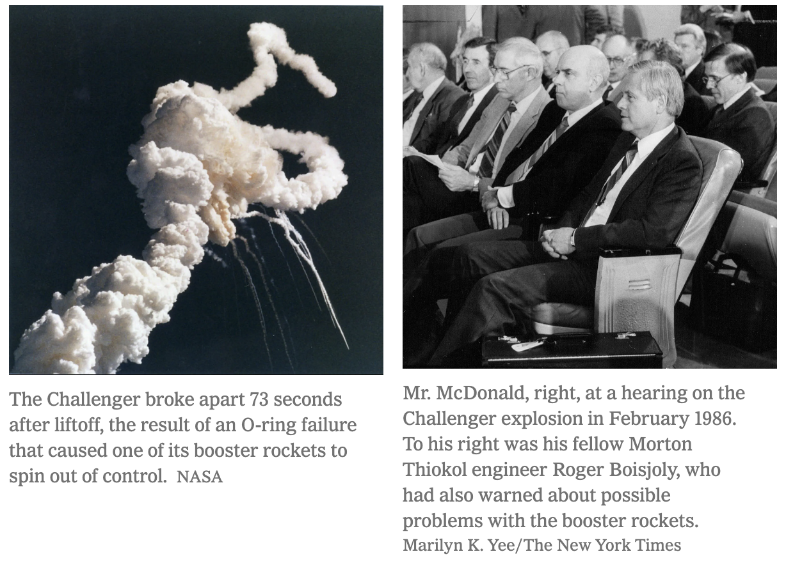
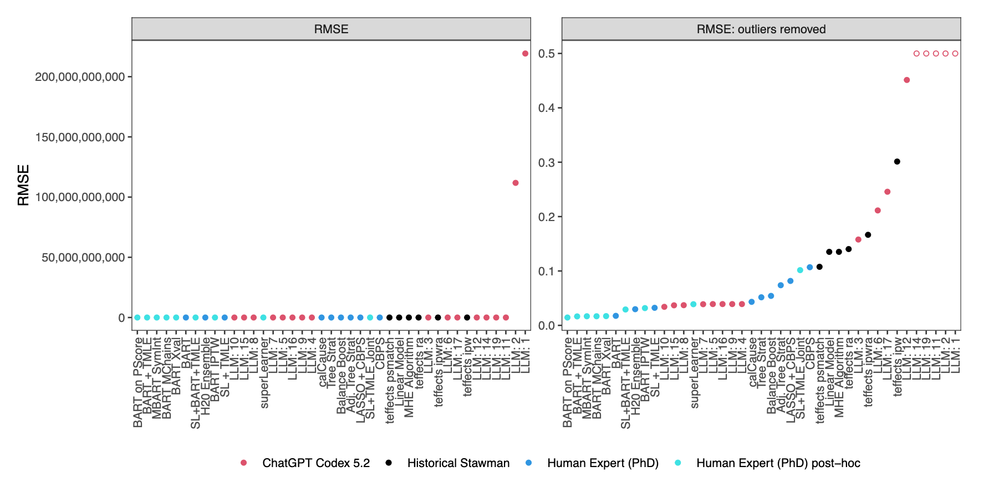
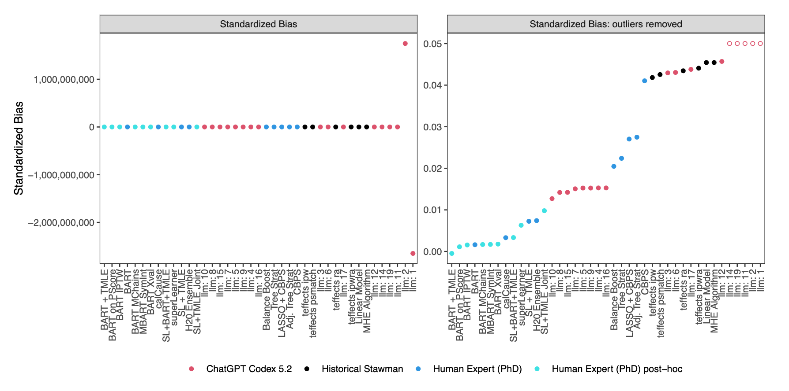
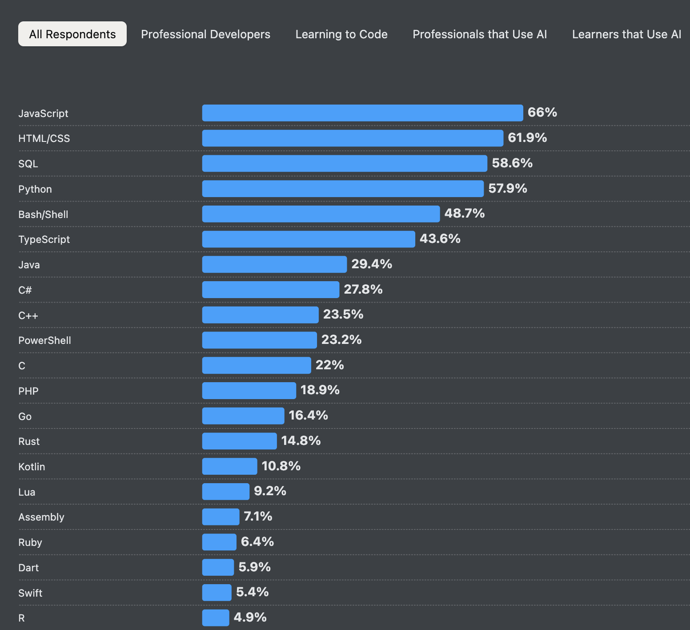
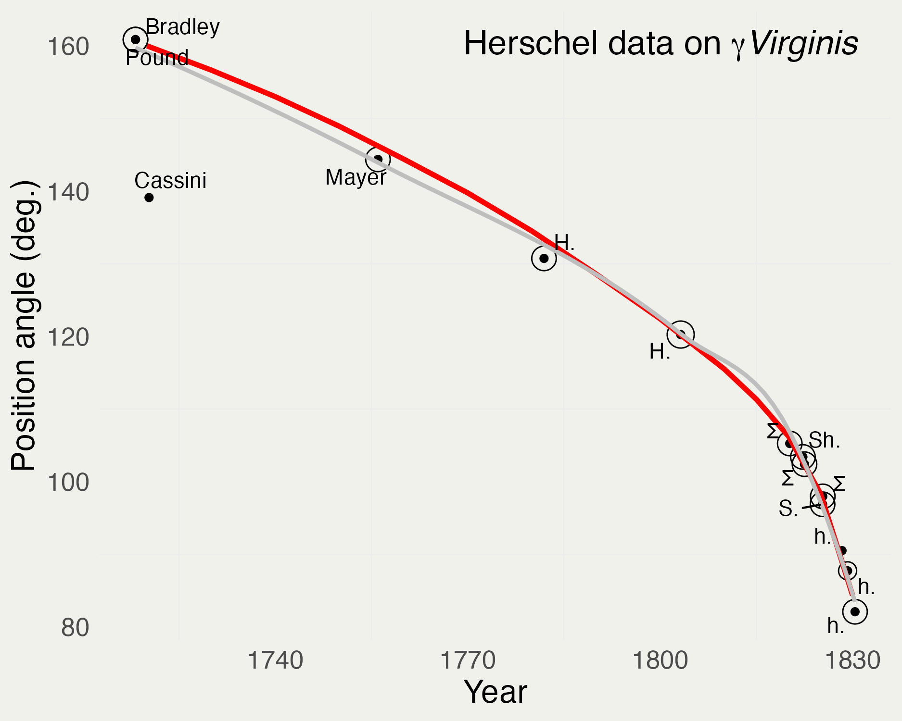
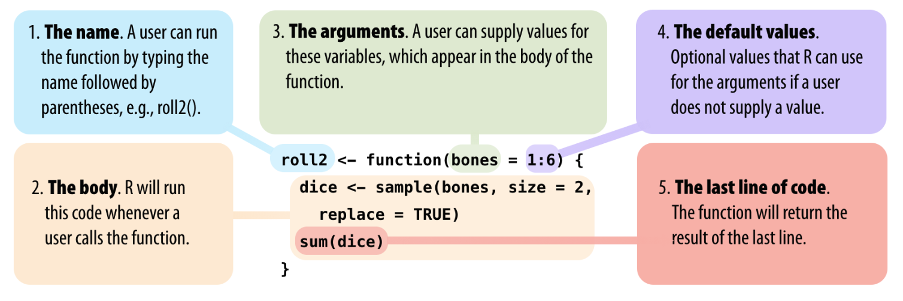

```{r}
#| include: false
library(ggplot2)
library(dplyr)
library(tibble)
library(readr)
library(scales)
library(HistData)
library(lubridate)

theme_set(
  theme_minimal() +
    theme(
      panel.background = element_rect(fill = "#f0f1eb", color = "#f0f1eb"),
      plot.background = element_rect(fill = "#f0f1eb", color = "#f0f1eb"),
      panel.grid.major = element_blank()
    )
)

# Challenger O-ring data distributed by the UCI Machine Learning Repository.
oring <- tribble(
  ~n_rings, ~n_distress, ~temp, ~psi, ~flight_order,
  6, 0, 66,  50,  1,
  6, 1, 70,  50,  2,
  6, 0, 69,  50,  3,
  6, 0, 68,  50,  4,
  6, 0, 67,  50,  5,
  6, 0, 72,  50,  6,
  6, 0, 73, 100,  7,
  6, 0, 70, 100,  8,
  6, 1, 57, 200,  9,
  6, 1, 63, 200, 10,
  6, 1, 70, 200, 11,
  6, 0, 78, 200, 12,
  6, 0, 67, 200, 13,
  6, 2, 53, 200, 14,
  6, 0, 67, 200, 15,
  6, 0, 75, 200, 16,
  6, 0, 70, 200, 17,
  6, 0, 81, 200, 18,
  6, 0, 76, 200, 19,
  6, 0, 79, 200, 20,
  6, 2, 75, 200, 21,
  6, 0, 76, 200, 22,
  6, 1, 58, 200, 23
)

y_pred <- read_rds("data/oring_pred.rds")
y_epred <- read_rds("data/oring_epred.rds")
temps <- seq(30, 81, length.out = 100)
oring_fit <- tibble(temp = temps, mean_failures = colMeans(y_epred * 6))
launch_index <- which.min(abs(oring_fit$temp - 36))
launch_failures <- oring_fit$mean_failures[launch_index]
```

## Course Objectives

::: columns
::: {.column width="60%"}
> “If you want to be a writer, you must do two things above all others: read a lot and write a lot. There's no way around these two things that I'm aware of, no shortcut.”
>
> — Stephen King, *On Writing: A Memoir of the Craft*

::: {.fragment style="font-size: 90%;"}
**Read code. Write code. Check code.**
:::

[Course syllabus (PDF)](../syllabus.pdf)
:::

::: {.column width="40%"}
{fig-align="center" height="410"}

::: {style="font-size: 52%; text-align: center;"}
Photo: [Kevin Payravi / WikiPortraits](https://commons.wikimedia.org/wiki/File:Stephen_King_at_the_2024_Toronto_International_Film_Festival_2_(cropped).jpg), [CC BY-SA 4.0](https://creativecommons.org/licenses/by-sa/4.0/).
:::
:::
:::

## Course Format

::: columns
::: {.column width="33%"}
### 2 weeks

5 days/week
:::

::: {.column width="33%"}
### 3 hours/day

Questions → lecture → practice
:::

::: {.column width="34%"}
### Computational

Many small programs
:::
:::

## Course Map {.smaller}

::: columns
::: {.column width="50%"}
- **R + data**
- **Differentiation + optimization**
- **Integration + probability**
- **Discrete + continuous distributions**
:::

::: {.column width="50%"}
- **Linear algebra**
- **Simulation**
- **Statistical inference**
- **Linear regression**
:::
:::

::: {.fragment style="text-align: center; font-size: 115%;"}
**model → compute → visualize → verify**
:::

## Session 1

::: incremental
1. Why SMaC?
2. R objects and syntax
3. Data frames and plots
4. Loops and functions
5. Monte Carlo simulation
:::

## Some Mistakes Are Deadly

::: {style="text-align: center; font-size: 120%;"}
**Challenger · January 28, 1986**
:::

::: {.fragment style="text-align: center;"}
7 crew members · 36°F at launch · O-ring thermal distress
:::

::: {.fragment style="text-align: center; font-size: 125%;"}
**What did the data say before launch?**
:::

::: footer
Sources: [NASA, STS-51L mission](https://www.nasa.gov/mission/sts-51l/) and @fowlkes1989.
:::

## Challenger O-Rings {.smaller}

::: panel-tabset
### Evidence

::: columns
::: {.column width="52%"}
```{r}
#| echo: false
#| fig-width: 5.2
#| fig-height: 4.2

ggplot(oring, aes(temp, n_distress)) +
  geom_point(size = 2) +
  scale_y_continuous(breaks = 0:2) +
  labs(
    x = "Launch temperature (°F)",
    y = "Distressed O-rings",
    title = "Pre-Challenger launches"
  )
```
:::

::: {.column width="48%"}
$$
Y_i \sim \operatorname{Binomial}(6, p_i)
$$

$$
\operatorname{logit}(p_i) = \alpha + \beta T_i
$$

::: {.fragment style="text-align: center; font-size: 115%;"}
**Extrapolate to 36°F**
:::
:::
:::

### Model

```{r}
#| echo: false
#| fig-width: 8.5
#| fig-height: 4.1
#| fig-align: center

ggplot(oring_fit, aes(temp, mean_failures)) +
  geom_line(color = "red", linewidth = 0.7) +
  geom_point(data = oring, aes(temp, n_distress), inherit.aes = FALSE) +
  geom_point(x = 36, y = launch_failures, color = "blue", size = 3) +
  annotate(
    "text", x = 50, y = launch_failures,
    label = paste("Expected failures at 36°F ≈", round(launch_failures)),
    color = "blue", size = 4
  ) +
  labs(x = "Launch temperature (°F)", y = "Distressed O-rings")
```

### Risk at Launch

::: columns
::: {.column width="50%"}
::: {style="text-align: center; font-size: 170%;"}
**`r round(mean(y_pred[, 7] > 0), 2)`**
:::

Probability of **≥ 1** damaged O-ring
:::

::: {.column width="50%"}
::: {style="text-align: center; font-size: 170%;"}
**`r round(mean(y_pred[, 7] == 6), 2)`**
:::

Probability of **all 6** damaged O-rings
:::
:::

### Sources

- Data: [UCI Machine Learning Repository](https://archive.ics.uci.edu/dataset/92/challenger+usa+space+shuttle+o+ring)
- Pre-launch analysis: @fowlkes1989
- Failure risk: @martz1992
:::

::: footer
Data: [UCI Challenger O-ring dataset](https://archive.ics.uci.edu/dataset/92/challenger+usa+space+shuttle+o+ring). Model draws: local `data/oring_epred.rds` and `data/oring_pred.rds`.
:::

## Allan McDonald

::: columns
::: {.column width="50%"}
{fig-align="center" height="400"}
:::

::: {.column width="50%"}
{fig-align="center" height="400"}
:::
:::

::: {.fragment style="text-align: center; font-size: 105%;"}
**Analysis must be communicated.**
:::

::: footer
Images and reporting: [The New York Times, “Allan McDonald, Who Refused to Approve Shuttle Launch, Dies at 83,” March 9, 2021](https://www.nytimes.com/2021/03/09/us/allan-mcdonald-dead.html).
:::

## SMaC: Why Bother?

::: columns
::: {.column width="50%"}
- **Programming** → experiments
- **Calculus** → change + optimization
- **Linear algebra** → many equations
:::

::: {.column width="50%"}
- **Probability** → population → sample
- **Statistics** → sample → population
- **Communication** → decisions
:::
:::

## One Moon Drop, Many Tools

::: {style="text-align: center; font-size: 150%;"}
$$x(t) = \tfrac{1}{2}gt^2$$
:::

::: {.fragment style="text-align: center; font-size: 110%;"}
**calculus → code → simulation → regression → uncertainty**
:::

::: {.fragment style="text-align: center;"}
One unknown: lunar gravity $g$
:::

## Programming and Statistics in the Age of AI {.smaller}

{fig-align="center" width="92%"}

::: {.fragment style="font-size: 76%; text-align: center;"}
20 solutions · 3 did not run · worst RMSE > **100 billion outcome SDs**
:::

::: footer
Plot and findings: [Perrett, Elliott, Hill, and Scott (2026), *Flaws in the LLM Automation Narrative*](https://arxiv.org/abs/2606.11166).
:::

## Plausible ≠ Correct {.smaller}

{fig-align="center" width="92%"}

::: {.fragment style="font-size: 88%; text-align: center;"}
**Generate → inspect → test → verify**
:::

::: footer
Plot and findings: [Perrett, Elliott, Hill, and Scott (2026), *Flaws in the LLM Automation Narrative*](https://arxiv.org/abs/2606.11166).
:::

## Differential Calculus {.smaller}

::: panel-tabset
### Fit

::: columns
::: {.column width="38%"}
$$
y_n \sim \operatorname{Normal}(\alpha + \beta x_n,\sigma)
$$

::: {.fragment style="text-align: center; font-size: 120%;"}
Find $(\hat\alpha,\hat\beta)$
:::
:::

::: {.column width="62%"}
```{r}
#| echo: false
#| fig-width: 5.7
#| fig-height: 4.2
set.seed(123)
reg <- tibble(x = seq(0, 10, length.out = 50)) |>
  mutate(y = 1 + 0.5 * x + rnorm(n()))

ggplot(reg, aes(x, y)) +
  geom_point() +
  geom_smooth(method = "lm", formula = y ~ x, linewidth = 0.7) +
  labs(x = "x", y = "y")
```
:::
:::

### Optimize

```{r}
#| echo: false
#| fig-width: 7
#| fig-height: 4.5
#| fig-align: center
alpha <- seq(-2, 4, length.out = 100)
beta <- seq(-2.5, 3.5, length.out = 100)
likelihood <- tidyr::expand_grid(alpha = alpha, beta = beta) |>
  mutate(z = mvtnorm::dmvnorm(cbind(alpha, beta), c(1, 0.5),
                              matrix(c(2, -1, -1, 2), nrow = 2)))

ggplot(likelihood, aes(alpha, beta, z = z)) +
  geom_contour_filled(bins = 12) +
  guides(fill = "none") +
  labs(x = expression(alpha), y = expression(beta), title = "Likelihood")
```

$$
\nabla \ell(\hat\alpha,\hat\beta) = \mathbf{0}
$$
:::

## Integral Calculus {.smaller}

::: columns
::: {.column width="42%"}
$$
\theta \sim \operatorname{Normal}(1,1)
$$

$$
\mathbb{P}(\theta > 0)
= \int_0^\infty p(\theta)\,d\theta
\approx 0.84
$$
:::

::: {.column width="58%"}
```{r}
#| echo: false
#| fig-width: 5.5
#| fig-height: 4.2
normal_curve <- tibble(theta = seq(-3, 5, length.out = 600)) |>
  mutate(density = dnorm(theta, 1, 1))

ggplot(normal_curve, aes(theta, density)) +
  geom_area(data = filter(normal_curve, theta > 0), fill = "skyblue") +
  geom_line() +
  labs(x = expression(theta), y = NULL)
```
:::
:::

## Models Are Programs {.smaller}

```stan
data {
  int<lower=0> N;
  int<lower=0> K;
  matrix[N, K] X;
  vector[N] y;
}
parameters {
  real alpha;
  vector[K] beta;
  real<lower=0> sigma;
}
model {
  y ~ normal(X * beta + alpha, sigma);
}
```

::: footer
Linear regression program adapted from the [Stan User’s Guide](https://mc-stan.org/docs/stan-users-guide/regression.html).
:::

## Binomial Regression {.smaller}

::: columns
::: {.column width="55%"}
```stan
parameters {
  real alpha;
  real beta;
}
model {
  alpha ~ normal(0, 2.5);
  beta ~ normal(0, 1);
  y ~ binomial_logit(N, alpha + beta * x);
}
```
:::

::: {.column width="45%"}
$$
p_i = \operatorname{logit}^{-1}(\alpha + \beta x_i)
$$

$$
Y_i \sim \operatorname{Binomial}(N,p_i)
$$
:::
:::

::: footer
Model form adapted from the [Stan User’s Guide](https://mc-stan.org/docs/stan-users-guide/regression.html#logistic-and-probit-regression).
:::

## R

::: columns
::: {.column width="42%"}
- open source
- interpreted
- vectorized
- statistical
- extensible
:::

::: {.column width="58%"}
{fig-align="center" width="630"}
:::
:::

::: footer
Chart: [Stack Overflow Developer Survey 2025, “Programming, scripting, and markup languages”](https://survey.stackoverflow.co/2025/technology#most-popular-technologies-language).
:::

## R: Very Basics {.smaller}

::: columns
::: {.column width="50%"}
```{r}
#| echo: true
2 + 3
10^3
(10 - 5) / 2
1:10
sin(pi / 2)
round(exp(1i * pi) + 1)
```
:::

::: {.column width="50%"}
```{r}
#| echo: true
die <- 1:6
length(die)
sum(die)
mean(die)
median(die)
sd(die)
```
:::
:::

## Your Turn: Vectors

::: columns
::: {.column width="50%"}
### Fibonacci

`0, 1, 1, 2, 3, 5, 8, 13, 21, 34`

- `length()`
- `sum()`
- `prod()`
- `diff()`
:::

::: {.column width="50%"}
### Gauss

$$
\sum_{i=1}^{N}i = \frac{N(N+1)}{2}
$$

Verify for $N=100$.
:::
:::

## Lists {.smaller}

```{r}
#| echo: true
x <- list(
  A = pi,
  B = c(0, 1),
  C = 1:10,
  D = c("one", "two")
)

x$A
x[1]
x[[1]]
```

::: {.fragment style="text-align: center;"}
**object · sub-list · element**
:::

## Data Frames {.smaller}

::: columns
::: {.column width="43%"}
```{r}
#| echo: true
data("Virginis.interp")
virginis <- as_tibble(Virginis.interp)
class(virginis)
virginis$velocity |> mean()
```

**rows = observations**  
**columns = variables**
:::

::: {.column width="57%"}
{fig-align="center" width="600"}
:::
:::

::: footer
Plot and historical data context: [Friendly and Wainer, *A History of Data Visualization and Graphic Communication*, “The Origin and Development of the Scatterplot”](https://friendly.github.io/HistDataVis/ch06-scat.html). Data via the R `HistData` package.
:::

## Plotting: John Snow {.smaller}

::: panel-tabset
### Deaths Over Time

```{r}
#| echo: false
#| fig-width: 8
#| fig-height: 4.8
#| fig-align: center
par(mar = c(3, 3, 2, 1), mgp = c(2, .7, 0), tck = -.01, bg = "#f0f1eb")
colors <- ifelse(Snow.dates$date < mdy("09/08/1854"), "red", "darkgreen")
plot(deaths ~ date, data = Snow.dates, type = "h", lwd = 2,
     col = colors, xlab = "", ylab = "Deaths")
points(deaths ~ date, data = Snow.dates, cex = 0.6, pch = 16, col = colors)
text(mdy("09/08/1854"), 40, "Pump handle removed\nSeptember 8", pos = 4)
```

### Map

```{r}
#| echo: false
#| fig-width: 7.5
#| fig-height: 5.2
#| fig-align: center
par(mar = c(3, 3, 2, 1), mgp = c(2, .7, 0), tck = -.01, bg = "#f0f1eb")
SnowMap(
  xlim = c(7.5, 16.5), ylim = c(7, 16),
  polygons = FALSE, density = TRUE,
  main = "Snow's Cholera Map"
)
```
:::

::: footer
Data and maps via the R `HistData` package; source context: [Friendly and Wainer, “John Snow’s Cholera Map”](https://friendly.github.io/HistDataVis/ch04-snow.html).
:::

## Simulating Coin Flips {.smaller}

```{r}
#| echo: true
coin <- c(H = 1, T = 0)

sample(coin, 10, replace = TRUE)
sample(coin, 10, replace = TRUE,
       prob = c(0.6, 0.4))
```

::: {.fragment style="text-align: center; font-size: 115%;"}
**Flip 1,000 times. Estimate $\mathbb{P}(H)$.**
:::

## For Loops {.smaller}

::: panel-tabset
### Pattern

```{r}
#| echo: true
x <- 1:100
s <- 0

for (i in seq_along(x)) {
  s <- s + x[i]
}

s == sum(x)
```

### Prompt

```r
s <- 0
for (i in seq_along(x)) {
  if (________________) {
    s <- ______________
  }
}
```

**Add only the even values. Write a test.**

### Check

```{r}
#| echo: true
s <- 0
for (i in seq_along(x)) {
  if (x[i] %% 2 == 0) {
    s <- s + x[i]
  }
}

s == sum(seq(2, 100, by = 2))
```
:::

## Law of Large Numbers {.smaller}

::: panel-tabset
### Code

```{r}
#| echo: true
set.seed(1)
n <- 1e4
flips <- sample(c(0, 1), n, replace = TRUE)

lln <- tibble(
  num_flips = seq_len(n),
  est_prop = cumsum(flips) / num_flips
)
```

$$
\overline X_n \xrightarrow{\;P\;} \mathbb{E}[X]
$$

### Plot

```{r}
#| echo: false
#| fig-width: 8
#| fig-height: 4.4
#| fig-align: center

ggplot(lln, aes(num_flips, est_prop)) +
  geom_line(linewidth = 0.25) +
  geom_hline(yintercept = 0.5, color = "red") +
  scale_x_log10(labels = comma) +
  labs(x = "Number of flips (log scale)", y = "Proportion of heads")
```

$$
\lim_{n\to\infty}\mathbb{P}\left(\left|\overline X_n-\mu\right|\geq\epsilon\right)=0
$$
:::

## Functions

{fig-align="center" height="420"}

::: {.fragment style="text-align: center;"}
**arguments → body → return value**
:::

::: footer
Diagram: [Grolemund, *Hands-On Programming with R*, “R Objects”](https://rstudio-education.github.io/hopr/r-objects.html), @grolemund2014.
:::

## Write a Function {.smaller}

::: columns
::: {.column width="50%"}
```{r}
#| echo: true
estimate_proportion <- function(n) {
  flips <- sample(c(0, 1), n,
                  replace = TRUE)
  mean(flips)
}

estimates <- replicate(
  1000,
  estimate_proportion(10)
)
```
:::

::: {.column width="50%"}
```{r}
#| echo: false
#| fig-width: 4.5
#| fig-height: 4
par(mar = c(3, 3, 2, 1), mgp = c(2, .7, 0), tck = -.01, bg = "#f0f1eb")
hist(estimates, xlab = "Proportion of heads", main = "1,000 estimates")
```
:::
:::

## Continuous Uniform Draws {.smaller}

::: columns
::: {.column width="42%"}
```r
runif(n, min = 0, max = 1)
```

::: {.fragment}
Predict:

```r
mean(runif(1000, -1, 0))
```
:::
:::

::: {.column width="58%"}
```{r}
#| echo: false
#| fig-width: 5.5
#| fig-height: 4.2
set.seed(2)
uniform_draws <- tibble(x = runif(1000))
ggplot(uniform_draws, aes(x)) +
  geom_histogram(bins = 25, color = "white") +
  labs(x = "x", y = "Count")
```
:::
:::

## Estimating $\pi$ {.smaller}

::: columns
::: {.column width="50%"}
$$
A_c = \pi r^2
$$

$$
A_s = (2r)^2 = 4r^2
$$
:::

::: {.column width="50%"}
$$
\frac{A_c}{A_s} = \frac{\pi}{4}
$$

$$
\pi = 4\frac{A_c}{A_s}
$$
:::
:::

::: {.fragment style="text-align: center; font-size: 110%;"}
**Throw darts at the square. Count hits inside the circle.**
:::

## Monte Carlo $\pi$ {.smaller}

::: panel-tabset
### Code + Plot

```{r}
#| echo: true
#| fig-width: 4
#| fig-height: 4
#| fig-align: center
set.seed(3)
n <- 1000
pi_draws <- tibble(
  x = runif(n, -1, 1),
  y = runif(n, -1, 1)
) |>
  mutate(inside = x^2 + y^2 < 1)

ggplot(pi_draws, aes(x, y, color = inside)) +
  geom_point(size = 1) +
  coord_equal() +
  guides(color = "none")
```

### Estimate

$$
\widehat\pi
= \frac{4}{N}\sum_{i=1}^{N}
\mathbb{I}(x_i^2+y_i^2<1)
$$

::: {style="text-align: center; font-size: 180%;"}
**`r round(4 * mean(pi_draws$inside), 3)`**
:::
:::

## Resources {.smaller}

::: columns
::: {.column width="50%"}
- *Hands-On Programming with R* @grolemund2014
- *R for Data Science* @wickham2023
- *Calculus Made Easy* @thompson1980
:::

::: {.column width="50%"}
- *Calculus, Volume 1* @herman2016
- *Introduction to Probability* @blitzstein2019
- *Introduction to Linear Algebra* @boyd2018
:::
:::

## References
