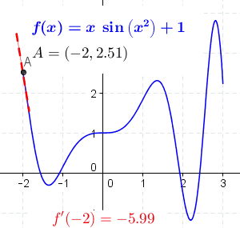

```{r}
#| include: false
library(ggplot2)
library(dplyr)
library(tibble)

theme_set(
  theme_minimal() +
    theme(
      panel.background = element_rect(fill = "#f0f1eb", color = "#f0f1eb"),
      plot.background = element_rect(fill = "#f0f1eb", color = "#f0f1eb"),
      panel.grid.minor = element_blank(),
      plot.title = element_text(face = "bold")
    )
)

accent <- "#5C5CFF"
ink <- "#222222"

Pn <- function(n, A, r, t) A * (1 + r / n)^(n * t)
Pe <- function(A, r, t) A * exp(r * t)

raw_moon <- read.csv("data/moon-drop.csv")
moon <- tibble(t = raw_moon$t_obs_s, x = raw_moon$x_m)
g_ref <- 1.625
moon_curve <- tibble(
  t = seq(0, max(moon$t), length.out = 300),
  x = 0.5 * g_ref * t^2
)
```

## Mission: recover lunar gravity

<br>
<br>

::: {style="text-align: center;"}
::: {style="font-size: 190%; font-weight: 700;"}
100 m tower · 20 flashes · 1 stopwatch
:::

::: {style="font-size: 115%; margin-top: 2rem;"}
1 kg ball · unknown $g$
:::

::: fragment
::: {style="font-size: 145%; margin-top: 2rem;"}
$$
(t_k, x_k) \longrightarrow \boxed{g} \longrightarrow \text{home}
$$
:::
:::

::: fragment
**functions $\rightarrow$ rates $\rightarrow$ limits $\rightarrow$ derivatives**
:::
:::

## A line is a constant rate

::: columns
::: {.column width="30%"}
<br>

::: {style="font-size: 150%;"}
$$y = a + bx$$
:::

$$a = y(0)$$

$$b = \frac{\Delta y}{\Delta x}$$
:::

::: {.column width="70%"}
```{r}
#| echo: false
#| fig-width: 7
#| fig-height: 4.8
#| fig-align: center
line_data <- bind_rows(
  tibble(x = seq(0, 5, length.out = 100), y = 1 + 2 * x, line = "positive"),
  tibble(x = seq(0, 5, length.out = 100), y = 7.5 - 2 * x, line = "negative")
)

ggplot(line_data, aes(x, y, color = line)) +
  geom_hline(yintercept = 0, color = "grey70", linewidth = 0.3) +
  geom_vline(xintercept = 0, color = "grey70", linewidth = 0.3) +
  geom_line(linewidth = 1) +
  geom_point(
    data = tibble(x = c(0, 0), y = c(1, 7.5), line = c("positive", "negative")),
    size = 2.5
  ) +
  annotate("text", x = 3.6, y = 9.3, label = "y = 1 + 2x", color = accent, size = 5) +
  annotate("text", x = 2.8, y = 2.4, label = "y = 7.5 - 2x", color = "#C43C39", size = 5) +
  scale_color_manual(values = c(positive = accent, negative = "#C43C39"), guide = "none") +
  coord_cartesian(xlim = c(0, 5), ylim = c(-3, 12)) +
  labs(x = "x", y = "y")
```
:::
:::

## Your Turn: `plot_line()` {.smaller}

Write `plot_line(slope, intercept)`.

```{r}
#| eval: false
#| echo: true
plot_line <- function(slope, intercept) {
  x <- seq(0, 5, length.out = 100)
  # construct y
  # return a ggplot
}
```

Test three cases:

$$b > 0 \qquad b = 0 \qquad b < 0$$

Use values that remain visible for $0 \le x \le 5$.

## Exponential growth

::: columns
::: {.column width="42%"}
<br>

$$
\frac{y(t + 1)}{y(t)} = b
$$

::: {style="font-size: 130%;"}
$$
y(t) = A b^t = A e^{kt},
\qquad k = \log b
$$
:::

::: fragment
$$
y'(t) = k y(t)
$$
:::
:::

::: {.column width="58%"}
```{r}
#| echo: false
#| fig-width: 5.8
#| fig-height: 4.6
#| fig-align: center
exp_data <- tibble(t = seq(0, 6, length.out = 200), y = 1.5^t)
exp_points <- tibble(t = 0:6, y = 1.5^(0:6))

ggplot(exp_data, aes(t, y)) +
  geom_line(color = accent, linewidth = 1) +
  geom_point(data = exp_points, size = 2.4, color = accent) +
  annotate("text", x = 4.2, y = 2.2, label = "each step: × 1.5", size = 5) +
  labs(x = "t", y = "y(t)")
```
:::
:::

## Compound interest

::: columns
::: {.column width="48%"}
$$
A \longrightarrow A(1+r) \longrightarrow A(1+r)^2
$$

$$
P(t) = A(1+r)^t
$$

$$
P_n(t) = A\left(1 + \frac{r}{n}\right)^{nt}
$$

::: fragment
$$
P_\infty(t) = A e^{rt}
$$
:::
:::

::: {.column width="52%"}
```{r}
#| echo: false
#| fig-width: 5.2
#| fig-height: 4.5
#| fig-align: center
n_comp <- 1:100
compound <- tibble(
  n = n_comp,
  value = Pn(n_comp, A = 100, r = 0.05, t = 50)
)
continuous_value <- Pe(A = 100, r = 0.05, t = 50)

ggplot(compound, aes(n, value)) +
  geom_line(color = accent, linewidth = 0.9) +
  geom_hline(yintercept = continuous_value, color = "#C43C39", linewidth = 0.8) +
  annotate(
    "text", x = 72, y = continuous_value + 18,
    label = "continuous: 100 e^(0.05 × 50)", color = "#C43C39", size = 4.5
  ) +
  scale_y_continuous(labels = scales::dollar_format()) +
  labs(x = "compoundings per year, n", y = "value after 50 years")
```
:::
:::

## Your Turn: bacterial growth

::: {style="text-align: center; font-size: 120%;"}
$N(0) = 1000$ · doubles every 4 hours
:::

<br>

$$
N(10) = \; ?
\qquad\qquad
N(24) = \; ?
$$

::: fragment
$$
N(t) = 1000 \cdot 2^{t/4}
$$

$$
N(10) \approx 5657
\qquad\qquad
N(24) = 64{,}000
$$
:::

## The limit that defines $e$

::: columns
::: {.column width="57%"}
```{r}
#| echo: false
#| fig-width: 5.8
#| fig-height: 4.6
#| fig-align: center
m <- 1:100
e_limit <- tibble(m, value = (1 + 1 / m)^m)

ggplot(e_limit, aes(m, value)) +
  geom_line(color = accent, linewidth = 1) +
  geom_hline(yintercept = exp(1), color = "#C43C39", linewidth = 0.8) +
  annotate("text", x = 76, y = exp(1) + 0.025, label = "e", color = "#C43C39", size = 6) +
  labs(x = "m", y = expression((1 + 1 / m)^m))
```
:::

::: {.column width="43%"}
<br>

::: {style="font-size: 125%;"}
$$
e = \lim_{m \to \infty}
\left(1 + \frac{1}{m}\right)^m
$$
:::

::: fragment
$$
\lim_{n \to \infty}
A\left(1 + \frac{r}{n}\right)^{nt}
= A e^{rt}
$$
:::
:::
:::

## Exponent and log toolkit {.smaller}

::: columns
::: {.column width="50%"}
$$a^{x+y} = a^x a^y$$

$$a^{x-y} = \frac{a^x}{a^y}$$

$$(a^x)^y = a^{xy}$$

$$(ab)^x = a^x b^x$$
:::

::: {.column width="50%"}
$$\log(uv) = \log u + \log v$$

$$\log(u/v) = \log u - \log v$$

$$\log(u^p) = p\log u$$

$$\log y = x \iff y = e^x$$
:::
:::

::: {style="text-align: center; font-size: 70%; margin-top: 1rem;"}
$a>0$ · logarithm arguments $>0$ · for base-$a$ logs, $a \ne 1$
:::

## Your Turn: continuous interest

::: {style="text-align: center; font-size: 115%;"}
$A(0) = \$750$ · $r = 5.5\%$ · continuous compounding
:::

<br>

Find $A(t)$, $A(5)$, $A(10)$, and $A(50)$.

::: fragment
$$
A(t) = 750e^{0.055t}
$$

$$
A(5) = \$987.40
\qquad
A(10) = \$1{,}299.94
\qquad
A(50) = \$11{,}731.97
$$
:::

## Logs turn growth into a line {.smaller}

::: columns
::: {.column width="50%"}
```{r}
#| echo: false
#| fig-width: 4.8
#| fig-height: 3.7
#| fig-align: center
growth <- tibble(t = 0:50, P = 100 * 1.05^t)

ggplot(growth, aes(t, P)) +
  geom_line(color = accent, linewidth = 1) +
  annotate("text", x = 31, y = 600, label = "P(t) = 100(1.05)^t", size = 4.5) +
  scale_y_continuous(labels = scales::dollar_format()) +
  labs(x = "t", y = "P(t)")
```
:::

::: {.column width="50%"}
```{r}
#| echo: false
#| fig-width: 4.8
#| fig-height: 3.7
#| fig-align: center
ggplot(growth, aes(t, log(P))) +
  geom_line(color = accent, linewidth = 1) +
  annotate(
    "text", x = 27, y = 5.1,
    label = "log(P(t)) = log(100) + t log(1.05)", size = 4
  ) +
  labs(x = "t", y = "log P(t)")
```
:::
:::

$$
\beta \text{ on a log scale}
\quad\Longrightarrow\quad
100\left(e^\beta - 1\right)\% \text{ change}
$$

## Softmax can overflow {.smaller}

::: columns
::: {.column width="48%"}
$$
\operatorname{softmax}(x)_i =
\frac{e^{x_i}}{\sum_{j=1}^N e^{x_j}}
$$

```{r}
#| echo: true
x <- 1000:1002
exp(x)
exp(x) / sum(exp(x))
```
:::

::: {.column width="52%"}
::: fragment
$$
m = \max_j x_j
$$

$$
\operatorname{LSE}(x)
= m + \log\sum_{j=1}^N e^{x_j-m}
$$

$$
\log\operatorname{softmax}(x)_i
= x_i - \operatorname{LSE}(x)
$$
:::
:::
:::

## Your Turn: stable softmax {.smaller}

1. Implement `LSE(x)`.
2. Implement `log_softmax(x)`.
3. Exponentiate; verify the result sums to 1.

::: fragment
```{r}
#| eval: false
LSE <- function(x) {
  m <- max(x)
  m + log(sum(exp(x - m)))
}

log_softmax <- function(x) x - LSE(x)
softmax <- function(x) exp(log_softmax(x))

sum(softmax(1000:1002))
```
:::

## Moon model

::: {style="text-align: center; font-size: 120%;"}
**downward distance = $+x$**
:::

::: columns
::: {.column width="50%"}
::: {style="font-size: 135%;"}
$$
m\ddot{x} = mg
\quad\Longrightarrow\quad
\ddot{x} = g
$$
:::

::: fragment
**1 kg** $\rightarrow$ mass cancels
:::
:::

::: {.column width="50%"}
$$
x(0) = 0
\qquad
v(0) = 0
$$

::: fragment
$$
v(t) = gt
$$

$$
x(t) = \tfrac{1}{2}gt^2$$
:::
:::
:::

## The drop, in data

```{r}
#| echo: false
#| fig-width: 8.5
#| fig-height: 4.8
#| fig-align: center

ggplot(moon, aes(t, x)) +
  geom_point(size = 2.3) +
  geom_line(data = moon_curve, color = "#C43C39", linewidth = 0.9) +
  annotate(
    "text", x = 4.1, y = 72,
    label = "x(t) = 1/2 × 1.625 × t^2", color = "#C43C39", size = 5
  ) +
  annotate(
    "text", x = 8.5, y = 18,
    label = "19 noisy times\nat known marks", size = 4.7
  ) +
  labs(x = "time, t (s)", y = "downward distance, x (m)")
```

::: {style="text-align: center; font-size: 72%;"}
reference curve: $g_{\mathrm{ref}} = 1.625\ \mathrm{m/s^2}$ · not an estimate from these observations
:::

## Average velocity is a secant slope {.smaller}

::: columns
::: {.column width="58%"}
```{r}
#| echo: false
#| fig-width: 5.8
#| fig-height: 4.6
#| fig-align: center
t1 <- 4
t2 <- 9
x1 <- 0.5 * g_ref * t1^2
x2 <- 0.5 * g_ref * t2^2
v_bar <- (x2 - x1) / (t2 - t1)

ggplot(moon_curve, aes(t, x)) +
  geom_line(linewidth = 0.9, color = ink) +
  geom_abline(
    slope = v_bar, intercept = x1 - v_bar * t1,
    color = "#C43C39", linewidth = 0.9
  ) +
  geom_point(data = tibble(t = c(t1, t2), x = c(x1, x2)), color = accent, size = 3) +
  annotate("text", x = t1 - 0.25, y = x1 + 9, label = "t[1]", parse = TRUE, color = accent, size = 5) +
  annotate("text", x = t2 - 0.25, y = x2 + 9, label = "t[2]", parse = TRUE, color = accent, size = 5) +
  annotate("text", x = 7.2, y = 48, label = "bar(v)", parse = TRUE, color = "#C43C39", size = 6) +
  labs(x = "t", y = "x(t)")
```
:::

::: {.column width="42%"}
<br>

$$
\bar v
= \frac{\Delta x}{\Delta t}
= \frac{x(t_2)-x(t_1)}{t_2-t_1}
$$

::: fragment
$$
\bar v
= \frac{\tfrac12 g(t_2^2-t_1^2)}{t_2-t_1}
= \tfrac12 g(t_1+t_2)
$$
:::
:::
:::

## From secant to tangent

::: columns
::: {.column width="55%"}
{fig-align="center" width="470"}
:::

::: {.column width="45%"}
<br>

$$
\text{secant slope}
= \frac{x(a+h)-x(a)}{h}
$$

::: fragment
$$
v(a)
= \lim_{h\to 0}\frac{x(a+h)-x(a)}{h}
= x'(a)
$$
:::
:::
:::

::: footer
Animation source: [Wikipedia, “Derivative”](https://en.wikipedia.org/wiki/Derivative).
:::

## Position $\rightarrow$ velocity $\rightarrow$ acceleration {.smaller}

$$
x(t) = \tfrac12 gt^2
$$

::: fragment
$$
\begin{aligned}
v(t)
&= \lim_{h\to 0}
\frac{\tfrac12 g(t+h)^2-\tfrac12 gt^2}{h} \\
&= \lim_{h\to 0}
\left(gt+\tfrac12 gh\right) \\
&= gt
\end{aligned}
$$
:::

::: fragment
$$
a(t) = v'(t) = x''(t) = g
$$

$$
v(4) \approx 1.62 \times 4 = 6.5\ \mathrm{m/s}\ \text{downward}
$$
:::

## Derivative toolkit {.smaller}

::: columns
::: {.column width="50%"}
$$
\begin{aligned}
(c)' &= 0 \\
(x^n)' &= nx^{n-1} \\
(cf)' &= cf' \\
(f+g)' &= f'+g'
\end{aligned}
$$
:::

::: {.column width="50%"}
$$
\begin{aligned}
(e^x)' &= e^x \\
(\log x)' &= \frac{1}{x} \\
(fg)' &= f'g + fg' \\
(f\circ g)' &= (f'\circ g)g'
\end{aligned}
$$
:::
:::

## Your Turn: another moon {.smaller}

$$
x(t) = 4 + 3t + 5t^2
$$

Find $x(0)$, $x(1)$, $v(0)$, $v(5)$, $a(5)$, and $g$.

::: fragment
::: columns
::: {.column width="50%"}
$$x(0)=4 \qquad x(1)=12$$

$$v(t)=3+10t$$
:::

::: {.column width="50%"}
$$v(0)=3 \qquad v(5)=53$$

$$a(t)=g=10$$
:::
:::
:::

## Exact and numerical derivatives {.smaller}

::: columns
::: {.column width="39%"}
$$
\begin{aligned}
\frac{d}{dt}[\sin t\cos t]
&= \cos t\cos t + \sin t(-\sin t) \\
&= \cos^2t-\sin^2t
\end{aligned}
$$

```r
diff(x) / diff(t)
```

$$
\frac{\Delta x}{\Delta t}
\approx \frac{dx}{dt}
$$
:::

::: {.column width="61%"}
```{r}
#| echo: false
#| fig-width: 6.2
#| fig-height: 4.7
#| fig-align: center
n <- 100
t <- seq(0, pi, length.out = n)
x <- sin(t) * cos(t)
exact <- cos(t)^2 - sin(t)^2
approx <- tibble(
  t = (t[-1] + t[-n]) / 2,
  value = diff(x) / diff(t)
)

exact_data <- tibble(t, x, exact)

ggplot(exact_data, aes(t, x)) +
  geom_line(color = ink, linewidth = 0.9) +
  geom_line(aes(y = exact), color = "#C43C39", linewidth = 0.9) +
  geom_line(data = approx, aes(t, value), color = accent, linewidth = 3, alpha = 0.3) +
  annotate("text", x = 0.65, y = 0.62, label = "f(t)", color = ink, size = 5) +
  annotate("text", x = 2.6, y = 0.75, label = "exact", color = "#C43C39", size = 5) +
  annotate("text", x = 2.55, y = 0.48, label = "finite difference", color = accent, size = 4.5) +
  labs(x = "t", y = NULL)
```
:::
:::

## Your Turn: chain rule

Warm-up:

$$
\frac{d}{dx}\sin(x^2) = 2x\cos(x^2)
$$

Now find

::: {style="font-size: 130%;"}
$$
\frac{d}{dx}\left(e^{x^2\cos x}\right).
$$
:::

::: fragment
$$
e^{x^2\cos x}
\left(2x\cos x-x^2\sin x\right)
$$
:::

## Mission checkpoint

<br>

::: {style="text-align: center;"}
::: {style="font-size: 210%; font-weight: 700;"}
1 drop $\longrightarrow$ 19 timed marks
:::

<br>

::: {style="font-size: 135%;"}
$g$ to **one decimal place**?

$g$ to **two decimal places**?
:::

::: fragment
**oxygen $\leftrightarrow$ precision**

Sessions 6–7
:::
:::

## Homework: circular motion {.smaller}

$$
x(t)=R\cos(\omega t),
\qquad
y(t)=R\sin(\omega t),
\qquad
0\le t\le \frac{2\pi}{\omega}
$$

$R>0$ · $\omega>0$ · $T=2\pi/\omega$

- Write position, velocity, and acceleration functions.
- Plot $x(t)$ and $y(t)$ against $t$; plot $y$ against $x$.
- Plot each velocity and acceleration component with its position component.
- Verify

$$
\mathbf a(t) = -\omega^2\mathbf r(t).
$$

- Explain the geometry of $\mathbf r(t)$, $\mathbf v(t)$, and $\mathbf a(t)$.
