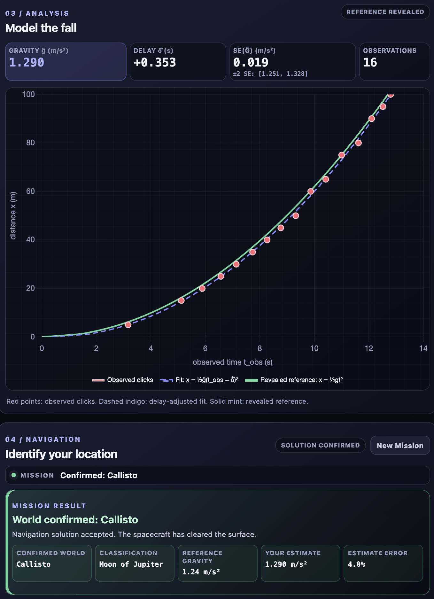
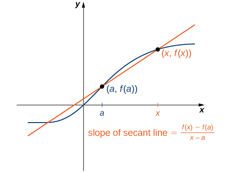
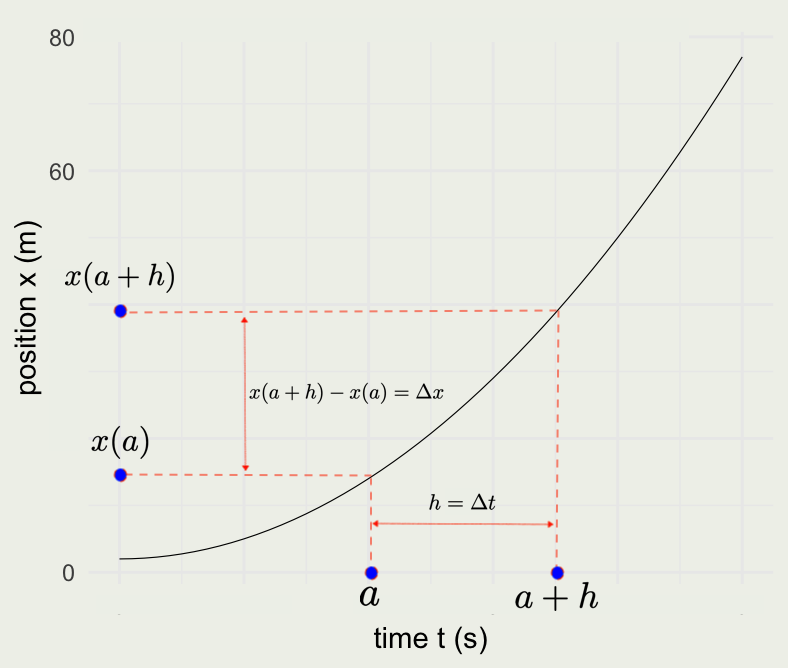

## Session 2 Outline

::: columns
::: {.column width="50%"}
::: incremental
-   Linear, exponential, and logarithmic functions

-   Limits

-   Definition of the derivative

-   Rules of differentiation

-   The chain rule and product rule

-   Live experiments and data collection!

:::
:::

::: {.column width="50%"}
{fig-align="center" width="396"}
:::
:::

::: footer
Image source: [Wikipedia](https://en.wikipedia.org/wiki/Derivative)
:::

## Lines

::: panel-tabset
### Lines

::: incremental

-   We typically use the slope-intercept form of the line: $y = a + bx$, where $a = y(0)$ is the intercept and $b = \Delta y / \Delta x$ is the slope (rise over run).
-   For example: $y = 1.5 + 0.5x$.
-   If $b = 0$, the line is horizontal.

:::

### Examples

::: columns
::: {.column width="50%"}
A graph of a line with the equation $y = 1 + 2x$.

```{r}
#| fig-width: 3
#| fig-height: 3
library(ggplot2)
thm <-
  theme_minimal() + theme(
    panel.background = element_rect(fill = "#f0f1eb", color = "#f0f1eb"),
    plot.background = element_rect(fill = "#f0f1eb", color = "#f0f1eb")
  )
theme_set(thm)

p <- ggplot() + xlim(0, 5) + ylim(0, 10)
p + geom_abline(slope = 2, intercept = 1, linewidth = 0.2)
```
:::

::: {.column width="50%"}
A graph of a line with the equation $y = 7.5 - 2x$.

```{r}
#| fig-width: 3
#| fig-height: 3

p <- ggplot() + xlim(0, 5) + ylim(0, 10)
p + geom_abline(slope = -2, intercept = 7.5, linewidth = 0.2)
```
:::
:::

### Code

```{r}
#| eval: false
#| echo: true

# y = 1 + 2x
p <- ggplot() + xlim(0, 5) + ylim(0, 10)
p + geom_abline(slope = 2, intercept = 1, linewidth = 0.2)

# y = 7.5 - 2x
p <- ggplot() + xlim(0, 5) + ylim(0, 10)
p + geom_abline(slope = -2, intercept = 7.5, linewidth = 0.2)

# to see some other ways of plotting lines
?geom_abline
```
:::

## Your Turn

- Turn the following code into a function called `plot_line(slope, intercept)`
- Test it for different values of `slope` and `intercept`

```{r}
#| eval: false
#| echo: true
p <- ggplot() + xlim(0, 5) + ylim(0, 10)
p + geom_abline(slope = 2, intercept = 1, linewidth = 0.2)
```

Choose test values whose lines are visible in the fixed plotting window.

## Exponential Functions

::: incremental
-   The idea of an exponential function is that the **rate of change** of the function at time $t$ is **proportional** to the value of the function at time $t$. In other words:
:::

::: {.fragment}
$$
\frac{\text{d}[y(t)]}{\text{d}t} = k \cdot y(t)
$$
:::

::: incremental
-   The general solution to this differential equation is $y(t) = C e^{kt}$, where $C = y(0)$.

-   Think of population growth or growth of an interest-bearing asset.
:::

## Example: Compound Interest {.smaller}

::: {.fragment}
An asset that has a value $A$ is invested with an annual interest rate $r$. What is the balance in the account, $P_1$, at the end of the first year?
:::

::: {.fragment}
$$
P_1 = A + rA = A(1 + r)
$$
:::

::: {.fragment}
After year two, the value is:

$$
P_2 = P_1 + rP_1 = P_1(1 + r) = \\
A(1 + r)(1 + r) = A(1 + r)^2
$$
:::

::: {.fragment}
And after year $t$, the value is:

$$
P(t) = A(1 + r)^t
$$
:::

::: {.fragment}
What if we compound the interest twice per year? In that case:

$$
P_1 = A \left (1 + \frac{r}{2} \right)^2
$$
:::

::: {.fragment}
If we compound $n$ times per year, the balance after one year would be:

$$
P_n(1) = A \left (1 + \frac{r}{n} \right)^n
$$

:::

::: {.fragment}
Combining these ideas, if we compound $n$ times per year, for $t$ years, we get:

$$
P_n(t) = A \left (1 + \frac{r}{n} \right)^{nt}
$$

Letting $n \to \infty$ gives **continuous compounding**. Both the finite- and continuous-compounding formulas are exponential functions of time.
:::

## Example: Compound Interest

::: panel-tabset
### Code

```{r}
#| echo: true
#| eval: false

rate <- 0.05    # interest rate r
P <- 100        # principal P
n_comp <- 1:100 # number of compoundings n

Pn <- function(n, A, r, t) A * (1 + r/n)^(t*n)
Pe <- function(A, r, t) A * exp(r * t)

pn <- Pn(n = n_comp, A = P, r = rate, t = 50)
pe <- Pe(A = P, r = rate, t = 50)

d <- data.frame(n_comp, pn)
p <- ggplot(d, aes(n_comp, pn))
p + geom_line(linewidth = 0.2) +
  geom_hline(yintercept = pe, color = 'red', linewidth = 0.2) +
  xlab("Number of times the interest is compounded") +
  ylab("Value of an asset") +
  ggtitle("Value of $100 at r = 0.05 after 50 years")
```

### Compounding

```{r}
#| fig-width: 6
#| fig-height: 5
#| fig-align: center

rate <- 0.05
P <- 100
n_comp <- 1:100

Pn <- function(n, A, r, t) A * (1 + r/n)^(t*n)
Pe <- function(A, r, t) A * exp(r * t)

pn <- Pn(n = n_comp, A = P, r = rate, t = 50)
pe <- Pe(A = P, r = rate, t = 50)

d <- data.frame(n_comp, pn)
p <- ggplot(d, aes(n_comp, pn))
p + geom_line(linewidth = 0.2) +
  geom_hline(yintercept = pe, color = 'red', linewidth = 0.2) +
  xlab("Number of times the interest is compounded") +
  ylab("Asset value") +
  ggtitle("Value of $100 at r = 0.05 after 50 years") +
  scale_y_continuous(labels = scales::dollar_format()) +
  annotate("text", 55, 1193,
           label = "P == 100 (1 + 0.05/n)^{50*n}", parse = TRUE)
#  annotate("text",  50, 1200,
#           label = "y(t) == 100 * e ^ {50*r}", parse = TRUE, color = 'red')
```

### Growth over time

::: columns
::: {.column width="50%"}
```{r}
#| fig-width: 4.5
#| fig-height: 4.5
#| fig-align: center

time <- 0:50
p1 <- Pn(n = 1, A = P, r = rate, t = time)
pe <- Pe(A = P, r = rate, t = time)

p <- ggplot(data.frame(time, p1, pe), aes(time, p1))
p + geom_line(linewidth = 0.2) +
  geom_line(aes(y = pe), linewidth = 0.2, color = 'red') +
  scale_y_continuous(labels = scales::dollar_format()) +
  xlab("Time (years)") + ylab("Asset value") +
  ggtitle("Growth of $100 with 5% interest") +
  annotate("text", 34, 5e2,
           label = "y(t) == 100 %.% 1.05^t", parse = TRUE, hjust = 0) +
  annotate("text", 47, 11e2,
           label = "y(t) == 100 * e^{0.05*t}", parse = TRUE,
           color = 'red', hjust = 1)
```
:::

::: {.column width="50%"}
```{r}
#| fig-width: 4.5
#| fig-height: 4.5
#| fig-align: center

p <- ggplot(data.frame(time, p1 = log10(p1), pe = log10(pe)), aes(time, p1))
p + geom_line(linewidth = 0.2) +
  geom_line(aes(y = pe), linewidth = 0.2, color = 'red') +
  xlab("Time (years)") + ylab("Asset value on Log10 scale") +
  ggtitle("Growth of $100 with 5% interest") +
  annotate("text", 20, 2.4,
           label = "y(t) == 2 + log[10](1.05) * t",
           parse = TRUE, hjust = 0) +
  annotate("text", 45, 3,
           label = "y(t) == 2 + 0.05 * log[10](e) * t",
           parse = TRUE, color = 'red', hjust = 1)
```
:::
:::
:::

## Your Turn

Suppose a particular population of bacteria is known to double in size every 4 hours. If a culture starts with 1000 bacteria, what is the population after 10 hours and 24 hours?

## The Number $e$ {.smaller}

::: {.fragment}
-   Recall the equation for asset value after $t$ years compounded $n$ times:

$$
P_n(t) = A \left (1 + \frac{r}{n} \right)^{nt}
$$
:::

::: {.fragment}
-   Let $m = n/r$ and take the limit as $m \to \infty$.

$$
P_\infty(t) = A \lim_{m \to \infty} \left ( 1 + \frac{1}{m} \right)^{m(rt)}
$$
:::


## The Number $e$ {.smaller}

::: panel-tabset
### Plot

::: columns
::: {.column width="50%"}

::: {.fragment}
-   We can compute the value of $\left ( 1 + \frac{1}{m} \right)^m$ as m increases.

```{r}
#| fig-width: 5
#| fig-height: 3
#| fig-align: center
f <- function(m) (1 + 1/m)^m
x <- 1:100
y <- f(x)
p <- ggplot(data.frame(x, y), aes(x, y))
p + geom_line(linewidth = 0.2) +
  geom_hline(yintercept = exp(1), color = 'red', linewidth = 0.2)
```
:::

:::

::: {.column width="50%"}

::: {.fragment}
-   The number that this limit approaches is called $e$.

$$
\begin{aligned}
P_\infty(t) &= A \lim_{m \to \infty} \left ( 1 + \frac{1}{m} \right)^{m(rt)} \\
            &= A e^{rt}
\end{aligned}
$$
:::

:::
:::


### Code

```{r}
#| echo: true
#| eval: false
f <- function(m) (1 + 1/m)^m
x <- 1:100
y <- f(x)
p <- ggplot(data.frame(x, y), aes(x, y))
p + geom_line(linewidth = 0.2) +
  geom_hline(yintercept = exp(1), color = 'red', linewidth = 0.2)
```
:::

## Properties of Exponents {.smaller}

::: {.fragment}
-   $a^x a^y = a^{x + y}$

```{r}
#| echo: true
2^7 * 2^8 == 2^(7 + 8)
```
:::

::: {.fragment}
-   $\frac{a^x}{a^y} = a^{x-y}$

```{r}
#| echo: true
2^7 / 2^8 == 2^(7 - 8)
```
:::

::: {.fragment}
-   $(a^x)^y = a^{xy}$

```{r}
#| echo: true
(2^7)^8 == 2^(7*8)
```
:::

::: {.fragment}
-   $(ab)^x = a^x b^x$

```{r}
#| echo: true
(2*3)^7 == 2^7 * 3^7
```
:::

::: {.fragment}
-   $\frac{a^x}{b^x} = \left( \frac{a}{b} \right)^x$

```{r}
#| echo: true
isTRUE(all.equal(2^4 / 3^4, (2/3)^4))
```
:::

## Your Turn
Suppose \$750 is invested in an account at an annual interest rate of 5.5%, compounded continuously. Let $t$ denote the number of years after the initial investment and $A(t)$ denote the amount of money in the account at time $t$. Find a formula for $A(t)$.
Find the amount of money in the account after 5 years, 10 years, and 50 years.

## Logarithmic functions {.smaller}

::: panel-tabset
### Introduction

::: incremental


-   For $a > 0$ and $a \ne 1$, an exponential function of the form $f(x) = a^x$ is one-to-one, so it has an inverse called a logarithmic function. Logarithm arguments must be positive.


-   The following relationship always holds for $a > 0$: $a^t = e^{\log(a)t}$ since $e^{\log(a)} = a$

-   $\log_a(uv) = \log_a(u) + \log_a(v)$
-   $\log_a(u/v) = \log_a(u) - \log_a(v)$
-   $\log_a u^n = n \log_a u$
:::


### Natural logs

::: {.fragment}
In R and throughout this course, $\log$ means the **natural log**, base $e$. The natural log and the exponential function undo one another:

$$
\log(e^x) = x, \qquad e^{\log(y)} = y \quad (y > 0).
$$
:::

::: {.fragment}
For $x$ close to zero, the curve $e^x$ is close to its tangent line at zero:

$$
e^x \approx 1 + x \qquad \text{for small } x.
$$

For example, $e^{0.05} = 1.0513 \approx 1.05$.
:::

::: {.fragment}
Apply $\log$ to the approximation $e^x \approx 1+x$:

$$
x = \log(e^x) \approx \log(1+x).
$$

Thus, for small $x$, $\log(1+x) \approx x$.
:::

::: {.fragment}
Now suppose a regression for a positive outcome has the fitted relationship

$$
\log \widehat{y}(x) = \alpha + 0.05x.
$$

Holding the other regressors fixed, increasing $x$ by one increases the fitted log outcome by $0.05$.
:::

::: {.fragment}
Transforming that change back to the original outcome scale:

$$
\begin{aligned}
\log \widehat{y}(x+1) - \log \widehat{y}(x) &= 0.05, \\
\log\!\left(\frac{\widehat{y}(x+1)}{\widehat{y}(x)}\right) &= 0.05, \\
\frac{\widehat{y}(x+1)}{\widehat{y}(x)} &= e^{0.05} \approx 1.05.
\end{aligned}
$$

So a coefficient of $0.05$ approximately **multiplies $y$ by $1.05$**, corresponding to a **5% increase**. The exact increase is $100(e^{0.05}-1)\% \approx 5.13\%$.
:::

### Example: Log-Sum-Exp

In statistics and machine learning, we often want to normalize a vector so its components add to one. The softmax function is

::: {.fragment}
$$
\operatorname{softmax}(x)_i =
\frac{\exp(x_i)}{\sum_{j=1}^N \exp(x_j)}.
$$

If $x$ has length 3, the numerator is a length-3 vector, the denominator is a scalar, and the resulting length-3 vector adds to 1.
:::

::: {.fragment}
```{r}
#| echo: true
softmax_unsafe <- function(x) exp(x) / sum(exp(x))

y_small <- 1:3
softmax_unsafe(y_small)

y_large <- c(1e3, 1e3 + 1, 1e3 + 2)
exp(y_large)
softmax_unsafe(y_large)
```

The large inputs overflow: their exponentials are too large for the computer to represent directly.
:::

::: {.fragment}
We can instead work on the log scale:

$$
\log \operatorname{softmax}(x)_i =
x_i - \log \sum_{j=1}^N \exp(x_j).
$$

The second term is the **log-sum-exp**, or LSE. To evaluate it stably, subtract the largest input before exponentiating.
:::

::: {.fragment}
$$
\begin{aligned}
m &= \max_j x_j, \\
\operatorname{LSE}(x)
&= \log \sum_{j=1}^N \exp(x_j) \\
&= m + \log \sum_{j=1}^N \exp(x_j - m).
\end{aligned}
$$

Because $m = \max_j x_j$, the largest shifted exponent is zero and every other shifted exponent is negative.
:::

::: {.fragment}
**Your Turn:** write `LSE(x)` and `log_softmax(x)`, test them on small and large inputs, exponentiate the log probabilities, and check that they add to 1.
:::

::: {.fragment}
```{r}
#| echo: true
LSE <- function(x) {
  m <- max(x)
  m + log(sum(exp(x - m)))
}

log_softmax <- function(x) x - LSE(x)
softmax <- function(x) exp(log_softmax(x))

softmax(y_small)
softmax(y_large)
sum(softmax(y_large))
```
:::
:::

## Limits

A limit is the value a function approaches as its input gets arbitrarily close to a specified point. The limit can exist even when the function is undefined there or has a different value there.

{fig-align="center"}

[This](https://mathinsight.org/applet/secant_line_slope) demo shows what happens to the secant line as it approaches the tangent.

::: footer
Source: [Calculus Volume 1](https://openstax.org/books/calculus-volume-1/pages/1-4-inverse-functions)
:::

## A Cruel Joke {.smaller}

A thousand years from now, your friends drug you, load you onto a ship, and fire it toward an **unknown moon**. You wake in a spacesuit beside the ship, looking at a 100 m tower. A metal ball is mounted at the top, you can release it remotely, and you have a stopwatch.

::: incremental
-   The ship's computer refuses to launch until you identify the moon and enter its gravitational acceleration $g$

-   Enter the correct answer and the autopilot takes you home. Enter the wrong answer and the ship follows the wrong trajectory --- and crashes

-   You remain on the ground, where you can see the full tower, and remotely release the ball from the top

-   A sensor **flashes a light** each time the falling ball crosses a 5 m mark, giving you 20 known distances down the tower

-   You use the stopwatch to record the time of every flash, producing pairs $(t_k, x_k)$

-   From those observations, you must estimate $g$, match it to the correct moon, and enter your answer
:::

## Setting Up the Equation of Motion {.smaller}

::: incremental
-   Let $x(t)$ measure downward distance from the release point, with $x(0)=0$. The ball is released from rest at $t=0$

-   Ignoring the atmosphere and treating $g$ as constant near the moon's surface, free fall is modeled by

::: {.fragment}
$$
x(t) = \tfrac{1}{2}\,g\,t^2
$$
:::

-   For now, take this equation as given. **We will derive it after we learn integration**

-   In the game, $g$ is unknown. Each flash gives a known distance $x_k$ and a measured time $t_k$; later we will use those observations to estimate $g$
:::

## The Drop {.smaller}

For this worked example, we are **not estimating $g$ yet**. We use the accepted gravity on Earth's Moon, $g_{\text{Moon}} = 1.625\ \text{m/s}^2$. At that value, a 100 m drop takes about 11 s, slow enough to time the flashes with a stopwatch; on Earth it would take only 4.5 s.

::: columns
::: {.column width="58%"}
::: {.fragment}
```{r}
#| fig-width: 4.8
#| fig-height: 4
#| fig-align: center

g_ref <- 1.625                      # accepted gravity on Earth's Moon, m/s^2
timing_delay <- 0.30                # seconds
timing_sd <- 0.16                   # seconds

x_marks <- seq(5, 95, by = 5)
t_true <- sqrt(2 * x_marks / g_ref)

set.seed(2003)
d <- data.frame(
  t = t_true + timing_delay + rnorm(length(x_marks), sd = timing_sd),
  x = x_marks
)

tt <- seq(0, max(d$t), length.out = 200)
sol <- data.frame(t = tt, x = 0.5 * g_ref * tt^2)

p <- ggplot(d, aes(t, x)) +
  geom_line(data = sol, color = 'red', linewidth = 0.35) +
  geom_point(size = 0.5) +
  annotate("text", 3, 80, label = "x(t) == frac(1, 2) * g * t^2",
           parse = TRUE, color = 'red') +
  xlab("time t (s)") + ylab("distance fallen x (m)") +
  ggtitle("Delayed, noisy stopwatch readings")
p
```
:::
:::

::: {.column width="42%"}
::: {.fragment}
- The red curve uses the accepted value of $g$; it is **not** estimated from these observations. Later, we will reverse the problem and recover an unknown $g$ from data like these.
:::
::: {.fragment style="font-size: 70%;"}
- **Oxygen is limited**, so each drop costs you. One drop gives up to 20 timed marks (this run caught 19) --- how many marks, and how many drops, do we need to pin down $g$ to one decimal place? To two? We return to this in Session 7.
:::

:::
:::


## Average Velocity and the Secant {.smaller}

::: {.fragment}
Before we can find $g$, we need to understand velocity. What was the ball's *average* velocity between $t_1$ and $t_2$ seconds? This is the slope of the secant line:

$$
\bar{v} =
\frac{\Delta x}{\Delta t} =
\frac{x(t_2) - x(t_1)}{t_2 - t_1} =
\frac{\tfrac{1}{2} g\, t_2^2 - \tfrac{1}{2} g\, t_1^2}{t_2 - t_1} =
\tfrac{1}{2} g\, (t_1 + t_2)
$$
:::

::: {.fragment}
```{r}
#| fig-width: 4.5
#| fig-height: 3.6
#| fig-align: center
#| echo: true
#| output-location: column
t1 <- 4; t2 <- 9
x1 <- 0.5 * g_ref * t1^2
x2 <- 0.5 * g_ref * t2^2

# avg velocity = ½ g (t1 + t2)
slope <- (x2 - x1) / (t2 - t1)
ggplot(sol, aes(t, x)) +
  geom_line(linewidth = 0.2) +
  geom_abline(slope = slope,
    intercept = x1 - slope * t1,
    color = 'red', linewidth = 0.2) +
  geom_point(aes(x = t1, y = x1), color = 'blue') +
  geom_point(aes(x = t2, y = x2), color = 'blue') +
  xlab("time t (s)") +
  ylab("distance fallen x (m)") +
  ggtitle("Position curve and a secant line")
```
:::

::: {.fragment}
What if we wanted the *speedometer* reading at an instant $t$, not the average over an interval? This is where the *limit* comes in.

$$
v = \lim_{\Delta t \to 0} \frac{\Delta x}{\Delta t} = \frac{dx}{dt}
$$
:::

## The Derivative {.smaller}

::: {.columns style="align-items: center;"}
::: {.column width="48%"}
::: {.fragment}
{fig-align="center" width="475"}
:::
:::

::: {.column width="52%"}
::: {.fragment}
-   How do we compute this limit, which we wrote as $dx/dt$?

-   Re-write the secant, or average-velocity, equation:

$$
\begin{aligned}
\bar v
&= \frac{x(a+h)-x(a)}{a+h-a} \\
&= \frac{x(a+h)-x(a)}{h}, \\[0.6em]
v
&= \lim_{h \to 0}\frac{x(a+h)-x(a)}{h}.
\end{aligned}
$$
:::
:::
:::

## The Derivative {.smaller}

::: {.fragment}
-   Our problem is to find the velocity at time $t$ given the position function $x(t) = \tfrac{1}{2} g t^2$.

$$
\begin{eqnarray}
v & = & \lim_{h \to 0} \frac{x(t + h) - x(t)}{h} =
\lim_{h \to 0} \frac{\tfrac{1}{2} g (t + h)^2 - \tfrac{1}{2} g t^2}{h} = \\
& \lim_{h \to 0} & \frac{g t h + \tfrac{1}{2} g h^2}{h} = \lim_{h \to 0} \left(g t + \tfrac{1}{2} g h\right) = g t
\end{eqnarray}
$$
:::

::: {.fragment}
- Using the accepted value $g \approx 1.62\ \text{m/s}^2$, the speedometer at $t = 4$ reads $1.62 \cdot 4 \approx 6.5\ \text{m/s}$ downward.

-   The velocity is the derivative of position with respect to time, and we can write:

$$
v(t) = \frac{dx}{dt} = g t
$$
:::

## The Derivative {.smaller}

::: {.fragment}
-   Acceleration is a change in velocity with respect to time or the second derivative of position:

$$
a(t) = \frac{dv}{dt} = \frac{d}{dt} \left( \frac{d x}{d t} \right) = \frac{d^2 x}{d t^2}
$$
:::

::: {.fragment}
-   We take the limit again, this time of the velocity function $v(t) = g t$:

$$
a = \frac{dv}{dt} = \lim_{h \to 0} \frac{g(t + h) - g t}{h} =
\lim_{h \to 0} \frac{g h}{h} = \lim_{h \to 0} g = g
$$
:::

::: {.fragment}
- The acceleration $a(t) = g$ does not depend on $t$ --- it is **constant**. **This constant is exactly what the mission needs.** Recovering it from the drop data is the inference problem we solve in Sessions 6 and 7.
:::

::: {.fragment style="font-size: 70%;"}
-   It would be cumbersome to compute derivatives this way. Fortunately, we have shortcuts.
:::

## Rules of Differentiation {.smaller}

$$
\begin{eqnarray}
\frac{d}{dx}(c) & = & 0 \\
\frac{d}{dx}(x) & = & 1 \\
\frac{d}{dx}(x^n) & = & n x^{n-1} \\
\frac{d}{dx}[c f(x)] & = & c \frac{d}{dx}[f(x)] \\
\frac{d}{dx}[f(x) + g(x)] & = & \frac{d}{dx}f(x) + \frac{d}{dx}g(x) \\
\frac{d}{dx}(e^x) & = & e^x \\
\frac{d}{dx}\log(x) & = & \frac{1}{x}
\end{eqnarray}
$$

::: incremental
-   If you are interested in why the last statement is true, see [this](https://openstax.org/books/calculus-volume-1/pages/3-9-derivatives-of-exponential-and-logarithmic-functions).

-   The derivatives of trigonometric functions can be found [here](https://openstax.org/books/calculus-volume-1/pages/3-5-derivatives-of-trigonometric-functions).

:::

## Your Turn {.smaller}

- Suppose that on a different moon a calibration drop (with a small initial push, so it is not released from rest) produced the position function:

$$
x(t) = 4 + 3t + 5t^2
$$

- What is the ball's position at time zero and time 1 second?

- What is the velocity at time zero?

- What is the velocity and acceleration at 5 seconds?

- What is this moon's gravitational acceleration $g$?

## Product Rule and Chain Rule {.smaller}

-   Product and chain rules help us differentiate products and compositions of functions, respectively.
-   Intuition for them can be found in the [Essence of Calculus](https://youtu.be/YG15m2VwSjA) video.
-   We will state them here without derivation.

$$
\frac{d}{dx}[f(x) g(x)] = f(x) \frac{d}{dx}[g(x)] + g(x)\frac{d}{dx}[f(x)]
$$

-   If $F = f \circ g$, in that $F(x)= f(g(x))$:

$$
F'(x) = f'(g(x))g'(x)
$$

## Example of a Product Rule

- Suppose we wanted to compute the derivative of $x(t) = \sin(t) \cos(t)$

$$
\begin{eqnarray}
\frac{d}{dt}(\sin(t) \cos(t)) & = & \\
\sin(t)\frac{d}{dt}[\cos(t)] + \cos(t)\frac{d}{dt}[\sin(t)] & = & \\
\sin(t) (-\sin(t)) + \cos(t)\cos(t) & = & \\
\cos^2(t) - \sin^2(t)
\end{eqnarray}
$$

## Approximating Derivatives {.smaller}

```{r}
#| fig-width: 5
#| fig-height: 4
#| fig-align: center
#| echo: true

library(ggplot2)
library(dplyr)
n <- 100
t <- seq(0, pi, length.out = n)
x <- sin(t) * cos(t)
dxdt <- cos(t)^2 - sin(t)^2

d <- tibble(t, x, dxdt)
p <- ggplot(d, aes(t, x))
p + geom_line() + geom_line(aes(y = dxdt), color = "red")

# approximate the derivative on each interval and align it to the midpoint
appr <- tibble(
  t_mid = (t[-1] + t[-n]) / 2,
  appr_dxdt = diff(x) / diff(t)
)

p + geom_line(aes(y = dxdt), color = "red") +
  geom_line(
    data = appr,
    aes(x = t_mid, y = appr_dxdt),
    color = "blue", linewidth = 5, alpha = 1/5
  )
```

## Examples of the Chain Rule
- What is the derivative of $\sin(x^2)$? It is $2x \cos(x^2)$

- Your turn:
$$
\frac{d}{dx} \left( e^{x^2 \cos(x)} \right ) =
$$

::: fragment
$$
e^{x^2 \cos(x)} \left(2x \cos(x) - x^2 \sin(x)\right)
$$
:::

## Homework {.smaller}

- A particle moves counter-clockwise in uniform circular motion, with $R > 0$ and $\omega > 0$:

$$
x(t) = R \cos(\omega t) \\
y(t) = R \sin(\omega t)
$$

- The particle's position vector is

$$
\mathbf{r}(t)=
\begin{pmatrix}
x(t) \\
y(t)
\end{pmatrix}.
$$

- Here $R$ is the radius, $\omega$ is the angular frequency in radians per unit time, and the period is $T = 2\pi / \omega$.
- Create position functions that take $R$, $t$, and $\omega$ as arguments.
- Create a length-100 vector $t$ covering one full rotation.
- Plot $x(t)$ and $y(t)$ against $t$ on the same graph, then plot $y$ against $x$. Explain the geometry.
- Create four more functions: velocity and acceleration in the $x$ and $y$ directions.
- Plot each velocity component with its corresponding position component, and each acceleration component with its corresponding position component.
- Define the acceleration vector as $\mathbf{a}(t)=(a_x(t),a_y(t))^\mathsf{T}$ and verify that $\mathbf{a}(t)=-\omega^2\mathbf{r}(t)$. Explain what the position, velocity, and acceleration vectors show.
