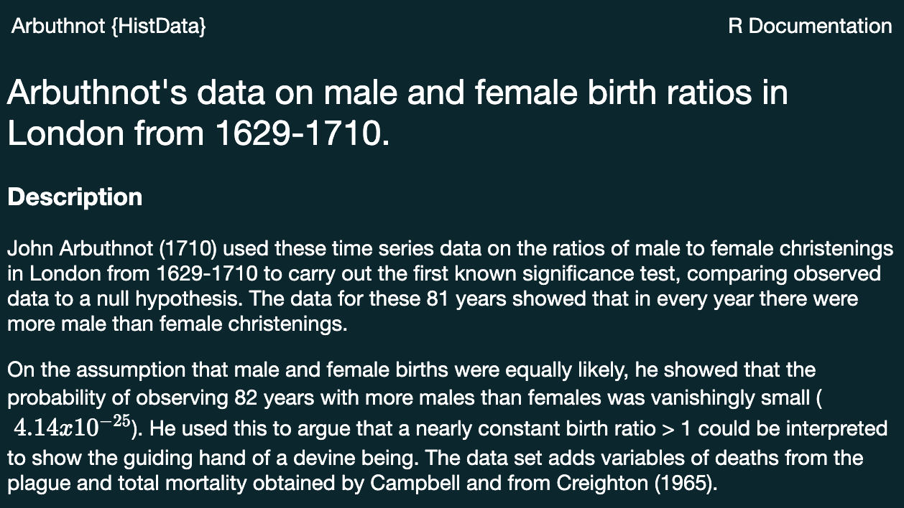
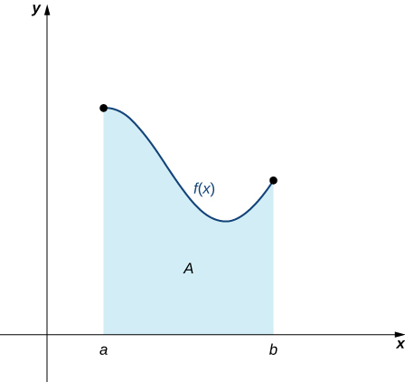
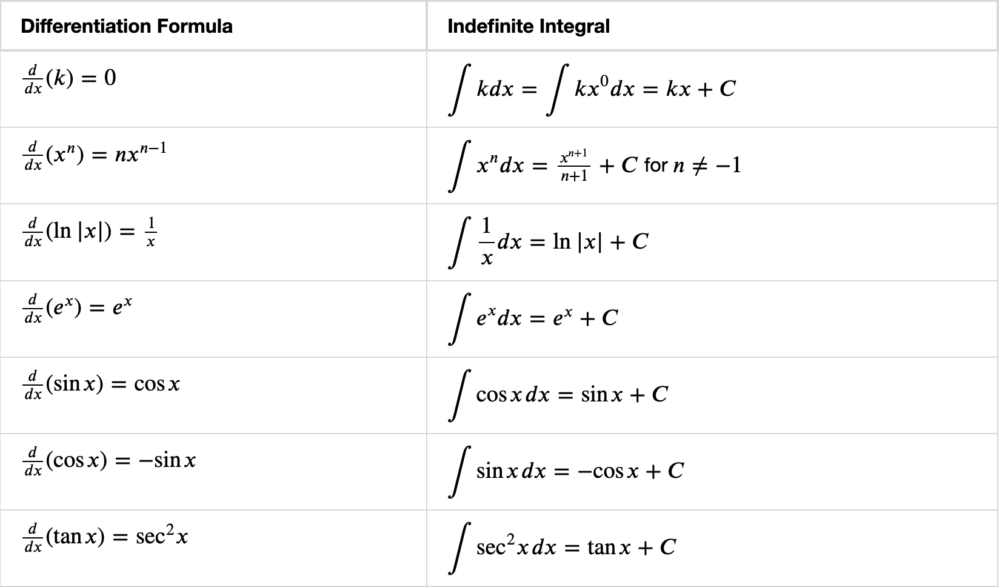
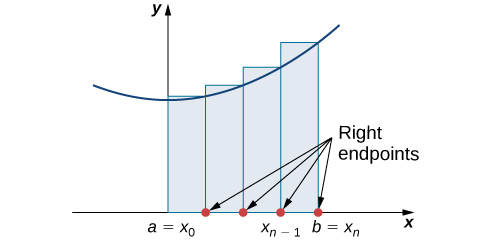
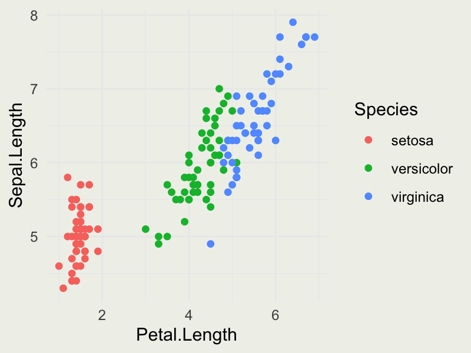
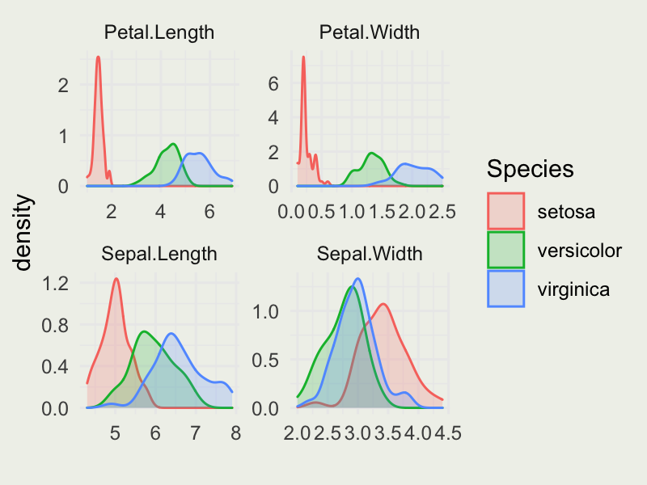

```{r}
#| include: false

library(ggplot2)
library(dplyr)
library(janitor)
#library(MASS)
library(gridExtra)
library(purrr)
reticulate::use_condaenv("miniconda3")

thm <-
  theme_minimal() + theme(
    panel.background = element_rect(fill = "#f0f1eb", color = "#f0f1eb"),
    plot.background = element_rect(fill = "#f0f1eb", color = "#f0f1eb"),
    panel.grid.major = element_blank()
  )
theme_set(thm)

dbinom_theta <- function(theta, N, y) {
  choose(N, y) * theta^y * (1 - theta)^(N - y)
}

dot_plot <- function(x, y) {
  p <- ggplot(data.frame(x, y), aes(x, y))
  p + geom_point(aes(x = x, y = y), size = 0.5) +
    geom_segment(aes(x = x, y = 0, xend = x, yend = y), linewidth = 0.2) +
    xlab(expression(theta)) + ylab(expression(f(theta)))
}

```

## Session 3 Outline

::: incremental
-   Transforming data for plotting
-   Deriving the free-fall equation with antiderivatives
-   Some rules of integration
-   Evaluating integrals numerically
-   The waiting time distribution
:::

$$
\DeclareMathOperator{\E}{\mathbb{E}}
\DeclareMathOperator{\P}{\mathbb{P}}
\DeclareMathOperator{\V}{\mathbb{V}}
\DeclareMathOperator{\L}{\mathscr{L}}
\DeclareMathOperator{\I}{\text{I}}
$$

## Data transformations

::: columns
::: {.column width="60%"}
::: incremental
-   We saw how annual and *continuous compounding* compare at a fixed interest rate
-   How does the asset value vary with the interest rate?
-   We investigate with a common simulate-pivot-plot pattern
:::
:::

::: {.column width="40%"}
{width="330"}
:::
:::

## Map Function {.smaller}

"The `purrr::map*` functions transform their input by applying a function to each element of a list or atomic vector and returning an object of the same length as the input."

::: incremental
-   Generate 10 vectors of 100 uniform random values. The first vector has `min = 1`, the second has `min = 2`, and so on through `min = 10`; all have `max = 15`
-   Then compute the mean of each of the 10 vectors
:::

::: {.fragment}
```{r}
#| echo: true
#| eval: false

library(purrr)

set.seed(2006)
x <- 1:10
samples <- x |>
  map(\(minimum) runif(n = 100, min = minimum, max = 15))

means <- samples |>
  map_dbl(mean)

```
:::

::: incremental
-   Run the code and inspect `samples` and `means`. How do the two objects differ, and what did you expect to see?
:::

## Pivot Functions {.smaller}

`pivot_longer()` “lengthens” data, increasing the number of rows and decreasing the number of columns. The inverse transformation is `pivot_wider()`.

::: {.fragment}
```{r}
#| fig-width: 4.5
#| fig-height: 4.5
#| fig-align: center
#| echo: true

library(tidyr)
head(iris)
iris_long <- iris |> pivot_longer(!Species, names_to = "length_width", values_to = "measure")
head(iris_long)
```
:::

## Data Transformations {.smaller}

::: panel-tabset
### Simulate

::: columns
::: {.column width="50%"}
```{r}
#| fig-width: 4.5
#| fig-height: 4.5
#| fig-align: center
#| echo: true

library(purrr)
library(tidyr)
library(dplyr)
library(ggplot2)

rates <- seq(0.05, 0.20, length = 10)
P <- 100
time <- seq(1, 50, length = 50)

Pe <- function(A, r, t) A * exp(r * t)
d <- time |>
  map(\(x) Pe(A = P, r = rates, t = x))
class(d)
d[[1]][1:4]
names(d) <- as.character(time)
d <- as_tibble(d)
```
:::

::: {.column width="50%"}

::: {.fragment}
```{r}
knitr::kable(d[1:10, 1:3])
```
:::

:::
:::

### Loops and Maps

::: incremental
-   Modern R usage offers many shortcuts, but those may be confusing to beginners.
-   In particular, R loops have mostly been replaced with `map()` functions.
-   We recommend `purrr::map()` functions instead of R's `*apply()`.
:::

::: {.fragment}
```{r}
#| echo: true
#| eval: false

rates <- seq(0.05, 0.20, length = 10)
P <- 100
time <- seq(1, 50, length = 50)

Pe <- function(A, r, t) A * exp(r * t)
time |> map(\(x) Pe(A = P, r = rates, t = x))

# above is a shortcut for
map(time, function(x) Pe(A = P, r = rates, t = x))

# and the above is a shortcut for the following loop
l <- list()
for (i in seq_along(time)) {
  l[[i]] <- Pe(A = P, r = rates, t = time[i])
}

```
:::

### Pivot

::: columns
::: {.column width="50%"}
```{r}
#| echo: true
library(tidyr)
# add rates as a column
d <- d %>% mutate(rate =
            round(rates, 2) |>
              as.character())

# convert from wide format to long
d <- d %>%
  pivot_longer(!rate,
               names_to = "year",
               values_to = "value")

d$year <- as.numeric(d$year)
```

- [Here](https://raw.githubusercontent.com/rstudio/cheatsheets/main/tidyr.pdf) is a cheat sheet explaining `tidyr` functions.
- And [here](https://gist.github.com/ericnovik/9ac7feb95ed89928faf3fa71b45eecdb) is a much shorter version of the exercise.

:::

::: {.column width="50%"}
::: {.fragment}
```{r}
knitr::kable(d[1:10, ])
```
:::
:::
:::

### Plot

::: columns
::: {.column width="50%"}
```{r}
#| fig-width: 4.5
#| fig-height: 4.5
#| fig-align: center
#| echo: true
#| eval: false
p <- ggplot(d, aes(year, value))
p + geom_line(aes(color = rate), linewidth = 0.2) +
  scale_y_continuous(labels =
          scales::dollar_format()) +
  xlab("Time (years)") +
  ylab("Asset value") +
  ggtitle("Growth of $100 at different interest rates")
```

::: {.fragment}
```{r}
#| fig-width: 4.5
#| fig-height: 4
#| fig-align: center
p <- ggplot(d, aes(year, value))
p + geom_line(aes(color = rate), linewidth = 0.2) +
  scale_y_continuous(labels =
          scales::dollar_format()) +
  coord_cartesian(xlim = c(30, 50)) +
  xlab("Time (years)") +
  ylab("Asset value") +
  ggtitle("Growth of $100 at different interest rates")
```
:::
:::

::: {.column width="50%"}
::: {.fragment}
```{r}
#| echo: true
d |>
  filter(year == max(year)) |>
  select(rate, y50 = value) |>
  knitr::kable()
```
:::
:::
:::
:::

::: footer
RStudio [cheat sheets](https://posit.co/resources/cheatsheets/)
:::

## Your Turn {.smaller}

::: panel-tabset

### Data

{fig-align="center" width="672"}

### Instructions

-   Run `install.packages("HistData")`
-   Then run `library(HistData)`
-   Take a look at the Arbuthnot dataset: `?Arbuthnot`

```{r}
library(HistData)
knitr::kable(Arbuthnot[1:6, ])
```

### Output

-   Use these tools to produce a plot that looks something like this
-   Bonus: compute and plot the proportion of christenings that were female, $\text{Females}/(\text{Males}+\text{Females})$

```{r}
#| fig-width: 6
#| fig-height: 4
#| fig-align: center
d <- Arbuthnot %>%
  select(1:3) %>%
  pivot_longer(!Year)

p <- ggplot(d, aes(Year, value))
p + geom_line(aes(color = name)) + xlab("Year") +
  ylab("Number of Christenings") +
  ggtitle("Male and female christenings in London, 1629–1710") +
  scale_y_continuous(labels = scales::comma) +
  theme(legend.title = element_blank())
```
:::

## Integral Calculus {.smaller}

::: columns
::: {.column width="50%"}
::: incremental
-   Integration describes **accumulated change** and plays a central role in statistics
-   For continuous distributions, integrals compute probabilities and expectations
-   Across Bayesian and frequentist statistics, integration is used to normalize densities and marginalize over unknown quantities
-   Derivatives are often used for optimization, including maximum-likelihood and maximum-a-posteriori estimation
:::
:::

::: {.column width="50%"}
{fig-align="center" width="672"}

::: incremental
-   Unknown quantities are often called parameters, such as the local gravitational acceleration $g$ in our Moon-drop model
:::
:::
:::

## Intuition Behind Integration {.smaller}

::: columns
::: {.column width="50%"}
::: incremental
-   A **definite integral** is a continuous analog of summation: it measures accumulated signed change over an interval
-   Geometrically, it is the signed area between a one-dimensional function $f$ and the horizontal axis
-   An **indefinite integral** represents a family of antiderivatives: $\int f(x)\,dx = F(x)+C$ when $F'(x)=f(x)$
-   The Fundamental Theorem of Calculus connects the two: $\int_a^b f(x)\,dx = F(b)-F(a)$
-   Many definite integrals are evaluated numerically, but it helps to understand what the computer is approximating
:::
:::

::: {.column width="50%"}
{fig-align="center" width="672"}
:::
:::

::: footer
Image source: [Calculus Volume 1](https://openstax.org/books/calculus-volume-1/pages/5-1-approximating-areas)
:::


## Some Common Integrals

{fig-align="center"}

::: footer
OpenStax: [Here is a more complete list](https://openstax.org/books/calculus-volume-1/pages/a-table-of-integrals)
:::

## Techniques of Integration {.smaller}

::: incremental
-   Definite integration, like differentiation, is linear:
:::

::: {.fragment}
$$
\begin{aligned}
\int_a^b [f(x)+g(x)]\,dx
  &= \int_a^b f(x)\,dx + \int_a^b g(x)\,dx, \\
\int_a^b c f(x)\,dx
  &= c\int_a^b f(x)\,dx.
\end{aligned}
$$
:::

::: incremental
-   Unlike differentiation, integration has no universal procedure that produces a closed-form antiderivative for every function

-   Many common integrals have closed-form analytical solutions, but many important integrals in statistics do not

-   For well-behaved integrands in one or two dimensions, numerical quadrature is often practical

-   Higher-dimensional problems may use Monte Carlo, importance sampling, quasi-Monte Carlo, or Markov chain Monte Carlo ([MCMC](https://arxiv.org/abs/1701.02434))

-   For simple integrals, we can sometimes find a closed-form solution using substitution or integration by parts
:::


## Playing with Integrals {.smaller}

::: incremental
-   Given our intuition for integrals as signed areas, let's see how to compute them analytically and numerically
-   The numerical techniques shown here work best in low dimensions; high-dimensional integration requires other methods
-   Suppose we want to evaluate the integral $\int_{1}^{3} x \sin(x^2)\,dx$
:::

::: {.fragment}
```{r}
#| fig-width: 6
#| fig-height: 4
#| fig-align: center

f <- function(x) x * sin(x^2)
x <- seq(0, pi, length.out = 100)
p <- ggplot(data.frame(x, y = f(x)), aes(x, y))
p + geom_line() +
  annotate("text", 0.5, 2, label = "y == x %.% sin(x^2)", parse = TRUE) +
  stat_function(fun = f,
                xlim = c(1, 3),
                geom = "area",
                fill = "lightblue")
```
:::


## Constructing a Riemann Sum {.smaller}

{fig-align="center" width="400" height="200"}


::: {.fragment}
```{r}
#| echo: true
riemann <- function(f, lower, upper, n = 100) {
  edges <- seq(lower, upper, length.out = n + 1)
  total <- 0

  for (i in seq_len(n)) {
    width <- edges[i + 1] - edges[i]
    height <- f(edges[i + 1]) # right endpoint
    total <- total + width * height
  }
  return(total)
}
```
:::


::: {.fragment}
Notice that the function takes another function as an argument. Functions that do this are called higher-order functions.
:::

::: footer
Source: [OpenStax Calculus Volume 1](https://openstax.org/books/calculus-volume-1/pages/5-1-approximating-areas)
:::

## Evaluating the Integral

```{r}
#| echo: true

f <- function(x) x * sin(x^2)
x <- seq(0, pi, length.out = 100)

riemann(f, 1, 3, n = 200)

# compute using R's integrate function
integrate(f, 1, 3)

```

## Integrating Analytically {.smaller}

::: incremental
-   Many integrals cannot be evaluated analytically, but we can find an antiderivative of $x\sin(x^2)$
-   Let $u=x^2$. Then $du=2x\,dx$, so $x\,dx=\tfrac{1}{2}du$
:::

::: {.fragment}
$$
\begin{aligned}
\int x\sin(x^2)\,dx
  &= \tfrac{1}{2}\int \sin(u)\,du \\
  &= -\tfrac{1}{2}\cos(u)+C \\
  &= -\tfrac{1}{2}\cos(x^2)+C.
\end{aligned}
$$
:::

## Comparing the Results

::: {.fragment}
-   Using R's `integrate` function:

```{r}
#| echo: true
integrate(f, 1, 3)
```
:::

::: {.fragment}
-   Using the analytical solution

```{r}
#| echo: true
f1 <- function(x) -1/2 * cos(x^2)

f1(3) - f1(1)
```
:::

::: {.fragment}
-   The universe is in balance!
:::

## Analytical Integration on the Computer {.smaller}

::: incremental
-   When in doubt, you can always try [WolframAlpha](https://www.wolframalpha.com/)

-   The Python library [SymPy](https://www.sympy.org/) can evaluate symbolic integrals directly

-   A computer algebra system returns one antiderivative and usually omits the arbitrary constant $+C$
:::

::: {.fragment}
```{python}
#| echo: true
#| cache: false
#| results: asis

import sympy as sp

x = sp.symbols("x", real=True)
f = x**2 / sp.sqrt(x**2 + 4)
antiderivative = sp.integrate(f, x)

equation = sp.Eq(
    sp.Integral(f, x),
    antiderivative,
    evaluate=False,
)

print("$$\n" + sp.latex(equation) + "\n$$")
```
:::

## Your Turn: Waiting Time {.smaller}

-   The **exponential distribution** is commonly used to model waiting times between events that occur at a constant average rate $\lambda>0$
-   Its probability density function (PDF) is

$$
f(x)=
\begin{cases}
\lambda e^{-\lambda x}, & x\ge 0, \\
0, & x<0.
\end{cases}
$$

-   Every PDF must integrate to 1. Verify that

$$
\int_0^\infty \lambda e^{-\lambda x}\,dx = 1.
$$

-   The exponential distribution is **memoryless**: conditional on having already waited $s$, the probability of waiting at least another $t$ does not depend on $s$

$$
\P(X>s+t\mid X>s)=\P(X>t)=e^{-\lambda t}.
$$


## Integration by Parts {.smaller}

::: {.fragment}
The product rule gives a useful integration identity:

$$
\begin{aligned}
(fg)' &= f'g + fg', \\
\int f(x)g'(x)\,dx
  &= f(x)g(x)-\int f'(x)g(x)\,dx, \\
\int u\,dv &= uv-\int v\,du.
\end{aligned}
$$
:::

::: {.fragment}
For example, integration by parts gives the mean waiting time:

$$
\begin{aligned}
\E[X]
  &= \int_0^\infty x\lambda e^{-\lambda x}\,dx \\
  &= \left[-xe^{-\lambda x}\right]_0^\infty
     + \int_0^\infty e^{-\lambda x}\,dx \\
  &= \frac{1}{\lambda}.
\end{aligned}
$$
:::

## Exponential Growth (again) {.smaller}

The exponential-growth function used earlier solves the following differential equation. Assume $y(t)>0$:

::: {.fragment}
$$
\frac{\text{d}[y(t)]}{\text{d}t} = k \cdot y(t)
$$
:::

::: {.fragment}
We can now solve it:

$$
\begin{align*}
\frac{1}{y} \, \text{d}y &= k \, \text{d}t \\
\int \frac{1}{y} \, \text{d}y &= \int k \, \text{d}t \\
\log(y) &= k \cdot t + C \\
y(t) &= A \cdot e^{kt}, \, A = e^C
\end{align*}
$$
:::

## Deriving the Free-Fall Equation {.smaller}

::: incremental
-   Let $x(t)$ be the **downward distance fallen** from the release point, so downward is positive
-   Treat the gravitational acceleration $g$ as constant near the surface
-   The ball has constant mass $m$, and the only force acting on it is gravity, $F=mg$
:::

::: {.fragment}
Newton's second law relates force to the rate of change of momentum:

$$
\begin{aligned}
F
  &= ma \\
  &= \frac{d}{dt}\left(m\frac{d[x(t)]}{dt}\right) = \frac{d}{dt}\left(mv(t)\right)\\
  &= mg.
\end{aligned}
$$

Because $m$ is constant, take it outside the derivative and cancel it from both sides:

$$
m\frac{d^2[x(t)]}{dt^2}=mg
\quad\Longrightarrow\quad
\frac{d^2[x(t)]}{dt^2}=g.
$$
:::

## Deriving the Free-Fall Equation {.smaller}

::: {.fragment}
Integrate twice with respect to $t$:

$$
\begin{aligned}
\int \frac{d^2[x(t)]}{dt^2}\,dt
  &= \int g\,dt, \\
\frac{d[x(t)]}{dt}
  &= gt+C_1, \\[0.6em]
\int \frac{d[x(t)]}{dt}\,dt
  &= \int (gt+C_1)\,dt, \\
x(t)
  &= \tfrac{1}{2}gt^2+C_1t+C_2.
\end{aligned}
$$
:::

::: {.fragment}
The ball is released from rest, and distance is measured from the release point, so

$$
\left.\frac{d[x(t)]}{dt}\right|_{t=0}=0
\Longrightarrow C_1=0,
\qquad
x(0)=0
\Longrightarrow C_2=0.
$$

Therefore,

$$
\boxed{x(t)=\tfrac{1}{2}gt^2}.
$$
:::

## Free Fall on Earth's Moon {.smaller}

::: columns
::: {.column width="58%"}
::: {.fragment}
```{r}
#| fig-width: 5
#| fig-height: 4
#| fig-align: center

g_moon <- 1.625
tower_height <- 100
t_impact <- sqrt(2 * tower_height / g_moon)

time <- seq(0, t_impact, length.out = 200)
moon_drop <- data.frame(
  time = time,
  distance = 0.5 * g_moon * time^2
)

ggplot(moon_drop, aes(time, distance)) +
  geom_line(linewidth = 0.4) +
  geom_hline(yintercept = tower_height, linetype = "dashed", color = "red") +
  geom_point(data = tail(moon_drop, 1), color = "red", size = 2) +
  xlab("time t (s)") +
  ylab("distance fallen x(t) (m)") +
  ggtitle("A 100 m drop on Earth's Moon")
```
:::
:::

::: {.column width="42%"}
::: {.fragment}
Using the accepted value $g_{\text{Moon}}=1.625\ \text{m/s}^2$, the ball reaches the bottom when $x(t)=100$ m:

$$
\begin{aligned}
100 &= \tfrac{1}{2}g_{\text{Moon}}t^2, \\
t_{\text{impact}}
  &= \sqrt{\frac{2(100)}{g_{\text{Moon}}}} \\
  &\approx 11.1\ \text{s}.
\end{aligned}
$$
:::

::: {.fragment}
The free-fall model describes the motion only until impact.
:::
:::
:::

## Homework {.smaller}

-   Take a look at the `iris` dataset (`?iris`)
-   Compute the overall means of `Sepal.Length`, `Sepal.Width`, `Petal.Length`, and `Petal.Width`
-   Compute these means by `Species` (hint: use `group_by()` and `summarise()` from `dplyr`)
-   Produce a plot that looks like this:

{fig-align="center" width="500"}

-   Produce a plot that looks like this (see `geom_density()` and `facet_wrap()`):

{fig-align="center" width="500"}

-   Compute the following integral and show the steps:

$$
\int 2x \cos(x^2)\, dx
$$

-   Evaluate this integral on paper from $0$ to $2\pi$, and use R's `integrate()` function to validate your answer.

```{r}
#| eval: false
library(ggplot2)
library(tidyr)

iris_long <- pivot_longer(iris, !Species)
density_plot <- ggplot(iris_long, aes(x = value)) +
  geom_density(aes(color = Species, fill = Species), alpha = 1/5) +
  facet_wrap(~ name, scales = "free") +
  xlab("")
density_plot

scatter_plot <- ggplot(iris, aes(Petal.Length, Sepal.Length)) +
  geom_point(aes(color = Species))
scatter_plot
```
