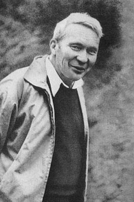
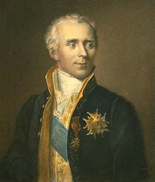
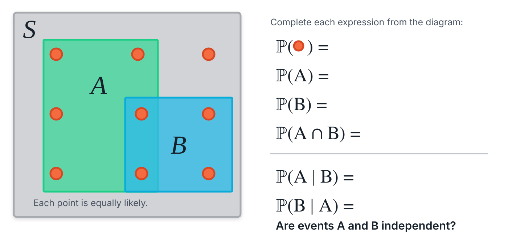
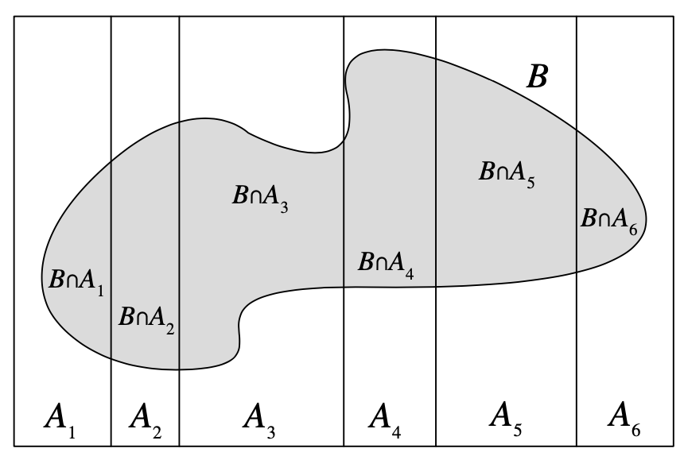
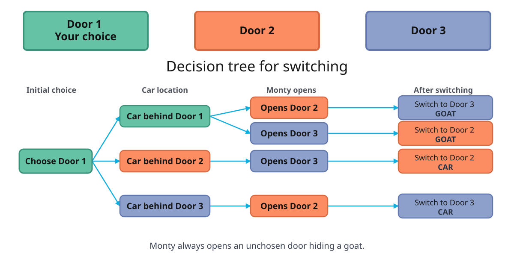
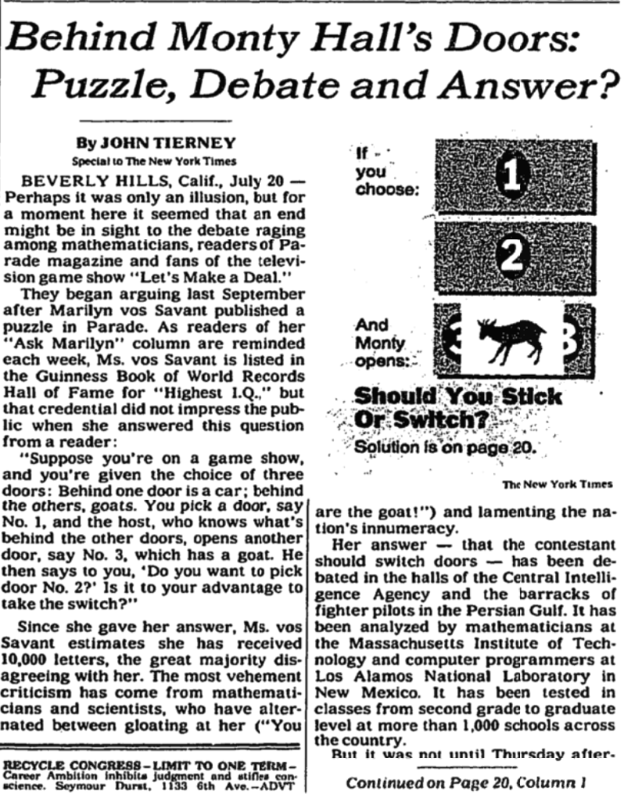
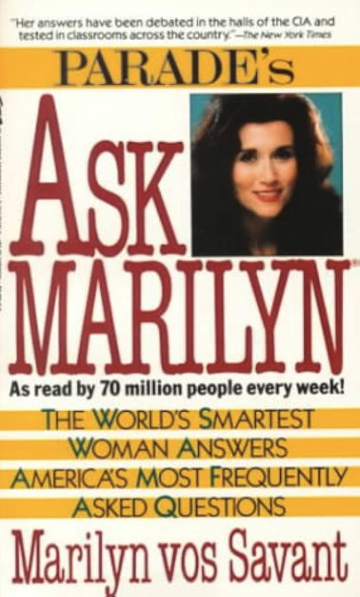

## Session 4 Outline

::: incremental
-   What is probability?
-   How does it relate to statistics?
-   Sample spaces and arithmetic of sets
-   How to count without counting
-   Conditional probability
-   Independence and Bayes' Rule
-   Examples
    -   COVID testing
    -   Birthday problem
    -   Leibniz's error
    -   Monty Hall

:::

```{r}
#| include: false

library(ggplot2)
library(dplyr)
library(janitor)
#library(MASS)
library(gridExtra)
library(purrr)

thm <-
  theme_minimal() + theme(
    panel.background = element_rect(fill = "#f0f1eb", color = "#f0f1eb"),
    plot.background = element_rect(fill = "#f0f1eb", color = "#f0f1eb"),
    panel.grid.major = element_blank()
  )
theme_set(thm)

dbinom_theta <- function(theta, N, y) {
  choose(N, y) * theta^y * (1 - theta)^(N - y)
}

dot_plot <- function(x, y) {
  p <- ggplot(data.frame(x, y), aes(x, y))
  p + geom_point(aes(x = x, y = y), size = 0.5) +
    geom_segment(aes(x = x, y = 0, xend = x, yend = y), linewidth = 0.2) +
    xlab(expression(theta)) + ylab(expression(f(theta)))
}

```


## What Is Probability?

::: columns
::: {.column width="60%"}
::: incremental
-   Statistics is the art of quantifying uncertainty, and probability is the language of statistics
-   Probability is a mathematical object
-   People argue over the interpretation of probability
-   People don't argue about the mathematical definition of probability
:::
:::

::: {.column width="40%"}
{fig-align="left"}

Andrei Kolmogorov (1903–1987)
:::
:::

$$
\DeclareMathOperator{\E}{\mathbb{E}}
\DeclareMathOperator{\P}{\mathbb{P}}
\DeclareMathOperator{\V}{\mathbb{V}}
\DeclareMathOperator{\L}{\mathscr{L}}
\DeclareMathOperator{\I}{\text{I}}
\newcommand{\indep}{\perp\!\!\!\perp}
$$

## Laplace's Demon {.smaller}

::: columns
::: {.column width="50%"}
> We may regard the present state of the universe as the effect of its past and the cause of its future. An intellect which at any given moment knew all of the forces that animate nature and the mutual positions of the beings that compose it, if this intellect were vast enough to submit the data to analysis, could condense into a single formula the movement of the greatest bodies of the universe and that of the lightest atom; for such an intellect nothing could be uncertain, and the future just like the past would be present before its eyes.
:::

::: {.column width="50%"}
{fig-align="center"}

Pierre-Simon Laplace, Marquis de Laplace (1749–1827)

"Uncertainty is a function of our ignorance, not a property of the world"
:::
:::

## Sample Spaces

::: incremental
-   A sample space, denoted $S$, is the set of all possible outcomes $s$ of an experiment

-   If we flip a coin twice, our sample space has $4$ elements: $\{TT, TH, HT, HH\}$.

-   An event $A$ is a subset of a sample space. We say that $A \subseteq S$

-   Possible events include: (1) at least one $T$; (2) $H$ on the first flip; (3) $T$ on both flips; and (4) neither $H$ nor $T$ on either flip—the impossible event $\emptyset$
:::

## Sample Spaces and De Morgan's Laws {.smaller}

::: incremental
-   The **complement** of an event $A$ is denoted $A^c$. Formally, $A^c = \{s \in S : s \notin A\}$

-   Suppose $S = \{1, 2, 3, 4\}$, $A = \{1, 2\}$, $B = \{2, 3\}$, and $C = \{3, 4\}$

-   Then $A \cup B = \{1, 2, 3\}$, $A \cap B = \{2\}$, $A^c = \{3, 4\}$, $B^c = \{1, 4\}$, and $A \cap C = \emptyset$

-   De Morgan's laws state that:
    - $(A \cup B)^c = A^c \cap B^c$ and
    - $(A \cap B)^c = A^c \cup B^c$

-   In our case, $(A \cup B)^c = (\{1, 2, 3\})^c = \{4\} = (\{3, 4\} \cap \{1, 4\})$

- **Your Turn**: Compute $(A \cap B)^c = A^c \cup B^c$
:::

## Naive Definition

::: incremental
-   The naive definition of probability assumes that every outcome in a finite sample space is equally likely
-   In that case, $\P(A) = \frac{|A|}{|S|}$, the number of outcomes in $A$ divided by the total number of outcomes
- What is the probability of rolling an even number on a six-sided die?
  - $\P(\text{Even Number}) = \frac{3}{6} = \frac{1}{2}$
- What is the probability of rolling a prime number?
  - $\P(\text{Prime Number}) =$

:::

## Counting {.smaller}

::: incremental

- Your mom feels probabilistic, so she asks you to flip a coin. If it lands heads, you get pizza for dinner, and if it lands tails, you get broccoli. You flip again for dessert. If it lands heads, you get ice cream, and if it lands tails, you get a cricket cookie. Assume you are not a fan of veggies and insects. What is the probability of having a completely disappointing meal? What is the probability of being partly disappointed?

- From Blitzstein and Chen (2015): Suppose that 10 people are running a race. Assume that ties are not possible and that all 10 will complete the race, so there will be well-defined first place, second place, and third place winners. How many possibilities are there for the first, second, and third place winners?

:::

## Basic Counting {.smaller}

::: incremental

-   **Permutations of $n$ objects:** arrange all $n$ distinct objects in order; there are $n!$ arrangements. For $S=\{A,B,C\}$, the resulting set is
    $$
    \{ABC, ACB, BAC, BCA, CAB, CBA\}.
    $$

-   **Sampling with replacement, where order matters:** choose from $n$ objects $k$ times, replacing the selected object each time; there are $n^k$ sequences. For $S=\{A,B,C\}$ and $k=2$, the resulting set contains $3^2=9$ sequences:
    $$
    \{AA, AB, AC, BA, BB, BC, CA, CB, CC\}.
    $$

-   **Sampling without replacement, where order matters:** choose from $n$ objects $k$ times without returning selected objects; there are $n!/(n-k)!$ sequences. For $S=\{A,B,C\}$ and $k=2$, the resulting set is
    $$
    \{AB, AC, BA, BC, CA, CB\}.
    $$

:::

## Binomial Coefficient {.smaller}

::: panel-tabset
### Derivation

::: {.fragment}
To choose an **unordered** $k$-element subset, first count ordered selections. Filling $k$ positions gives $n$ choices, then $n-1$, and so on—the first $k$ factors of $n!$:

$$
\begin{aligned}
n!
&=\underbrace{n(n-1)\cdots(n-k+1)}_{\text{first }k\text{ factors}}
  \underbrace{(n-k)(n-k-1)\cdots2\cdot1}_{\text{tail }=(n-k)!}, \\
\frac{n!}{(n-k)!}
&=n(n-1)\cdots(n-k+1).
\end{aligned}
$$

Dividing by $(n-k)!$ removes the unused tail.
:::

::: {.fragment}
The ordered count includes every unordered subset $k!$ times, so divide once more:

$$
\boxed{\binom{n}{k}=\frac{n!}{k!(n-k)!}}.
$$
:::

### Why $k!$?

::: {.fragment}
A fixed set of $k$ objects can be ordered in $k!$ ways: there are $k$ choices for the first position, $k-1$ for the second, and so on, giving

$$
k(k-1)\cdots2\cdot1=k!.
$$
:::

::: {.fragment}
For $k=3$, the one subset $\{A,B,C\}$ is counted as

$$
\begin{array}{ccc}
ABC & ACB & BAC \\
BCA & CAB & CBA
\end{array}
$$

All six strings contain exactly the same objects, so they represent one unordered subset counted $3!=6$ times.
:::

::: {.fragment}
In general, dividing the ordered count by $k!$ leaves each unordered subset counted exactly once.
:::

### Pascal's Triangle

Each entry in row $n$ and column $k$ is $\binom{n}{k}$:

::: columns
::: {.column width="50%"}
**Indexed table**

$$
\begin{array}{c|ccccc}
n\backslash k & 0 & 1 & 2 & 3 & 4 \\ \hline
0 & 1 &   &   &   &   \\
1 & 1 & 1 &   &   &   \\
2 & 1 & 2 & 1 &   &   \\
3 & 1 & 3 & 3 & 1 &   \\
4 & 1 & 4 & 6 & 4 & 1
\end{array}
$$
:::

::: {.column width="50%"}
**Complete triangle**

$$
\begin{array}{ccccccccc}
  &   &   &   & 1 &   &   &   &   \\
  &   &   & 1 &   & 1 &   &   &   \\
  &   & 1 &   & 2 &   & 1 &   &   \\
  & 1 &   & 3 &   & 3 &   & 1 &   \\
1 &   & 4 &   & 6 &   & 4 &   & 1
\end{array}
$$
:::
:::

::: {.fragment}
Every interior number is the sum of the two numbers above it; for example, $\binom{4}{2}=\binom{3}{1}+\binom{3}{2}=3+3=6$.
:::

### Pascal's Rule

::: {.fragment}
Choose one distinguished object. A $k$-element subset either:

-   contains it, leaving $k-1$ objects to choose from the other $n-1$, or
-   excludes it, leaving all $k$ objects to choose from the other $n-1$
:::

::: {.fragment}
These two cases are disjoint and include every $k$-element subset, so

$$
\boxed{\binom{n}{k}=\binom{n-1}{k-1}+\binom{n-1}{k}}.
$$

This identity generates Pascal's triangle row by row.
:::

### Examples

::: {.fragment}
The two-person subsets of $S=\{A,B,C,D,E\}$ are

$$
\{AB,AC,AD,AE,BC,BD,BE,CD,CE,DE\},
$$

so $\binom{5}{2}=10$.
:::

::: incremental
-   Choosing the $k$ included objects is equivalent to choosing the $n-k$ excluded objects, so $\binom{n}{k}=\binom{n}{n-k}$
-   A standard deck has $\binom{52}{5}$ distinct five-card hands
-   What is the probability of the full house in poker? One pair? Two pair?
:::
:::

## Birthday Problem {.smaller}

::: panel-tabset
### Problem Description

There are $j$ people in a room. Assume each person's birthday is equally likely to be any of the 365 days of the year (excluding February 29) and that people's birthdays are independent. What is the probability that at least one pair of group members has the same birthday?

### Simulation

```{r}
#| echo: true
#| cache: true
#| eval: false

set.seed(2006)
n <- 1e4
n_people <- 80
j <- 2:n_people
days <- 1:365

find_match <- function(x, d) {
  y <- sample(d, x, replace = TRUE)
  match_found <- length(unique(y)) < length(y)
}

prop <- numeric(n_people - 1)
for (i in seq_along(j)) {
  matches <- replicate(n, find_match(j[i], days))
  prop[i] <- mean(matches)
}
```

### Plot

```{r}
#| fig-width: 6
#| fig-height: 5
#| fig-align: center

n_people <- 80
j <- 2:n_people
prop <- vapply(
  j,
  \(group_size) 1 - prod((365 - seq_len(group_size) + 1) / 365),
  numeric(1)
)

p <- ggplot(data.frame(j, prop), aes(j, prop))
p + geom_line(linewidth = 0.3) +
  geom_vline(xintercept = 23, linewidth = 0.3, color = "red", linetype = "dotted") +
  geom_hline(yintercept = 0.5, linewidth = 0.3, color = "red", linetype = "dotted") +
  xlab("Number of people") +
  ylab("Probability of at least one match") +
  ggtitle("Probability that at least two people share a birthday")
```

:::

## Birthday Analysis {.smaller}

::: incremental
-   For $j$ people, there are $365^j$ possible birthday assignments under the independence assumption

-   It is easier to count assignments with no match. For $j$ people, the count is $365\cdot364\cdots(365-j+1)$
:::

::: {.fragment}

$$
\begin{aligned}
\P(\text{at least one match})
  &= 1-\P(\text{no match}) \\
  &= 1-\frac{\prod_{i=0}^{j-1}(365-i)}{365^j} \\
  &= 1-\frac{365\cdot364\cdot363\cdots(365-j+1)}{365^j}.
\end{aligned}
$$

:::

::: incremental
-   Pairs are shown as (number of people, probability of at least one match):
:::

::: {.fragment}
```{r}
#| echo: false
max_people <- 23
Pr_match <- numeric(max_people - 1)
for (j in 2:max_people) {
  numerator <- prod(seq(365, 365 - j + 1))
  Pr_match[j - 1] <- round(1 - (numerator / 365^j), 2)
}
result <- paste("(", 2:max_people, ", ", Pr_match, ")", sep = "")
cat(result, sep = "; ")
```
:::


## Probability {.smaller}

-   Probability $\P$ assigns a real number to each event $A$ and satisfies the following axioms:

::: {.fragment}
$$
\begin{aligned}
\P(A) &\ge 0 \quad \text{for every event } A, \\
\P(S) &= 1, \\
A_i\cap A_j=\emptyset \text{ for every } i\ne j
&\quad\Longrightarrow\quad
\P\!\left(\bigcup_{i=1}^{\infty}A_i\right)
=\sum_{i=1}^{\infty}\P(A_i).
\end{aligned}
$$
:::

::: incremental
-   For $S=\{1,2,3,4\}$, suppose $\P(\{s\})=1/4$ for every $s\in S$. Let $A_1=\{1\}$, $A_2=\{2\}$, and $A=A_1\cup A_2=\{1,2\}$. Verify the axioms for these events.
:::


## Some Consequences

::: {.fragment}
$$
\begin{aligned}
\P(\emptyset) &= 0, \\
A\subseteq B &\Longrightarrow \P(A)\le \P(B), \\
\P(A^c) &= 1-\P(A), \\
A\cap B=\emptyset &\Longrightarrow \P(A\cup B)=\P(A)+\P(B), \\
\P(A\cup B) &= \P(A)+\P(B)-\P(A\cap B).
\end{aligned}
$$
:::

::: incremental
-   The final identity is the inclusion-exclusion principle
-   Two events $A$ and $B$ are independent, denoted $A\indep B$, if $\P(A \cap B) = \P(A) \P(B)$
:::

## Some Examples

::: panel-tabset
### Simulation

You flip a fair coin four times. What is the probability that you get one or more heads?

::: {.fragment}
```{r}
#| echo: true
#| cache: true
one_or_more <- function() {
  flips <- sample(c(1, 0), size = 4, replace = TRUE)
  if (sum(flips) >= 1) {
    return(TRUE)
  } else {
    return(FALSE)
  }
}
# simulate 10,000 four-flip experiments
x <- replicate(1e4, one_or_more())
mean(x)
```
:::

### Analysis

Let $A$ be the event of obtaining at least one head. Then $A^c$ is the event of obtaining all tails. Let $B_i$ be the event of obtaining tails on the $i$th trial.

::: {.fragment}
$$
\begin{eqnarray}
\P(A)  = 1 - \P(A^c) & = & \\
1 - \P(B_1 \cap B_2 \cap B_3 \cap B_4) & = & \\
1 - \P(B_1)\P(B_2)\P(B_3)\P(B_4) & = & \\
1 - \left( \frac{1}{2} \right)^4 =  1 - \frac{1}{16} = 0.9375
\end{eqnarray}
$$
:::

### Your Turn

-   Modify the function so that, instead of computing one or more heads in four trials, it computes one or more heads in $n$ trials

-   Modify it to compute $x$ or more heads in $n$ trials, and simulate the probability of at least two heads in five trials

-   Can you solve it analytically to validate your simulation results?
:::

## Conditional Probability {.smaller}

> Conditioning is the soul of statistics --- Joe Blitzstein

::: incremental
-   Think of conditioning as computing probability on a reduced sample space: when we condition on an event, we restrict attention to the part of $S$ where that event occurred

-   Note: In some texts, $AB$ is used as a shortcut for $A \cap B$. You can't multiply events, but you can multiply their probabilities.
:::

::: {.fragment}
$$
\P(A\mid B) = \frac{\P(A\cap B)}{\P(B)}, \qquad \P(B)>0
$$
:::

::: incremental
-   Note that $\P(A\mid B)$ and $\P(B\mid A)$ are different quantities and are often confused

-   When $\P(B)>0$, events $A$ and $B$ are independent if and only if $\P(A\mid B)=\P(A)$. In other words, learning $B$ does not change the probability of $A$
:::

## Conditional Probability: Your Turn

{fig-alt="Exercise diagram with nine equally likely points in sample space S, event A containing six points, event B containing four points, blank probability expressions, and a question asking whether A and B are independent" fig-align="center" width="100%"}

## Law of Total Probability and Bayes' Rule {.smaller}

::: panel-tabset
### LOTP
In the following, $A_1,\ldots,A_n$ form a partition of the sample space $S$:

$$
\P(B)=\sum_{i=1}^{n}\P(B\mid A_i)\P(A_i).
$$

{fig-align="center" width="400"}

### Bayes' Rule

::: incremental
-   We take the definition of conditional probability and expand the numerator and denominator:
:::

::: {.fragment}
$$
\P(A\mid B)
=\frac{\P(B\mid A)\P(A)}{\sum_{i=1}^{n}\P(B\mid A_i)\P(A_i)},
\qquad \P(B)>0
$$
:::

::: incremental
-   We call $\P(A)$ the prior probability of $A$ and $\P(A\mid B)$ its posterior probability after observing $B$
:::
:::

::: footer
Image source: *Introduction to Probability*, Blitzstein and Hwang.
:::

## Example: Medical Testing {.smaller}

::: panel-tabset
### Derivation

> [The authors calculated](https://www.idsociety.org/covid-19-real-time-learning-network/diagnostics/rapid-testing/#:~:text=The%20authors%20calculated%20the%20sensitivity,negative%20predictive%20value%20was%2097.3%25.) the sensitivity and specificity of the Abbott PanBio SARS-CoV-2 rapid antigen test to be 45.4% and 99.8%, respectively. Suppose the prevalence is 0.1%.

::: incremental
-   Your child tests positive. What is the probability that she has COVID? That is, we want $\P(D^+\mid T^+)$
-   $\text{Specificity}:=\P(T^-\mid D^-)=0.998$
-   False-positive rate $\text{FP}:=1-\text{specificity}=\P(T^+\mid D^-)=0.002$
-   $\text{Sensitivity}:=\P(T^+\mid D^+)=0.454$
-   False-negative rate $\text{FN}:=1-\text{sensitivity}=\P(T^-\mid D^+)=0.546$
-   Prevalence: $\P(D^+)=0.001$
:::

::: {.fragment}
$$
\begin{aligned}
\P(D^+\mid T^+)
&=\frac{\P(T^+\mid D^+)\P(D^+)}{\P(T^+)} \\
&=\frac{\P(T^+\mid D^+)\P(D^+)}
{\P(T^+\mid D^+)\P(D^+)+\P(T^+\mid D^-)\P(D^-)} \\
&=\frac{0.454\cdot0.001}{0.454\cdot0.001+0.002\cdot0.999} \\
&\approx 0.185.
\end{aligned}
$$
:::

### Discussion

-   The answer, about 18.5%, is very sensitive to disease prevalence—our prior probability of infection
-   At the time of the test, prevalence was estimated at 4.8%, not 0.1%, which would substantially change the answer: $\P(D^+\mid T^+)\approx0.92$
-   Lesson: do not rely on intuition alone; check the prior probability
:::

## Example: Leibniz's Error

-   You have two fair six-sided dice. You roll both and compute their sum. Which sum is more likely: 11 or 12?

## Example: Monty Hall

{fig-alt="Monty Hall decision tree showing the result of switching for each possible car location" fig-align="center" width="100%"}

## The Monty Hall Debate

::: columns
::: {.column width="55%"}
{fig-alt="New York Times article titled Behind Monty Hall's Doors: Puzzle, Debate and Answer?" fig-align="center" height="520"}
:::

::: {.column width="45%"}
{fig-alt="Cover of Parade's Ask Marilyn by Marilyn vos Savant" fig-align="center" height="520"}
:::
:::

## Homework {.smaller}

::: incremental
1.  **Conditional probability—course enrollment.** Among 200 students, 120 take statistics, 80 take calculus, and 50 take both. For a randomly selected student, compute $\P(\text{statistics}\mid\text{calculus})$ and $\P(\text{calculus}\mid\text{statistics})$. Explain why the two probabilities differ.

2.  **Conditional probability—dice.** Roll two fair six-sided dice. Given that their sum is 8, what is the probability that at least one die shows 5? List the reduced sample space before calculating the probability. Verify with a simulation. Hint: in R, `if (a || b)`, means either `a` is true or `b` is true.

3.  **Bayes' rule—fraud screening.** An insurer estimates that 2% of submitted claims are fraudulent. A screening system flags 92% of fraudulent claims and 6% of legitimate claims. If a claim is flagged, what is the probability that it is fraudulent? Define the events and show the Bayes' rule calculation.

4.  **R simulation—Monty Hall.** Write an R simulation of at least 10,000 games to check that always switching wins the car with probability $2/3$. In each game, randomly place the car and choose an initial door; have Monty randomly open an unchosen goat door; then switch to the only other closed door. Report the simulated proportion of wins.
:::
