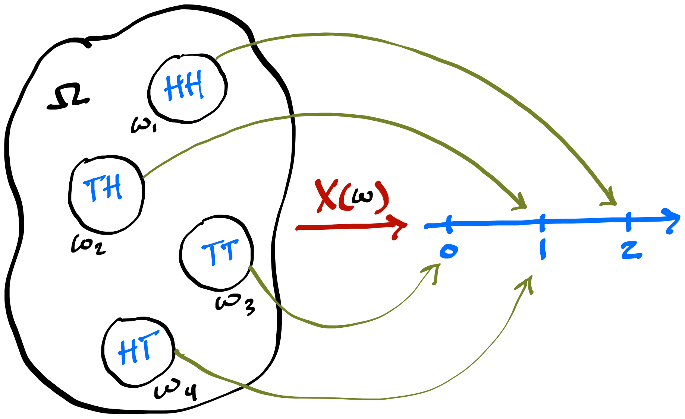
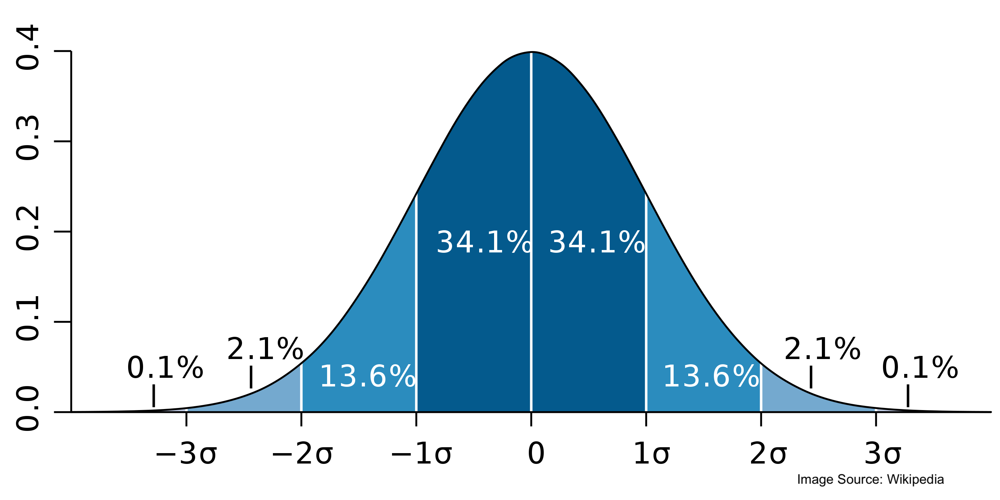

## Session 5 Outline {.smaller}

::: incremental
-   Random variables
-   Bernoulli, binomial, and geometric distributions
-   PMFs, PDFs, and CDFs
-   LOTUS
-   Poisson distribution
-   Expectation and variance
-   St. Petersburg paradox
-   Normal distribution

:::

```{r}
#| include: false

library(ggplot2)
library(MASS)
library(patchwork)

thm <-
  theme_minimal() + theme(
    panel.background = element_rect(fill = "#f0f1eb", color = "#f0f1eb"),
    plot.background = element_rect(fill = "#f0f1eb", color = "#f0f1eb"),
    panel.grid.major = element_blank()
  )
theme_set(thm)

dbinom_theta <- function(theta, N, y) {
  choose(N, y) * theta^y * (1 - theta)^(N - y)
}

dot_plot <- function(x, y) {
  p <- ggplot(data.frame(x, y), aes(x, y))
  p + geom_point(aes(x = x, y = y), size = 0.5) +
    geom_segment(aes(x = x, y = 0, xend = x, yend = y), linewidth = 0.2) +
    xlab(expression(theta)) + ylab(expression(f(theta)))
}

```

$$
\DeclareMathOperator{\E}{\mathbb{E}}
\DeclareMathOperator{\P}{\mathbb{P}}
\DeclareMathOperator{\V}{\mathbb{V}}
\DeclareMathOperator{\L}{\mathscr{L}}
\DeclareMathOperator{\I}{\text{I}}
$$

## Random Variables Are Not Random {.smaller}

::: panel-tabset
### Story

::: incremental
-   It would be inconvenient to enumerate all possible events to describe a stochastic system

-   A random variable is a measurable function $X:S\to\mathbb{R}$ that maps the sample space $S$ into the real line

-   For each possible outcome $s\in S$, the random variable assigns the value $X(s)$

-   This mapping is deterministic. The randomness comes from the experiment, not from the random variable (RV)

-   While $\P(A)$ is defined for an event $A$, $\P(X)$ is not meaningful. The event $\{s\in S:X(s)=x\}$ is abbreviated as $\{X=x\}$, so we write $\P(X=x)$

-   Let $X$ be the number of heads in two coin flips. If the outcome is $s=HH$, then $X(s)=2$, while $S=\{TT,TH,HT,HH\}$
:::

### Picture

-   Random variable $X$ for the number of heads in two flips

{fig-align="center" width="680"}
:::

## Characterizing Random Variables {.smaller}

::: panel-tabset
### CDF

::: incremental
-   Every random variable has a cumulative distribution function (CDF). Discrete RVs have probability mass functions (PMFs), while the continuous RVs considered here have probability density functions (PDFs)
-   The CDF $F_X(x)$ is a function of $x$ bounded between 0 and 1:
:::

::: {.fragment}
$$
F_X(x)=\P(X\le x)
$$
:::

### PMF

::: {.fragment}
-   The PMF $p_X(x)$ of a discrete RV gives its point probabilities

$$
p_X(x)=\P(X=x)
$$
:::

::: {.fragment}
-   We obtain $F_X$ from $p_X$ by summing over all support points at or below $x$. For example,

$$
F_X(4)=\P(X\le4)
=\sum_{\substack{t\in\operatorname{supp}(X)\\t\le4}}p_X(t).
$$
:::

### R Conventions

::: incremental

-   In R, PMFs and PDFs start with `d`. For example, `dbinom()` evaluates the binomial PMF and `dnorm()` evaluates the normal PDF

-   CDFs start with `p`; examples include `pbinom()` and `pnorm()`

-   Quantile functions are generalized inverses of CDFs. In R they start with `q`; for example, `qbinom()`

-   Random number generators start with `r`; an example is `rbinom()`

-   A binomial RV, defined below, represents the number of successes in $N$ trials. In R, its PMF is `dbinom()` and its CDF is `pbinom()`

-   Here is the full function signature: `dbinom(x, size, prob, log = FALSE)`

    -   `x` is the number of successes, `size` is the number of trials $N$, `prob` is the success probability $\theta$, and `log` requests probabilities on the log scale

:::

:::

## Binomial RV {.smaller}

::: panel-tabset
### Binomial PMF

::: incremental
-   A Bernoulli RV represents one trial with a fixed probability of success, such as obtaining heads

-   If $X\sim\operatorname{Bernoulli}(\theta)$ with $0\le\theta\le1$, its support is $\{0,1\}$

-   If $X_1,\ldots,X_N$ are independent Bernoulli RVs with the same success probability $\theta$, then $X=\sum_{i=1}^{N}X_i\sim\operatorname{Binomial}(N,\theta)$
:::

::: {.fragment}
$$
p_X(x)=\left\{
\begin{array}{ll}
\theta & \text{if }x=1,\\
1-\theta & \text{if }x=0.
\end{array}
\right.
$$
:::

::: {.fragment}
-   The binomial PMF for $X\sim\operatorname{Binomial}(N,\theta)$ is

$$
p_X(x)=\binom{N}{x}\theta^x(1-\theta)^{N-x},
\qquad x\in\{0,1,\ldots,N\}.
$$
:::

### PMF and CDF Plots

$X\sim\operatorname{Binomial}(N=4,\theta=1/2)$

::: {.fragment}
```{r}
#| fig-align: center
#| fig-width: 9
#| fig-height: 4

N <- 4

# compute and plot the PMF
pmf <- dbinom(x = 0:N, size = N, prob = 1/2)
d <- data.frame(x = 0:N, pmf)
p1 <- ggplot(d, aes(x, pmf))
p1 <- p1 + geom_col(width = 0.2) +
  geom_text(aes(label = fractions(pmf)), nudge_y = 0.02) +
  ylab("P(X = x)") + xlab("x = Number of heads") +
  ggtitle("X ~ Binomial(4, 1/2)",
          subtitle = expression(PMF: p[X](x) == P(X == x)))

# compute and plot the CDF
x <- seq(-0.5, 4.5, length.out = 500)
cdf <- pbinom(q = x, size = N, prob = 1/2)
d <- data.frame(x, cdf)
dd <- data.frame(x = seq(-0.5, 4.5, by = 1), cdf = unique(cdf), x_empty = 0:5)
closed <- data.frame(x = 0:N, cdf = pbinom(0:N, size = N, prob = 1/2))
p2 <- ggplot(d, aes(x, cdf))
p2 <- p2 + geom_point(size = 0.2) +
  geom_text(aes(x, cdf, label = fractions(cdf)), data = dd, nudge_y = 0.05) +
  geom_point(aes(x_empty, cdf), data = dd[-6, ], size = 2, color = "white") +
  geom_point(aes(x_empty, cdf), data = dd[-6, ], size = 2, shape = 1) +
  geom_point(aes(x, cdf), data = closed, size = 2) +
  ggtitle("X ~ Binomial(4, 1/2)",
          subtitle = expression(CDF: F[X](x) == P(X <= x))) +
  ylab(expression(P(X <= x))) + xlab("x = Number of heads")

p1 + p2
```
:::

### Code to Generate the Plots

```{r}
#| echo: true
#| eval: false
library(patchwork)
library(MASS)

N <- 4 # Number of trials; x is the number of successes

# compute and plot the PMF
pmf <- dbinom(x = 0:N, size = N, prob = 1/2)
d <- data.frame(x = 0:N, pmf)
p1 <- ggplot(d, aes(x, pmf))
p1 <- p1 + geom_col(width = 0.2) +
  geom_text(aes(label = fractions(pmf)), nudge_y = 0.02) +
  ylab("P(X = x)") + xlab("x = Number of heads") +
  ggtitle("X ~ Binomial(4, 1/2)",
          subtitle = expression(PMF: p[X](x) == P(X == x)))

# compute and plot the CDF
x <- seq(-0.5, 4.5, length.out = 500)
cdf <- pbinom(q = x, size = N, prob = 1/2)
d <- data.frame(x, cdf)
dd <- data.frame(x = seq(-0.5, 4.5, by = 1), cdf = unique(cdf), x_empty = 0:5)
closed <- data.frame(x = 0:N, cdf = pbinom(0:N, size = N, prob = 1/2))
p2 <- ggplot(d, aes(x, cdf))
p2 <- p2 + geom_point(size = 0.2) +
  geom_text(aes(x, cdf, label = fractions(cdf)), data = dd, nudge_y = 0.05) +
  geom_point(aes(x_empty, cdf), data = dd[-6, ], size = 2, color = "white") +
  geom_point(aes(x_empty, cdf), data = dd[-6, ], size = 2, shape = 1) +
  geom_point(aes(x, cdf), data = closed, size = 2) +
  ggtitle("X ~ Binomial(4, 1/2)",
          subtitle = expression(CDF: F[X](x) == P(X <= x))) +
  ylab(expression(P(X <= x))) + xlab("x = Number of heads")

p1 + p2
```
:::

## Binomial in R {.smaller}

::: panel-tabset
### PMF

```{r}
#| echo: true

# What is the probability of getting 2 heads in 5 flips of a fair coin?
N <- 5
x <- 2
dbinom(x = x, size = N, prob = 0.5) |> fractions()

# Evaluate the PMF over values inside and outside its support
x <- -2:7
dbinom(x = x, size = N, prob = 0.5) |> fractions()

# Verify that the PMF sums to 1
sum(dbinom(x = x, size = N, prob = 0.5))
```

### CDF

```{r}
#| echo: true

N <- 5
x <- -2:7

# What is the probability of 3 heads or fewer?
pbinom(q = 3, size = N, prob = 0.5) |> fractions()

# Evaluate the CDF over x
pbinom(q = x, size = N, prob = 0.5) |> fractions()

# Recover the CDF by cumulatively summing the PMF
dbinom(x = x, size = N, prob = 0.5) |> cumsum() |> fractions()
```

### Your Turn

Suppose the probability of success is $1/3$ and $N=10$. What is the probability of 6 or more successes? Compute it from the PMF first, then verify it with the CDF.
:::

## Geometric RV {.smaller}

::: panel-tabset
### Definition

::: incremental
-   The geometric distribution is a discrete waiting-time distribution; the exponential distribution is its continuous analog
-   Let $X$ be the number of failures before the first success. Then $X\sim\operatorname{Geometric}(\theta)$, where $0<\theta\le1$ is the probability of success on each independent trial
-   Example: We flip a fair coin until the first head appears
    -   If the sequence is T T T T H, then $X=4$
    -   The probability of this sequence is $(1/2)^4(1/2)=1/32$
-   The PMF is $\P(X=x)=(1-\theta)^x\theta$ for $x=0,1,2,\ldots$
:::

### Check

-   To check if this is a valid PMF, we need to sum over all $x$:

::: {.fragment}
$$
\begin{align}
\sum_{x = 0}^{\infty} \theta (1 - \theta)^x  =
\theta \sum_{x = 0}^{\infty} (1 - \theta)^x \\
\text{Let } u = 1 - \theta \\
\theta \sum_{x = 0}^{\infty} u^x = \theta \frac{1}{1-u} = \theta \frac{1}{1-1 + \theta} = \frac{\theta}{\theta} = 1
\end{align}
$$
:::

::: {.fragment}
-   The final step uses the geometric-series formula for $|u|<1$
:::

### Examples

-   For the sequence T T T H, $x=3$ failures. When $\theta=1/2$, its probability is $(1/2)^4=1/16$

::: {.fragment}
```{r}
#| echo: true

x <- 3
theta <- 1/2
dgeom(x = x, prob = theta) |> fractions()
```
:::

::: {.fragment}
-   If $\theta=1/3$, the probability of the same sequence is $(2/3)^3(1/3)=8/81$

```{r}
#| echo: true

x <- 3
theta <- 1/3
dgeom(x = x, prob = theta) |> fractions()
```
:::

::: {.fragment}
-   The support is unbounded, the PMF tends to 0 as $x\to\infty$, and the probabilities sum to 1
:::

### PMF Plot

```{r}
#| cache: true
#| fig-width: 5
#| fig-height: 4
#| fig-align: center
#| echo: true
#| output-location: column

x <-  0:15
theta <- 1/5
y <- dgeom(x = x, prob = theta)
d <- data.frame(x, y)
p <- ggplot(d, aes(x, y))
p + geom_col(width = 0.2) +
  xlab("x = Number of failures before first success") +
  ylab(expression(P(X == x))) +
  ggtitle("X ~ Geometric(1/5)",
          subtitle = expression(PMF: p[X](x) == P(X == x)))

```

### Summing the Geometric

For $|u|<1$, let $S$ denote the infinite geometric series. Multiplying by $u$ shifts every term one position:

$$
\begin{aligned}
S  &= 1+u+u^2+u^3+\cdots,\\
uS &= \phantom{1+{}}u+u^2+u^3+\cdots.
\end{aligned}
$$

Subtracting the second line from the first cancels the infinite tail:

$$
S-uS=1
\quad\Longrightarrow\quad
\boxed{S=\frac{1}{1-u}}.
$$


:::

## Expectation {.smaller}

::: panel-tabset
### Introduction

::: incremental
-   An expectation is a kind of average, typically a weighted average
-   Expectation is a single-number summary of a distribution
-   In a weighted average, the weights must add to 1; a PMF has exactly this property
-   The expectation of a discrete RV is the sum of its possible values weighted by their probabilities
-   For a discrete RV, $\E(X)=\sum_x x\,p_X(x)$ when $\sum_x|x|p_X(x)<\infty$
-   For a continuous RV, $\E(X)=\int_{-\infty}^{\infty}x f_X(x)\,dx$ when $\int_{-\infty}^{\infty}|x|f_X(x)\,dx<\infty$
:::

### Examples

::: incremental
-   Consider the expectation of $X\sim\operatorname{Geometric}(\theta)$
-   It can be derived by differentiating a geometric series; here we state the result:
:::

::: {.fragment}
$$
\E(X) = \sum_{x=0}^{\infty} x \theta (1 - \theta)^x = \frac{1-\theta}{\theta}
$$
:::

::: incremental
- In particular, for $X\sim\operatorname{Geometric}(1/5)$, what is the expected number of failures before the first success?

-   The answer is $4 = \frac{(1 - \frac{1}{5})}{\frac{1}{5}}$
:::

### R Code

::: incremental
-   Let's check computationally:
:::

::: {.fragment}
```{r}
#| echo: true

theta <- 1/5
x <- 0:100
sum(x * dgeom(x = x, prob = theta))

theta <- 1/4
sum(x * dgeom(x = x, prob = theta))
```
:::

::: incremental

- Question: The geometric support is unbounded, yet summing only through 100 gives the analytic answer at the displayed precision. Why?

- The geometric PMF decays quickly, so the omitted tail is negligible for these choices of $\theta$

- Without doing any calculations, what is $\E(X)$ when $X\sim\operatorname{Geometric}(1/8)$?
:::

### Bernoulli and Binomial Expectations

::: incremental
-   If $X\sim\operatorname{Bernoulli}(\theta)$, then $\E(X)=\sum_{x=0}^{1}x\theta^x(1-\theta)^{1-x}=\theta$

-   For $X\sim\operatorname{Binomial}(N,\theta)$, write $X$ as a sum of $N$ iid Bernoulli RVs. Each has expectation $\theta$, so $\E(X)=N\theta$

-   This uses linearity of expectation:
    $$
    \E(X_1+\cdots+X_N)
    =\E(X_1)+\cdots+\E(X_N)
    =N\theta.
    $$
:::
:::

## St. Petersburg Paradox {.smaller}

::: panel-tabset
### First Success Distribution

::: incremental
- The first-success distribution counts trials up to and including the first success; R's geometric distribution counts failures before that success
- If $N\sim\operatorname{FS}(\theta)$, then $\P(N=n)=(1-\theta)^{n-1}\theta$ for $n=1,2,3,\ldots$
- Therefore, $N-1\sim\operatorname{Geometric}(\theta)$
- If $Y=N-1$, then
  $$
  \E(N)=\E(Y+1)=\frac{1-\theta}{\theta}+1=\frac{1}{\theta}.
  $$
:::

### The Paradox

::: incremental
- Suppose you flip a fair coin until the first head appears. If the game ends on round $N$, the payout is $W=2^N$: \$2 after round 1, \$4 after round 2, \$8 after round 3, and so on.
:::

::: {.fragment}
$$
\E(W)=\sum_{n=1}^{\infty}\P(N=n)2^n
=\sum_{n=1}^{\infty}\frac{1}{2^n}2^n
=\sum_{n=1}^{\infty}1
=\infty
$$
:::

::: incremental
- Vote: How much would you be willing to pay to play this game?
- How many rounds do we expect? Since $N\sim\operatorname{FS}(1/2)$, $\E(N)=1/(1/2)=2$
- One proposed resolution is that the utility of money is nonlinear

:::

### Expected Utility

::: incremental
- Daniel Bernoulli (1700–1782) proposed that $dU/dw\propto1/w$, where $U$ is utility and $w$ is wealth
- Thus, $dU/dw=k/w$ for some $k>0$
- Integrating gives $U(w)=k\ln(w)+C$, where $C$ is an arbitrary utility baseline
- Positive changes of scale do not alter preferences, so for illustration we use $U(w)=\log_2(w)$ and treat the payout as wealth
:::

::: {.fragment}
$$
\E[U(W)]
=\sum_{n=1}^{\infty}\frac{1}{2^n}\log_2(2^n)
=\sum_{n=1}^{\infty}\frac{n}{2^n}
=2<\infty
$$
:::

::: incremental
- The identity $\sum_{n=1}^{\infty}nr^n=r/(1-r)^2$ follows by differentiating a geometric series; setting $r=1/2$ gives 2
:::

### Ticket Price

::: incremental
- Finite expected utility does not by itself determine a fair ticket price
- From initial wealth $w_0$, compare $\sum_{n\ge1}2^{-n}U(w_0-c+2^n)$ with $U(w_0)$, subject to $w_0-c+2>0$

:::

:::

## Indicator Random Variable {.smaller}

::: panel-tabset
### Recall Our $\pi$ Simulation

::: {.fragment}
$$
\I_A(s) = \I(s \in A) = \left\{\begin{matrix}
1 & \text{if } s \in A \\
0 & \text{if } s \notin A
\end{matrix}\right.
$$
:::

::: {.fragment}
Recall from Lecture 1. Sample iid points uniformly from the square, so each $X_i$ and $Y_i$ is uniform on $(-1,1)$ and the two coordinates are independent:

$$
\pi\approx\frac{4}{N}\sum_{i=1}^{N}\I(X_i^2+Y_i^2<1).
$$
:::

### Fundamental Bridge

::: incremental
- There is a link between probabilities and expectations of indicator RVs
- Joe Blitzstein calls it the fundamental bridge: $\P(A) = \E(\I_A)$
:::

::: {.fragment}
```{r}
#| echo: true
#| cache: true

# Probability of exactly two heads in five trials
(P2 <- dbinom(2, 5, prob = 1/2))

# Generate 1,000,000 independent Binomial(5, 1/2) realizations
set.seed(2006)
x <- rbinom(1e6, size = 5, prob = 1/2)
x[1:30]

# Indicator RV: I2 is TRUE (1) when x == 2 and FALSE (0) otherwise
I2 <- (x == 2)
I2[1:30] |> as.integer()

# Estimate E(I2), which equals P(X = 2) = P2
mean(I2)
```
:::


:::

## LOTUS {.smaller}

::: incremental
- LOTUS stands for the Law of the Unconscious Statistician
- It lets us compute the expectation of $g(X)$ using the PMF or PDF of $X$, provided $\E[|g(X)|]<\infty$
:::

::: {.fragment}
$$
\begin{aligned}
\E[g(X)]&=\int_{-\infty}^{\infty}g(x)f_X(x)\,dx
&&\text{(continuous)},\\
\E[g(X)]&=\sum_x g(x)p_X(x)
&&\text{(discrete)}.
\end{aligned}
$$
:::

::: incremental
- Notice that we do not need to derive $f_{g(X)}$ or $p_{g(X)}$
- Although $g$ transforms the values of $X$, LOTUS averages $g(x)$ using the probabilities or density assigned to the original values $x$
:::


## Variance {.smaller}

::: panel-tabset
### Definitions

::: incremental
-   Assuming $\E(X^2)<\infty$, variance measures the spread of a distribution:
    $$
    \V(X)=\E\!\left[(X-\E(X))^2\right]
    =\E(X^2)-[\E(X)]^2.
    $$
-   If $\mu=\E(X)$, then $\V(X)=\E[(X-\mu)^2]=\E(X^2)-\mu^2$
-   Unlike expectation, variance is not linear. In particular, $\V(cX)=c^2\V(X)$
-   $\V(c+X)=\V(X)$ because constants do not vary
-   If $X$ and $Y$ are independent, $\V(X+Y)=\V(X)+\V(Y)$; this does not hold in general
-   The standard deviation is $\operatorname{sd}(X)=\sqrt{\V(X)}$, which has the same units as $X$
:::

### Formulas

-   In R, sample variance is computed with `var()` and sample standard deviation with `sd()`
-   The variance of $X\sim\operatorname{Geometric}(\theta)$ is $(1-\theta)/\theta^2$

### Simulation

```{r}
#| echo: true
#| output-location: column

set.seed(2006)
n <- 1e5
theta1 <- 1/6
theta2 <- 1/3
x <- rgeom(n, prob = theta1)
var(x) |> round(2)
y <- rgeom(n, prob = theta2)
var(y) |> round(2)
(var(x) + var(y)) |> round(2)
var(x + y) |> round(2)
cov(x, y) |> round(2)
(var(x) + var(y) + 2 * cov(x, y)) |> round(2)
# compare to the analytic result
(1 - theta1) / (theta1)^2 + (1 - theta2) / (theta2)^2
```
:::


## Poisson Random Variable {.smaller}

::: incremental
- The Poisson distribution is a model for counts
- Not every count process is Poisson, just as not every waiting-time process is geometric
- We write $X\sim\operatorname{Poisson}(\lambda)$
- Its PMF is $\P(X=x)=\lambda^x e^{-\lambda}/x!$ for $x=0,1,2,\ldots$ and $\lambda>0$
:::

::: {.fragment}
$$
\sum_{x=0}^{\infty}\frac{\lambda^x e^{-\lambda}}{x!}
=e^{-\lambda}\sum_{x=0}^{\infty}\frac{\lambda^x}{x!}
=1
$$
:::

::: incremental
- The final equality follows from the [Taylor series](https://www.mathsisfun.com/algebra/taylor-series.html) $e^{\lambda}=\sum_{k=0}^{\infty}\lambda^k/k!$
- For a Poisson RV, $\E(X)=\V(X)=\lambda$. This equidispersion restriction is often violated by real count data, which may be overdispersed or underdispersed
:::

## Poisson PMF {.smaller}

- Notice the location of $\E(X) = \lambda$ in each plot

```{r}
#| cache: true
#| fig-width: 6
#| fig-height: 3
#| fig-align: center
#| echo: true

p1 <- dot_plot(0:10, dpois(0:10, lambda = 3)) + xlab("x") +
  ylab(expression(P(X == x))) + ggtitle("X ~ Poisson(3)")
p2 <- dot_plot(0:22, dpois(0:22, lambda = 10)) + xlab("x") +
  ylab(expression(P(X == x))) + ggtitle("X ~ Poisson(10)")
p1 + p2
```

## Continuous RVs and the Uniform {.smaller}

::: panel-tabset
### Definitions

::: incremental
-   We leave the discrete world and enter continuous RVs
-   For a continuous RV, every point probability satisfies $\P(X=x)=0$, so point probabilities do not characterize the distribution
-   We use PDFs and obtain probabilities over intervals by integrating the density
-   A PDF satisfies $f_X(x)\ge0$ and $\int_{-\infty}^{\infty}f_X(x)\,dx=1$
:::

::: {.fragment}
$$
\begin{aligned}
\P(a<X<b)&=\int_a^b f_X(x)\,dx,\\
F_X(x)&=\int_{-\infty}^{x}f_X(u)\,du.
\end{aligned}
$$
:::

### Uniform

::: {.fragment}
If $X\sim\operatorname{Uniform}(\alpha,\beta)$ with $\alpha<\beta$, its PDF is

$$
f_X(x)=
\begin{cases}
\dfrac{1}{\beta-\alpha}, & \alpha\le x\le\beta,\\[4pt]
0, & \text{otherwise}.
\end{cases}
$$
:::

::: incremental
- **Your Turn:** Guess $\E(X)$
- Now derive it from $\E(X)=\int_{\alpha}^{\beta}x f_X(x)\,dx$
:::

### Uniform Plot

::: {.fragment}
```{r}
#| echo: true
#| fig-width: 5
#| fig-height: 3.9
#| fig-align: center

x <- seq(-0.5, 1.5, length.out = 100)
pdf_x <- dunif(x, min = 0, max = 1)
p <- ggplot(data.frame(x, pdf_x), aes(x, pdf_x))
p + geom_line() + ylab(expression(f[X](x))) +
  ggtitle("X ~ Uniform(0, 1)", subtitle = "PDF: f_X(x) = 1 on [0, 1] and 0 otherwise")
```
:::

:::

## Example: Stick Breaking {.smaller}

::: panel-tabset

### Setup
::: incremental
-   You break a unit-length stick at a random point
-   Let $X$ be the breaking point, so $X\sim\operatorname{Uniform}(0,1)$
-   Let $Y$ be the larger piece. What is $\E(Y)$?
-   [LOTUS](https://en.wikipedia.org/wiki/Law_of_the_unconscious_statistician) says that we do not need $f_Y$; we can work with $f_X$
:::

::: {.fragment}
$$
\E(Y)=\int_0^1 y(x)f_X(x)\,dx
$$
:::

### Piecewise Function

::: incremental
- This works only if $Y$ is a function of $X$. Here, $Y=\max\{X,1-X\}$
- In both cases, the larger piece lies between $1/2$ and $1$:
:::

::: {.fragment}
$$
y(x)=
\begin{cases}
1-x, & 0\le x\le1/2,\\
x, & 1/2<x\le1.
\end{cases}
$$
:::

### Expectation

::: {.fragment}
-   Therefore, $\E(Y)$ is the sum of two integrals:

$$
\begin{aligned}
\E(Y)
&=\int_0^{1/2}(1-x)\,dx+\int_{1/2}^{1}x\,dx\\
&=\left[x-\frac{x^2}{2}\right]_0^{1/2}
 +\left[\frac{x^2}{2}\right]_{1/2}^{1}\\
&=\frac34.
\end{aligned}
$$
:::

### Simulation
::: {.fragment}
-   Let's do a quick simulation in R

```{r}
#| echo: true

set.seed(2006)
x <- runif(1e4, min = 0, max = 1) # pick a random breaking point on (0, 1)
y <- ifelse(x > 0.5, x, 1 - x)    # generate y = max(x, 1-x)
mean(y) |> round(3)               # estimate the expectation E(Y)
```
:::

:::

## Normal RV {.smaller}

::: panel-tabset
### Definition

::: incremental
-   If $X\sim\operatorname{Normal}(\mu,\sigma)$, with $\mu\in\mathbb{R}$ and $\sigma>0$, then for $x\in\mathbb{R}$ its PDF is
:::

::: {.fragment}
$$
f_X(x)=\frac{1}{\sqrt{2\pi}\,\sigma}
\exp\!\left[-\frac12\left(\frac{x-\mu}{\sigma}\right)^2\right].
$$
:::

::: incremental
- The negative quadratic in the exponent produces the bell shape
- The mean, median, and mode are all $\mu$
- The variance is $\V(X)=\sigma^2$, and the standard deviation is $\sigma$
- Standardizing subtracts the mean and divides by the standard deviation
:::

::: {.fragment}
$$
Z=\frac{X-\mu}{\sigma}\sim\operatorname{Normal}(0,1),
\qquad
f_Z(z)=\frac{1}{\sqrt{2\pi}}e^{-z^2/2}.
$$
:::

### Properties of the Standard Normal

{fig-align="center" width="1000"}
:::

## Example: Heights of US Adults {.smaller}

::: panel-tabset
### Context

::: incremental
-   Under standard central-limit conditions, a standardized sum tends toward $\operatorname{Normal}(0,1)$; equivalently, a large sum is approximately normal with its own mean and standard deviation
-   Human height reflects many small contributions and is often approximately normal within groups
-   The following values come from *Teaching Statistics: A Bag of Tricks* by Gelman and Nolan
:::

### Plot and Code

::: {.fragment}
```{r}
#| echo: true
#| fig-width: 5
#| fig-height: 4
#| fig-align: center
#| output-location: column

mu_m <- 69.1   # mean height of US men in inches
sigma_m <- 2.9 # corresponding standard deviation
mu_w <- 63.7   # mean height of US women in inches
sigma_w <- 2.7 # corresponding standard deviation

x <- seq(50, 80, length.out = 1e3)
pdf_m <- dnorm(x, mean = mu_m, sd = sigma_m)
pdf_w <- dnorm(x, mean = mu_w, sd = sigma_w)
p <- ggplot(data.frame(x, pdf_m, pdf_w), aes(x, pdf_m))
p <- p + geom_line(linewidth = 0.2, color = "red") +
  geom_line(aes(y = pdf_w), linewidth = 0.2, color = "blue") +
  xlab("Height (in)") + ylab("") +
  ggtitle("Distribution of heights of US adults") +
  annotate("text", x = 73.5, y = 0.10, label = "Men", color = "red") +
  annotate("text", x = 58, y = 0.10, label = "Women", color = "blue") +
  theme(axis.text.y = element_blank(),
        axis.ticks.y = element_blank())

print(p)
```
:::
:::

## A Mixture of Normal Distributions {.smaller}

-   A mixture of normal distributions is not generally normal, even when each component is normal

```{r}
#| echo: true
#| fig-width: 5
#| fig-height: 4
#| fig-align: center
#| output-location: column

set.seed(2006)
n_m <- as.integer(1e5 * 0.48)
n_w <- as.integer(1e5 * 0.52)

h_m <- rnorm(n_m, mu_m, sigma_m)
h_w <- rnorm(n_w, mu_w, sigma_w)
h <- c(h_m, h_w)

p <- ggplot(data.frame(h), aes(x = h))
p + geom_density(linewidth = 0.2, bw = 0.5) +
  xlab("Height (in)") + ylab("") + ylim(0, 0.15) +
  ggtitle("Mixture of men's and women's height distributions") +
  theme(
    axis.text.y = element_blank(),
    axis.ticks.y = element_blank()
  )
```

## Normal Probability Examples {.smaller}

::: {.fragment}
-   You randomly sample a man from the population. What is $\P(\text{Height}_m<65)$?

```{r}
#| echo: true

pnorm(65, mean = mu_m, sd = sigma_m) |>
  round(2)
```
:::

::: {.fragment}
-   You randomly sample a woman from the population. What is $\P(60<\text{Height}_w<70)$?

```{r}
#| echo: true

(pnorm(70, mean = mu_w, sd = sigma_w) -
 pnorm(60, mean = mu_w, sd = sigma_w)) |>
  round(2)
```
:::

::: incremental
-   What is the probability that a randomly chosen man is taller than an independently sampled woman?

-   Let $M\sim\operatorname{Normal}(\mu_m,\sigma_m)$ and $W\sim\operatorname{Normal}(\mu_w,\sigma_w)$ be independent. Define $Z=M-W$, so $\P(M>W)=\P(Z>0)$

-   A linear combination of independent normal RVs is normal. Means combine linearly, while variances add after squaring the coefficients
:::

::: {.fragment}
$$
\begin{aligned}
Z&\sim\operatorname{Normal}\!\left(
\mu_m-\mu_w,\sqrt{\sigma_m^2+\sigma_w^2}
\right),\\
\E(Z)&=\mu_m-\mu_w=69.1-63.7=5.4,\\
\V(Z)&=\sigma_m^2+\sigma_w^2=2.9^2+2.7^2=15.7,\\
\operatorname{sd}(Z)&=\sqrt{15.7}\approx3.96,\\
Z&\sim\operatorname{Normal}(5.4,\sqrt{15.7}),
\qquad \sqrt{15.7}\approx3.96.
\end{aligned}
$$
:::

::: {.fragment}
-   Compute $\P(Z>0)$ by integrating the PDF from 0 to infinity:

```{r}
#| echo: true

integrate(dnorm, lower = 0, upper = Inf,
          mean = 5.4, sd = sqrt(15.7))$value |>
  round(2)
```
:::

::: {.fragment}
-   Equivalently, evaluate the complementary CDF:

```{r}
#| echo: true

p_m_taller <- 1 - pnorm(0, mean = 5.4, sd = sqrt(15.7))
p_m_taller |> round(2)
```

Because $M$ and $W$ are continuous, $\P(M=W)=0$. Therefore,

$$
\P(W>M)=1-\P(M>W)\approx0.09.
$$
:::

::: {.fragment}
-   Check the analytic result with simulation:

```{r}
#| echo: true
#| cache: true

set.seed(2006)
n <- 1e5
height_m <- rnorm(n, mu_m, sigma_m)
height_w <- rnorm(n, mu_w, sigma_w)
z <- height_m - height_w
mean(z > 0) |> round(2)
```

-   Estimate $\V(Z)$ with `var(z)`. How close is it to the analytic value 15.7?

:::

## What We Did Not Cover

- Joint, marginal, and conditional distributions
- Covariance and correlation
- Conditional expectations

## Homework {.smaller}

::: incremental
1. **Binomial PMF and CDF.** Let $X\sim\operatorname{Binomial}(20,0.35)$. Compute $\P(X=7)$, $\P(X\leq7)$, and $\P(5\leq X\leq10)$; verify each result with `dbinom()` or `pbinom()`, then plot the PMF and CDF for $x=0,\ldots,20$.

2. **Simulation—first success.** Let $T$ be the trial on which the first success occurs when $\theta=0.2$. Simulate 50,000 values with `rgeom() + 1`; for $t=1,\ldots,10$, compare the empirical probabilities with $\P(T=t)=\theta(1-\theta)^{t-1}$. Compare the simulated mean and variance with $1/\theta$ and $(1-\theta)/\theta^2$.

3. **Simulation—rare events.** Simulate 100,000 values from $\operatorname{Binomial}(1000,0.003)$ and compare the empirical PMF for $0,\ldots,10$ with a Poisson PMF having $\lambda=3$. Compare the two means, variances, and probabilities of at least 6 events.

4. **Simulation—checking Poisson equidispersion.** Repeat 1,000 times: simulate 200 counts from $\operatorname{Poisson}(4)$ and record their sample mean and variance. Plot variance against mean. Then repeat after drawing each count's rate independently from $\{1,7\}$ with equal probability. Compare the plots and explain why the heterogeneous counts are overdispersed relative to a single Poisson model.
:::
