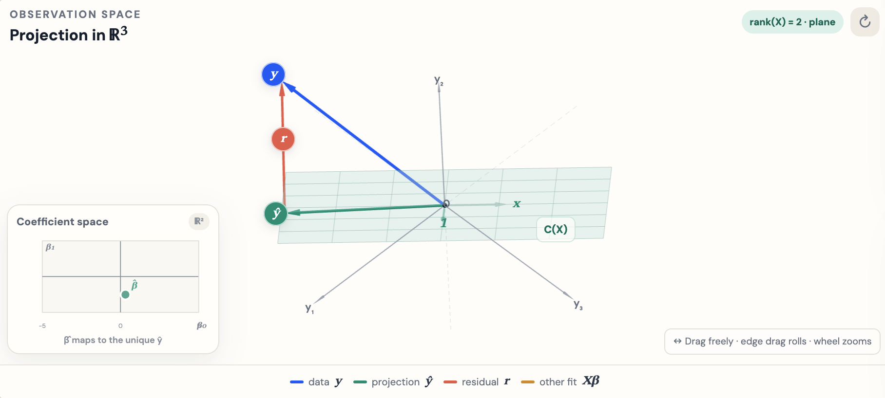

## Session 6 Outline

::: incremental
- Vectors and vector arithmetic
- Matrices and matrix arithmetic
- Determinants
- Matrix inverses
- Solving linear systems
:::

::: footer
Inspiration for a lot of the examples came from the Essense of Linear Algebra by [3blue1brown](https://www.youtube.com/c/3blue1brown)
:::


```{r}
library(magrittr)
library(patchwork)
library(ggplot2)
library(caracas)
library(stringr)
reticulate::use_condaenv("miniconda3")
thm <-
  theme_minimal() + theme(
    panel.background = element_rect(fill = "#f0f1eb", color = "#f0f1eb"),
    plot.background = element_rect(fill = "#f0f1eb", color = "#f0f1eb")
  )
theme_set(thm)

add_align <- function(latex) {
  str_c("\\begin{aligned} ", latex, " \\end{aligned}")
}

draw_vector <- function(x, ...) {
  df <- data.frame(x1 = x[1], x2 = x[2])
  a <- arrow(length = unit(0.03, "npc"))
  dims <- ceiling(abs(max(x)))
  p <- ggplot() + xlim(-dims, dims) + ylim(-dims, dims)
  p <- p + geom_segment(aes(x = 0, y = 0, xend = x1, yend = x2),
                        arrow = a, data = df, ...) +
    geom_hline(yintercept = 0, size = 0.1) +
    geom_vline(xintercept = 0, size = 0.1)
  return(p)
}

add_vector <- function(p, x, ...) {
  df <- data.frame(x1 = x[1], x2 = x[2])
  dims_x <- ceiling(abs(max(x)))
  dimx_p <- ceiling(abs(layer_scales(p)$x$range$range))
  dimy_p <- ceiling(abs(layer_scales(p)$y$range$range))
  dims <- max(c(dims_x, dimx_p, dimy_p))
  a <- arrow(length = unit(0.03, "npc"))
  p <- p + geom_segment(aes(x = 0, y = 0, xend = x1, yend = x2),
                        arrow = a, data = df, ...) +
    xlim(-dims, dims) + ylim(-dims, dims)
  return(p)
}
sm <- function(x) {
  suppressMessages(x)
}
rotate <- function(v, theta) {
  R <- matrix(c(cos(theta), sin(theta),
               -sin(theta), cos(theta)), ncol = 2)
  return(R %*% v)
}
```

$$
\DeclareMathOperator{\E}{\mathbb{E}}
\DeclareMathOperator{\P}{\mathbb{P}}
\DeclareMathOperator{\V}{\mathbb{V}}
\DeclareMathOperator{\L}{\mathscr{L}}
\DeclareMathOperator{\I}{\text{I}}
$$

## Introduction to Vectors {.smaller}

::: incremental
- Linear Algebra offers a language for manipulating n-dimensional objects
- Vectors are the basic building block of Linear Algebra
- A straightforward way to think about them is as a column of numbers
- How we interpret the entries is up to us
- Vectors are typically written in a column form:
:::

::: {.fragment}
```{r}
#| results: asis

V <- matrix(c("a", "b", "c"), 3, 1)
V <- as_sym(V)
tex(V) %>% str_c("V = ", .) %>% add_align() %>% cat()
```
:::

::: {.fragment}
- If we want the row version, we transpose it:

```{r}
#| results: asis

tex(t(V)) %>% str_c("V^T = ", .) %>% add_align() %>% cat()
```
:::

## Introduction to Vectors {.smaller}

::: incremental
- In R, vectors, unfortunately, are neither row nor column vectors
- R makes some assumptions when performing vector-matrix arithmetic
- We already saw lots of vectors whenever we used `c()` function or generated random numbers with, say `runif()` function
:::

::: {.fragment}
```{r}
#| echo: true

set.seed(123)
(v <- c(sample(3)))
class(v)
```
:::

::: {.fragment}
- R reports the $v$ is an integer vector

- You can add two vectors in a usual way, elementwise:

```{r}
#| results: asis

vs <- as_sym(v)
w <- sample(3)
ws <- as_sym(w)

str_c(tex(vs)) %>% str_c("+") %>% str_c(tex(ws)) %>%
  str_c("=") %>% str_c(tex(vs + ws)) %>% add_align() %>% cat()
```
:::

::: {.fragment}
- In R:
```{r}
#| echo: true
v
w
v + w
```
:::

## Introduction to Vectors {.smaller}

::: {.fragment}
- You can take linear combination $av + bw$, where a and b are scalars

```{r}
#| echo: true

2*v + 3*w # linear combination
```
:::

::: {.fragment}
- You can also take dot product: $v \cdot w$, which results in a scalar
```{r}
#| results: asis

str_c("v \\cdot w = ") %>% str_c(tex(t(vs))) %>% str_c(tex(ws)) %>%
  str_c("=") %>% str_c(tex(t(vs) %*% ws)) %>% add_align() %>% cat()

```
:::

::: {.fragment}
- In R, we multiply vectors and Matrices with `%*%`, not `*`, which will produce a component-wise multiplication, not a dot product

```{r}
#| echo: true

v %*% w # dot product
v * w   # component wise multiplication
```
:::

::: {.fragment}
- We write dot product this way:

$$
v^T w = v_1w_1 + v_2w_2 + \cdots + v_nw_n
$$
:::


## Introduction to Vectors {.smaller}

::: {.fragment}
- When is dot product zero?

```{r}
#| echo: true
v <- c(1, 1)
w <- c(1, -1)
v %*% w

(3 * v) %*% (4 * w)
```
:::

::: {.fragment}
- These vectors are perpendicular (orthogonal)

```{r}
#| fig-width: 4
#| fig-height: 4
#| fig-align: center

draw_vector(v, col = 'red') %>%
  add_vector(w, col = 'blue') %>% sm() +
  annotate("text", x = 0.7, y = 0.8, label = "v") +
  annotate("text", x = 0.7, y = -0.8, label = "w") + xlab("x") + ylab("y")

```
:::

## Introduction to Vectors {.smaller}

- A length of a vector is the square root of the dot product with itself

$$
||v|| = \sqrt{v \cdot v} = \sqrt{v_1^2 + v_2^2 + \cdots v_n^2}
$$
```{r}
#| echo: true

v <- c(1, 1)
sqrt(v %*% v) # this is sqrt of 2
```

## Introduction to Matrices {.smaller}

::: incremental

- You can think of a matrix as a rectangular (or square) set of numbers
- $m{\times}n$ matrix has m rows and n columns
- In statistics, it is convenient to think of a matrix as n columns where each column is a variable like the price of the house, and the rows are the observations for each house
- Throughout these slides, we write a linear system as $X\beta = y$
- $X$ is the design matrix, $\beta$ is the vector of unknown coefficients, and $y$ is the outcome vector
- The entry $x_{ij}$ is in row $i$ and column $j$ of $X$
:::

## Introduction to Matrices {.smaller}

::: panel-tabset
### Basis

::: incremental
- A good way to think about the Matrices is that they act on vectors and transform them in some way (stretch or turn them)
- You can think of this transformation as encoding the eventual locations of the basis vectors
- Standard basis vectors in $R^2$ (two-dimensional space), are commonly called $\hat{i}$ with location $(1, 0)$, and $\hat{j}$ with location $(0, 1)$.
- Notice their dot product is zero: $\hat{i} \cdot \hat{j} = 0$ and so they are orthogonal
- Let's look at one simple transformation -- rotation by 90 degrees counter-clockwise
:::

### Plot of v and w
::: columns
::: {.column width="50%"}

::: {.fragment}
- Recall, vectors $v$ and $w$:

$$
v = \left[ \begin{matrix}1\\2\end{matrix} \right]
w = \left[ \begin{matrix}3\\1\end{matrix} \right]
$$
:::

:::

::: {.column width="50%"}

::: {.fragment}
```{r}
#| fig-width: 4
#| fig-height: 4
#| fig-align: center
v <- c(1, 2)
w <- c(3, 1)
p1 <- draw_vector(v, col = 'red') %>%
  add_vector(w, col = 'blue') %>% sm()

p1 + annotate("text", x = 0.8, y = 2, label = "v") +
  annotate("text", x = 2.5, y = 1, label = "w")

```
:::

:::
:::


### Transformation

::: {.fragment}
- The following matrix encodes a 90-degree, counterclockwise rotation. Why?

$$
R =
\begin{bmatrix}
0 & -1 \\
1 & 0
\end{bmatrix}
$$
:::

::: {.fragment}
- Let's see how this matrix will act on vectors $v$ and $w$. That's where multiplication comes in.

$$
Rv =
\begin{bmatrix}
0 & -1 \\
1 & 0
\end{bmatrix}
\begin{bmatrix}
1 \\
2
\end{bmatrix}
=
1
\begin{bmatrix}
0 \\
1
\end{bmatrix}
+
2
\begin{bmatrix}
-1 \\
0
\end{bmatrix}
=
\begin{bmatrix}
0 \\
1
\end{bmatrix}
+
\begin{bmatrix}
-2 \\
0
\end{bmatrix}
=
\begin{bmatrix}
-2 \\
1
\end{bmatrix}
$$
:::

::: {.fragment}
- We scale the first vector, then scale the second, and then add.
:::

### R Example

::: columns
::: {.column width="50%"}

::: {.fragment}
- The following shows the same operation you can do in one step in R.

```{r}
#| echo: true

R <- matrix(c(0, 1, -1, 0), ncol = 2)
R
v <- c(1, 2)
(v_prime <- R %*% v)
```
:::

:::

::: {.column width="50%"}

::: {.fragment}
- Now let's plot $v$ and $v'$. Notice, the 90 degree rotation
```{r}
#| fig-width: 4
#| fig-height: 4
#| fig-align: center
p2 <- draw_vector(v, col = 'red') %>%
  add_vector(v_prime, col = 'red', linetype = "dashed") %>% sm()

p2 + annotate("text", x = 1, y = 1.8, label = "v") +
  annotate("text", x = -2, y = 0.8, label = "v'")
```
:::

:::
:::

:::

## Matrix Multiplication {.smaller}

::: panel-tabset
### Multiplication

::: incremental
- Our matrix encodes a rotation of every single vector in $R^2$.
- In particular, it rotates every point $(x, y)$ in $R^2$ by 90 degrees
- We can do this transformation in one go by applying the Rotation matrix to another matrix comprising our vectors $v$ and $w$
- The number of columns in the Rotation matrix has to match the number of rows in the $K = [v, w]$ matrix
:::

::: {.fragment}
```{r}
#| echo: true
(K <- matrix(c(v, w), ncol = 2))
(K_prime <- R %*% K)
```
:::

::: incremental
- The resulting matrix $K'$ has the correctly rotated $v$ in the first column and rotated $w$ in the second column.

- Another way to think about this operation is to encode two transformations in $K'$ --- the $K$ transformation followed by the $R$ transformation. We can now use the resulting $K'$ matrix and apply these two transformations in one swoop to any vector in $R^2$.

- Think about why matrix multiplication, in general, does not commute --- $RK \neq KR$
:::

### Plot

- Rotating red ($v = [1 \ 2]$) and blue ($w = [3 \ 1]$) vectors by 90 degrees

::: {.fragment}
```{r}
#| fig-width: 5
#| fig-height: 5
#| fig-align: center

p3 <- draw_vector(v, col = 'red') %>%
  add_vector(w, col = 'blue') %>%
  add_vector(K_prime[, 1], col = 'red', linetype = 'dashed') %>%
  add_vector(K_prime[, 2], col = 'blue', linetype = 'dashed') %>% sm()
print(p3)
```
:::

### Transform the Space



### Your Turn

::: {.fragment}
- **Your Turn**: Come up with a 90-degree clockwise rotation matrix and show that it sends $(2, 2)$ to $(2, -2)$

- Now pick three vectors in $R^2$ and rotate all three at the same time
:::

:::

## Linear Independence and Determinants {.smaller}

::: columns
::: {.column width="50%"}

::: incremental
- Think of a determinant as a (signed) area scaling factor from the basis $(\hat{i}, \hat{j})$ to the transformed vectors
- The area represented by two $R^2$ basis vectors is 1
:::

::: {.fragment}

```{r}
#| echo: true

# this transformation matrix scales the area by 12
(A <- matrix(c(4, 0, 0, 3), ncol = 2))

# compute the determinant
det(A)
```
:::

::: incremental
- What happens if the columns of $A$ are linear combinations of each other?
- Geometrically, that means that in $R^2$, they both sit on the same line
:::

:::

::: {.column width="50%"}

::: {.fragment}
```{r}
#| echo: true
# the second column is the first column * 1.5
(A <- matrix(c(2, 1, 1.5 * 2, 1.5 * 1), ncol = 2))

# compute the determinant
det(A)
```
:::

::: {.fragment}
```{r}
#| fig-width: 4
#| fig-height: 4
#| fig-align: center

draw_vector(A[, 1], col = 'red') %>%
  add_vector(A[, 2], col = 'blue', alpha = 1/2) %>% sm()

```
:::

:::
:::


## Example: Random Matrix {.smaller}

::: incremental
- Generate a random, say 5x5 matrix
- Is it likely that we will get linearly dependent columns?
:::

::: {.fragment}
```{r}
#| echo: true
set.seed(123)
(A <- matrix(sample(25), ncol = 5))
det(A)
```
:::

::: {.fragment}
- This is a full rank matrix that encodes a transformation in $R^5$ --- 5-dimensional space
:::

## Computing Determinants
- Don't bother doing it by hand

```{r}
#| results: asis

library(caracas)

A <- matrix(c("a", "b", "c", "d"), 2, 2)
A <- as_sym(A)

str_c("A = ") %>% str_c(tex(A)) %>% add_align() %>% str_c("\\newline") %>% cat()
str_c("\\det(A) = ") %>% str_c(tex(det(A))) %>% add_align() %>% str_c("\\newline") %>% cat()

B <- matrix(c("a", "b", "c", "d", "e", "f", "g", "h", "i"), 3, 3)
B <- as_sym(B)

str_c("B = ") %>% str_c(tex(B)) %>% add_align() %>% str_c("\\newline") %>% cat()
str_c("\\det(B) = ") %>% str_c(tex(det(B))) %>% add_align() %>% cat()

```

## Linear Systems and Inverses {.smaller}

::: panel-tabset
### Linear Systems

::: columns
::: {.column width="43%"}

::: incremental
- We consistently write a system as $X\beta=y$
- Row $i$ is $\sum_j x_{ij}\beta_j=y_i$
- A square, full-rank $X$ gives one exact solution
- What happens in this rank-deficient example?
:::

::: {.fragment}
$$
\begin{aligned}
2\beta_1 + \beta_2 &= 1 \\
4\beta_1 + 2\beta_2 &= 1.
\end{aligned}
$$
:::

::: {.fragment}
- A solution is a common intersection
:::

:::

::: {.column width="57%"}

::: {.fragment}
```{r}
#| fig-width: 5
#| fig-height: 4.2
#| fig-align: center
#| echo: false

library(ggplot2)

# Values of beta[1] along the horizontal axis
beta_1_vals <- seq(-1, 2, length.out = 200)

# Solve each equation for beta[2]
system_lines <- data.frame(
  beta_1 = rep(beta_1_vals, 2),
  beta_2 = c(
    1 - 2 * beta_1_vals,
    (1 - 4 * beta_1_vals) / 2
  ),
  equation = rep(
    c("2β₁ + β₂ = 1", "4β₁ + 2β₂ = 1"),
    each = length(beta_1_vals)
  )
)

ggplot(
  system_lines,
  aes(x = beta_1, y = beta_2, color = equation)
) +
  geom_line(linewidth = 1) +
  scale_color_manual(
    values = c(
      "2β₁ + β₂ = 1" = "blue",
      "4β₁ + 2β₂ = 1" = "red"
    )
  ) +
  theme(legend.position = "bottom") +
  labs(
    x = expression(beta[1]),
    y = expression(beta[2]),
    title = "No common solution",
    color = "Equation"
  )
```
:::

:::
:::


### No solution

::: {.fragment}
- Here $\det(X)=0$, so $X$ is singular and the system cannot have a unique solution

```{r}
#| echo: true
(X <- matrix(c(2, 4, 1, 2), ncol = 2))
(y <- c(1, 1))
det(X)
```
:::

::: {.fragment}
- A singular system can have no solution or infinitely many solutions
- Here the second row of $X$ is twice the first, but $y_2$ is not twice $y_1$, so this particular system has no solution
- Before we discuss overdetermined systems, let's see how inversion works in the square, full-rank case
:::


### Idea of an inverse

::: {.fragment}
- To see what a matrix inverse does, let's bring back the 90-degree counterclockwise rotation matrix $R$

```{r}
#| results: asis

R_matrix <- matrix(c(0, 1, -1, 0), 2, 2)
R_matrix <- as_sym(R_matrix)

str_c("R = ") %>% str_c(tex(R_matrix)) %>% add_align() %>% cat()
```
:::

::: incremental
- The idea of an inverse is to reverse the action of this transformation
- In this case, we need a clockwise 90-degree rotation matrix
- We can find that matrix by directly tracing the basis vectors
:::

::: {.fragment}
```{r}
#| results: asis

R_inverse <- matrix(c(0, -1, 1, 0), 2, 2)
R_inverse <- as_sym(R_inverse)

str_c("R^{-1} = ") %>% str_c(tex(R_inverse)) %>% add_align() %>% cat()
```
:::

### Inverse in R

::: {.fragment}
- Let's check our results in R. When you multiply a matrix by its inverse, you get back the identity matrix (which is like when you divide a scalar by its reciprocal, you get 1)
:::

::: {.fragment}
```{r}
#| echo: true

(R_matrix <- matrix(c(0, 1, -1, 0), 2, 2))
(R_inverse <- matrix(c(0, -1, 1, 0), 2, 2))

R_inverse %*% R_matrix

# find an inverse using R's solve function
solve(R_matrix)
```

:::

### $X\beta = y$

::: columns
::: {.column width="44%"}

::: {.fragment}
- When $X$ is square and full rank:

$$
\begin{aligned}
X\beta &= y \\
X^{-1}X\beta &= X^{-1}y \\
\beta &= X^{-1}y.
\end{aligned}
$$
:::

:::

::: {.column width="56%"}

::: {.fragment}
- In two dimensions, the matrix equation is

$$
\begin{bmatrix}
x_{11} & x_{12} \\
x_{21} & x_{22}
\end{bmatrix}
\begin{bmatrix}
\beta_1 \\
\beta_2
\end{bmatrix}
=
\begin{bmatrix}
y_1 \\
y_2
\end{bmatrix}.
$$
:::

::: {.fragment}
- In R, `solve(X, y)` solves for $\beta$:

```{r}
#| echo: true
(X <- matrix(c(3, 2, 1, 1), ncol = 2))
(y <- c(7, 5))
(beta_solution <- solve(X, y))
```
:::

:::
:::

:::

## Your Turn
- Consider the following system of equations:

$$
\begin{aligned}
3\beta_1 + 2\beta_2 + 1.5\beta_3 &= 4 \\
7\beta_1 + \beta_2 &= 2 \\
3\beta_2 + 2\beta_3 &= 1.
\end{aligned}
$$

- Express it as $X\beta=y$, solve for $\beta$ in R using `solve(X, y)`, and validate that the result is correct

## Some Useful Rules

> If you put on socks and then shoes, the first to be taken off are the ____

--- Gilbert Strang (discussing the order of undoing the inverse)


$$
(ABC \dots)^{-1} = \dots C^{-1}B^{-1}A^{-1} \\
(A^T)^{-1} = (A^{-1})^T \\
(A + B)^T = A^T + B^T \\
(ABC \dots)^T = \dots C^T B^T A^T
$$

::: footer
For a complete list, see the [Matrix Cookbook](http://matrixcookbook.com)
:::

## Solving n > p Systems {.smaller}

::: incremental

- In statistics, we often have many observations and relatively few coefficients, so $n>p$
- An overdetermined system has an exact solution only when $y$ lies in the column space of $X$
- With noisy data, $y$ usually lies outside that space, so we find the closest fitted vector instead
- Many coefficient vectors define candidate lines or planes; when $X$ has full column rank, least squares selects one unique best fit
- **Optimization-based** (frequentist) inference estimates the coefficients of that fit and their uncertainty
- **Integration-based** (Bayesian) inference describes plausible coefficient values with a joint probability distribution
- For simple linear models, the two approaches often give similar point estimates

:::

## An Overdetermined $X\beta = y$ {.smaller}

::: incremental
- We keep the same notation: $X$ is the design matrix, $\beta$ is the unknown coefficient vector, and $y$ is the outcome vector
- In this generic example the coefficients are $\beta_1$ and $\beta_2$; an intercept model would usually label its intercept $\beta_0$
- Suppose $X$ is $3\times2$, $\beta$ is $2\times1$, and $y$ is $3\times1$
- Written one row at a time, $X\beta=y$ is
:::

::: {.fragment}
$$
\begin{aligned}
x_{11}\beta_1 + x_{12}\beta_2 &= y_1 \\
x_{21}\beta_1 + x_{22}\beta_2 &= y_2 \\
x_{31}\beta_1 + x_{32}\beta_2 &= y_3.
\end{aligned}
$$
:::

::: incremental
- Even with linearly independent columns, this rectangular $X$ is not invertible
- The linear combinations $X\beta$ span a plane in $\mathbb{R}^3$, which may not contain the target $y$
:::

## Projecting $y$ onto the Column Space of $X$ {.smaller}

::: incremental
- If no $\beta$ satisfies $X\beta=y$ exactly, find the vector $X\hat\beta$ that is closest to $y$
- We call this fitted vector $\hat y=X\hat\beta$
- Geometrically, $\hat y$ is the projection of $y$ onto the column space of $X$
:::

::: {.fragment}
{fig-align="center"}
:::

::: footer
Image from [Geometry of Least Squares](https://ericnovik.github.io/apps/least-squares/)
:::

## Solving the Least-Squares Problem {.smaller}

::: panel-tabset
### Solution

::: columns
::: {.column width="45%"}

::: incremental
- The residual $r=y-X\hat\beta$ is computed after fitting the model
- It is distinct from the unobserved model error $\varepsilon$
- Least squares makes $r$ perpendicular to the column space of $X$:
:::

::: {.fragment}
$$
X^T(y - X\hat{\beta}) = 0
$$
:::

:::

::: {.column width="55%"}

::: {.fragment}
- We can now solve this normal equation:

$$
\begin{eqnarray}
X^T(y - X\hat{\beta}) & = & 0 \\
X^TX\hat{\beta} & = & X^Ty \\
(X^TX)^{-1}(X^TX)\hat{\beta} & = & (X^TX)^{-1}X^Ty \\
\hat{\beta} & = & (X^TX)^{-1}X^Ty
\end{eqnarray}
$$
:::

:::
:::

### Example of an $X^TX$

::: {.fragment}
- Matrix $X^TX$ is square and symmetric. It is invertible exactly when the columns of $X$ are linearly independent.
:::

::: columns
::: {.column width="50%"}

::: {.fragment}
**Independent columns**

```{r}
#| echo: true

X <- matrix(c(1, 2, 3, 1, 0, 2), ncol = 2)
XtX <- t(X) %*% X
qr(X)$rank
solve(XtX) %>% round(2)
```
:::

:::

::: {.column width="50%"}

::: {.fragment}
**Dependent columns**

```{r}
#| echo: true

X <- matrix(c(1, 2, 3, 2, 4, 6), ncol = 2)
XtX <- t(X) %*% X
qr(X)$rank
det(XtX)
```
:::

:::
:::

:::

## Recovering g from the Moon Drop {.smaller}

::: incremental
- Recall the Moon mission from Session 2: fixed marks give known distances $x_i$, while stopwatch readings $t_i$ have a constant delay and random noise
- `gravity-flash-162-01.csv` contains 17 recorded readings from one actual trial
- We are now in a position to solve the problem
:::

::: {.fragment}
```{r}
#| fig-width: 6
#| fig-height: 4
#| fig-align: center

moon_drop <- read.csv("data/gravity-flash-162-01.csv")
moon_drop$sqrt_x <- sqrt(moon_drop$distance_m)

x <- moon_drop$distance_m
t_obs <- moon_drop$observed_time_s

g_moon <- 1.625
curve_x <- seq(0, max(x), length.out = 200)
moon_curve <- data.frame(
  distance_m = curve_x,
  time_s = sqrt(2 * curve_x / g_moon)
)

p <- ggplot(moon_drop, aes(distance_m, observed_time_s)) +
  geom_line(
    data = moon_curve,
    aes(x = distance_m, y = time_s),
    inherit.aes = FALSE,
    color = "red",
    linewidth = 0.35
  ) +
  geom_point(size = 0.8) +
  xlab("fixed distance mark x (m)") +
  ylab("observed time t (s)") +
  ggtitle("Actual readings and the accepted Moon-gravity curve")
print(p)
```
:::

## Recovering g from the Moon Drop {.smaller}

::: panel-tabset
### Setup

::: columns
::: {.column width="48%"}

::: {.incremental style="font-size: 84%;"}
- The marks $x_i$ are fixed; let $\beta_0$ be the constant stopwatch delay

- Model the observed time as
  $$
  \beta_0+\sqrt{\frac{2x_i}{g}}+\varepsilon_i=t_i,
  \qquad \E(\varepsilon_i)=0.
  $$
:::

:::

::: {.column width="52%"}

::: {.incremental style="font-size: 84%;"}
- Set $y_i=t_i$, $z_i=\sqrt{x_i}$, and $\beta_1=\sqrt{2/g}$ to obtain
  $$
  \beta_0+\beta_1z_i+\varepsilon_i=y_i.
  $$

- With $\beta=(\beta_0,\beta_1)^\mathsf{T}$, the matrix model is
  $$
  X\beta+\varepsilon=y,
  \qquad
  X=\begin{pmatrix}
  1 & \sqrt{x_1}\\
  \vdots & \vdots\\
  1 & \sqrt{x_n}
  \end{pmatrix}.
  $$

- Recover gravity from the slope: $\hat g=2/\hat\beta_1^2$
:::

:::
:::

### Solution

::: columns
::: {.column width="50%"}

::: {.fragment}
```{r}
#| echo: true

# observed times are the noisy outcome vector
length(t_obs)
head(t_obs, 4)

# intercept plus z = sqrt(x)
X <- cbind(intercept = 1, sqrt_x = sqrt(x))
head(X, 4)

# write observed times as a column vector
y <- matrix(t_obs, ncol = 1)
head(y, 4)
```
:::

:::

::: {.column width="50%"}

::: {.fragment}
- The least-squares estimate is $\hat\beta=(X^\mathsf{T}X)^{-1}X^\mathsf{T}y$
:::

::: {.fragment}
```{r}
#| echo: true

beta_hat <- solve(t(X) %*% X) %*% t(X) %*% y
round(beta_hat, 4)

delay_hat <- as.numeric(beta_hat["intercept", ])
slope_hat <- as.numeric(beta_hat["sqrt_x", ])
g_hat <- 2 / slope_hat^2
round(c(delay = delay_hat, g = g_hat), 3)

# R gives the same estimates
coef(lm(t_obs ~ sqrt(x)))

```
:::

::: {.fragment}
- $\hat\beta_0=0.377\text{ s};\quad \hat g=1.691\text{ m/s}^2$.
:::

:::
:::

### Plot the Linearized Fit

::: columns
::: {.column width="45%"}

```{r}
#| echo: true

fit_data <- transform(
  moon_drop,
  t_hat = delay_hat + slope_hat * sqrt_x
)

p_linearized <- ggplot(
  fit_data,
  aes(sqrt_x, observed_time_s)
) +
  geom_point(size = 0.7) +
  geom_line(
    aes(y = t_hat),
    color = "red",
    linewidth = 0.35
  ) +
  labs(
    x = expression(sqrt(x)),
    y = "observed time t (s)",
    title = "Linearized fit"
  )
```

:::

::: {.column width="55%"}

```{r}
#| echo: false
#| fig-width: 4.5
#| fig-height: 4.5
#| fig-align: center

print(p_linearized)
```

:::
:::

### Natural Scale

```{r}
#| echo: false
#| fig-width: 8
#| fig-height: 4.6
#| fig-align: center

estimated_physical_curve <- transform(
  moon_curve,
  time_s = slope_hat * sqrt(distance_m)
)

fitted_observation_curve <- transform(
  moon_curve,
  time_s = delay_hat + slope_hat * sqrt(distance_m)
)

series_order <- c(
  "observed",
  "true_physics",
  "estimated_physics",
  "observation_fit"
)

series_labels <- c(
  "observed data: tᵢᵒᵇˢ",
  "true physics: τ(x) = √(2x / 1.625)",
  "estimated physics: τ̂(x) = β̂₁√x (ĝ = 1.691)",
  "observation fit: ŷ(x) = β̂₀ + β̂₁√x"
)

ggplot() +
  geom_point(
    data = moon_drop,
    aes(
      x = distance_m,
      y = observed_time_s,
      color = "observed"
    ),
    size = 1
  ) +
  geom_line(
    data = moon_curve,
    aes(
      x = distance_m,
      y = time_s,
      color = "true_physics"
    ),
    linewidth = 0.4
  ) +
  geom_line(
    data = estimated_physical_curve,
    aes(
      x = distance_m,
      y = time_s,
      color = "estimated_physics"
    ),
    linewidth = 0.5,
    linetype = "dashed"
  ) +
  geom_line(
    data = fitted_observation_curve,
    aes(
      x = distance_m,
      y = time_s,
      color = "observation_fit"
    ),
    linewidth = 0.5,
    linetype = "dotted"
  ) +
  scale_color_manual(
    values = c(
      "observed" = "black",
      "true_physics" = "red",
      "estimated_physics" = "blue",
      "observation_fit" = "purple"
    ),
    breaks = series_order,
    labels = series_labels
  ) +
  labs(
    x = "fixed distance mark x (m)",
    y = "time (s)",
    color = NULL,
    title = "Physical process and stopwatch observation process",
    subtitle = paste(
      "Physical curves satisfy τ(0) = 0;",
      "the observation fit starts at β̂₀ = 0.377 s"
    )
  ) +
  guides(color = guide_legend(nrow = 2, byrow = TRUE)) +
  theme(
    legend.position = "bottom",
    legend.text = element_text(size = 7.5)
  )
```

### Zoom

```{r}
#| echo: false
#| fig-width: 8.5
#| fig-height: 4.8
#| fig-align: center

zoom_plot <- function(
  x_min,
  x_max,
  y_min,
  y_max,
  plot_title
) {
  in_range <- function(data) {
    subset(
      data,
      distance_m >= x_min & distance_m <= x_max
    )
  }

  y_breaks <- seq(
    ceiling(2 * y_min) / 2,
    floor(2 * y_max) / 2,
    by = 0.5
  )

  ggplot() +
    geom_point(
      data = in_range(moon_drop),
      aes(
        x = distance_m,
        y = observed_time_s,
        color = "observed"
      ),
      size = 1.2
    ) +
    geom_line(
      data = in_range(moon_curve),
      aes(
        x = distance_m,
        y = time_s,
        color = "true_physics"
      ),
      linewidth = 0.5
    ) +
    geom_line(
      data = in_range(estimated_physical_curve),
      aes(
        x = distance_m,
        y = time_s,
        color = "estimated_physics"
      ),
      linewidth = 0.6,
      linetype = "dashed"
    ) +
    geom_line(
      data = in_range(fitted_observation_curve),
      aes(
        x = distance_m,
        y = time_s,
        color = "observation_fit"
      ),
      linewidth = 0.6,
      linetype = "dotted"
    ) +
    scale_y_continuous(
      limits = c(y_min, y_max),
      breaks = y_breaks,
      expand = expansion(mult = c(0.02, 0.02))
    ) +
    scale_color_manual(
      values = c(
        "observed" = "black",
        "true_physics" = "red",
        "estimated_physics" = "blue",
        "observation_fit" = "purple"
      ),
      breaks = series_order,
      labels = series_labels
    ) +
    labs(
      x = "distance x (m)",
      y = "time (s)",
      color = NULL,
      title = plot_title
    ) +
    guides(color = guide_legend(nrow = 2, byrow = TRUE))
}

zoom_pair <- (
  zoom_plot(
    5, 20, 2.3, 5.5,
    "Beginning: 5–20 m"
  ) +
    zoom_plot(
      75, 100, 8.3, 11.5,
      "End: 75–100 m"
    )
) +
  plot_layout(guides = "collect") +
  plot_annotation(
    title = "The intercept–slope tradeoff on a common vertical scale",
    subtitle = paste(
      "Each panel spans 3.2 s with 0.5 s tick spacing;",
      "equal vertical distances now represent equal time gaps"
    )
  )

zoom_pair &
  theme(
    legend.position = "bottom",
    legend.text = element_text(size = 7)
  )
```

:::

## Your Turn {.smaller}
- Load your own experimental dataset into R
- Plot `time` against `distance`, treating `time` as the output variable $y$. (We generally don't like to use the words dependent vs. independent in this context)
- Using the normal equations, find the intercept and slope of the best-fit line
- Validate that it matches the output from `lm`
- Plot it in its linear form and on the natural scale; also plot the data
- Now add the curve representing the true gravity of the planet from which you escaped

## Homework {.smaller}

::: incremental
1. **Basis vectors and linearity.** Let $A=\begin{pmatrix}1&2\\-1&1\end{pmatrix}$, $\mathbf{u}=(2,-1)^\mathsf{T}$, and $\mathbf{v}=(-1,3)^\mathsf{T}$. Compute $A\mathbf{e}_1$, $A\mathbf{e}_2$, $A\mathbf{u}$, and $A\mathbf{v}$; then verify $A(2\mathbf{u}-\mathbf{v})=2A\mathbf{u}-A\mathbf{v}$.

2. **Inverse and linear system.** Let $X=\begin{pmatrix}3&1\\2&1\end{pmatrix}$ and $y=(7,5)^\mathsf{T}$. Compute $\det(X)$ and $X^{-1}$, solve $X\beta=y$ using $X^{-1}$, and verify the result with `solve(X, y)` in R.

3. **Simulation—transforming space.** With `set.seed(6)`, use `runif()` to generate 2,000 points in $[-1,1]^2$. Apply the matrix $A$ from Problem 1, plot the original and transformed point clouds with equal axis scales, and explain how the transformed basis vectors and $\det(A)$ predict the picture.

4. **Simulation—recovering Moon gravity.** Use fixed marks $x=5,10,\ldots,100$, $g=1.625$, delay $\beta_0=0.25$, and timing errors from $\operatorname{Uniform}(-0.1,0.1)$. Simulate 1,000 experiments from $\beta_0+\sqrt{2x_i/g}+\varepsilon_i=y_i$; in each, estimate $\beta=(\beta_0,\beta_1)^\mathsf{T}$ with $(X^\mathsf{T}X)^{-1}X^\mathsf{T}y$ and compute $\hat g=2/\hat\beta_1^2$. Plot and summarize the estimates, then repeat with the intercept forced to zero and compare.
:::
