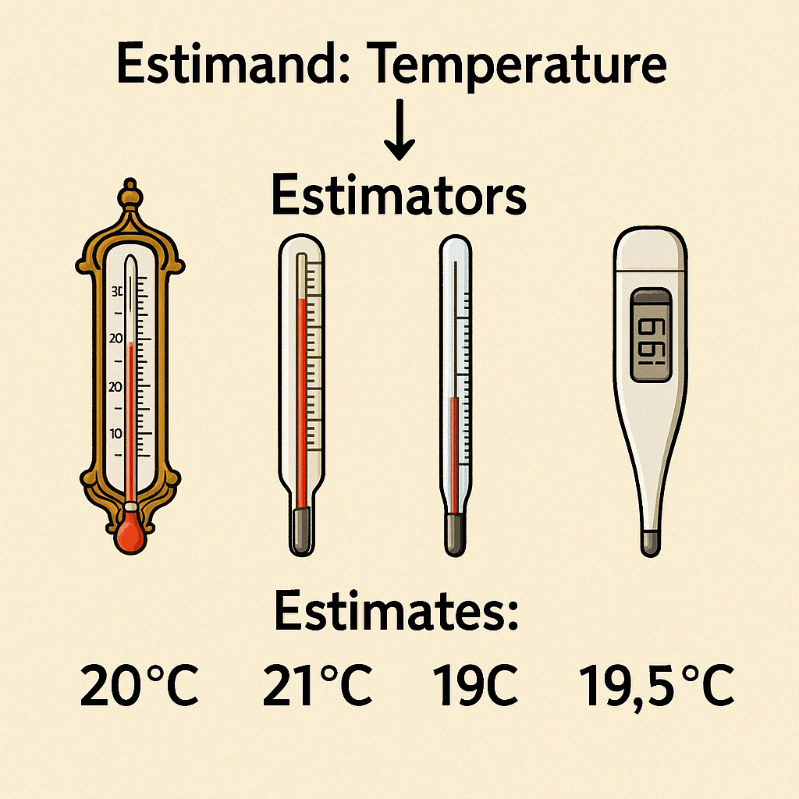
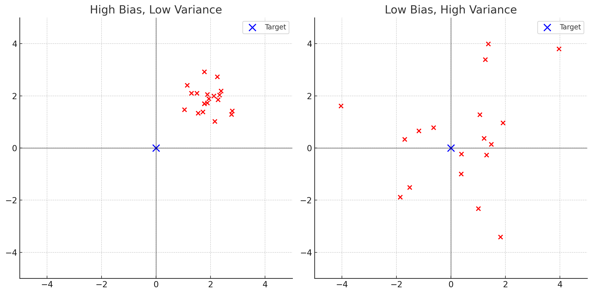

## Session 7 Outline

::: incremental
- Statistical inference
- Sampling distribution
- Standard errors
- Confidence intervals
- Degrees of freedom and t distribution
- Bias and uncertainty
- Statistical significance
:::

::: footer
The material for this session is based on Chapter 4 of the [Regression and Other Stories](https://avehtari.github.io/ROS-Examples/) by Gelman et al.
:::


```{r}
library(magrittr)
library(patchwork)
library(ggplot2)
library(caracas)
library(stringr)
reticulate::use_condaenv("miniconda3")
thm <-
  theme_minimal() + theme(
    panel.background = element_rect(fill = "#f0f1eb", color = "#f0f1eb"),
    plot.background = element_rect(fill = "#f0f1eb", color = "#f0f1eb")
  )
theme_set(thm)
```

$$
\DeclareMathOperator{\E}{\mathbb{E}}
\DeclareMathOperator{\P}{\mathbb{P}}
\DeclareMathOperator{\V}{\mathbb{V}}
\DeclareMathOperator{\L}{\mathscr{L}}
\DeclareMathOperator{\I}{\text{I}}
$$

## Introduction to Statistical Inference {.smaller}

::: columns
::: {.column width="50%"}

- **Statistical Inference:** A process of learning from noisy measurements
- **Key Challenges:**
  - Generalizing from a sample to the population of interest
  - Learning what would have happened under a different treatment
  - Understanding the relationship between the measurement and the estimand
:::

::: {.column width="50%"}

{fig-align="center"}

:::
:::

## Measurement Error Models {.smaller}
::: incremental
- We are trying to estimate the parameters of some data-generating process
- For the Moon drop, the distance marks $x_i$ are fixed and the stopwatch times are noisy:

::: {.fragment}
$$
t_i=\alpha+\sqrt{\frac{2x_i}{g}}+\epsilon_i
   =\alpha+\beta\sqrt{x_i}+\epsilon_i,
\qquad \beta=\sqrt{\frac{2}{g}}.
$$
:::

- Here $\alpha$ is a constant timing delay and $\epsilon_i$ is random timing error
- Other measurement mechanisms may require different additive or multiplicative error models
:::


## Sampling Distribution {.smaller}

::: incremental
- A **generative model** describes how repeated datasets could arise under fixed assumptions
- "The **sampling distribution** is the set of possible datasets that could have been observed if the data collection process had been re-done, along with the probabilities of these possible values." Ch-4 ROS, Gelman, Hill, Vehtari
- It depends on the sampling design, treatment-assignment mechanism, and measurement process
- **Examples**
  - In a simple random sample of size $n$ from a population of size $N$, every subset of $n$ people has the same probability of being selected
  - For the Moon drop, fix $\alpha$, $\beta$, and the marks $x_i$, then draw timing errors $\epsilon_i$ and form $t_i=\alpha+\beta\sqrt{x_i}+\epsilon_i$
  - We can write code to generate observations from this process, as we did for the Moon drop
:::

## Standard Errors {.smaller}

::: incremental
- **Standard error** is the estimated standard deviation of the estimate
- It provides a **measure of uncertainty** around the estimate
- Holding the data-generating process fixed, standard errors typically decrease as sample size increases
- For the mean of $n$ independent observations with population sd $\sigma$: $\text{se}(\bar{x})=\frac{\sigma}{\sqrt{n}}$

::: {.fragment}
```{r}
#| echo: true
set.seed(1)
n <- 100; mu <- 5; sigma <- 1.5
x <- rnorm(n, mean = mu, sd = sigma)
x_bar <- mean(x); round(x_bar, 2)
se <- sigma/sqrt(n)
print(se)
```
:::

:::

## Estimating the Standard Error {.smaller}

::: incremental
- If $\sigma$ is unknown, estimate it from the sample: $s = \sqrt{\frac{1}{n-1} \sum_{i=1}^{n} (x_i - \bar{x})^2}$
- Then $\widehat{\text{se}}(\bar{x})=s/\sqrt{n}$
:::

::: {.fragment}
```{r}
#| echo: true
sd(x) |> round(2)
sd_s <- sqrt(sum((x - x_bar)^2) / (n - 1))
print(sd_s |> round(2))
se_s <- sd_s/sqrt(n)
print(se_s |> round(2))
```
:::

## Confidence Intervals {.smaller}

::: incremental
- For a given sampling distribution, a confidence interval provides a range of parameter values consistent with the data
- If $\hat{\theta}$ is approximately Normal and its standard error is estimated well, repeated intervals $\hat{\theta} \pm 1.96\cdot\text{se}$ cover the true $\theta$ about 95% of the time
:::

::: {.fragment}
```{r}
#| cache: true
#| fig-width: 8
#| fig-height: 4
#| fig-align: center

n_samples <- 100
sample_size <- 100
true_mean <- mu
true_sd <- sigma

# Function to compute normal-approximation confidence intervals
compute_ci <- function(sample, level = 0.95) {
  mean_sample <- mean(sample)
  se <- sd(sample) / sqrt(length(sample))
  z <- qnorm(1 - (1 - level) / 2)
  lower <- mean_sample - z * se
  upper <- mean_sample + z * se
  return(c(lower, upper))
}

# Generate samples and compute confidence intervals
results <- data.frame(sample_id = integer(),
                      ci_lower_50 = numeric(),
                      ci_upper_50 = numeric(),
                      ci_lower_95 = numeric(),
                      ci_upper_95 = numeric())

for (i in 1:n_samples) {
  sample <- rnorm(sample_size, mean = true_mean, sd = true_sd)
  ci_50 <- compute_ci(sample, level = 0.50)
  ci_95 <- compute_ci(sample, level = 0.95)
  results <- rbind(results, data.frame(sample_id = i,
                                       ci_lower_50 = ci_50[1],
                                       ci_upper_50 = ci_50[2],
                                       ci_lower_95 = ci_95[1],
                                       ci_upper_95 = ci_95[2]))
}

# Plot the confidence intervals using geom_linerange
ggplot(results, aes(x = sample_id)) +
  geom_linerange(aes(ymin = ci_lower_50, ymax = ci_upper_50), linewidth = 0.8) +
  geom_linerange(aes(ymin = ci_lower_95, ymax = ci_upper_95), linewidth = 0.2) +
  geom_hline(yintercept = true_mean, linewidth = 0.1, color = 'red') +
  labs(title = "Approximate Confidence Intervals for 100 Samples from Normal(5, 1.5)",
       x = "",
       caption = "50% CI in bold, 95% CI is thin black")

```
:::


## Confidence Intervals for Proportions {.smaller}

::: columns
::: {.column width="50%"}

::: incremental
- In surveys, we are often interested in estimating the standard error of the proportion
- Suppose we want to estimate the proportion of the US population that supports same-sex marriage
- Say you randomly survey $n = 500$ from the population, and $y = 355$ people respond yes (*)
- The estimate of the proportion is $\hat{\theta} = y/n$ with the $\text{se} = \sqrt{\hat{\theta}(1 -\hat{\theta})/n }$
:::

:::

::: {.column width="50%"}

::: {.fragment}
```{r}
#| cache: true
#| echo: true
n <- 500
y <- 355
theta_hat <- y/n
theta_hat |> round(2)
se <- sqrt(theta_hat * (1 - theta_hat) / n)
se |> round(2)
theta_hat + 2*se |> round(2)
theta_hat - 2*se |> round(2)
ci_95 <- theta_hat + qnorm(c(0.025, 0.975)) * se
ci_95 |> round(2)
```
:::

:::
:::

::: {.fragment}
(*) A May 2023 Gallup poll found that 71% of Americans thought same-sex marriage should be legally recognized
:::

## Your Turn

Assume the conservative value $p=0.5$. In a national survey, how large must $n$ be so that $\text{se}(\hat p)$ is at most:

- 3 percentage points?
- 1 percentage point?


## Standard Error for Differences
::: incremental
- For two independent estimates, variances add:


::: {.fragment}
$$
\text{se}_{\text{diff}} = \sqrt{\text{se}_1^2 + \text{se}_2^2}
$$
:::

- **Your turn:** Assume two independent, equally sized groups, $p_1=p_2=0.5$, and $n$ is the total sample size. How large must $n$ be so that $\text{se}(\hat p_1-\hat p_2)\leq 0.03$?

:::

## Moon Drop: How Many Drops? {.smaller}

Each drop gives 20 noisy time readings at fixed distance marks, and each drop costs oxygen. Here we omit the delay term and impose the physical constraint $t(0)=0$. We repeatedly fit $t=\beta\sqrt{x}+\varepsilon$ through the origin and transform $\hat g=2/\hat\beta^2$.

::: {.fragment}
```{r}
#| echo: true
#| cache: true
set.seed(1)
g_true <- 1.625
timing_sd <- 0.10                         # random timing noise, seconds
reps <- 500
marks <- seq(5, 100, by = 5)              # fixed marks every 5 m
sqrt_marks <- sqrt(marks)
beta_true <- sqrt(2 / g_true)

se_ghat <- function(n_drops) {
  z <- rep(sqrt_marks, n_drops)            # fixed design values
  g_hat <- replicate(reps, {
    t_obs <- beta_true * z +
      rnorm(length(z), 0, timing_sd)
    beta_hat <- coef(lm(t_obs ~ 0 + z))[["z"]]
    2 / beta_hat^2
  })
  sd(g_hat)                                # empirical SE of g_hat
}
```
:::

## Moon Drop: Simulation Results {.smaller}

::: columns
::: {.column width="55%"}

::: {.fragment style="font-size: 78%;"}
```{r}
#| echo: true
#| cache: true

drops <- c(1, 2, 3, 5, 10, 12, 15, 20, 40)
se_g <- purrr::map_dbl(drops, se_ghat)
moon_drop_results <- data.frame(
  drops = drops,
  readings = drops * 20,
  se_g = round(se_g, 4),
  half_width = round(1.96 * se_g, 4)
)
moon_drop_results
```
:::

:::

::: {.column width="45%"}

::: {.fragment style="font-size: 80%;"}
- **Rows:** each row summarizes 500 simulated repetitions; `readings` is 20 times `drops`
- **`se_g`:** empirical standard deviation of the 500 $\hat g$ values
- **`half_width`:** $1.96\,\text{se}_g$, an approximate 95% margin; smaller is more precise
- **Precision targets:** one decimal requires `half_width` $\leq0.05$ (half of 0.1); two decimals requires `half_width` $\leq0.005$ (half of 0.01)
- **Reading the table:** one drop has $0.0175<0.05$; 12 drops have $0.0052>0.005$, while 15 drops have $0.0048<0.005$
:::

:::
:::

## Computer Demo: Computing CIs {.smaller}

- These demos are taken from the book [Active Statistics](https://avehtari.github.io/ActiveStatistics/) by Gelman and Vehtari

```{r}
#| cache: true
#| echo: true
#| eval: false

# Generate fake data
p <- 0.3
n <- 20
data <- rbinom(1, n, p)
print(data)

# Estimate proportion and calculate confidence interval
p_hat <- data / n
se <- sqrt(p_hat * (1 - p_hat) / n)
ci <- p_hat + c(-2, 2) * se
print(ci)

# Put it in a loop
reps <- 100
for (i in 1:reps) {
  data <- rbinom(1, n, p)
  p_hat <- data / n
  se <- sqrt(p_hat * (1 - p_hat) / n)
  ci <- p_hat + c(-2, 2) * se
  print(ci)
}

```

## Computer Demo: Proportions, Means, and Differences of Means {.smaller}

```{r}
#| cache: true
#| echo: true
#| eval: false

# Read data from here:  https://github.com/avehtari/ROS-Examples
library("foreign")
library("dplyr")
pew_pre <- read.dta(
  paste0(
    "https://raw.githubusercontent.com/avehtari/",
    "ROS-Examples/master/Pew/data/",
    "pew_research_center_june_elect_wknd_data.dta"
  )
)
pew_pre <- pew_pre |> select(c("age", "regicert")) %>%
  na.omit() |> filter(age != 99)
n <- nrow(pew_pre)

# Estimate a proportion (certain to have registered for voting?)
registered <- ifelse(pew_pre$regicert == "absolutely certain", 1, 0)
p_hat <- mean(registered)
se_hat <- sqrt((p_hat * (1 - p_hat)) / n)
round(p_hat + c(-2, 2) * se_hat, 4) # ci

# Estimate an average (mean age)
age <- pew_pre$age
y_hat <- mean(age)
se_hat <- sd(age) / sqrt(n)
round(y_hat + c(-2, 2) * se_hat, 4) # ci

# Estimate a difference of means
age2 <- age[registered == 1]
age1 <- age[registered == 0]
y_2_hat <- mean(age2)
se_2_hat <- sd(age2) / sqrt(length(age2))
y_1_hat <- mean(age1)
se_1_hat <- sd(age1) / sqrt(length(age1))
diff_hat <- y_2_hat - y_1_hat
se_diff_hat <- sqrt(se_1_hat ^ 2 + se_2_hat ^ 2)
round(diff_hat + c(-2, 2) * se_diff_hat, 4) # ci

```

## Degrees of Freedom

::: incremental
- Degrees of freedom count independent pieces of information remaining after accounting for constraints or fitted parameters
- In a full-rank linear model with $n$ observations and $p$ fitted coefficients, the residual degrees of freedom are $n-p$
- For a sample variance, the deviations from $\bar{x}$ must sum to zero, leaving $n-1$ degrees of freedom
:::

## Normal and t Distributions
- Student's t distribution has a degrees-of-freedom parameter; with few degrees of freedom, it has heavier tails than the Normal distribution

```{r}
#| cache: true
#| fig-width: 6
#| fig-height: 3
#| fig-align: center
#| echo: false

x_values <- seq(-4, 4, length.out = 1000)

# Compute the densities
data <- data.frame(
  x = x_values,
  normal = dnorm(x_values),
  t_df_2 = dt(x_values, df = 2),
  t_df_10 = dt(x_values, df = 10),
  t_df_100 = dt(x_values, df = 100)
)

# Melt the data for ggplot
library(reshape2)
data_melted <- melt(data, id.vars = "x",
                    variable.name = "Distribution",
                    value.name = "Density")

# Plot using ggplot2
ggplot(data_melted, aes(x = x, y = Density, color = Distribution)) +
  geom_line(linewidth = 0.2) +
  scale_color_manual(values = c("black", "red", "blue", "green"),
                     labels = c("Normal", "t (df = 2)", "t (df = 10)", "t (df = 100)")) +
  labs(title = "Standard Normal and t-Distributions",
       x = "",
       y = "Density") +
  theme(legend.title = element_blank())

```

## Confidence Intervals from the t Distribution {.smaller}

::: columns
::: {.column width="40%"}

::: incremental
- For i.i.d. Normal data with unknown variance, $(\bar X-\mu)/(s/\sqrt n)$ follows $t_{n-1}$
- It is the t reference distribution—not the standard error itself—that has $n-1$ degrees of freedom
- Example: five dart distances from the bull's eye, in cm (dartboard radius $\approx 23$ cm)
:::

:::

::: {.column width="60%"}

::: {.fragment}
```{r}
#| cache: true
#| echo: true

# Distance from the bull's eye in cm
data <- c(8, 6, 10, 5, 18)

# Calculate the sample mean
mean_data <- mean(data)

# Calculate the standard error of the mean
se_mean <- sd(data) / sqrt(length(data))

# Degrees of freedom
df <- length(data) - 1

# Calculate the 95% and 50% confidence interval
ci_95 <- mean_data + qt(c(0.025, 0.975), df) * se_mean
ci_50 <- mean_data + qt(c(0.25, 0.75), df) * se_mean

# Output the results
mean_data |> round(2)
se_mean |> round(2)
ci_95 |> round(2)
ci_50 |> round(2)
```
:::

:::
:::


## Bias and Uncertainty
- There is a lot more to it than what is in the following standard picture
- Discuss among yourselves what are the potential sources of bias

{fig-align="center" width="672"}

## Statistical Significance {.smaller}

::: incremental
- Comes up in NHST: Null Hypothesis Significance Testing
- Bad decision filter: if p-value is less than 0.05 (relative to some Null), the results can be trusted, otherwise they are likely noise
- For a test statistic $T$ where larger values are more extreme under $H_0$:
:::

::: {.fragment}
$$
\text{p-value}(y) = \P\!\left(T(Y_\text{rep}) \geq T(y) \mid H_0\right)
$$
:::

::: incremental
- Often, estimates are labeled not significant when they are within roughly 2 SEs of the null value (commonly zero for a coefficient); selecting models this way is also problematic
:::

## Some Problems with Statistical Significance

::: incremental
- Statistical significance does not mean practical (or, in biostatistics, clinical) significance
- Nonsignificance does not mean there is no effect
- There is nothing special about p=0.05 despite what you will read in the medical journals
- [The difference between “significant” and “not significant” is not itself statistically significant](https://www.tandfonline.com/doi/abs/10.1198/000313006X152649), Gelman and Stern
- [Researcher degrees of freedom](https://en.wikipedia.org/wiki/Researcher_degrees_of_freedom) and [the garden of forking paths](https://en.wikipedia.org/wiki/Forking_paths_problem). [Here](https://sites.stat.columbia.edu/gelman/research/unpublished/p_hacking.pdf) is the full paper.
:::
